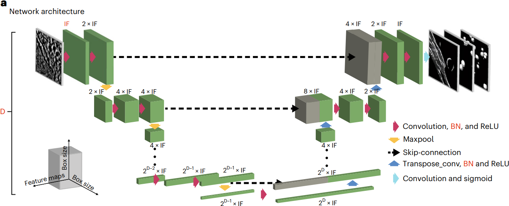

# Convolutional Networks for Supervised Mining of Molecular Patterns within Cellular Context

## 0 Abstract

为了在实验数据上对 DeePiCt (Deep Picker in Context) 进行训练和基准测试，我们全面标注了 20 份粟酒裂殖酵母的核糖体、脂肪酸合酶、膜、核孔复合物、细胞器和胞质溶胶的断层图。
To train and benchmark DeePiCt (Deep Picker in Context) on experimental data, we comprehensively annotated 20 tomograms of Schizosaccharomyces pombe for ribosomes, fatty acid synthases, membranes, nuclear pore complexes, organelles, and cytosol.

我们使用 DeePiCt 研究组成不同的细胞核糖体亚群，重点关注它们与线粒体和内质网的背景关联。
We use DeePiCt to study compositionally distinct subpopulations of cellular ribosomes, with emphasis on their contextual association with mitochondria and the endoplasmic reticulum.

最后，将预训练的网络应用于 HeLa 细胞断层扫描表明，DeePiCt 在几分钟内即可对来自不同生物物种的未见过的数据集实现高质量的预测。
Finally, applying pre-trained networks to a HeLa cell tomogram demonstrates that DeePiCt achieves high-quality predictions in unseen datasets from different biological species in a matter of minutes.

## 1 Introduction

模板匹配基于对已知复合物模板的相似系数（交叉相关性）进行逐点数值计算，是一种常用的计算方法。这种方法能准确定位大型结构，但无法识别较小或密度较低的颗粒，而且计算量很大。
Template Matching is a commonly applied computational approach and is based on a point-wise numerical computation of a similarity coefficient (cross correlation) to a known template of the complex in question. It is accurate in the localization of large structures, but fails at identifying smaller or less dense particles , and is computationally intensive.

目前使用经典图像处理技术的无模板方法是针对特定分子构型设计的，因此仅限于颗粒与膜或微管等大型细胞结构相关联的分子构型。
Current template-free methods using classical image processing are designed for, and thus limited to, specific molecular configurations in which particles are associated with large cellular structures such as membranes or microtubules.

这两种方法通常都需要人工因此费时费力。
Both these methods typically require manual inspection and are therefore laborious and time-consuming.

我们介绍一款开源软件 DeePiCt，它与有监督卷积网络协同作用，可对细胞区室（细胞器或细胞膜）和结构（膜或细胞骨架丝）进行分割，并对粒子进行定位。
we present DeePiCt (deep picker in context), an open-source software that synergizes supervised convolutional networks for segmentation of cellular compartments (organelles or cytosol) and structures (membranes or cytoskeletal filaments), and localization of particles.

## 2 Results

### 2.1 DeePiCt for automated segmentation and particle localization

它结合了二维 CNN 和三维 CNN，二维 CNN 用于分割易于识别的细胞区，三维 CNN 受益于三维信息，用于粒子定位和注释连续结构，如膜和细胞骨架丝（图 1）。
It combines a 2D CNN for segmentation of cellular compartments that are easily recognized in 2D, and a 3D CNN for particle localization and annotation of continuous structures, such as membranes and cytoskeletal filaments, that benefit from 3D information.

二维和三维 CNN 均改编自原始 U-Net 架构（图 1a 和补充材料 1）。二维 CNN 采用固定深度 5（4 个最大池化层）和 16 个初始过滤器（图 1a）。三维 CNN 允许多标签学习（补充材料 1），并可调整深度、初始滤波器数量、批处理归一化层以及编码器和解码器路径中的 dropout 参数等架构参数。
The 2D and 3D CNNs are adapted from the original U-Net architecture. The 2D CNN employs a fixed depth of 5 (4 max-pooling layers) and 16 initial filters. The 3D CNN allows multi-label learning and adjustable architectural parameters for depth, number of initial filters, a batch normalization layer, and the dropout parameter in the encoder and decoder paths.

一般来说，较大的颗粒可以从较大的深度中获益，以增加网络的感受野，而低密度打印（相对于周围环境的低信噪比）的颗粒则需要更多的初始滤波器（补充表 1）。
In general, larger particles benefit from larger depth to increase the receptive field of the network, and particles with a low-density print (low SNR with respect to the surrounding context) require more initial filters.

训练时，每个网络都需要相关结构的断层图和相应的三维二值分割掩膜，例如用于二维 U-Net 的细胞器分割和用于三维 U-Net 的代表粒子的球体（图 1b）。原始输入断层图可选择使用幅谱均衡滤波器进行预处理，以增强图像对比度（图 1c 和扩展数据图 1）。
For training, each network requires tomograms and corresponding 3D binary segmentation masks of the structures of interest, for example organelle segmentations for the 2D U-Net and spheres representing particles for the 3D U-Net. The raw input tomograms are optionally pre-processed using an amplitude spectrum equalization filter to enhance image contrast.

在二维网络的训练过程中，图片会以 90 度的增量随机翻转和旋转，以提高泛化能力。对于 3D CNN，我们对输入图像进行了一系列可选的随机变换，以增加数据量（补充材料 1）。根据我们的经验，二维 CNN 需要大约 6 份完全分割的断层图像来进行训练，而三维 CNN 则需要大约 5 份断层图像来进行膜分离，并需要至少 300 个注释实例来进行粒子学习，这与细胞体积中的粒子稀疏性无关（补充图片 2）。
During training of the 2D network, tiles are randomly flipped and rotated in 90-degree increments to improve generalization. For the 3D CNN, we implemented a number of optional random transformations to the input images for data augmentation. In our experience, the 2D CNNs require about 6 fully segmented tomograms for training, while the 3D CNNs require about 5 tomograms for membrane segmentation, and a minimum of 300 annotated instances for particle learning independent of particle sparsity in the cellular volumes.

将二维网络输出的预测切片组合成三维体像，通过应用一维高斯滤波器沿 Z 轴进行平滑处理，然后进行阈值处理（用户可自定义，默认为 0.75），生成二值三维体像（扩展数据图 2a-2c）。根据用户定义的概率值对三维 CNN 的输出进行阈值处理，然后进行聚类，生成二值分割图。
The predicted slices outputted by the 2D network are combined into a 3D volume, smoothened along the z-axis by applying a one-dimensional Gaussian filter, and thresholded (user-definable, default = 0.75) to generate a binary 3D map. The output of the 3D CNN is thresholded at a user-defined probability value, followed by clustering, to generate a binary segmentation map.

聚类输出可与代表断层扫描区域的二值图（例如二维 CNN 的细胞膜分割）中的上下文信息整合，以减少误报。整合模式可根据用户的具体应用，在三种不同选项中进行选择：交叉、接触或共定位（图 1e 和补充图像 3）。
The clustered output can be integrated with contextual information from a binary map representing a tomographic region (for example, the cytosol segmentation from the 2D CNN) to reduce false positives. The mode of integration can be chosen among three different options: intersection, contact, or colocalization, depending on the users' specific application.

在粒子定位时，可根据聚类中心点生成坐标列表。
For particle localization, a list of coordinates is generated from the clusters' centroids.

对于细胞丝等连续结构的分割，可沿分割中心线以选定的间距进行坐标采样并导出；然后可通过外部软件（如 Warp、M、RELION、Dynamo 或 EMAN2）的子图分析获得粒子方向和结构特征。
For segmentations of continuous structures, such as cellular filaments, coordinates can be sampled along the segmentation centerline at a chosen spacing and exported; the particle orientations and structural features can then be obtained by subtomogram analysis in external software (for example, Warp, M, RELION, Dynamo, or EMAN2).

### 2.2 Generation of ground truth annotations in S. pombe

我们设计了一个迭代工作流程，将模板匹配、DeePiCt 和人工拾取结合起来，对通过结合离焦和伏特电位相板 (VPP) 获得的十份断层图像以及十份纯离焦断层图像（离焦）中的核糖体、脂肪酸合成酶 (FAS)、膜、细胞器和细胞质进行注释（图 2 和补充表 2-4）。
We devised an iterative workflow combining template matching, DeePiCt, and manual picking, to annotate ribosomes, fatty acid synthases (FAS), membranes, organelles, and the cytoplasm in ten tomograms acquired by combining defocus and a Volta potential phase plate (VPP) and ten defocus-only tomograms (defocus).

为注释核孔复合体（NPC），还使用了一个包含约 354 个 NPC 的 127 张断层图像（用 defocus* 表示）的额外数据集，以确保为这一大型、低丰度（平均每张断层图像 3 个）、结构灵活的复合体提供足够的训练数据。
For annotating the nuclear pore complex (NPC), an additional dataset of 127 tomograms (denoted by defocus*) featuring ~354 NPCs was used to ensure enough training data for this large, low abundance (on average three per tomogram), and structurally flexible complex.

| |defocus + VPP tomograms|defocus-only tomograms|
|:-:|:-:|:-:|
|ribosome|25311, template maching (61.6%) + DeePiCt (21%) + manually (17%)|25901, template maching (19%) + DeePiCt (19%) + manually (61%)|
|FAS|731, manually (58.96%)+ DeePiCt (22%) + manually (19%)|366, manually (49%)+ DeePiCt (37%) + manually (14%)|

仅通过 DeePiCt 检测到的核糖体的平均值再现了 80S 核糖体，与所有注释核糖体的平均值相似（图 2l,m）。FAS 的三维分类表明，DeePiCt 与手动标注相结合，可以恢复这些具有挑战性的壳状结构，而不受数据采集类型的影响（图 2l,m，补充注释 2 和补充图 6）。
Averages of ribosomes detected only by DeePiCt recapitulate 80S ribosomes, similar to the averages from all annotated ribosomes (Fig. 2l,m). 3D classifications of FAS demonstrated that DeePiCt together with manual annotations can recover these challenging shell-like structures independent of the data acquisition type.

### 2.3 Performance analysis and hyper-parameter tuning of DeePiCt 

#### Performance analysis of 2D CNN in VPP.

#### Hyper-parameter tuning for the 3D CNN

为了衡量性能，我们将每个目标结构的预测结果与适当的 "区域掩码" 整合在一起，以去除预期区域之外的假阳性结果（补充图 3）：对于核糖体和 FAS，我们使用了 "交叉" 模式下二维 CNN 预测的细胞膜；对于膜分割，我们使用了 "接触" 模式下二维 CNN 预测的细胞膜；对于 NPC，我们使用了 "接触" 模式下三维 CNN 预测的核膜。
To measure performance, we integrated the predictions of each target structure with an appropriate 'region mask' to remove false positives outside of expected regions: for ribosome and FAS, we used a cytosol prediction from the 2D CNN in 'intersection' mode; for membrane segmentation, we used the predicted cytosol from the 2D CNN in 'contact' mode; for NPCs, we used a 3D CNN prediction of the nuclear envelope in 'contact' mode.

#### Performance of DeePiCt in the same-domain setting

对于离焦\*中的核孔复合体的分割（图 3c），即使网络是在完整数据集上训练的，其性能也取决于断层图像的质量，其中 23% 的断层图像根据薄片厚度和倾斜序列对齐误差被评估为高质量（方法；高质量和低质量的体素 F1 中位数分别为 0.47 和 0.19）。DeePiCt 单标签网络与多标签网络的比较分析表明，即使在多标签网络训练中使用了考虑类不平衡的损失函数，如广义骰子，单标签网络也能提供更好的结果（扩展数据图 6）（补充图 1）。
For the NPC segmentation in defocus\* (Fig. 3c), the performance depended on the quality of the tomograms, 23% of which were assessed to be high quality on the basis of lamella thickness and tilt-series alignment error (Methods; median voxel-F1 of 0.47 versus 0.19 for high and lower quality, respectively), even if the network was trained on the full dataset. Comparative analysis between DeePiCt single-class versus multi-label networks showed that single-class networks provide better results (Extended Data Fig. 6), even when employing loss functions that account for class imbalance, such as Generalized Dice, in multi-label networks training.

#### Comparison of DeePiCt to state-of-the-art tools

在训练之前，首先对断层图像进行归一化处理，以获得频域上均匀的均值 0 和方差 1。然后应用频谱均衡滤波器，将每张断层图像的幅值频谱与人工选择的一张高对比度 VPP 断层扫描图像（断层图像 TS_001；扩展数据图 1b）的目标频谱进行匹配。使用快速傅里叶变换提取频谱振幅，然后对整个频域的振幅进行径向平均。如果目标层析成像图的奈奎斯特频率低于输入层析成像图的奈奎斯特频率，则用零填充目标频谱，以匹配输入频谱的大小。然后，通过将目标频谱除以相应的输入频谱来创建均衡向量，将其转换为旋转核，并与频域中的输入层析成像图相乘，再结合一个西格玛形低通滤波器来消除高频噪声。经过反变换后，断层图显示出与目标断层图相似的对比度（扩展数据图 1）。对于二维 CNN，断层扫描图和训练分割被逐片处理成大小固定为 288 × 288 像素（256 × 256 像素，每边填充 16 像素）的二维图块。对于三维 CNN，默认情况下将断层图像分割成 64 × 64 × 64 像素的立方体块，每个维度有 12 个像素重叠。
Tomograms were first normalized to obtain uniform mean of 0 and variance of 1 in the frequency domain, before training. The spectrum equalization filt[[2017 Attention Is All You Need]]er was then applied by matching the amplitude spectrum of each tomogram to the target spectrum of one manually selected high-contrast VPP tomogram (Tomogram TS_001; Extended Data Fig. 1b). Extraction of spectra amplitudes was done using fast Fourier transform followed by radial averaging of the amplitudes across the frequency domain. If the Nyquist frequency of the target tomogram is lower than that of the input tomogram, the target spectrum was padded with zeros to match the size of the input spectrum. Next, an equalization vector was created by dividing entry-wise the target spectrum by the respective input spectrum, converted into a rotational kernel and multiplied by the input tomograms in the frequency domain in combination with a sigmoidal-shaped low-pass filter to eliminate high-frequency noise. After back transformation, the tomogram exhibits a similar contrast to the target tomogram (Extended Data Fig. 1). For the 2D CNN, tomograms and training segmentations are processed slice-wise into 2D tiles with a fixed size of 288 × 288 pixels (256 × 256 pixels and 16 pixels padding on each side). For the 3D CNN, tomograms are by default split into cubic patches of 64 × 64 × 64 voxels, and 12 voxels overlap in each dimension.
