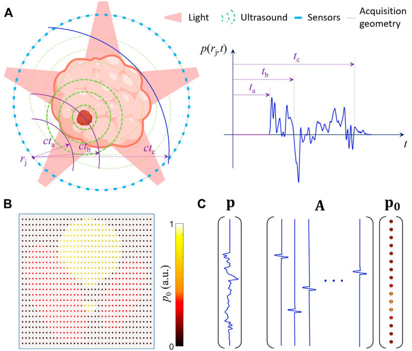

# A Practical Guide for Model-based Reconstruction Optoacoustic Imaging

## 0 Abstract

光声（OA，光声）成像利用超声波在生物组织内的低散射，在光学显微镜无法达到的深度提供基于光吸收的高分辨率对比。
Optoacoustic (OA, photoacoustic) imaging capitalizes on the low scattering of ultrasound within biological tissues to provide optical absorption-based contrast with high resolution at depths not reachable with optical microscopy.

## 1 Introduction

只有在一组包围样品的位置上获取信号，并有足够的角度覆盖，才能准确重建 OA 图像。
OA images can only be accurately reconstructed if signals are acquired at a set of locations enclosing the sample with sufficient angular coverage.

OA 激励主要是用短的（$10^{-10}\sim10^{-7}$秒）光脉冲进行。在这种情况下，收集到的样品周围的信号对应于一个以雷登式变换表示初始问题的解决方案，取决于超声传感器的排列和形状。
OA excitation is mainly performed with short ($10^{-10}\sim10^{-7}$s) light pulses. In this case, the collected signals around the sample correspond to a solution of an initial value problem expressed as a Radon-type transform that depends on the arrangement and shape of US sensors.

传感器的形状和探测带宽以及声学传播效应不能被 FBP 公式准确地解释，这些公式只为特定的采集或扫描几何形状而开发。
The shape and detection bandwidth of the sensors as well as acoustic propagation effects cannot accurately be accounted for by FBP formulas, which have only been developed for specific acquisition or scanning geometries.

另一个需要考虑的重要方面是，断层反演问题的可接受的解决方案可以通过将图像表达为一组基础函数的组合来限制。适当地选择这些函数和正则化条款可以利用基于压缩感知的概念，从相对较少的信号中重建图像。
Another important aspect to consider is the fact that the admissible solutions of the tomographic inversion problem can be restricted by expressing the images as a combination of a set of basis functions. Proper selection of these functions along with regularization terms enable exploiting compressed-sensing-based concepts to reconstruct an image from a relatively low number of signals.

## 2 The Optoacoustic Forward Model

在实践中，MB 重建是通过考虑一个离散到离散的线性模型，将光吸收分布的有限维表示映射到一组位置和时间点上收集的信号。
In practice, MB reconstruction is performed by considering a discrete-to-discrete linear model mapping a finite-dimensional representation of the optical absorption distribution to the collected signals at a set of locations and time points.

OA 正向模型的数学推导取决于光束的时间轮廓，可以在时域或频域进行。
The mathematical derivation of the OA forward model depends on the temporal profile of the light beam and can be done in the time or frequency domains.

|   Symbols   |                         Descriptions                         |
| :---------: | :----------------------------------------------------------: |
| $\delta(t)$ |     Dirac delta, the temporal profile of the light beam.     |
| $\Gamma(r)$ |            the dimensionless Grueneisen parameter            |
|   $H(r)$    |         the energy being thermalized per unit volume         |
|  $p_0(r)$   | $p_0(r)=\Gamma(r)H(r)$, optical absorption resulted initial pressure rise |
|  $p(r,t)$   |                 the acoustic pressure field                  |
|   $c(r)$    |                      the speed of sound                      |
|  $\rho(r)$  |                the mass density of the medium                |

$$
\frac{\partial^2{p}(r,t)}{\partial{t}^2}-c(r)^2\rho(r)\nabla\cdot\left(\frac{1}{\rho(r)}\nabla{p}(r,t)\right)=\Gamma(r)H(r)\frac{\partial\delta(t)}{\partial{t}}\tag{1}
$$

一般来说，包围样本的笛卡尔网格的像素（或体素）被认为是建立用于近似 $H(r)$ 的基函数，例如通过加权插值。
Generally, the pixels (or voxels) of a Cartesian grid enclosing the sample are considered to build the basis functions used to approximate $H(r)$ e.g. via weighted interpolation.
$$
\frac{\partial^2{p}(r,t)}{\partial{t}^2}-c(r)^2\rho(t)\nabla\cdot\left(\frac{1}{\rho(t)}\nabla{p}(r,t)\right)\approx\frac{\partial\delta(t)}{\partial{t}}\sum_{i=1}^{N}p_{0,i}k_i(r)\tag{2}
$$
其中 $p_{0,i}$ 是第 $i$ 个体素中心的初始压力值，$k_i(r)$ 是插值函数。
where $p_{0,i}$ is the initial pressure at the center of the $i$-th voxel and $k_i(r)$ is the interpolation function.

The solution of Eq $(2)$ can be expressed as
$$
p(r,t)=\sum_{i=1}^{N}p_{0,i}p_i(r,t)\tag{3}
$$
其中 $p_i(r,t)$ 是单位初始压力上升时产生的压力场。

离散到离散的 OA 前向模型是由换能器的位置和采样时刻的 $p_i(r,t)$ 的值建立的。具体来说，这些位置和时刻的 $p(r,t)$，以列向量 $\mathbf{p}$ 表示，作为网格体素的 $p_{0,i}$ 的函数，也以列向量 $\mathbf{p}_0$ 表示，即为
The discrete-to-discrete OA forward model is built from the values of $p_i(r,t)$ for the positions of the transducer(s) and the sampling instants. Specifically, $p(r,t)$ at these positions and instants, expressed as a column vector $\mathbf{p}$, is given as a function of $p_{0,i}$ for the voxels of the grid, also expressed as a column vector $\mathbf{p}_0$, as
$$
\mathbf{p}=\mathbf{A}\mathbf{p}_0
$$

模型矩阵 $\mathbf{A}$ 表示离散到离散的 OA 正向模型。该矩阵的列对应于网格中每个体素的 $p_i(r, t)$ 信号。
The model matrix $\mathbf{A}$ represents the discrete-to-discrete OA forward model. The columns of this matrix correspond to the $p_i(r, t)$ signals for each voxel of the grid.

## 3 The Inverse Problem

$$
\mathbf{p}_{0,\text{sol}}=\mathop{\arg\min}_{\mathbf{p}_0}\{\|\mathbf{p}_m-\mathbf{A}\mathbf{p}_0\|_2+\lambda R(\mathbf{p}_0)\}\tag{5}
$$

Optionally, $\mathbf{p}_0$ can be constrained e.g. not to have negative values ($\mathbf{p}_0\ge0$) in order to avoid solutions with no physical meaning.
$$
\mathbf{p}_{0,\text{sol}}=(\mathbf{A}^T\mathbf{A}+\lambda I)^{-1}\mathbf{A}^T\mathbf{p}_m\tag{6}
$$
If a very large regularization term (strong regularization) is chosen to suppress artifacts and enhance signal-to-noise ratio (SNR), the term $\lambda I$ becomes dominant over $\mathbf{A}^T\mathbf{A}$
$$
\mathbf{p}_{0,\text{sol}}=\mathbf{A}^T\mathbf{p}_m\tag{7}
$$
which can be interpreted as a model back-projection (MBP, noniterative) reconstruction approach associated to the discreteto-discrete model and enabling fast reconstructions.

## 4 Outperforming Filtered Back Projection

