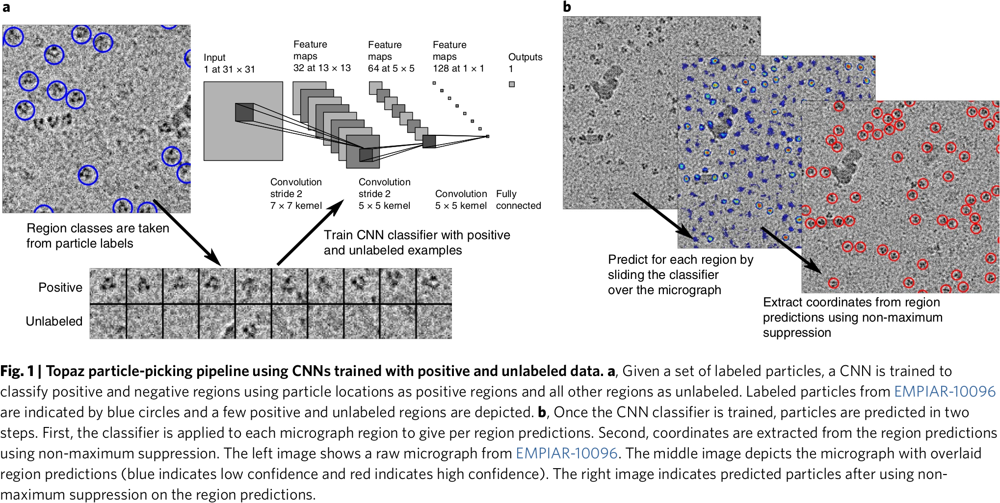

# Positive-unlabeled Convolutional Neural Networks for Particle Picking in Cryo-electron Micrographs

Nature Methods 的切入角度就可以直接到具体生物子领域的子方面了。

## 0 Abstract

Cryo-EM 当前挑选的方法存在假阳率过高、后处理不通用的问题。而 Topaz 用少量的标记的颗粒和负样本训练。

## 1 Introduction

第一段的切入是，Cryo-EM 重建需要足量的 micrograph。Micrograph 首要的问题就是噪声过大，需要大量的图像（图像分辨率和颗粒数量存在对数-线性关系），因此颗粒挑选就是主要瓶颈。

第二段是对过去方法的介绍。传统方法有 DoG 和模板匹配。存在的问题是假阳率高、形状奇特的颗粒无法挑选、需要手工筛选、可能会移除罕见的颗粒视角和构象。AI 方法有 CNN，会在图中提前标注正负样本区域并且预测未标注区域。存在的问题是标注量大、负样本数据的多样性使得负样本要比正样本多一个数量级。

第三段阐述了 Topaz 中的方法。将颗粒挑选问题建模为正样本-未标记样本（Positive-Unlabeled, PU）学习问题。为了解决 PU 学习中存在的过拟合问题，而且用少样本来训练，作者提出了新的损失函数。此外引入了自编码器来提高 In-Context 学习的能力。

第四、五段是介绍 Topaz 的大致效果，并且提供了新的一套数据集。Topaz 在这套数据集上的分辨率是 3.7 $\AA$，并解析出其他方法无法解析的二级结构。在三个公开数据集上，Topaz 只使用了 1,000 个数据做训练。Topaz 在确定长簇型原始卡德林的单颗粒行为中发挥了关键作用。

## 2 Result

### Topaz Pipeline

1. 可选的 GMM 数据增强。
2. PU 学习的架构 + CNN + SGD。
3. 滑动窗口计算像素级的概率 + 非极大值抑制。

#### Classifier Training from Positive and Unlabeled Data

除了 CNN 外，还有一个自编码器来帮助 In-Context 学习。

#### Micrograph Region Classification and Particle Extraction

### Topaz Picks Challenging Particles and Orientations

一个小型、不对称、非球形且聚集的蛋白质，一种 Toll 受体。

|                     |        DoG        |     Template      |        Topaz        | Other CNN |
| :-----------------: | :---------------: | :---------------: | :-----------------: | :-------: |
|       Picking       | 770,263/1,599,638 | 627,533/1,265,564 | 1,006,089/1,010,937 | 131,300/0 |
|         FSC         |       3.86        |       3.92        |        3.70         |  6.8/NaN  |
| Secondary Structure |        :x:        |        :x:        | :white_check_mark:  |    :x:    |

各种视角的蛋白质都可以挑选出来。

### Topaz Enables High-resolution Reconstruction with No Post-processing

用 Topaz 多挑出来的颗粒做重建，发现质量一样。

### Topaz Particle Predictions are Well-ranked and Contain Few False Positives

设定的阈值越低，挑选出的颗粒就越多，但是假阳率也越高，高到一定程度时候，分辨率反而会下降。但是视角均衡也会影响重建的质量，越均衡越好。

### GE-criteria-based PU Learning Method Outperforms Other General-purpose PU Learning Approaches

说明某个方法的好坏需要做假设检验。

加入了自编码器增强 In-Context 学习，少标几个有助于学习，但是多标就容易导致过度正则化。测试下来权重 $\gamma=10/N$、$N\le250$ 会比较好。

## 3 Discussion

## 4 Methods

### Dataset Description

|    Dataset    |         Protein         | Original (Angstroms per pixel) | Downsampled (Angstroms per pixel) | Particle radius (pixels) | Training radius (pixels) | $\pi$ | Trainning Number of micrographs | Trainning Number of particles | Test Number of micrographs | Test Number of particles |
| :-----------: | :---------------------: | :----------------------------: | :-------------------------------: | :----------------------: | :----------------------: | :---: | :-----------------------------: | :---------------------------: | :------------------------: | :----------------------: |
| EMPIAR-10025  |     T20S proteasome     |              0.98              |               15.7                |            7             |            3             | 0.035 |               156               |            39,653             |             40             |          10,301          |
| EMPIAR-10028  |      80S ribosome       |              1.34              |               10.7                |            12            |            3             | 0.012 |               831               |            80,701             |            250             |          24,546          |
| EMPIAR-10096  |  Hemagglutinin trimer   |              1.31              |               5.24                |            10            |            4             | 0.035 |               347               |            100,465            |            100             |          29,535          |
| EMPIAR-10215  | Rabbit muscle aldolase  |             0.832              |               6.64                |            10            |            3             |  0.1  |               865               |            163,758            |            200             |          39,347          |
| EMPIAR-10234  | Clustered protocadherin |             1.061              |               8.49                |            15            |            4             | 0.015 |               67                |             1,167             |             20             |           373            |
| Toll receptor |      Toll receptor      |             0.832              |               3.328               |            25            |            5             | 0.035 |               30                |              686              |             14             |           362            |

### Micrograph Normalization

|     Symbols      |                     Descriptions                     |
| :--------------: | :--------------------------------------------------: |
|   $x_{i,j,k}$    |            第 $k$ 张图片像素 $(i,j)$ 的值            |
|   $z_{i,j,k}$    | 第 $k$ 张图片像素 $(i,j)$ 对应的 Gaussian 分布的序号 |
|      $\rho$      |               采样第 $z$ 个分布的参数                |
|    $\alpha_k$    |                 第 $k$ 张图片的增益                  |
| $\mu_z,\sigma_z$ |            第 $z$ 个 Gaussian 分布的参数             |

每张图片用了 2 个 Gaussian 组成的 GMM 模型来归一化。给定 K 张图像，每个像素都被建模为来自 GMM 其中一个 Gaussian，即

$$
\begin{align*}
z_{i,j,k}&\sim\mathrm{Bernoulli}(\rho)\\
x_{i,j,k}\mid z_{i,j,k}&\sim\mathrm{Gaussian}\left(\alpha_k\mu_{z_{i,j,k}},\left(\alpha_k\sigma_{z_{i,j,k}}\right)^2\right)
\end{align*}
$$

$\mu_z,\sigma_z,z\in\{0,1\}$ 和 $\alpha_k,k\in\{1,\dots,K\}$ 使用 EM 算法求解出来，$\rho$ 取 0.5。最后归一化的像素为：
$$
x'_{i,j,k}=\frac{1}{\sigma_{z_{i,j,k}}}\left(\frac{x_{i,j,k}}{\alpha_k}-\mu_{z_{i,j,k}}\right)
$$

从结果来看，该算法比 Auto Contrast 能更好的拉开图像的对比度。

### PU Learning Baselines

|     Symbols     |               Descriptions                |
| :-------------: | :---------------------------------------: |
|       $P$       |    以颗粒为中心的已标记为正样本的区域     |
|       $U$       |               未标记的区域                |
|      $\pi$      |      未标记的区域中正样本区域的比例       |
|       $g$       |               像素级分类器                |
| $y_i\in\{0,1\}$ |        0 表示负样本，1 表示正样本         |
|     $Y(k)$      | 包含了 $k$ 个正样本和任意多个负样本的集合 |

PU 学习的目标函数为
$$
\pi\mathbb{E}_{x\sim P}[L(g(x),1)]+(1-\pi)\mathbb{E}_{x\sim U}[L(g(x),0)]
$$
这种方法在正样本与未标记数据点完全分离时效果很好，但容易因为对分类目标规范不足而出现过拟合问题。有点类似于 Cross Entropy Loss。（个人觉得这样设计的 Loss 完全没道理。）

### PU Learning with Generalized Expectation Criteria

如果 $\pi$ 是已知的，那么可以用 $\pi$ 来作为分类器的一个约束，即 GE-KL 散度
$$
\mathbb{E}_{x\sim P}[L(g(x),1)]+\lambda\mathrm{KL}(\mathbb{E}_{x\sim U}[g(x)]||\pi)
$$
对于 SGD 的方法来说，从小批量数据来估计 GE-KL 散度是有偏的，因此用 GE 二项分布来解决这个问题。在来自 $U$ 的 $N$ 个样本的小批量中，正样本的数量 $k$ 遵循参数为 $\pi$ 的二项分布。分类器也定义了在小批量数据上正样本数量的分布：
$$
q(k)=\sum_{y\in Y(k)}\prod_{i=1}^{N}g(x_i)^{y_i}\left(1-g(x_i)^{(1-y_i)}\right)
$$
带入 KL 散度的公式得到
$$
\mathbb{E}_{x\sim P}[L(g(x),1)]+\lambda\sum_{k=1}^{N}q(k)\log p(k)
$$
精准计算 $q(k)$ 不太实际且没有必要，由中心极限定理可以保证，用均值为 $\sum_{i=1}^{N}g(x_i)$、方差为 $\sum_{i=1}^{N}g(x_i)(1-g(x_i))$ 的 Gaussian 做近似即可。

### Autoencoder-based Classifier Regularization

| Symbols |         Descriptions         |
| :-----: | :--------------------------: |
|   $f$   | Encoder 中除去最后一层的网络 |
|   $c$   |      Encoder 中最后一层      |
|   $d$   |           Decoder            |
|   $D$   |          图片数据集          |

Topaz 中用到了 AutoEncoder。其中 $g=c(f(I))$，重建的图像 $I'=d(f(I))$，最终的目标函数为
$$
\mathbb{E}_{x\sim P}[L(g(x),1)]+\lambda\sum_{k=1}^{N}q(k)\log p(k)+\gamma\mathbb{E}_{x\sim D}[\|x-d(f(x))\|^2_2]
$$

### Classifier and Autoencoder Architectures and Hyperparameters

