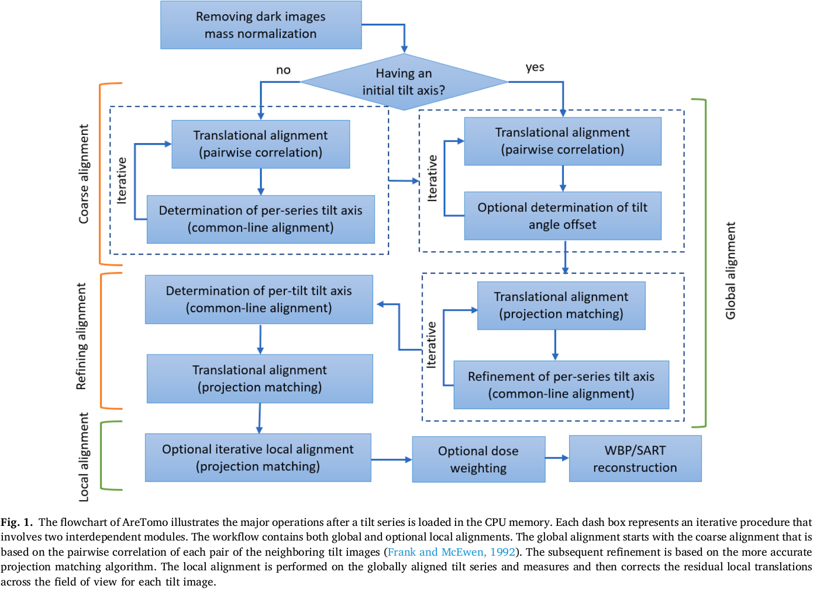

# AreTomo: An Integrated Software Package for Automated Marker-free, Motion-corrected Cryo-electron Tomographic Alignment and Reconstruction

## 0 Abstract

通过校正平面内旋转、平移，更重要的是 tilt series 内由光束引起的运动局部运动，AreTomo 可以生成足够精确的断层图像，直接用于子断层平均。另一个主要应用是在 tilt series 采集的同时即时重建断层图像，为用户提供样本质量的实时反馈，以便用户对采集参数进行必要的调整。AreTomo 发现校正全局运动后的残余局部运动在 $\pm80\AA$ 范围内，这表明精确校正局部运动对高分辨率 cryoET 至关重要。

## 1 Introduction

因为公共轴与倾斜轴具有相同的方向，公共轴方法旨在通过迭代来确定倾斜轴的方向以及平移移位。

投影匹配旨在通过迭代将等效的标本区域与不完美重建的体积的参考再投影进行匹配，以确定最佳的对齐参数集。

## 2 Method and Results

全局对齐确定了倾斜角度偏移、倾斜图像的平移以及在整个倾斜系列中变化的倾斜轴方向。

For example, the first iterative procedure is the coarse align­ment of both translation and in-plane rotation. The translational align­ment implements the pairwise correlation algorithm that requires stretching the higher-tilt image in the direction perpendicular to the tilt axis. Therefore, it depends on the orientation of tilt axis, a result of the in-plane rotational alignment, which calculates a set of potential common lines on each translational aligned tilt image.
第一个迭代过程是粗略对齐平移和平面旋转。平移对齐实施了成对相关算法，需要将较高倾斜图像在垂直于倾斜轴方向上进行拉伸。因此，这依赖于倾斜轴的方向，这是平面旋转对齐的结果，该对齐计算了每个平移对齐的倾斜图像上的一组潜在公共线。

### 2.1 Determination of  Tile-angle Offset

设 $\Delta\alpha$ 为倾斜角偏移量，AreTomo 目的是最大化所有相邻图像之间的交叉相关系数之和。两张图像之间更高倾斜角度的图像会按照如下公式
$$
\cos(\alpha_i+\Delta\alpha)/\cos(\alpha_j+\Delta\alpha)
$$
垂直于倾斜轴进行拉伸。目标函数因此为
$$
\arg\max_{\Delta\alpha}\sum_{i}\mathrm{CC}(t_i,t_j)
$$
$\alpha_i$, $\alpha_j$ 是图像 $t_i$ 和 $t_j$ 的倾斜角度。

### 2.2 Alignment of In-plane Rotations

单轴 CryoET 中，投影图像在 Fourier 空间中相交在公共线上。由于公共线与倾斜轴方向相同，因此通过最大化公共线的交叉相关来实现。

平移和平面内旋转的对齐是相互依赖的，它们在迭代中是交错的，即旋转对齐是基于上一轮迭代的 tilt series 进行的，而对倾斜轴方向的改进估计则用于下一轮的平移对齐。由于对平移和旋转的纠正，公共线计算中排除了缺失区域。因为高倾斜角度会增加样品的视野，带入了在较低倾斜图像中不存在的额外信息。为了抑制这种误差源，AreTomo 首先确定了整个 tilt series 中计算公共线的公共视野。

---

公共线法认为图像在频域中会相交于同一条线段，因此就垂直于倾斜轴在图像上的投影再做一次 Radon 变换，把 2D 图像变为 1D 信号。然后固定 0 度视角，最大化每个视角之间的交叉相关系数，再更新优化平面内旋转。

---

倾斜轴方向在每个 tilt 内变化，但变化很慢，使用倾斜角的三次多项式函数来建模这种变化，同时抑制噪声，并通过最大化以下目标函数来使用共轭梯度法进行求解。
$$
\arg\max_{a_0,\dots,a_3}\sum\sum_{i\ne j}\mathrm{CC}(l_i, l_j)
$$
$l_i$, $l_j$ 是图像 $t_i$ 和 $t_j$ 的公共线。

### 2.3 Translational Alignment

AreTomo 的平移对齐用的是投影匹配方法的一种变体。主要改变之一是在投影图像计算中使用加权方案。在傅立叶空间中，相邻的切片具有最大的相似性，而相隔 90 度的切片在除了沿着公共线的方向之外是相互独立的。更确切地说，不同图片之间的实际耦合是分辨率、Z厚度以及倾斜角差异的函数。然而，为了通用性，当为后续正向投影到参考角度的中间层析图进行重建时，AreTomo 根据与参考角度的角度差异的余弦值对倾斜图像进行加权。当角度差异超过 90 度时，将使用其补角。采集在参考角度的倾斜图像被排除以避免自相关。另一个改变是，倾斜图像按从低到高的倾斜角度依次对齐，将校正后的倾斜角度最接近零的图像设置为参考图像。仅使用对齐的倾斜图像和参考图像来重建中间层析图，然后将其正向投影到下一个要对齐的倾斜图像的角度。因此，在较高角度的图像对齐中使用了更多的图像。与仅使用成对比较相比，这种方法不太容易积累误差。值得注意的是，尽管整个对齐过程是迭代的，但实际的平移偏移计算是非迭代的，使用基于滤波 FFT 的交叉相关以提高效率。

### 2.4 Local Alignment

