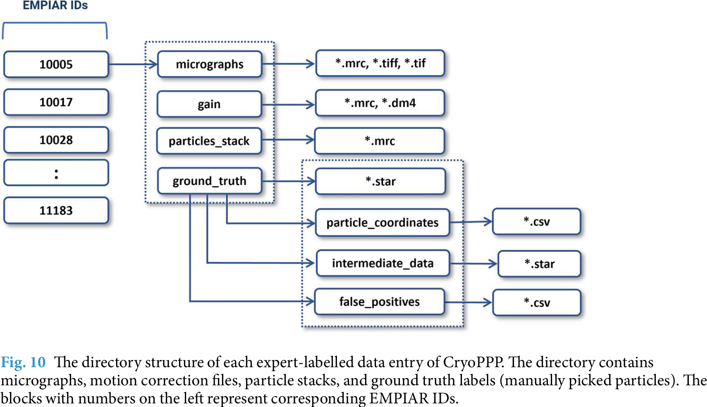

# A Large Expert-curated Cryo-EM Image Dataset for Machine Learning Protein Particle Picking

## 0 Abstract

从 EMPIAR 挑选 34 种蛋白质，总共 2.6 TB，9893 张高分辨率、标注了颗粒坐标的图片。

## 1 Background & Summary

## 2 Cryo-EM Grid Preparation and Image Acquistion

## 3 Cryo-EM Micrographs and Single Particle Analysis

挑选任务的难度所在：
1. 由冰和污染引起的高噪声水平
2. 颗粒图像的低对比度
3. 颗粒的异质构象
4. 由方向变化引起的单个颗粒外观的不可预测性。

## 4 Advances and Challenges in Single Protein Particle Picking

模版匹配、XMIPP、APPLE picker、DeepPicker、DeepEM、FastParticle Picker、crYOLO、PIXER、PARSED、WARP、Topaz、AutoCryoPicker、DeepCryoPicker。

小样本训练的缺陷是，他们不能很好的分辨“好”和“坏”的颗粒，坏的颗粒一般是重叠的颗粒、聚合体、冰污染、碳。小样本小在数量和多样性甚至测试上。

## 5 Methods

## 6 Data Records

每个数据文件夹（以其相应的 EMPIAR ID 为命名）包含以下信息：
1. 原始图片（无论是否经过运动校正）
2. Gain 运动校正参考
3. 新的运动校正显微照片（如果原始显微照片没有经过运动校正）
4. 真值标签（手动挑选的颗粒）
5. 颗粒栈

### Raw Micrographs

原始图片来自 EMPIAR，部分做了运动校正。如果有一个“gain”文件夹，那么在数据集中它既包括原始的无运动校正的显微照片，也包括由我们创建的运动校正的显微照片。用户应该使用运动校正显微照片作为机器学习任务的输入。

### Motion Correction (Gain Files)

### Particle Stack

### Ground Truth Labels

真值包含了所有的正样本和部分典型的负样本（冰污染、聚合体、碳边界），分开在两个文件中。

## Technical Validation

