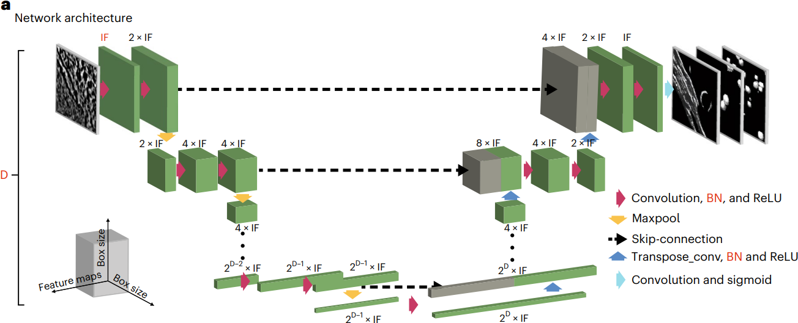

# Convolutional Networks for Supervised Mining of Molecular Patterns within Cellular Context

## 0 Abstract

为了在实验数据上对 DeePiCt (Deep Picker in Context) 进行训练和基准测试，我们全面标注了 20 份粟酒裂殖酵母的**核糖体**、**脂肪酸合酶**、**膜**、**核孔复合物**、**细胞器**和**胞质溶胶**的断层图。
To train and benchmark DeePiCt (Deep Picker in Context) on experimental data, we comprehensively annotated 20 tomograms of Schizosaccharomyces pombe for ribosomes, fatty acid synthases, membranes, nuclear pore complexes, organelles, and cytosol.

我们使用 DeePiCt 研究组成不同的细胞核糖体亚群，重点关注它们与线粒体和内质网的背景关联。
We use DeePiCt to study compositionally distinct subpopulations of cellular ribosomes, with emphasis on their contextual association with mitochondria and the endoplasmic reticulum.

最后，将预训练的网络应用于 HeLa 细胞断层扫描表明，DeePiCt 在几分钟内即可对来自不同生物物种的未见过的数据集实现高质量的预测。
Finally, applying pre-trained networks to a HeLa cell tomogram demonstrates that DeePiCt achieves high-quality predictions in unseen datasets from different biological species in a matter of minutes.

## 1 Introduction

模板匹配基于对已知复合物模板的相似系数（交叉相关性）进行逐点数值计算，是一种常用的计算方法。这种方法能准确定位大型结构，但无法识别较小或密度较低的颗粒，而且计算量很大。
Template Matching is a commonly applied computational approach and is based on a point-wise numerical computation of a similarity coefficient (cross correlation) to a known template of the complex in question. It is accurate in the localization of large structures, but fails at identifying smaller or less dense particles , and is computationally intensive.

目前使用经典图像处理技术的无模板方法是针对特定分子构型设计的，因此仅限于颗粒与膜或微管等大型细胞结构相关联的分子构型。
Current template-free methods using classical image processing are designed for, and thus limited to, specific molecular configurations in which particles are associated with large cellular structures such as membranes or microtubules.

这两种方法通常都需要人工因此费时费力。
Both these methods typically require manual inspection and are therefore laborious and time-consuming.

我们介绍一款开源软件 DeePiCt，它与有监督卷积网络协同作用，可对细胞区室（细胞器或细胞膜）和结构（膜或细胞骨架丝）进行分割，并对粒子进行定位。
We present DeePiCt (deep picker in context), an open-source software that synergizes supervised convolutional networks for segmentation of cellular compartments (organelles or cytosol) and structures (membranes or cytoskeletal filaments), and localization of particles.

## 2 Results

### 2.1 DeePiCt for automated segmentation and particle localization

它结合了二维 CNN 和三维 CNN，二维 CNN 用于分割易于识别的细胞区，三维 CNN 受益于三维信息，用于粒子定位和注释连续结构，如膜和细胞骨架丝（图 1）。
It combines a 2D CNN for segmentation of cellular compartments that are easily recognized in 2D, and a 3D CNN for particle localization and annotation of continuous structures, such as membranes and cytoskeletal filaments, that benefit from 3D information.

二维和三维 CNN 均改编自原始 U-Net 架构（图 1a 和补充材料 1）。二维 CNN 采用固定深度 5（4 个最大池化层）和 16 个初始过滤器（图 1a）。三维 CNN 允许多标签学习（补充材料 1），并可调整深度、初始滤波器数量、批处理归一化层以及编码器和解码器路径中的 dropout 参数等架构参数（图 1a）。
The 2D and 3D CNNs are adapted from the original U-Net architecture. The 2D CNN employs a fixed depth of 5 (4 max-pooling layers) and 16 initial filters. The 3D CNN allows multi-label learning and adjustable architectural parameters for depth, number of initial filters, a batch normalization layer, and the dropout parameter in the encoder and decoder paths.

一般来说，较大的颗粒可以从较大的深度中获益，以增加网络的感受野，而低密度打印（相对于周围环境的低信噪比）的颗粒则需要更多的初始滤波器（补充表 1）。
In general, larger particles benefit from larger depth to increase the receptive field of the network, and particles with a low-density print (low SNR with respect to the surrounding context) require more initial filters.

训练时，每个网络都需要相关结构的断层图和相应的三维二值分割掩膜，例如用于二维 U-Net 的细胞器分割和用于三维 U-Net 的代表粒子的球体（图 1b）。**原始输入断层图可选择使用幅谱均衡滤波器进行预处理，以增强图像对比度（图 1c 和扩展数据图 1）。**
For training, each network requires tomograms and corresponding 3D binary segmentation masks of the structures of interest, for example organelle segmentations for the 2D U-Net and spheres representing particles for the 3D U-Net. **The raw input tomograms are optionally pre-processed using an amplitude spectrum equalization filter to enhance image contrast.**

在二维网络的训练过程中，图片会以 90 度的增量随机翻转和旋转，以提高泛化能力。对于 3D CNN，我们对输入图像进行了一系列可选的随机变换，以增加数据量（补充材料 1）。根据我们的经验，二维 CNN 需要大约 6 份完全分割的断层图像来进行训练，而三维 CNN 则需要大约 5 份断层图像来进行膜分离，并需要至少 300 个注释实例来进行粒子学习，这与细胞体积中的粒子稀疏性无关（补充图片 2）。
During training of the 2D network, tiles are randomly flipped and rotated in 90-degree increments to improve generalization. For the 3D CNN, we implemented a number of optional random transformations to the input images for data augmentation. In our experience, the 2D CNNs require about 6 fully segmented tomograms for training, while the 3D CNNs require about 5 tomograms for membrane segmentation, and a minimum of 300 annotated instances for particle learning independent of particle sparsity in the cellular volumes.

将二维网络输出的预测切片组合成三维体像，通过应用一维高斯滤波器沿 $Z$ 轴进行平滑处理，然后进行阈值处理（用户可自定义，默认为 0.75），生成二值三维体像（扩展数据图 2a-2c）。根据用户定义的概率值对三维 CNN 的输出进行阈值处理，然后进行聚类，生成二值分割图。
The predicted slices outputted by the 2D network are combined into a 3D volume, smoothened along the z-axis by applying a one-dimensional Gaussian filter, and thresholded (user-definable, default = 0.75) to generate a binary 3D map. The output of the 3D CNN is thresholded at a user-defined probability value, followed by clustering, to generate a binary segmentation map.

聚类输出可与代表断层扫描区域的二值图（例如二维 CNN 的细胞膜分割）中的上下文信息整合，以减少误报。整合模式可根据用户的具体应用，在三种不同选项中进行选择：交叉、接触或共定位（图 1e 和补充图像 3）。
The clustered output can be integrated with contextual information from a binary map representing a tomographic region (for example, the cytosol segmentation from the 2D CNN) to reduce false positives. The mode of integration can be chosen among three different options: intersection, contact, or colocalization, depending on the users' specific application.

在粒子定位时，可根据聚类中心点生成坐标列表。
For particle localization, a list of coordinates is generated from the clusters' centroids.

对于细胞丝等连续结构的分割，可沿分割中心线以选定的间距进行坐标采样并导出；然后可通过外部软件（如 Warp、M、RELION、Dynamo 或 EMAN2）的子图分析获得粒子方向和结构特征。
For segmentations of continuous structures, such as cellular filaments, coordinates can be sampled along the segmentation centerline at a chosen spacing and exported; the particle orientations and structural features can then be obtained by subtomogram analysis in external software (for example, Warp, M, RELION, Dynamo, or EMAN2).

### 2.2 Generation of ground truth annotations in S. pombe

我们设计了一个迭代工作流程，将模板匹配、DeePiCt 和人工拾取结合起来，对通过结合离焦和伏特电位相板 (VPP) 获得的十份断层图像以及十份纯离焦断层图像（defocus）中的核糖体、脂肪酸合成酶 (FAS)、膜、细胞器和细胞质进行注释（图 2 和补充表 2-4）。
We devised an iterative workflow combining template matching, DeePiCt, and manual picking, to annotate ribosomes, fatty acid synthases (FAS), membranes, organelles, and the cytoplasm in ten tomograms acquired by combining defocus and a Volta potential phase plate (VPP) and ten defocus-only tomograms (defocus).

为注释核孔复合体（NPC），还使用了一个包含约 354 个 NPC 的 127 张断层图像（用 defocus* 表示）的额外数据集，以确保为这一**大型、低丰度（平均每张断层图像 3 个）、结构灵活的复合体**提供足够的训练数据。
For annotating the nuclear pore complex (NPC), an additional dataset of 127 tomograms (denoted by defocus*) featuring ~354 NPCs was used to ensure enough training data for this **large, low abundance (on average three per tomogram), and structurally flexible complex**.

|          |                             defocus + VPP tomograms                             |                     defocus-only tomograms                     |
| :------: | :-----------------------------------------------------------------------------: | :------------------------------------------------------------: |
| ribosome |        25311, template maching (61.6%) + DeePiCt (21%) + manually (17%)         | 25901, template maching (19%) + DeePiCt (19%) + manually (61%) |
|   FAS    | 731, template maching (0%) + manually (58.96%) + DeePiCt (22%) + manually (19%) |      366, manually (49%) + DeePiCt (37%) + manually (14%)      |

两种采集类型的核糖体总数相当，而在散焦数据集中检测到的 FAS 颗粒较少，这可能是由于尽管使用了均衡滤波器，但信噪比较低的缘故（扩展数据图3，补充表2和3以及补充说明2）。
Total numbers of ribosomes in both acquisition types were comparable, while fewer FAS particles were detected in the defocus dataset likely owing to the lower SNR despite the application of an equalization filter.

为了评估所获得的核糖体和 FAS 的 GT 注释的质量，我们进行了结构三维分类和细化（补充注释 2、补充图 5-7 以及补充表 7 和 8；方法）。仅通过 DeePiCt 检测到的核糖体的平均值再现了 80S 核糖体，与所有注释核糖体的平均值相似（图 2l,m）。FAS 的三维分类表明，DeePiCt 与手动标注相结合，可以恢复这些具有挑战性的壳状结构，而不受数据采集类型的影响（图 2l,m，补充注释 2 和补充图 6）。
To assess the quality of the obtained ground truth annotations for ribosome and FAS, we performed structural 3D classification and refinement. Averages of ribosomes detected only by DeePiCt recapitulate 80S ribosomes, similar to the averages from all annotated ribosomes. 3D classifications of FAS demonstrated that DeePiCt together with manual annotations can recover these challenging shell-like structures independent of the data acquisition type.

> 图 2 主要可视化了每一轮（模板匹配、DeePiCt、手工）挑选的颗粒（核糖体、酶、膜），展示了每一轮挑选的颗粒的占比，可视化了挑选的 Subtomogram Averages。

### 2.3 Performance analysis and hyper-parameter tuning of DeePiCt 

#### Performance analysis of 2D CNN in VPP.

为了评估二维 CNN 的性能，我们使用五重交叉验证对十张 GT VPP 层析成像进行了两项二值分割任务评估：所有细胞器（所有膜封闭细胞器和核质）的分割和细胞质的分割。二维 CNN 实现了较高的精确度-召回曲线下面积（AUPRC；补充注释 1 和补充图 4），细胞器的 AUPRC 中值为 0.92，细胞质的 AUPRC 中值为 0.98（图 3a 和扩展数据图 5）。
For assessing the performance of the 2D CNN, we evaluated two binary segmentation tasks on the ten ground truth VPP tomograms using fivefold cross-validation: segmentation of all organelles (all membrane-enclosed organelles and the nucleoplasm), and segmentation of the cytosol. The 2D CNN achieves high areas under the precision–recall curve (AUPRC), with a median AUPRC of 0.92 for organelles and 0.98 for cytosol.

#### Hyper-parameter tuning for the 3D CNN

为了衡量性能，我们将每个目标结构的预测结果与适当的“区域掩码”整合在一起，以去除预期区域之外的假阳性结果（补充图 3）：对于核糖体和 FAS，我们使用了“交叉”模式下二维 CNN 预测的细胞膜；对于膜分割，我们使用了“接触”模式下二维 CNN 预测的细胞膜；对于 NPC，我们使用了“接触”模式下三维 CNN 预测的核膜。
To measure performance, we integrated the predictions of each target structure with an appropriate 'region mask' to remove false positives outside of expected regions: for ribosome and FAS, we used a cytosol prediction from the 2D CNN in 'intersection' mode; for membrane segmentation, we used the predicted cytosol from the 2D CNN in 'contact' mode; for NPCs, we used a 3D CNN prediction of the nuclear envelope in 'contact' mode.

#### Performance of DeePiCt in the same-domain setting

利用优化后的网络，我们使用三重交叉验证分析了 DeePiCt 工作流程在同域设置（即在同一数据集类型中进行训练和测试）中的性能（图 3b 和扩展数据图 7a-c）。在 VPP 中，核糖体的性能 F1 得分介于 0.68 和 0.80 之间（中位数为 0.79），FAS 的性能 F1 得分介于 0.21 和 0.64 之间（0.46），膜的体素 F1 得分介于 0.58 和 0.90 之间（0.71）。
Using the optimized networks, we analyzed the performance of the DeePiCt workflow in the same-domain setting (that is, training and testing in the same dataset type) using threefold cross-validation. In VPP, it achieved a performance F1 score between 0.68 and 0.80 (median 0.79) for ribosomes, between 0.21 and 0.64 (0.46) for FAS, and a voxel-F1 between 0.58 and 0.90 (0.71) for membranes.

对于离焦\*中的核孔复合体的分割（图 3c），即使网络是在完整数据集上训练的，其性能也取决于断层图像的质量，其中 23% 的断层图像根据薄片厚度和倾斜序列对齐误差被评估为高质量（方法）。DeePiCt 单标签网络与多标签网络的比较分析表明，即使在多标签网络训练中使用了考虑类不平衡的损失函数，如广义 Dice，单标签网络也能提供更好的结果（扩展数据图 6）（补充图 1）。
For the NPC segmentation in defocus\*, the performance depended on the quality of the tomograms, 23% of which were assessed to be high quality on the basis of lamella thickness and tilt-series alignment error (Methods), even if the network was trained on the full dataset. Comparative analysis between DeePiCt single-class versus multi-label networks showed that single-class networks provide better results, even when employing loss functions that account for class imbalance, such as Generalized Dice, in multi-label networks training.

|        |                        |                  |                     |                        |                      |                       |
| :----: | :--------------------: | :--------------: | :-----------------: | :--------------------: | :------------------: | :-------------------: |
| Space  | Performance evaluation |      Class       | Same domain DeePiCt | Same domain DeepFinder | Cross-domain DeePiCt | VPP Template matching |
| 3D CNN |       Picking F1       |    Ribosomes     |        0.79         |        **0.83**        |         0.59         |         0.49          |
| 3D CNN |       Picking F1       |       FAS        |      **0.46**       |          0.11          |         0.15         |         0.06          |
| 3D CNN | Segmentation voxel-F1  |    Membranes     |      **0.79**       |           -            |         0.41         |           -           |
| 3D CNN | Segmentation voxel-F1  |       NPC        |      **0.24**       |           -            |          -           |           -           |
| 3D CNN | Segmentation voxel-F1  | High quality NPC |      **0.47**       |           -            |          -           |           -           |
| 3D CNN | Segmentation voxel-F1  | Low quality NPC  |      **0.19**       |           -            |          -           |           -           |
| 2D CNN |   Segmentation AUPRC   |    Organelles    |      **0.92**       |           -            |         0.74         |           -           |
| 2D CNN |   Segmentation AUPRC   |     Cytosol      |      **0.97**       |           -            |         0.95         |           -           |

#### Comparison of DeePiCt to state-of-the-art tools

在核糖体定位方面，DeepFinder 的表现与 DeePiCt 相当（中位数 F1 为 0.83 对 0.79）。在 FAS 定位方面，DeepFinder 的表现明显不如 DeePiCt（0.11 对 0.46；t 检验 P = 0.007；图 3d）。
In ribosome localization, DeepFinder performed comparably to DeePiCt (median F1 0.83 versus 0.79). For FAS localiza tion, DeepFinder performed significantly worse than DeePiCt (0.11 versus 0.46; t-test P = 0.007).

通过比较核糖体原始输出层析图中每个层析图的前 2000 个交叉相关峰和 FAS 的前 1000 个峰来衡量模板匹配性能。它在每个数据集中的检测都需要几个小时，在核糖体定位方面的表现比两种深度学习方法都差，而在 FAS 方面则完全失败（图 3e）。
Template matching performance was measured by comparing the top 2,000 cross correlation peaks per tomogram of the raw output for ribosome and the top 1,000 peaks for FAS. It required several hours for detection in each dataset and showed worse performance than both deep-learning methods for the localization of ribosome, and completely failing for FAS.

### 2.4 DeePiCt domain generalization across acquisition conditions

与 VPP 相比，散焦数据的优点是可以在子图平均中生成分辨率更高的图。然而，它的图像信噪比和对比度较低。
Defocus data has the advantage of yielding higher-resolution maps in subtomogram averaging compared to VPP. Yet, it suffers from a lower image SNR and contrast.

在 VPP 层析成像上训练的二维 CNN 模型在离焦数据上的表现略逊于同域设置（细胞质的 AUPRC 为 0.82，细胞器的 AUPRC 为 0.42；图 3a，f）。同样，与同域设置相比，DeePiCt 三维 CNN 的性能也有所下降，核糖体的中位 F1 为 0.59，FAS 为 0.15，膜的中位体素 F1 为 0.41（图 3g）。
The 2D CNN model trained on VPP tomograms shows slightly poorer performance on defocus data than in the same-domain setting (AUPRC 0.82 for cytosol and 0.42 for organelles). Similarly, DeePiCt 3D CNN performance dropped with respect to the same-domain setting to a median F1 of 0.59 for ribosome, 0.15 for FAS, and median voxel-F1 of 0.41 for membranes.

> 图 3 展示了
>
> - a 2D CNN 分割细胞器和细胞质的 AUPRC。
> - b DeePiCt 在核糖体、酶、膜上的 F1 分数。
> - c DeePiCt 在核孔复合体上的 F1 分数（根据薄片厚度和倾斜序列对齐误差区分高低质量）。
> - d DeepFinder 在核糖体、酶上的 F1 分数。
> - e 模板匹配在核糖体、酶上的 F1 分数。
> - f 训练在 VPP 上的 2D CNN 在 Defocus 上分割细胞器和细胞质的 AUPRC。
> - g 训练在 VPP 上的 3D CNN 在 Defocus 上核糖体、酶、膜上的 F1 分数。

### 2.5 DeePiCt predictions result in high-quality subtomogram averages

就 FAS 而言，虽然 DeePiCt 发现的颗粒少于 GT（补充表 8、9），但子图平均值显示了应用 D3 对称的桶状 I 型 FAS 的两个半圆顶，这与 GT 平均值和其他酵母菌种已发表的结构一致（图 4c、d 和扩展数据图 8b-e）。
For FAS, while DeePiCt identified fewer particles than in the ground truth, subtomogram averages revealed the two half domes of the barrel-shaped type I FAS with applied D3 symmetry, consistent with the ground truth average and published structures from other yeast species.

对核糖体颗粒进行三维细化后，在 M 中进行多颗粒细化后得到了标称分辨率为 11 $\AA$（GT）和 15 $\AA$（DeePiCt 预测）的子图平均值（图 4e 和扩展数据图 8f）。分层三维分类显示了一个排列整齐的类别，该类别在 M 中被进一步细化到 9.3 $\AA$（GT）和 9.4 $\AA$（DeePiCt）的亚纳米分辨率（图 4f-h 和扩展数据图 8i-k）。这样就可以确定占据肽基转移酶中心（PTC）P 位点和面向 E 位点的 L1 柄的 tRNA（图 4g、h 和扩展数据图 8j、k）。
3D refinement of the ribosomal particles resulted in subtomogram averages with nominal resolutions of 11 $\AA$ (ground truth) and 15 $\AA$ (DeePiCt predictions) after multi-particle refinement in M (Fig. 4e and Extended Data Fig. 8f). Hierarchical 3D classification revealed a well-aligned class that was further refined in M to subnanometer resolutions of 9.3 $\AA$ (ground truth) and 9.4 $\AA$ (DeePiCt) (Fig. 4f–h and Extended Data Fig. 8i–k). This allowed the identification of tRNA occupying the P-site of the peptidyl transferase center (PTC) and the L1 stalk facing the E-site (Fig. 4g,h and Extended Data Fig. 8j, k).

### 2.6 DeePiCt-predicted ribosomes reveal functional subpopulations

### 2.7 DeePiCt reveals ribosome-mitochondria association

> 图 4 展示了
>
> - a 数据处理前后对比。
> - b DeePiCt 在跨域设置中的分割结果示例。
> - c, d DeePiCt 挑选的 FAS 做 Subtomogram Averages。
> - e ~ h DeePiCt 挑选的核糖体与 GT 在 M 中做 Subtomogram Averages 的对比。
> - i 对 40S 小亚基头部的 DeePiCt 挑选的核糖体进行集中分类（Focused Classification）。
> - j 对核糖体出口隧道处的 DeePiCt 挑选的核糖体进行集中分类。
> - k, l 内质网和核糖体的联系
> - m, n 内质网和核糖体/线粒体与核糖体的联系

### 2.8 Trained networks can be readily applied to other species

为了证明我们的工作流程在跨物种领域通用性方面的潜力以及应用预训练模型的简便性，我们在已发表的 VPP HeLa 细胞数据集中预测了核糖体、膜和细胞骨架丝（肌动蛋白和微管）（图 5）。为了进行评估，我们使用公开的注释（EMDB 编号 EMD-11992）计算了体素-F1 分数。使用在上述 S. pombe 的十张 VPP 层析成像图上训练的核糖体和膜网络，核糖体的体素-F1 为 0.55，膜的体素-F1 为 0.18（扩展数据图 10a）。然而，现有的专家膜分割数据集仅涵盖 ER 膜。目测预测的膜分割结果显示拟合效果良好（图 5）。
As a demonstration of the domain generalization potential of our workflow across species and the ease of applying pre-trained models, we predicted ribosomes, membranes, and cytoskeletal filaments (actin and microtubules) in a published VPP HeLa cell dataset, for which we manually generated a mask (using Amira) of the cytoplasmic volume, to exclude the nucleus. For evaluation, we computed the voxel-F1 score using the publicly available annotations (EMDB accession EMD-11992). Using the ribosome and membrane networks trained on the ten VPP tomograms from S. pombe described above resulted in a voxel-F1 of 0.55 for ribosomes and a voxel-F1 of 0.18 for membranes. However, the available expert membrane segmentation for the dataset covered only ER membranes. Visual inspection of the predicted membrane segmentation revealed a good fit.

## 3 Discussion

## 4 Method

### 4.4 Tomogram Reconstruction

Tilt series 用 IMOD 做 Bin 4 重建，用 Patch Tracking，用 Weighted Back Projection。

### 4.5 Ground truth annotation for organelles, cytoplasm, and membranes

我们在 Amira 中手动对十张 VPP 层析成像图进行了分割，并用它来训练二维 CNN。利用这一训练有素的 CNN，我们对经过频谱均衡滤波器预处理的十张离焦断层图像进行了预测，并对分割结果进行了人工校正。
Segmentations of ten VPP tomograms were performed manually in Amira, and used to train a 2D CNN. Using this trained CNN, we predicted in ten defocus tomograms pre-processed with the spectrum equalization filter, and manually corrected the segmentations.

对十张 VPP 层析成像和五张离焦层析成像进行了膜注释。最初，使用 Amira 对五张 VPP 断层扫描图进行注释，每两到三张切片进行手动分割，然后进行内插。然后用它们来训练膜分离 3D CNN，其对其余五张 VPP 和五张离焦断层图像的预测在 Amira 中进行了手动校正。
Membrane annotations were performed on ten VPP tomograms and five defocus tomograms. Initially, five VPP tomograms were annotated using Amira by manual segmentation on every two to three slices and subsequently interpolated. These were then used to train a membrane segmentation 3D CNN, whose predictions on the remaining five VPP and five defocus tomograms were manually corrected in Amira.

### 4.6 Ground truth particle annotation in VPP data

在迭代工作流程中，核糖体和 FAS 在 bin4 断层图（13.48 $\AA$ 像素大小）中定位。核糖体的人工策划模板匹配和 FAS 的非穷举人工挑选（步骤 1；补充表 2 和 3）用于训练 3D CNN（步骤 2）。CNN 的预测用细胞质的分割进行掩蔽。对于核糖体，步骤 2 重复进行了三次（始终根据步骤 1 和前一轮的综合预测结果进行训练），每一轮由三个同时训练的网络组成，采用默认超参数（补充表 2 和 3），但 IF = 4、8 和 32 的数量除外，以提供对不完整训练数据拟合过度较小的累积预测结果。在 tom_chooser（核糖体）和 EMAN2（FAS）中对累积预测进行了人工修订，在 EMAN2 spt2_boxer（步骤 3；补充表 2 和 3）中对频谱匹配或高斯滤波层析图（$\sigma$ = 3）进行了多达三轮的人工挑选。通过对坐标应用椭圆距离约束来清除重复的粒子列表（补充注释 1 和补充表 2 和 3）。
Ribosome and FAS were localized in 4×-binned tomograms (13.48 $\AA$ voxel size) in an iterative workflow. Manually curated template matching for ribosomes and non-exhaustive manual picking for FAS (step 1) were used for training 3D CNNs (step 2). CNN predictions were masked with a segmentation of the cytosol. For ribosomes, step 2 was repeated three times (always trained on combined predictions of step 1 and the preceding round) and each round consisted of three simultaneously trained networks with default hyperparameters, except for the number of IF = 4, 8, and 32, to provide a cumulative prediction that is less overfitted to the incomplete training data. Cumulative predictions were manually revised in tom_chooser (ribosomes) and in EMAN2 (FAS) and manual picking was performed in either spectrum-matched or Gaussian-filtered tomograms ($\sigma$ = 3) for up to three rounds in EMAN2 spt2_boxer (step 3). The particle lists were cleaned for duplicates by applying elliptic distance constraints to the coordinates.

核糖体的模板匹配是通过 pyTOM 对 1,944 种欧拉角组合进行三维交叉相关搜索来完成的，使用的是按相应像素大小缩放的 S. cerevisiae 80S 核糖体大亚基图谱（EMDB 编号 EMD-3228 (参考文献)）和球形掩膜（直径 337 $\AA$）。在高斯滤波层析图（$\sigma$ = 3）中，用 tom_chooser（pyTOM 工具箱）手动修改了 2,000-3,000 个最高的交叉相关得分。对于 VPP 数据集中的 FAS，以已发表的 S. cerevisiae FAS 图谱（EMDB 编号 EMD-1623）为参考的模板匹配失败。
Template matching for ribosomes was performed with pyTOM by a 3D cross-correlation search over 1,944 Euler angle combinations using the large subunit of S. cerevisiae 80S ribosome map (EMDB accession EMD-3228) scaled to the corresponding pixel size, and a spherical mask (diameter 337 $\AA$). The 2,000–3,000 highest cross correlation scores were manually revised in Gaussian-filtered tomograms ($\sigma$ = 3) with tom_chooser (pyTOM toolbox). For FAS in the VPP dataset template matching with a published S. cerevisiae FAS map (EMDB accession EMD-1623) as reference failed.

### 4.7 Ground truth particle annotation in defocus data

采用了与上述类似的程序，但以下情况除外： (i) 核糖体的初始注释是在模板匹配和初始 FAS 人工挑选不完整后人工清理的；(ii) 在核糖体 GT 构建的第 2 步中，三轮 DeePiCt 预测中的两轮是使用在 VPP 数据上训练的模型获得的（第一轮和第二轮 VPP 地面实况构建；补充表 2）。
A procedure similar to the above was applied, except that: (i) the initial annotations for ribosomes were manually cleaned after template matching and initial FAS manual picking was incomplete; and (ii) in step 2 of the ribosomes ground truth construction, two of the three rounds of DeePiCt predictions were obtained using models trained on VPP data (first and second round of VPP ground truth construction).

### 4.9 NPC manual localization

如前所述，NPC 是人工定位的。354 个 NPC 的坐标和初始方向是在 127 张 bin4 、类似 SIRT 滤波的失焦\*断层图像中人工确定的。注释的 NPC 数据根据质量标准进行了划分： 38 张质量 1 的断层图像厚度低于 300 nm，倾斜序列配准残余误差低于 0.7 像素。质量 0 的有 89 张断层图像，厚度为 300-395 纳米，倾斜序列配准的残余误差为 0.7-5.0 像素。
NPCs were manually localized as described previously. Coordinates and initial orientations of 354 NPCs were manually determined in 127 4×-binned, SIRT-like filtered defocus* tomograms. The annotated NPC data was divided on the basis of quality criteria: 38 tomograms of quality 1 have a thickness below 300 nm, and a tilt-series alignment residual error below 0.7 pixels. Quality 0 was assigned to 89 tomograms with 300–395 nm thickness and a residual error of 0.7–5.0 pixels for tilt-series alignments.

### 4.13 CNN pre- and post-processing

在训练之前，首先对断层图像进行归一化处理，以获得频域上均匀的均值 0 和方差 1。然后应用频谱均衡滤波器，将每张断层图像的幅值频谱与人工选择的一张高对比度 VPP 断层扫描图像（断层图像 TS_001；扩展数据图 1b）的目标频谱进行匹配。使用快速傅里叶变换提取频谱振幅，然后对整个频域的振幅进行径向平均。如果目标层析成像图的奈奎斯特频率低于输入层析成像图的奈奎斯特频率，则用零填充目标频谱，以匹配输入频谱的大小。然后，通过将目标频谱除以相应的输入频谱来创建均衡向量，将其转换为旋转核，并与频域中的输入层析成像图相乘，再结合一个 Sigmoid 形低通滤波器来消除高频噪声。经过反变换后，断层图显示出与目标断层图相似的对比度（扩展数据图 1）。对于二维 CNN，断层扫描图和训练分割被逐片处理成大小固定为 288 $\times$ 288 像素（256 $\times$  256 像素，每边填充 16 像素）的二维图块。对于三维 CNN，默认情况下将断层图像分割成 64 $\times$  64 $\times$  64 像素的立方体块，每个维度有 12 个像素重叠。
Tomograms were first normalized to obtain uniform mean of 0 and variance of 1 in the frequency domain, before training. The spectrum equalization filter was then applied by matching the amplitude spectrum of each tomogram to the target spectrum of one manually selected high-contrast VPP tomogram (Tomogram TS_001). Extraction of spectra amplitudes was done using fast Fourier transform followed by radial averaging of the amplitudes across the frequency domain. If the Nyquist frequency of the target tomogram is lower than that of the input tomogram, the target spectrum was padded with zeros to match the size of the input spectrum. Next, an equalization vector was created by dividing entry-wise the target spectrum by the respective input spectrum, converted into a rotational kernel and multiplied by the input tomograms in the frequency domain in combination with a sigmoidal-shaped low-pass filter to eliminate high-frequency noise. After back transformation, the tomogram exhibits a similar contrast to the target tomogram. For the 2D CNN, tomograms and training segmentations are processed slice-wise into 2D tiles with a fixed size of 288 $\times$ 288 pixels (256 $\times$  256 pixels and 16 pixels padding on each side). For the 3D CNN, tomograms are by default split into cubic patches of 64 $\times$  64 $\times$  64 voxels, and 12 voxels overlap in each dimension.

二维网络的后处理是将每个切片的预测组合成三维分割。预测的片分割每边裁剪 48 像素，以减少边缘的伪影，然后重新组合成三维堆栈，剩余的重叠区域取平均值。沿 Z 轴应用一维高斯滤波器，以减少单片假阳性（扩展数据图 2）。
Post-processing for the 2D network assembles the per-slice prediction into a 3D segmentation. Predicted tile segmentations are cropped on each side by 48 pixels to reduce artifacts around the edges, followed by reassembly into 3D stacks, with remaining overlapping areas averaged. A one-dimensional Gaussian filter is applied along the z-axis to reduce single-slice false positives.

对于三维 CNN，单个 64 $\times$ 64 $\times$ 64 体素块被重新组合为概率图，随后对阈值图（通常阈值为 0.5）进行聚类。聚类可以根据大小和上下文（在二维网络输出的特定细胞器/细胞溶胶分割内或接近该细胞器/细胞溶胶分割）进行过滤，以获得最终预测图（补充说明 1）。然后导出代表粒子位置预测的聚类中心点坐标列表。
For the 3D CNN, individual 64 $\times$ 64 $\times$ 64 voxel patches are reassembled into the probability map and the thresholded map (usually at threshold value of 0.5) subsequently clustered. Clusters can be filtered for size and context (within or close to a given organelle/cytosol segmentation output by the 2D network) for the final prediction map. A list of coordinates of cluster-centroids, representing the particle location predictions, is then exported.

### 4.14 Evaluation metrics

为了评估粒子定位任务（核糖体和 FAS），我们将真阳性粒子定义为其坐标在容差半径（10 个体素，135 $\AA$）内与地面实况粒子重叠的预测粒子，并将召回率（恢复地面实况粒子的比例）和精确度（预测粒子中真阳性粒子的比例；补充注释 1 和补充表 1）之间的调和平均值作为 F1 分数进行报告。对于结构分割任务（膜或 NPC 分割），我们通过计算体素精确度和召回率来比较地面实况掩膜和预测的后处理分割，并报告相应的基于体素的 F1（体素-F1）得分，也称为索伦森-迪斯系数（补充说明 1 和补充图 4）。
To evaluate the particle localization task (ribosome and FAS), we defined true positives as those predicted particles whose coordinates overlap with a ground truth particle within a tolerance radius (10 voxels, 135 $\AA$), and reported the F1 score as the harmonic mean between recall (proportion of ground truth particles recovered) and precision (proportion of predicted particles that were true positives). For the structure segmentation task (membrane or the NPC segmentation), we compared the ground truth masks with the predicted post-processed segmentation by calculating their voxel-wise precision and recall and reported the corresponding voxel-based F1 (voxel-F1) score, also known as Sørensen–Dice coefficient.
