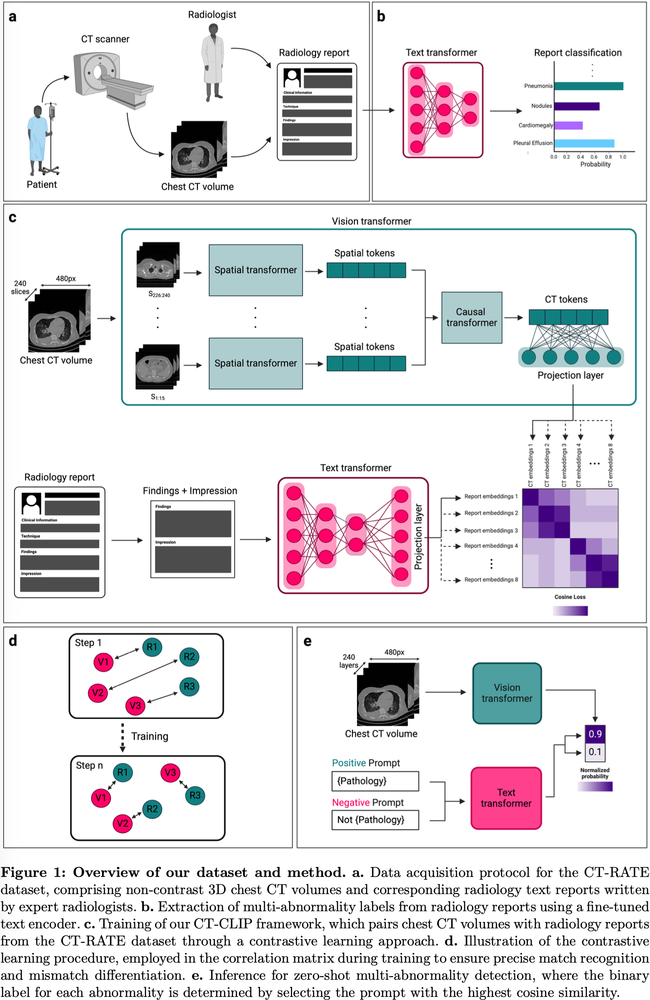

# A Foundation Model Utilizing Chest CT Volumes and Radiology Reports for Supervised-level Zero-shot Detection of Abnormalities

## Claim

1. 提出了 CT-RATE，首个 3D 医学影像数据集，附带有文字报告。
2. CT-RATE 从 21304 名患者中获取了 25692 个胸部 CT 扫描，用不同的重建方法生成了 50188 个 3D CT 体积。
3. 基于 CT-RATE，训练了 CT-CLIP，用自监督学习的方式超过了监督学习模型的异常检测性能。

## Motivation

1. 计算 3D 医学影像缺少全面的数据集，包括资源、时间、领域知识、专家标注等。
2. 3D 医学影像相关的探索性研究缺乏。

## Method

