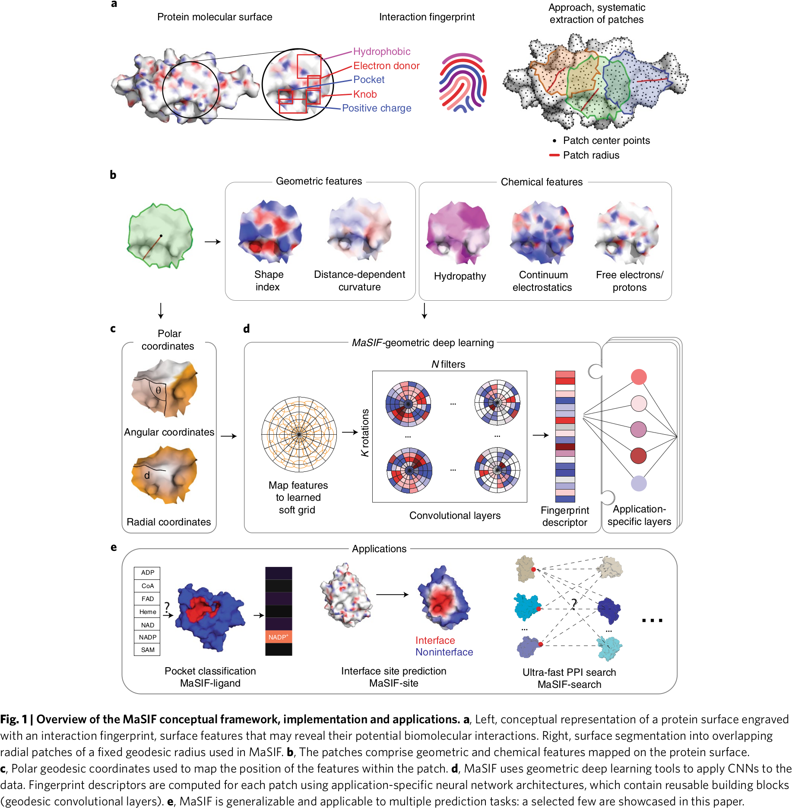

# Deciphering Interaction Fingerprint from Protein Molecular Surfaces Using Geometric Deep Learning

## 0 Abstract
**只用结构**来预测蛋白质和生物大分子的相互作用。MaSIF（Molecular Surface Interaction Fingerprint；分子表面相互作用指纹）是一个使用几何深度学习方法来识别蛋白质分子表面模式的概念框架。这些模式或“指纹”代表了特定生物分子相互作用所重要的化学和几何特征。这种方法的独特之处在于其能够检测出参与类似相互作用的蛋白质之间共有的相互作用指纹，而**不考虑它们的进化历史**。这些指纹虽然难以通过视觉分析辨识，但可以通过大规模数据集学习得到。MaSIF 通过三个预测挑战来展示其应用：**预测蛋白质口袋-配体相互作用（protein pocket-ligand prediction）、蛋白质-蛋白质相互作用位点（protein-protein interaction site prediction）和快速扫描蛋白质表面以预测蛋白质-蛋白质复合物（ultra-fast scanning of protein surface for prediction of protein-protein complexes）**。这个框架有望增强对蛋白质功能的理解并帮助蛋白质设计。

## 1 Introduction

强调了蛋白质与其他生物分子之间相互作用的重要性。尽管许多程序通过利用蛋白质序列和结构中的**进化特征**有效预测这些相互作用，但这些方法需要知道同源蛋白。相比之下，MaSIF 使用的分子表面是蛋白质结构的更高级表示，**模拟了蛋白质作为一个连续形状并包含了几何和化学特征**。MaSIF 能够识别和解读蛋白质表面的模式，而不需要显式考虑潜在的蛋白质序列或结构折叠。

分子表面表示法长期以来一直用于研究蛋白质相互作用的多个任务，特别是研究**蛋白质-溶剂电子相互作用**。最近的一些方法捕捉了分子表面具有功能相关性的模式，如三维 Zernike 描述符和几何不变指纹（GIF）描述符。这些描述符是手工设计的。

几何深度学习能产生比手工设计更好的描述符。MaSIF 将表面分解为具有固定测地半径的重叠径向斑块，然后为每个斑块中的点分配预计算几何和化学输入特征。这些输入特征会被嵌入到一个数字向量描述符中，并进一步通过应用依赖的神经网络层进行处理。

MaSIF 的三个应用：(1) 配体口袋相似性比较（MaSIF-配体）；(2) 蛋白质表面中蛋白质-蛋白质相互作用（PPI）位点的预测（MaSIF-位点）；(3) 利用表面指纹快速扫描以预测蛋白质-蛋白质复合物的结构配置（MaSIF-搜索）。这个概念框架对于寻找没有共同进化历史的蛋白质间相似的相互作用指纹的生物学家非常有用。重要的是，MaSIF 代表了一种从欧几里得结构表达方式中脱颖而出的学习方式，可能使得识别对蛋白质功能和设计重要的结构特征成为可能。

### 1.1 MaSIF: A General Framework to Learn Protein Surface Fingerprints

在网格的每个顶点周围，MaSIF 提取具有测地半径为 $r=9\AA$ 或 $r=12\AA$ 的斑块。斑块半径的选择取决于应用。MaSIF 计算一个离散化的分子表面（即溶剂排除表面），并为网格中的每个顶点分配几何和化学特征。这些特征包括两个几何特征（形状指数和距离依赖的曲率）和三个化学特征（亲水指数、连续电子静力学和自由电子及质子供体的位置）。顶点的坐标是到中心的测地距离和一个幅角。

MaSIF 框架关键组成部分是测地卷积，作用于局部的斑块。在极坐标中，构建了一套高斯核系统，这些核定义在**局部测地极坐标系**中，其参数是可学习的。这些可学习的高斯核局部平均顶点级斑块特征（作为**软像素**）并产生固定维度的输出，与一组可学习的滤波器相关。这套高斯核被称为学习的软极网格。

在斑块上执行 $K$ 次旋转并计算所有旋转的最大值，从而产生斑块位置的测地卷积输出。类似于在图像上的滑动窗口操作，重复于不同的斑块位置，为每个点产生表面指纹描述符，以向量形式嵌入中心点及其邻域的表面模式信息。学习过程包括针对特定应用的训练数据和成本函数最小化局部核和滤波器权重的参数集。

## 2 Result

### 2.1 Molecular Surface Fingerprinting to Classify Ligand-binding Pockets

Geometric: 0.55/ Chemistry: 0.65/ Geometric + Chemistry: 0.73

对于相似的配体分子，SAM ~ ADP 和 NADP ~ NAD 来说，几何特征都不足以区分这些分子，显然是靠化学特征来区分。

### 2.2 Predicting Protein Binding Site Based on Interaction Fingerprints

### 2.3 Ultrafast Scanning of Interaction Fingerprints for Prediction of Protein-Protein Complex

用 MaSIF 来计算嵌入向量，可以加快蛋白质的搜索。

#### Discussion

## 3 Method

### 3.1 Computation of Molecular Surface

用滚球法计算出对应的 mesh，然后把各种性质放到顶点上。

### 3.2 Decomposition of Protein into Overlapping Radial Patches and Computation of Features

#### Shape Index

用微分几何算出的 Gaussian 曲率和平均曲率得到 $\kappa_1,\kappa_2$，得到 shape index
$$
\frac{2}{\pi}\arctan\frac{\kappa_1+\kappa_2}{\kappa_1-\kappa_2}\in(-1,1)
$$

#### Distance-dependent Curvature

#### Poisson-Boltzmann Continuum Electrostatics

PDB2PQR + APBS 来计算静电场。顶点上的电荷值先截断到 [-30, 30] 再归一化到 [-1, 1]。

#### Free Electrons and Proton Donors

用氢键势计算电子和质子的给体，也就是广义的酸碱性。

#### Hydropathy

Kyte + Doolittle 算氨基酸的亲疏水性。顶点上的数值先截断到 [-4.5, 4.5] 再归一化到 [-1, 1]。

### 3.3 Computation of Geodesic Polar Coordinates

#### Geodesic Distances

转化成有环图的带 L2 权重的最短路径问题，用 Dijkstra 算法求解。

#### Radial Coordinates

最短路径边的权重和。

#### Angular Coordinates

多维度的缩放算法。

### Geometric Deep Learning on A Learned Soft Polar Grid

几何深度学习允许我们将成功的基于图像的深度神经网络架构（如 CNN）应用于几何数据（如曲面）。用于图像分析的传统 CNN 可视为在图像中运行一个滑动窗口；在窗口的每个位置，都会提取一片像素。然后，每个像素乘以相应的可学习滤波值，并将结果相加。在蛋白质分子表面，我们没有规则的网格，因此我们用在局部大地极坐标系中定义的高斯核系统来代替它，这些高斯核就像“软像素”一样。高斯的参数可以自行学习。因此，我们将这种高斯核系统称为学习软极坐标网格。

### MaSIF-ligand:  Ligand Site Prediction and Classification

每次都随机采集 32 个 patch 的原因是：
1. 每个 patch 覆盖 12 $\AA$ 半径，因此 32 个 patch 很可能覆盖整个口袋的表面；
2. 数目足够少，因此所有配体类型都至少与这么多 patch 中心接触；
3. 由于内存限制。
为了获得更稳定的预测结果，我们对每个口袋进行了 100 次采样，然后对这 100 次采样的预测结果取平均值，得出最终预测结果。

### MaSIF-site: Protein Interaction Site Prediction

### MaSIF-search: Prediction of PPIs Based on Surface Fingerprints

