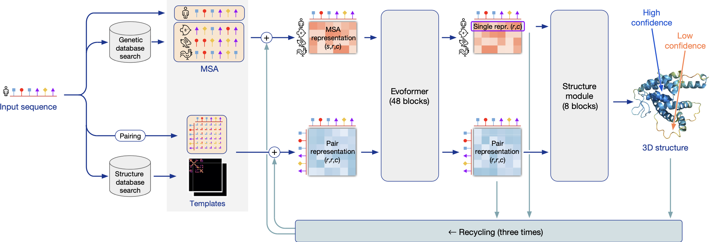
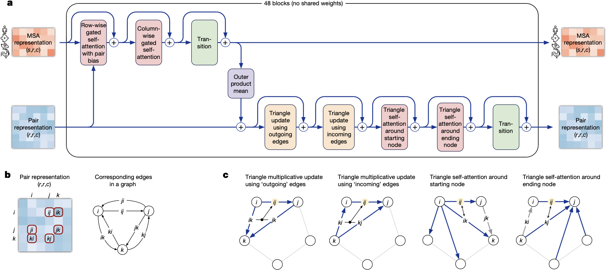
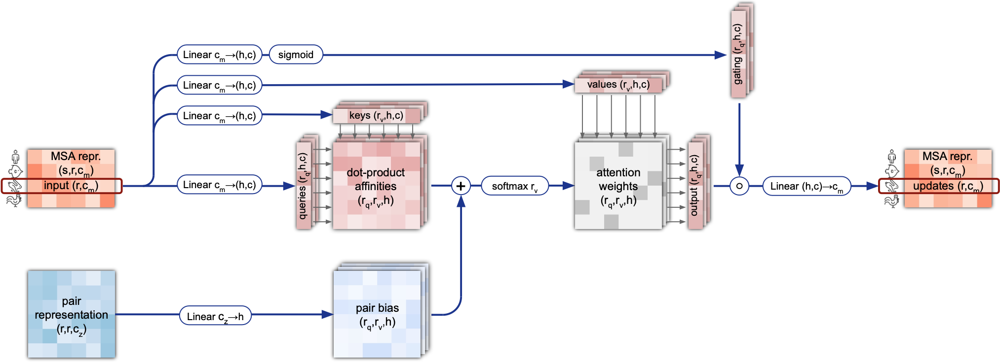
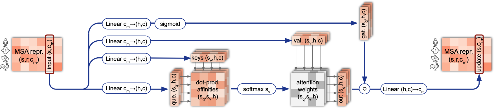
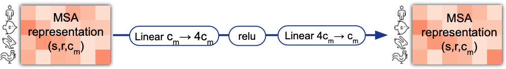
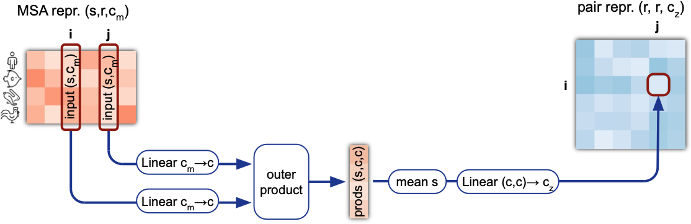
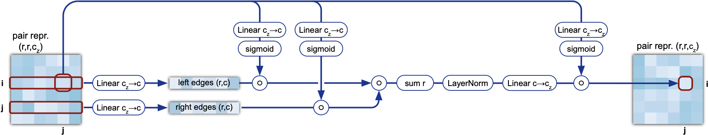
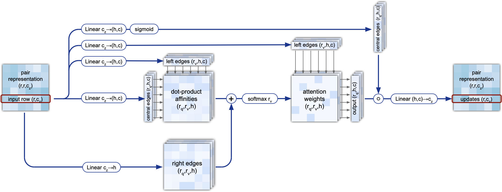
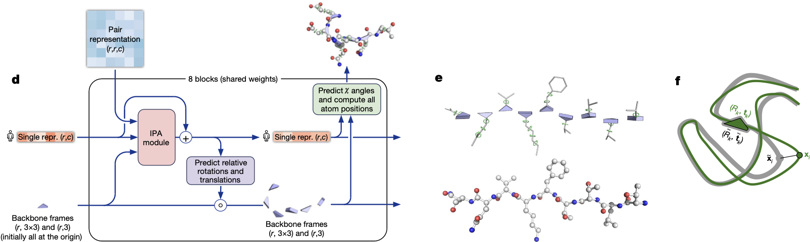
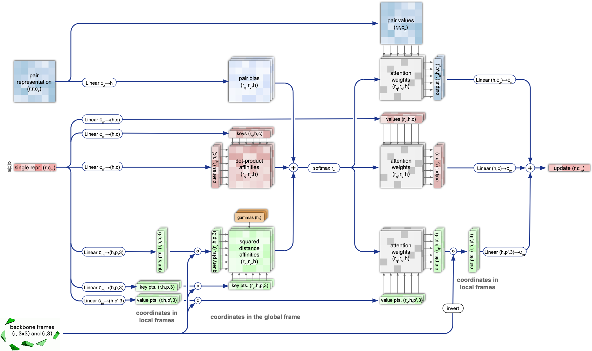

# Highly Accurate Protein Structure Prediction with AlphaFold

## 0 Abstract

作者首先表明了蛋白质的重要性以及理解它们结构的价值（化学、生物的核心：结构决定性质）。接着，作者指出了目前蛋白质结构研究中的一个难题，即蛋白质折叠问题。该问题受实验方法的繁琐所限制，对计算方法存在需求。为此提出了 AlphaFold2，首个能够以原子精度（即 1 $\AA$ 的精度）预测蛋白质结构的计算方法，尤其是在没有已知类似结构的情况下。最后，AlphaFold2 在 CASP14 做了验证。

## 1 Introduction

第一段的明确指出了蛋白质结构预测的两条主要途径：热力学相互作用和蛋白质的进化历史。热力学方法计算量巨大，准确性和规模受限；进化历史方法通过分析蛋白质的进化历史、同源结构和进化相关性来推断结构。在缺乏密切同源结构的情况下，这两种方法通常无法达到实验水平的准确性，展现了现有方法的局限性。

第二段提出了 AlphaFold2，介绍了 CASP 大赛。

第三段表示说，在 CASP14 中，AlphaFold2 的结构预测结果远超其他竞争方法， 不仅在领域结构（domain structures）上非常精确，还能在主链非常准确的情况下产生高度精确的侧链。即使在有强模板可用的情况下，它的表现也大大优于基于模板的方法。AlphaFold2 能够处理非常长的蛋白质，准确预测领域和领域间的相互作用。最后，该模型能够提供每个残基精确的可靠性估计，从而使这些预测可以被可靠地使用。

| Method | Median Backbone Accuracy | All-atom Accuracy |
|:-:|:-:|:-:|
| AlphaFold2 | $0.96\AA$ | $1.5\AA$ |
| AlphaFold2 | $2.8\AA$ | $3.5\AA$ |

第四段表示说，AlphaFold2 在新的数据上效果仍然不错。介绍了 3 种 metrics：
1. **Predicted local-distance difference test (pLDDT)**
2. **C$\alpha$ local-distance difference test (lDDT-C$\alpha$)**
3. **Template modelling score (TM-score)**

## 2 The AlphaFold Network



| Symbols | Descriptions |
|:-:|:-:|
| $s$ | Number of Sequences |
| $r$ | Number of Residuals in Sequences aligned to the same length |
| $c$ | Number of Features |

AlphaFold2 的输入是一段氨基酸序列，输出每个氨基酸在三维空间中的位置。它由三部分组成，Feature Extratcor、Encoder 和 Decoder。
1. Feature Extractor 按照给定的输入生成以下特征：
	1. 从基因数据库中抽取同源蛋白质序列组成多序列比对（Multi-Sequence Alignment, MSA），形成一个 $[s,r,c]$ 大小的矩阵。对于位于 $(s_i,r_j)$ 的一个特征，表示它和第 $i$ 条序列以及第 $j$ 个氨基酸残基的相对关系。
	2. 形成一个 Pair 矩阵表示输入序列内部的关系，形成一个 $[r,r,c]$ 大小的矩阵。对于位于 $(r_i,r_j)$ 的一个特征，表示第 $i$ 条氨基酸残基以及第 $j$ 个氨基酸残基的相对关系。
	3. 从结构数据库中抽取模版，即相似结构中氨基酸的空间距离。
2. Encoder 由 48 个 Evoformer 块组成，每个块类似于一个 Transformer Encoder 块，输入和输出大小一致。详细见 [Evoformer](#3%20Evoformer)。
3. Decoder 由 8 个 Structure Module 块组成，。
4. Recycling 机制。将 Encoder 和 Decoder 的输出再次送入 Encoder，相当于将网络复制了多次。

## 3 Evoformer



Evoformer 将蛋白质结构预测问题看作是 3D 空间中的图推理问题，图的边由相邻的残基定义。

### 3.0 Utils

```python
def attention(
    self,
    q_x: torch.Tensor,
    kv_x: torch.Tensor,
    biases: torch.Tensor
) -> torch.Tensor:
    # q_x, kv_x: [s, r, c_m]
    # biases: []

    q = self.linear_q(q_x)  # [s, r, n * h]
    k = self.linear_k(kv_x) # [s, r, n * h]
    v = self.linear_v(kv_x) # [s, r, n * h]

    q = q.view(q.shape[:-1] + (self.n_heads, -1)).transpose(-2, -3)  # [s, n, r, h]
    k = k.view(k.shape[:-1] + (self.n_heads, -1)).transpose(-2, -3) # [s, n, r, h]
    v = v.view(v.shape[:-1] + (self.n_heads, -1)).transpose(-2, -3) # [s, n, r, h]

    q /= math.sqrt(self.c_hidden)
    k = k.transpose(-2, -1) # [s, n, h, r]

    a = torch.matmul(q, k) # [s, n, r, r]
    for b in biases:
        a += b
    a = softmax(a, -1) # [s, n, r, r]
    a = torch.matmul(a, v) # [s, n, r, h]
    a = a.transpose(-2, -3) # [s, r, n, h]

    if self.linear_g is not None:
        g = torch.sigmoid(self.linear_g(q_x)) # [s, r, n * h]
        g = g.view(g.shape[:-1] + (self.n_heads, -1)) # [s, r, n, h]
        a = a * g # [s, r, n, h]
    a = torch.flatten(a, -2) # [s, r, n * h]

    o = self.linear_o(a) # [s, r, c_m]
    return o
```

```python
def _mask_bias(self, x: torch.Tensor, mask: torch.Tensor) -> torch.Tensor:
	if mask is None:
		mask_bias = torch.ones(*x.shape[:-1])

	mask_bias = (torch.inf * (mask - 1)).unsqueeze(-2, -3) # [s, 1, ,1 r]
	return mask_bias

def _prep_inputs(
    self,
    msa: torch.Tensor,
    pair: torch.Tensor,
    mask: torch.Tensor | None
) -> list[torch.tensor]:
    # msa: [s, r, c_m]
    # pair: [r, r, c_z]
    # mask: [s, r]
    mask_bias = self._mask_bias(msa, mask)

    if self.linear_z is not None:
	    z = self.layer_norm_z(pair) # [r, r, c_z]
	    z = self.linear_z(z) # [r, r, n]
	z = z.permute(-3, -1, -2).unsqueeze(-4) # [1, r, r, n]

	biases = [mask_bias, z]
	return biases
```
### 3.1 MSA Row-wise Gated Self-Attention with Pair Bias



```python
def MSA_row_attention_with_pair_bias(
    self,
    msa: torch.Tensor,
    pair: torch.Tensor,
    mask: torch.Tensor
):
    # msa: [s, r, c_m]
    # pair: [r, r, c_z]
    msa = self.layer_norm_m(msa)
    biases = self._prep_input(msa, pair, mask)
    msa = self.attention(msa, msa, biases)
    return msa
```

### 3.2 MSA Column-wise Gated Self-Attention



```python
def MSA_column_attention(
    self,
    msa: torch.Tensor
):
    # msa: [s, r, c_m]
    # pair: [r, r, c_z]
    msa = msa.transpose(-2, -3)
    msa = self.layer_norm_m(msa)
    msa = self.attention(msa, msa, [])
    msa = msa.transpose(-2, -3)
    return msa
```

### 3.3 MSA Transition



```python
def MSA_transition(self, msa: torch.Tensor) -> torch.Tensor:
    # msa: [s, r, c_m]
    msa = self.layer_norm(msa) # [s, r, c_m]
    msa = self.linear_1(msa) # [s, r, 4 * c_m]
    msa = self.relu(msa) # [s, r, 4 * c_m]
    msa = self.linear_2(msa) # [s, r, c_m]
    return msa
```

### 3.4 Outer Product Mean



```python
def outer_product_mean(
	self,
	msa: torch.Tensor,
	mask: torch.Tensor
) -> Torch.Tensor:
    # msa: [s, r, c_m]
    # mask: [s, r, 1]
    msa = self.layer_norm(msa) # [s, r, c_m]
    msa_1 = self.linear_1(msa) # [s, r, c]
    msa_2 = self.linear_2(msa) # [s, r, c]
    msa_1 = msa_1.transpose(-2, -3) # [r, s, c]
    msa_2 = msa_2.transpose(-2, -3) # [r, s, c]
    outer = torch.einsum("...bac,...dae->...dbce", msa_1, msa_2) # [r, r, c, c]
    norm = torch.einsum("...abc,...adc->...bdc", msa_1, msa_2) # [r, r, 1]
    outer = outer.flatten(-2) # [r, r, c * c]
    outer = self.linear_o(outer) # [r, r, c_z]
    outer = outer / norm # [r, r, c_z]
    return outer
```

论文的伪代码先 mean 后 linear，但效果等价。

### 3.5 Triangular Multiplicative Update



```python
def triangle_multipicative_update_outgoing(
	self,
	pair: torch.Tensor
) -> torch.Tensor:
    # pair: [r, r, c_z]
    pair = self.layer_norm_in(pair)
    a = self.linear_a_p(pair) * torch.sigmoid(self.linear_a_g(pair)) # [r, r, c]
    b = self.linear_b_p(pair) * torch.sigmoid(self.linear_b_g(pair)) # [r, r, c]
    p = torch.einsum("...abc,...dbc->...adc", a, b) # [r, r, c]
    p = self.layer_norm_out(p) # [r, r, c]
    x = self.linear_z(p) * torch.sigmoid(self.linear_g(pair)) # [r, r, c_z]
    return z

def triangle_multipicative_update_incoming(
	self,
	pair: torch.Tensor
) -> torch.Tensor:
    # pair: [r, r, c_z]
    pair = self.layer_norm_in(pair)
    a = self.linear_a_p(pair) * torch.sigmoid(self.linear_a_g(pair)) # [r, r, c]
    b = self.linear_b_p(pair) * torch.sigmoid(self.linear_b_g(pair)) # [r, r, c]
    p = torch.einsum("...abc,...adc->...bdc", a, b) # [r, r, c]
    p = self.layer_norm_out(p) # [r, r, c]
    x = self.linear_z(p) * torch.sigmoid(self.linear_g(pair)) # [r, r, c_z]
    return z
```

### 3.6 Triangular Self-Attention



```python
def triangle_attention_starting_node(
	self,
	pair: torch.Tensor,
	mask: torch.Tensor
) -> torch.Tensor:
    # pair: [r, r, c_z]
    pair = self.layer_norm(pair) # [r, r, c_z]
    biases = [self._mask_bias(pair, mask), self.linear(pair)]
    pair = self.attention(pair, pair, biases)
    return pair

def triangle_attention_ending_node(
	self,
	pair: torch.Tensor,
	mask: torch.Tensor
) -> torch.Tensor:
    # pair: [r, r, c_z]
    pair = pair.transpose(-2, -3)
    pair = self.layer_norm(pair) # [r, r, c_z]
    biases = [self._mask_bias(pair, mask), self.linear(pair)]
    pair = self.attention(pair, pair, biases)
    pair = self.transpose(-2, -3)
    return pair
```

### 3.7 Overall

```python
def evoformer_stack(
	self,
	msa: torch.Tensor,
	pair: torch.Tensor,
	mask: torch.Tensor
) -> tuple[torch.Tensor, ...]:
    for i range(48):
        msa += self.msa_dropout(self.MSA_row_attention_with_pair_bias(msa, pair), 0.15)
         msa += self.MSA_column_attention(msa)
         msa += self.MSA_transition(msa)

         pair += self.outer_product_mean(msa, pair, mask)
         pair += self.msa_dropout(self.triangle_multipicative_update_outgoing(pair), 0.25)
         pair += self.msa_dropout(self.triangle_multipicative_update_incoming(pair), 0.25)
         pair += self.msa_dropout(self.triangle_attention_starting_node(pair, mask), 0.25)
         pair += self.msa_dropout(self.triangle_attention_starting_node(pair, mask), 0.25)
         pair += self.pair_transition(pair)

    s = self.linear(msa[..., 0])

    return msa, pair, s
```

## 4 End-to-end Structure Prediction



蛋白质 3D 结构由 $r$ 个独立的刚体旋转和平移组成，参考系是世界坐标系。刚体旋转和平移表示蛋白质主链，即 N-C$\alpha$-C 之间的关系，这主要约束了侧链的位置。但是主链的旋转和平移没有额外的约束，这里靠的是增加约束项。

### 4.1 Invariant Point Attention



```python
def invariant_point_attention(
    self,
    single: torch.Tensor,
    pair: torch.Tensor,
    rigid: Rigid
) -> torch.Tensor:
    # single: [r, c_s]
    # pair: [r, r, c_z]
    # rigid: [r]
    q, k, v = self.linear_q(single), self.linear_k(single), self.linear_v(single) # [r, n, h]
    q_pts, k_pts, v_pts = self.linear_q_pts(single), self.linear_k_pts(single), self.linear_v_pts(single) # [r, n, p, 3]
    b = self.linear_b(pair) # [r, r, h]
    a = torch.einsum("...abc,...dbc->...bad", q, k)# [n, r, r]
    a += b.permute(-3, -1, -2)
    pts_atten = torch.sum(rigid.apply(q).unsqueeze(-4) - rigid.apply(k).unsqueeze(-5), dim=-1) # [r, r, n, p]
    pts_atten = torch.sum(pts_atten * CONSTANTS, dim=-1).transpose(-1, -3, -2) # [n, r, r]
    a += pts_atten
    a *= CONSTANTS
    a = torch.softmax(a)

    o = torch.einsum("...abc,...cad->...bad", a, v).flatten(-2) # [r, n * h]
    o_pt = rigid.inverse_apply(torch.einsum("...abc,...cade->...bade", a, rigid.appky(v_pts))).flatten(-3, -2) # [r, n * p, 3]
    o_pt_norm = torch.norm(o_pt, dim=-1) # [r, n * p]
    o_pair = torch.einsum("...abc,...bcd->...bae", a, pair).flatten(-2) # [r, n * c_z]

    single = self.linear_out(torch.cat([o, *torch.unbind(o_pt, dim=-1), o_pt_norm, o_pair], dim=-1)) # [r, c_s]
``` 

### 4.2 Backbone Update

这里就是把网络输出转化成刚体的旋转和平移。其中旋转用四元数表示。

### 4.3 Overall

```python
def structure_module(
	self,
    single: torch.Tensor,
    pair: torch.Tensor
) -> :
    single = self.layer_norm_s(single)
    single = self.linear_in(single)
    pair = self.layer_norm_z(pair)
    rigid = Rigid.identity()

    for i in range(self.n_blocks):
        single = single + self.ipa(single, pair, rigid)
        single = self.linear_norm_ipa(single)
        single = self.transition(single)

        rigid = rigid.update(self.backbone_update(single))
        # Side chain update ...
        # Loss/metric computation ...
```

## 5 Training with Labelled and Unlabelled Data

Noisy Student Self-Distillation，用训练好的 AlphaFold2 在 Uniclust30 这个数据集上预测并过滤了 350000 个高置信度序列。然后再重新用 PDB 和这个数据训练一个新的 AlphaFold2，并且做很大的数据增强。最后将 BERT 的训练方法引入训练的过程中。

## 6 Interpreting the Neural 

对于每次 Recycling 的总共 48 个 Encoder，每次都送入 Decoder，一共产生 192 个中间结构。发现每次变动都是比较平缓的。

## 7 MSA Depth and Cross-chain Contacts

- 对于短链（长度小于 30）的效果还是比较糟糕。
- 长度超过 100 的增效不明显。
- 与异型接触的数量相比，对链内或同型接触较少的蛋白质的效果要弱得多。

## Methods

### Training regimen

256 长度的蛋白质、batch size 128、TPU v3 128 块。