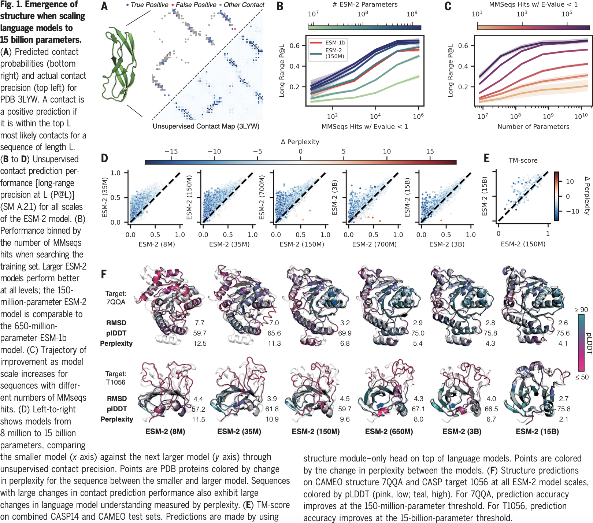
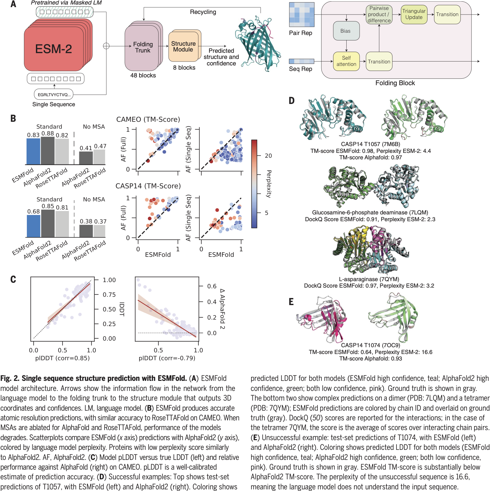

# Evolutionary-scale Prediction of Atomic-level Protein Structure with a Language Model

## 0 Abstract

ESMFold 展示了利用大语言模型从主序列直接推断出全原子级蛋白质结构的方法。ESMFold 参数量为 150 亿，学习到的表征出现了蛋白质结构的原子分辨率图像。作者利用这种能力构建了 ESM 元基因组图谱，预测了超过 6.17 亿个元基因组蛋白质序列的结构，其中包括超过 2.25 亿个高置信度预测序列。

## 1 Introduction

第一段描述蛋白质序列的重要性。进化尺度上来说，蛋白质序列包含了生物结构和功能信息，记录了生物的进化模式。

第二、三段引出语言模型。语言模型有可能学习蛋白质序列在整个进化过程中的模式。包括学习基础生物学的各方面的表征和以低分辨率捕捉二级结构和三级结构。GPT 和 BERT 体现了语言模型的能力。

第四段将语言模型和蛋白质序列结合起来。作者利用类似 BERT 的手法，在整个进化过程中填补蛋白质序列中缺失氨基酸。作者训练了多个模型，参数量从 800 万到 150 亿，这些模型学习到了原子分辨率到结构，并在不断改进。语言模型对蛋白质序列的理解（困惑度）与结构预测的准确性之间的强相关性揭示了语言建模与结构学习之间的密切联系。

第五段展现了模型的优势。语言模型可以直接从序列中快速实现端到端的原子分辨率结构预测。语言模型捕捉到的进化模式消除了多序列比对（MSA）的需求，提高了 60 倍的推理速度，同时也完全消除了相关蛋白的搜索过程。

第六、七段给出了模型的一个应用。ESMFold 在速度上的优势使得结构预测扩展到元基因组规模的数据集（数十亿个蛋白质）成为可能。ESMFold 用两周时间和 2000 个 GPU 完成了 MGnify90 数据集（6.17 亿个蛋白质）的折叠。ESMFold 对超过 2.25 亿个结构进行了高置信度预判定，从而揭示并描述了远离现有知识的元基因组空间区域。大多数（76.8%）高置信度预判定与 UniRef90 的序列相似度至少相差 90%，数千万个预测（12.6%）与实验确定的结构不匹配。这些结果提供了元基因组蛋白质结构的广阔范围和多样性。

## 2 Atomic-resolution Structure Emerges in Language Models Trained on Protein Sequences

ESM-2 类似 BERT 的训练方式，15% 的氨基酸被 $M$ 遮盖掉，让 ESM-2 去猜测，损失函数是
$$
\mathcal{L}_{\text{MLM}}=-\sum_{i\in M}\log p(x_{i}\mid x_{\backslash M})
$$
在训练过程中，对 4,300 万个序列的 UniRef50（来自 1.38 亿个序列的 UniRef90 ）进行均匀加权采样，因此在训练过程中，模型看到了 6,500 万个独特的序列。

困惑度（perplexity）是衡量结果的标度，1 表示完美贴合，20 表示随机预测。直观地说，困惑度描述了模型在 $x_{i}$ 处预测的氨基酸的平均数量。
$$
\text{perplexity}(x)=\exp\left(-\log p(x_{i\in M}\mid x_{j\in M}\cup \hat{x}_{i\in M})\right)
$$
其中 $\hat{x}_{i\in M}$ 是替换过后的输入。由于 $M$ 是随机变量，上述表达式是随着 $M$ 的变化而变化的，适用于极为大量的数据集去估计。还有一种是：
$$
\text{pseudo-perplexity}(x)=\exp\left(-\frac{1}{L}\sum_{i=1}^{L}\log p(x_{i}\mid x_{j\ne i})\right)
$$
这种方法是确定性的，但是需要计算 token 长度 $L$ 次才行，适用于单个序列。困惑度从 8M 的 10.45 降到 15B 的 6.37。

BERT 类的训练方式可以产生蛋白质残基-残基接触图相对应的注意模式。因此使用一个线性层从 ESM-2 中抽取接触图，定义如下：
$$
p(c_{ij})=\left(1+\exp\left(-\beta_{0}-\sum_{l=1}^{N}\sum_{k=1}^{K}\beta_{kl}\alpha_{ij}^{kl}\right)\right)^{-1}
$$
其中 $c_{ij}$ 是 bool 变量，如果氨基酸 $i,j$ 相互接触，则为真。假设 transformer 里面有 $N$ 层，每层 $K$ 个注意力头，则 $A_{kl}$ 是第 $l$ 层第 $k$ 个头的对称化且 APC 矫正的注意力图，$a_{ij}^{kl}$ 是其第 $i,j$ 位置上的值。前 $L$ 个精确度（P@L）衡量了衡量了注意力模式与蛋白质结构的对应关系。增加参数量显著提高了性能；相关序列越多模型理解越深入。

对于单个序列，模型性能的提升随着参数的增加是非线性的。

## 3 Accelerating Accurate Atomic-resolution Structure Prediction with A Language Model

我们发现，ESM-2 语言模型可直接从主蛋白质序列生成最先进的 3D 结构预测，从而在保持高分辨率精度的同时，将结构预测的速度提高了一个数量级以上。该架构与 AlphaFold2 类似，分为两个部分：一个是折叠模块，将语言模型特征作为输入并生成表示；另一个是结构模块，将折叠模块的输出作为输入并输出 3D 原子坐标。在结构模块中，我们使用了 AlphaFold2 中提出的等变转换器架构和不变点注意力。对于折叠模块，我们简化了 AlphaFold2 中使用的 Evoformer 模块。在 ESMFold 中没有使用模板。简化了搜库过程和部分 AlphaFold 中的结构，做到了大大加速。

