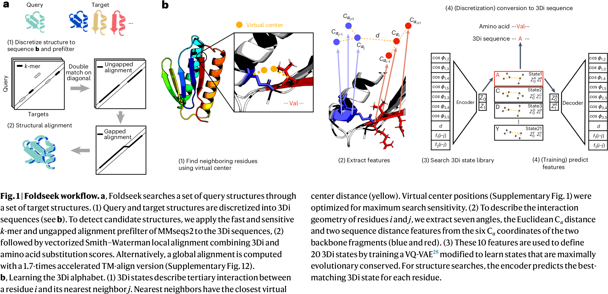

# Fast and Accurate Protein Structure Search with Foldseek

## 0 Abstract

蛋白质数据库的膨胀使得搜索成了限制蛋白质预测模型的一个瓶颈。Foldseek 将蛋白质中三级氨基酸的相互作用描述为结构字母表上的序列，来对齐查询蛋白的结构与数据库。它能将时间减少 4 - 5 个数量级，但灵敏度还能保持 90%。（灵敏度 sensitivity 和准确率 precision 不是一个概念）

## 1 Introduction

序列搜索（Sequence Search）和结构对比（Structural Alignment）的目的是：找到同源序列，从中推断出被查询序列/结构的性质。

|                   |         序列搜索          |                结构对比                 |
| :---------------: | :-------------------: | :---------------------------------: |
|        优势         |          快速           | 通过 3D 叠加检测蛋白质结构之间的相似性，识别同源蛋白质的敏感性更高 |
|        劣势         |   仅从序列中检测远程进化关系比较困难   |                 缓慢                  |
| 1 亿个蛋白质结构全部对比一遍速度 | TM-align：1000 万 CPU 年 |          MMseqs2：10 CPU 年           |

结构比对工具慢有两个原因：
1. 序列搜索工具采用快速且敏感的预过滤算法来提高速度数量级，而结构比对没有类似的预过滤器。
2. 结构相似性评分是非局部的：改变一个部分的对齐会影响所有其他部分的相似性。大多数结构比对工具，如流行的 TM-align、Dali 和 CE，通过迭代或随机优化来解决对齐优化问题。

## 2 Foldseek

以前的方法提出：把氨基酸主链描述为结构字母表上的序列，并使用序列比对来比较结构。例如，将局部氨基酸主链，通常为 3-5 个 $\mathrm{C}\alpha$ 原子的短片段的构象，离散化。因此，结构字母表将结构比较简化为更快的序列比对。

Foldseek 开发了一种结构字母表（3D 相互作用字母表；3Di），它不描述主链，而是描述三级相互作用：3Di 的 20 个状态描述了每个残基与其空间上最近的残基的几何构象。相比传统的主链结构字母表，3Di 优势有
1. 相邻字母之间的依赖性较弱；
2. 状态频率分布更均匀，这两点都增强了信息密度并减少了假阳率；
3. 最高信息密度编码在保守的蛋白质核心中，而在非保守的卷曲/环区域中最低，而之前的方法则恰好相反。

Foldseek 具体的查询流程为：
1. 把被查询的结构和目标结构都离散化为 3Di 字母表上的序列。
2. 使用 MMseqs2 基于 k-mer 的双对角预过滤器和无间隙对齐预过滤器模块，在目标结构的 3Di 序列中进行搜索。
3. 高分候选通过 3Di 进行局部对齐（默认）或通过 TM-align 进行全局对齐（Foldseek-TM）。局部对齐阶段结合了 3Di 和氨基酸替换分数。
4. 为了减少高分假阳性并提供可靠的 E 值，我们从原始得分中减去了反向查询对齐得分，并在本地残基序列窗口内应用了组成偏差校正。
5. E 值使用极值得分分布计算，参数由基于 3Di 序列组成和查询长度的神经网络预测。

## 3 Methods

### Create Database

createdb 模块把 PDB、mmCIF、FCZ 文件格式变成 Foldseek 的格式。

### Descriptors for 3Di Structural Alphabet

3Di 字母表描述了残基与其在 3D 空间中最近邻之间的三级接触。对于每个残基 $i$，围绕其局部主链的构象，以及围绕其最近邻 $j$ 的局部主链，被近似为 $A=20$ 个离散状态。作者做试验得到 20 可以尽可能多地编码信息，限制我们需要在基于 k-mer 的预过滤器中生成的相似 3Di k-mer 的数量。每个字母从描述了 10 个特征描述符而来，这些特征编码了由 $\mathrm{C}\alpha$ 原子表示的残基 $i$ 和 $j$ 周围主链的构象（$\mathrm{C}\alpha_{i-1},\mathrm{C}\alpha_{i},\mathrm{C}\alpha_{i+1}$）和（$\mathrm{C}\alpha_{j-1},\mathrm{C}\alpha_{j},\mathrm{C}\alpha_{j+1}$）。10 个描述符来源为：使用沿以下方向的五个单位向量：
$$
\begin{align*}
\mathbf{u}_{1}&=\mathrm{C}\alpha_{i-1}\to\mathrm{C}\alpha_{i}\\
\mathbf{u}_{2}&=\mathrm{C}\alpha_{i}\to\mathrm{C}\alpha_{i+1}\\
\mathbf{u}_{3}&=\mathrm{C}\alpha_{j-1}\to\mathrm{C}\alpha_{j}\\
\mathbf{u}_{4}&=\mathrm{C}\alpha_{j}\to\mathrm{C}\alpha_{j+1}\\
\mathbf{u}_{5}&=\mathrm{C}\alpha_{i}\to\mathrm{C}\alpha_{j}
\end{align*}
$$
然后定义 $\cos\phi_{ij}$ 为 $\mathbf{u}_{i}$ 和 $\mathbf{u}_{j}$ 之间的夹角余弦值，其中选取了 7 个
$$
\cos\phi_{12},\cos\phi_{13},\cos\phi_{14},\cos\phi_{15},\cos\phi_{23},\cos\phi_{34},\cos\phi_{35},
$$
以及 $|\mathrm{C}\alpha_{i}-\mathrm{C}\alpha_{j}|$，$\mathrm{sign}(i-j)\min(|i-j|,4)$，$\mathrm{sign}(i-j)\log(|i-j|+1)$。

### Learning the 3Di States Using a VQ-VAE

用 VQ-VAE 把 10 个描述符转化成 20 个字母。从对齐的蛋白质里面提取 2 个描述符 $x,y$，用 $x$ 去预测 $y$ 的分布。VQ-VAE 的 latent 是离散的。

## 4 Experiments

为了找到可能存在问题的高分 Foldseek 假阳性，我们使用 AlphaFoldDB（版本1）中平均预测LDDT 大于 80 的未碎片化模型对其自身进行了搜索。我们检查了 1,675 个（共 133,813 个）高分假阳性（每个对齐列的得分大于 1.0，TM得分小于 0.5），发现查询包含多个结构化片段，但相对方向不正确。被 Foldseek 正确对齐的折叠片段。这表明，如 TM-align 这样的 3D 对齐器可能会忽略那些不能全局叠加的同源结构，而 Foldseek（以及 2D 对齐器 Dali）不依赖于相对域方向，并擅长检测同源多域结构。
