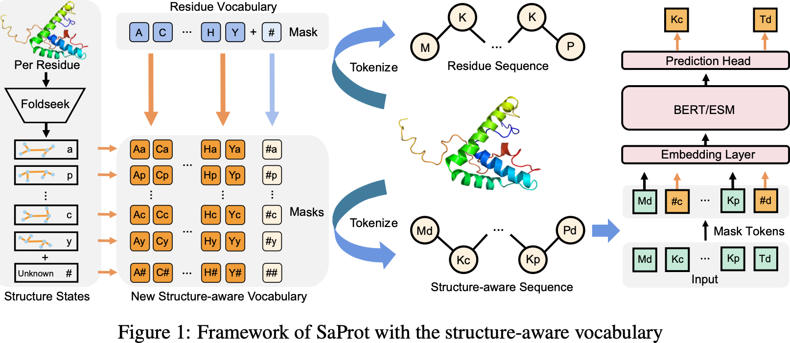

# SaProt: Protein Language Modeling with Structure-aware Vocabulary

## 0 Abstract

作者认为蛋白质语言模型（PLM）缺少对于蛋白质结构信息的显示考虑。因此作者引入了“结构感知词表”，将结构信息（来源于 FoldSeek）和序列信息（来源于 ESM）结合在一起了。SaProt 在 4000 万的序列-结构对上训练。

## 1 Introduction

结合结构信息的 PLM 还在使用由 AlphaFold2、ESMFold 预测出来的结构，而且数据量还特别小。因此，结合 FoldSeek 的结构信息，作者提出 SaProt：
1. 引入了“结构感知词表”，将残基信息和结构信息结合。
2. SaProt 的主干网络是 ESM。
3. 测试数据是：Clinical Disease Variant Prediction, Fitness Landscape Prediction, Protein-protein Interaction, Diverse Protein Function Predictions.
4. 加入预测结构的 PLM 训练可能会过拟合（？）。

## 2 Related Work

### 2.1 Residue Sequence-based Pre-training

用 BERT 式的训练，使得 PLM 可以生成通用的蛋白质表征，还可以结合 MSA 信息，做到单序列结构预测。

### 2.2 Structure-based Pre-training

一般用图 $\mathcal{G}=(\mathcal{V}, \mathcal{E})$ 来表示一个蛋白质，因此就用 GNN 来学习其中的联系。还有用自注意力模块中的注意力图来提取结构信息（Uni-Mol）。

### 2.3 FoldSeek

FoldSeek 原本是作为 MSA 的替代品。类似 MAGE，用 VQ-VAE 将蛋白质结构转换成 token。

## 3 Idea of New Vocabulary

### 3.1 Preliminary Analysis

作者先找到了 2 种蛋白质结构建模的方法：
1. 将从 AlphaFold 预测的结构视为图，用 GNN 来提取结构信息。
2. 提取结构中每一对的残基的距离和角度信息，将其作为结构偏置加入注意力图中。

作者注意到，直接用预测出来的结构做训练，在用真实结构做验证集上做验证明显出现了过拟合现象，即二者仍然存在分布上的差距。

### 3.2 Structure-aware Vocabulary

|          Symbols          |             Descriptions              |
| :-----------------------: | :-----------------------------------: |
|    $P=(s_1,\dots,s_n)$    |       Protein with $n$ residues       |
|     $s\in\mathcal{V}$     |     Residues in residue alphabet      |
|    $P=(f_1,\dots,f_n)$    |     Protein in structure alphabet     |
|     $f\in\mathcal{F}$     |    Residues in structure alphabet     |
| $P=(s_1f_1,\dots,s_nf_n)$ | Protein in structure-residue alphabet |
|       $s\#$, $\#f$        |  Only residue or structure available  |
总计 441 个 SA 词汇。

### 3.3 SaProt

#### 3.3.1 Model Architecture

ESM2 的结构。

#### 3.3.2 Objective Function

可以有两种 mask 方法
1. 用 $\#\#$ 来随机 mask，但是由于结构是预测的，也会存在分布不统一问题。
2. 只预测被 mask 的序列，即 $\#f$，避免由于结构不精确带来的问题。
