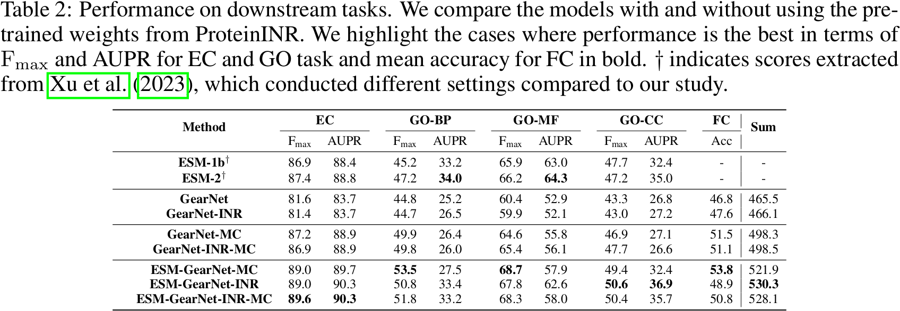

# Pre-training Sequence, Structure, and Surface Features for Comprehensive Protein Representation Learning

## 0 Abstract

蛋白质有多个层次的表征语义，分为
1. 序列
2. 3D 结构：$\mathrm{C}\alpha$ 骨架加上重原子。
3. 表面：点云、SDF

这篇文章就把这三者结合起来做蛋白质表征的预训练

## 1 Introduction

先说序列信息被充分利用了，再说表面信息仍然没有被合理利用。这篇文章中
- 序列用 ESM-1b。
- 3D 结构用 GearNet。
- 表面用 TransINR，每个数据集一个网络。

## 4 Method

1. 在**序列编码器**上对序列进行预训练，并将序列编码作为结构编码器的输入。
2. 使用 ProteinINR 在表面预训练**结构编码器**，并将权重保留准备再训练**结构编码器**。
3. 通过多视角对比学习对**结构编码器**进行预训练，以获得最终的蛋白质表示。
4. 利用预训练模型在三种模式上的蛋白质表征来解决下游任务。

### 4.1 Generalizable Implicit Neural Representations for Protein

预训练 ProteinINR 编码过程：
1. 输入为 $\mathcal{P}\in\mathbb{R}^{N\times 3}$ 的蛋白质点云，$N$ 是点云数量，但只采集 16384 个点。
2. 用 DSPoint + KPConv 处理点云。
3. 最后线性变化对齐嵌入维度 $\mathbf{p}\in\mathbb{R}^{M\times h}$。
4. 类似 dMaSIF 集成化学性质。
5. **结构编码器**出嵌入 $\mathbf{g}\in\mathbb{R}^{R\times h}$，$R$ 是序列长度。
6. 用 Spatial Functa 增强 ProteinINR latent 的信息聚合能力，latent 大小为 $\mathbf{z}\in\mathbb{L}^{L\times c}$，线性变化对齐到 $\mathbf{z}\in\mathbb{L}^{L\times h}$。
7. $\mathbf{h}=\text{Concat}(\mathbf{p},\mathbf{s},\mathbf{z})\in\mathbb{R}^{(M+R+L)\times h}$。

预训练 ProteinINR 解码过程：
1. 用 TransINR 的框架，拟合 TSDF 即可。

### 4.2 Pre-training on Sequence and Structures

## 5 Experiments and Results

### 5.1 Dataset Preparation for Pre-training

1. 用 MSMS 算分子表面。
2. 用 DeepSDF 算 SDF 函数，准备训练 ProteinINR。
3. 用 AFDB-v2 预训练**结构编码器**

### 5.2 Experimental Settings

三个任务：
1. Enzyme Commission：预测蛋白质的 EC 数字，这代表它们催化的生物医学反应。使用 AUPRC 来评估性能。
2. Gene Ontology：它们的本体论被划分为三个子任务，Biological Process, Molecular Function, Cellular Component。使用 AUPRC 来评估性能。
3. Fold Classification：对蛋白质的折叠标签进行分类。使用平均准确率来评估性能。

七个模型：
1. 直接在下游任务上训练的 GearNet，带有一个结构模块
2. GearNet-INR，其中结构模块在表面上预训练，然后在下游任务上训练
3. GearNet-MC，其结构模块通过多视角对比学习在结构上预训练，然后在下游任务上训练
4. GearNet-INR-MC，其结构模块先在表面上预训练，随后在结构上预训练，然后在下游任务上训练
5. ESM-GearNet-MC，其中序列编码器先预训练，随后在结构上预训练
6. ESM-GearNet-INR，其中序列编码器先预训练，随后在表面上预训练
7. ESM-GearNet-INR-MC，其中先预训练序列编码器，然后在表面上预训练结构模块，随后在结构上进一步训练，最后在下游任务上训练

模型在 EC 任务上训练 50 epoches，在 GO 任务上训练 200 epoches，在折叠分类任务上训练 300 epoches。

