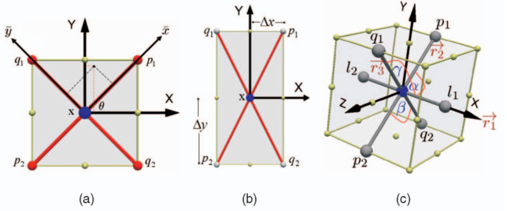

# Multistencils Fast Marching Methods: A Highly Accurate Solution to the Eikonal Equation on Cartesian Domains

## 0 Abstract

## 1 Introduction

与现有技术相比，FMM 的主要优势在于它明确地保持了一个窄带，将已知解的网格点与未知解分开。因此，每个网格点的解都是按照与波锋传播方式一致的顺序计算的。
The main advantage of the FMM over existing techniques is that it explicitly maintains a narrow band that separates the grid points of known solutions from the unknown ones. Therefore, the solution at every grid point is computed in an order that is consistent with the way wave fronts propagate.

它通过沿覆盖其整个邻接点的几个模版求解 Eikonal 方程来计算每个网格点的解，然后挑选出满足上风条件的解决方案。对于那些与自然坐标系不对齐的模版，Eikonal 方程是用方向导数推导出来的，然后用高阶有限差分方案进行求解。
It computes the solution at each grid point by solving the Eikonal equation along several stencils that cover its entire neighbor points and then picks the solution that satisfies the upwind condition. For those stencils that are not aligned with the natural coordinate system, the Eikonal equation is derived using directional derivatives and then solved using higher order finite difference schemes.

## 2 Monotonically Advancing Fronts

|     Symbols     |                         Descriptions                         |
| :-------------: | :----------------------------------------------------------: |
|    $\Gamma$     | close interface, boundary, a curve in 2-D or a surface in 3-D |
|       $F$       |                  speed $\Gamma$ moves with                   |
| $T(\mathbf{x})$ | the arrival time of $\Gamma$ as it crosses each point $\mathbf{x}$ |

In 1-D case:
$$
F=\frac{\mathrm{d}x}{\mathrm{d}T}\tag{1}
$$
In multi dimension case:
$$
|\nabla{T}|F=1,T(\Gamma_0)=0\tag{2}
$$
where the arrival time $T$ of the initial position of the front is set to $0$.

## 3 The Fast Marching Method

如果速度只是位置的函数，那么就称为各向同性的 FMM。
If the speed is only a function of the location, then the FMM is called isotropic.

在二维，选择物理上正确的消失粘度弱解的 $|\nabla{T}|$ 的数值近似为
In 2D, the numerical approximation of $|\nabla{T}|$ that selects the physically correct vanishing viscosity weak solution is
$$
\max\left(D_{ij}^{-x}T,-D_{ij}^{+x}T,0\right)^2+\max\left(D_{ij}^{-y}T,-D_{ij}^{+y}T,0\right)^2=\frac{1}{F_{ij}^2}\tag{3}
$$
其中 $D_{ij}^{-}$ 和 $D_{ij}^{+}$ 分别是在位置 $(i,j)$ 的标准后向和前向有限差分方法。
where $D_{ij}^{-}$ and $D_{ij}^{+}$ are the standard backward and forward finite difference schemes, respectively, at location $(i,j)$.

---

$$
D_{ij}^{-x}T=\frac{T_{i,j}-T_{i-1,j}}{\Delta{x}}\\
D_{ij}^{+x}T=\frac{T_{i+1,j}-T_{i,j}}{\Delta{x}}\\
$$

因此：
$$
\begin{align*}
\max\left(D_{ij}^{-x}T,-D_{ij}^{+x}T,0\right)^2&=\max\left(\frac{T_{i,j}-T_{i-1,j}}{\Delta{x}},\frac{T_{i,j}-T_{i+1,j}}{\Delta{x}},0\right)^2\\
&=\max\left(\max\left(\frac{T_{i,j}-T_{i-1,j}}{\Delta{x}},\frac{T_{i,j}-T_{i+1,j}}{\Delta{x}}\right),0\right)^2\\
&=\max\left(\frac{T_{ij}-\min\left(T_{i-1,j},T_{i+1,j}\right)}{\Delta{x}},0\right)^2\\
\end{align*}
$$

---

如果 $\nabla{T}$ 被一阶有限差分方法逼近：
If $\nabla{T}$ is approximated by a first-order finite difference scheme:
$$
\max\left(\frac{T_{i,j}-\min(T_{i-1,j},T_{i+1,j})}{\Delta_x},0\right)^2+\max\left(\frac{T_{i,j}-\min(T_{i,j-1},T_{i,j+1})}{\Delta_y},0\right)^2=\frac{1}{F_{ij}^2}\tag{4}
$$
Let:
$$
T_x=\min(T_{i-1,j},T_{i+1,j})\\
T_y=\min(T_{i,j-1},T_{i,j+1})\tag{5}
$$

1. $T_{i,j}>\max(T_x,T_y)$: $T_{i,j}$ 是对应一元二次方程较大的那个解。
2. $T_y>T_{i,j}>T_x$: $T_{i,j}=T_x+\Delta_x/F_{ij}$。
3. $T_x>T_{i,j}>T_y$: $T_{i,j}=T_y+\Delta_y/F_{ij}$。

FMM 背后的想法是在计算网格点的解（到达时间）时，以类似于 Dijkstra 最短路径算法的方式引入网格点的选择顺序。
The idea behind the FMM is to introduce an order in the selection of the grid points during computation of their solutions (arrival times) in a way similar to the Dijkstra shortest path algorithm.

这个顺序是基于因果关系，即任何一点的到达时间 $T$ 只取决于数值较小的相邻点。在锋面的演化过程中，每个网格点 $\mathbf{x}$ 都被赋予三种可能的标签之一：
This order is based on the causality relationship, which states that the arrival time $T$ at any point depends only on the adjacent neighbors that have smaller values. During the evolution of the front, each grid point $\mathbf{x}$ is assigned one of the three possible tags:

1. **已知**。在 $\mathbf{x}$ 处计算出的传播时间以后不会被改变。
    **Known**. The computed travel time at $\mathbf{x}$ will not be changed later.
2. **窄带**。在 $\mathbf{x}$ 处计算的传播时间以后可能会被改变。
    **Narrow band**. The computed travel time at $\mathbf{x}$ may be changed later.
3. **远距离**。$\mathbf{x}$ 处的传播时间还没有计算出来。
    **Far**. The travel time at $\mathbf{x}$ is not yet computed.

**Algorithm**

1. 所有的边界点都被标记为**已知**。
    All boundary points are tagged as **known**.
2. 在通过 $(4)$ 计算出所有边界点最近的邻居的到达时间后，它们都标记为**窄带**。
    All boundary points nearest neighbors are tagged as **narrow band** after their arrival time is computed by solving $(4)$.
3. 在所有的窄带点中，提取具有最小到达时间的点，并将其标签改为**已知**。
    Among all narrow-band points, extract the point with minimum arrival time and change its tag to **known**.
4. 找到其最近的邻居，这些邻居要么是**远的**，要么是**窄带**的。
    Find its nearest neighbors that are either **far** or **narrow band**.
5. 通过求解 $(4)$ 来更新它们的到达时间。
    Update their arrival times by solving $(4)$.
6. 循环3-5，直到所有的点都得到解决。
    Loop 3 - 5 until all the points are solved.

首先，该方法的计算复杂度很高，因为它将解存储在一个窄带中，该窄带是用一个排序的堆数据结构实现的。维护堆的复杂性是 $O(\log n)$，其中 $n$ 是网格点的总数。因此，该方法的总复杂度为 $O(n\log n)$。其次，在每个网格点 $\mathbf{x}$，该方法采用 4 点模版，只利用 $\mathbf{x}$ 相邻的四个邻居的信息，从而忽略了对角线点所提供的信息。
First, the computational complexity of the method is high because it stores the solutions in a narrow band that is implemented using a sorted heap data structure. The complexity of maintaining the heap is $O(\log n)$, where $n$ is the total number of grid points. Therefore, the total complexity of the method is $O(n\log n)$. Second, at each grid point $\mathbf{x}$, the method employs a 4-point stencil to exploit only the information of the adjacent four neighbors to $\mathbf{x}$, thus ignoring the information provided by diagonal points.

## 4 Improved Fast Marching Methods

### 4.1 The Higher Accuracy Fast Marching Method (HAFMM)

HAFMM 提高了 FMM 的精度，只要有邻居点的到达时间，就用二阶有限差分方案来逼近梯度，但在其他情况下则恢复到一阶逼近。
The HAFMM improves the accuracy of the FMM by approximating the gradient by a second-order finite difference scheme whenever the arrival times of the neighbor points are available, but reverts to a first-order approximation in other cases.

Second order:
$$
D_{ij}^{-x}T=\frac{3T_{i,j}-4T_{i-1,j}+T_{i-2,j}}{2\Delta{x}}\\
D_{ij}^{+x}T=-\frac{3T_{i,j}-4T_{i+1,j}+T_{i+2,j}}{\Delta{x}}\tag{7}
$$

---

$$
\begin{align*}
\max\left(D_{ij}^{-x}T,-D_{ij}^{+x}T,0\right)^2&=\max\left(\frac{3T_{i,j}-4T_{i-1,j}+T_{i-2,j}}{2\Delta{x}},\frac{3T_{i,j}-4T_{i+1,j}+T_{i+2,j}}{2\Delta{x}},0\right)^2\\
&=\max\left(\frac{3}{2\Delta{x}}\left[T_{ij}-\min\left(\frac{4T_{i-1,j}-T_{i-2,j}}{3},\frac{4T_{i+1,j}-T_{i+2,j}}{3}\right)\right],0\right)^2\\
\end{align*}
$$

---

Let:
$$
T_x=\min\left(\frac{4T_{i-1,j}-T_{i-2,j}}{3},\frac{4T_{i+1,j}-T_{i+2,j}}{3}\right)\\
T_y=\min\left(\frac{4T_{i,j-1}-T_{i,j-2}}{3},\frac{4T_{i,j+1}-T_{i,j+2}}{3}\right)\tag{10}
$$
we get
$$
\max\left(\frac{3(T_{i,j}-T_x)}{2\Delta_x},0\right)^2+\max\left(\frac{3(T_{i,j}-T_y)}{2\Delta_y},0\right)^2=\frac{1}{F_{ij}^2}\tag{9}
$$
该方法主张在两个条件下使用梯度的二阶近似，否则，它将恢复到一阶近似。
The method asserts two conditions to use a second-order approximation of the gradient; otherwise, it reverts to a first-order approximation.

1. 每个方向上与 $(i,j)$ 相距两点的点是已知的。例如，在 $x$ 方向上，必须知道 $T_{i-2,j}$ 或 $T_{i+2,j}$。
    The points that are two points away from $(i,j)$ in each direction are known. For example, in the $x$ direction, $T_{i-2,j}$ or $T_{i+2,j}$ must be known.
2. 每个方向上距离 $(i,j)$ 两点的点的行程时间必须小于于距离 $(i,j)$ 一个点的点。例如，在 $x$ 方向上，$T_{i-2,j}\le T_{i-1,j}$ 和 $T_{i+2,j}\le T_{i+1,j}$。
    The points that are two points away from $(i,j)$ in each direction must have less travel time than those points at one point away from $(i,j)$. For example, in the $x$ direction, $T_{i-2,j}\le T_{i-1,j}$, and $T_{i+2,j}\le T_{i+1,j}$.

### 4.2 The Shifted Grid Fast Marching (SGFM) Method

### 4.3 The Group Marching Method (GMM)

从窄带中提取一组点 $G$，以便点的行进时间在更新过程中不会相互改变。$G$ 的相邻格网点在计算其传播时间后加入窄带。最后，点 $G$ 被标记为已知。 
A group of points $G$ is extracted from the narrow band such that the points' travel times do not alter each other in the update procedure. The neighbor grid points of $G$ join the narrow band after their travel times are computed. Finally, the points $G$ are tagged as known.

### 4.4 Untidy Fast Marching Method (UFMM)

## 5 Multistencils Fast Marching Methods

### 5.1 Single-Stencil Multiple Rotations of Coordinate System

假设坐标系旋转了 $\theta$ 角度：
$$
\bar{x}=x\cos\theta+y\sin\theta\\
\bar{y}=-x\sin\theta+y\cos\theta\tag{12}
$$
因此：
$$
T_x=\frac{\partial{T}}{\partial{x}}=\frac{\partial{T}}{\partial{\bar{x}}}\frac{\partial{\bar{x}}}{\partial{x}}+\frac{\partial{T}}{\partial{\bar{y}}}\frac{\partial{\bar{y}}}{\partial{x}}=\frac{\partial{T}}{\partial{\bar{x}}}\cos\theta-\frac{\partial{T}}{\partial{\bar{y}}}\sin\theta\\
T_y=\frac{\partial{T}}{\partial{y}}=\frac{\partial{T}}{\partial{\bar{x}}}\frac{\partial{\bar{x}}}{\partial{y}}+\frac{\partial{T}}{\partial{\bar{y}}}\frac{\partial{\bar{y}}}{\partial{y}}=\frac{\partial{T}}{\partial{\bar{x}}}\sin\theta+\frac{\partial{T}}{\partial{\bar{y}}}\cos\theta\tag{14}
$$
我们有：
$$
T_x^2+T_y^2=T_{\bar{x}}^2+T_{\bar{y}}^2=|\nabla{T}(\bar{x},\bar{y})|=\frac{1}{F^2(x,y)}\tag{15}
$$

### 5.2 2D Multistencils Fast Marching Method

|                           Symbols                            |      Descriptions       |
| :----------------------------------------------------------: | :---------------------: |
| $\mathbf{r}_1=(r_{11},r_{12})$, $\mathbf{r}_2=(r_{21},r_{22})$ | unit vectors along axis |

The directional derivatives along $\mathbf{r}_1$ and $\mathbf{r}_2$.
$$
U_x=\mathbf{r}_1\cdot\nabla{T}(\mathbf{x})=r_{11}T_x+r_{12}T_{y}\\
U_y=\mathbf{r}_2\cdot\nabla{T}(\mathbf{x})=r_{21}T_x+r_{22}T_{y}\tag{17}
$$
or
$$
\begin{bmatrix}U_x\\U_y\end{bmatrix}=\begin{bmatrix}r_{11}&r_{12}\\r_{21}&r_{22}\end{bmatrix}\begin{bmatrix}T_x\\T_y\end{bmatrix}\tag{18}
$$
Thus:
$$
\begin{align*}
U&=R\nabla{T}\\
\nabla{T}&=R^{-1}U\\
(\nabla{T})^T&=(R^{-1}U)^T=U^TR^{-T}\\
\end{align*}\tag{21}
$$
Since
$$
|\nabla{T}|^2=(\nabla{T})^T\nabla{T}\tag{22}
$$
Then
$$
|\nabla{T}|^2=U^TR^{-T}R^{-1}U=U^T(RR^{T})^{-1}U=\frac{1}{F^2}\tag{23}
$$
If $\phi$ is the angle between the unit directional vectors, then $RR^{T}$ is given as
$$
RR^{T}=\begin{bmatrix}|\mathbf{r}_1|^2&\mathbf{r}_1\cdot\mathbf{r}_2\\\mathbf{r}_2\cdot\mathbf{r}_1&|\mathbf{r}_2|^2\end{bmatrix}=\begin{bmatrix}1&\cos\phi\\\cos\phi&1\end{bmatrix}\tag{24}
$$
and
$$
(RR^{T})^{-1}=\frac{1}{\sin^2\phi}\begin{bmatrix}-1&\cos\phi\\\cos\phi&-1\end{bmatrix}\tag{25}
$$
By substituting $(25)$ into $(23)$,
$$
U_x^2-2U_xU_y\cos\phi+U_y^2=\frac{\sin^2\phi}{F^2(\mathbf{x})}\tag{26}
$$
The first-order approximation of the directional derivative $U_1,U_2$ is
$$
U_x=\max\left(\frac{T(\mathbf{x})-T_x}{\|\mathbf{x}-\mathbf{x}_x\|},0\right)\\
U_y=\max\left(\frac{T(\mathbf{x})-T_y}{\|\mathbf{x}-\mathbf{x}_y\|},0\right)\tag{27}
$$
where $T(\mathbf{x})$, $T_x$, $T_y$ are in $(5)$. $\mathbf{x}_x$ and $\mathbf{x}_y$ is the known grid point at which $T_x$ and $T_y$ is minimum.

The second-order approximation of the directional derivative is
$$
U_x=\max\left(\frac{3(T(\mathbf{x})-T_x)}{2\|\mathbf{x}-\mathbf{x}_x\|},0\right)\\
U_y=\max\left(\frac{3(T(\mathbf{x})-T_y)}{2\|\mathbf{x}-\mathbf{x}_y\|},0\right)\tag{28}
$$
where $T(\mathbf{x})$, $T_x$, $T_y$ are in $(10)$. $\mathbf{x}_x$ and $\mathbf{x}_y$ is the known grid point at which $T_x$ and $T_y$ is minimum.

#### $\mathcal{S}_1$ Stencil

The stencil is aligned with the natural coordinate system. Since $\phi=90^\circ$, then $(26)$ reduces to
$$
U_x^2+U_y^2=\frac{1}{F^2}\tag{29}
$$
Solving first-order approximation
$$
\max\left(\frac{T_{i,j}-T_x}{\Delta_x},0\right)^2+\max\left(\frac{T_{i,j}-T_y}{\Delta_y},0\right)^2=\frac{1}{F_{ij}^2}\tag{30}
$$
Solving second-order approximation
$$
\max\left(\frac{3(T_{i,j}-T_x)}{2\Delta_x},0\right)^2+\max\left(\frac{3(T_{i,j}-T_y)}{2\Delta_y},0\right)^2=\frac{1}{F_{ij}^2}\tag{31}
$$

#### $\mathcal{S}_2$ Stencil

The stencil is aligned with the diagonal neighbors

Solving first-order approximation
$$
\max\left(\frac{T_{i,j}-T_x}{\sqrt{2}\Delta_x},0\right)^2+\max\left(\frac{T_{i,j}-T_y}{\sqrt{2}\Delta_y},0\right)^2=\frac{1}{F_{ij}^2}\tag{32}
$$
Solving second-order approximation
$$
\max\left(\frac{3(T_{i,j}-T_x)}{2\sqrt{2}\Delta_x},0\right)^2+\max\left(\frac{3(T_{i,j}-T_y)}{2\sqrt{2}\Delta_y},0\right)^2=\frac{1}{F_{ij}^2}\tag{33}
$$

