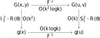
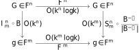
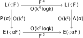

# Fourier Slice Photography

## 0 Abstract

1. 在 Fourier Domain，由全光圈透镜形成的照片是 4D 光场的 2D 切片。
2. 聚焦在不同深度的照片对应于 4D 光场的不同轨迹的切片。

## 1 Introduction

## 3 Background

| Symbols | Description |
|:-------:|:-----------:|
|$\bar{L}(x,y,u,v;F)$|Two-plane light field **inside camera**|
|$(u,v)$|Arrival plane on lens|
|$(x,y)$|Destination plane on sensor|
|$F$|Distance between lens and sensor|
|$E(x,y;F)$|Irradiance|
|$\phi$|Angle between ray and the normal of $(x,y)$ plane|
|$L(x,y,u,v;F)$|$L(x,y,u,v;F)=\bar{L}(x,y,u,v;F)\cos^{4}\phi$|

### Image Formation of Traditional Camera

$$
E(x,y;F)=\frac{1}{F^{2}}\iint_{\mathbb{R}^{2}}\bar{L}(x,y,u,v;F)\cos^{4}\phi\ \mathrm{d}u\mathrm{d}v\tag{1}
$$

因为 $\phi$ 是 $(x,y,u,v;F)$ 的函数，所以可以被吸收进入 $\bar{L}$ 之中，定义 $L(x,y,u,v;F)=\bar{L}(x,y,u,v;F)\cos^{4}\phi$。

### Image Formation of Plenoptic Camera

全光相机可以采集到从特定方向上穿过传感器的光线辐射度。对于任意的深度 $F'=\alpha F$，用相似三角形可以得到

$$
\begin{align*}
L(x,y,u,v;\alpha F)&=L\left(u+\frac{x-u}{\alpha},v+\frac{y-v}{\alpha},u,v;F\right)\\
&=L\left(u\left(1-\frac{1}{\alpha}\right)+\frac{x}{\alpha},v\left(1-\frac{1}{\alpha}\right)\frac{v}{\alpha},u,v;F\right)
\end{align*}\tag{2}
$$

> 这里 $(u,v)$ 空间的度规好像和 $(x,y)$ 相等才可以推导。

因此，在深度为 $\alpha F$ 的辐射度与某个深度为 $F$ 的辐射度相关联起来了。合并上面两个公式得到空域上的 Photography Synthetic 算子：
$$
\begin{align*}\\
\mathcal{P}(\alpha)[L](x,y;F)&=E(x,y;\alpha F)\\
&=\frac{1}{\alpha^{2}F^{2}}\iint_{\mathbb{R}^{2}}L\left(\frac{x}{\alpha}+u\left(1-\frac{1}{\alpha}\right),\frac{y}{\alpha}+v\left(1-\frac{1}{\alpha}\right),u,v;F\right)\mathrm{d}u\mathrm{d}v
\end{align*}\tag{3}
$$

其中 $\mathcal{P}(\alpha)[L](x,y;F)$ 这个算子将在深度为 $F$ 采集到的光场转化成了在深度为 $\alpha F$ 的照片。这个算子可以看作是先剪切 4D 空间，然后向下投影到 2D 空间。

## 4 Photographic Imaging in Fourier Space

### 4.1 Generalization of Fourier Slicing Theorem

- $f:\mathbb{R}^{n}\mapsto\mathbb{R}$ 函数表示一个 volume。
- **Projection**: $\mathcal{I}^{n}_{m}:(\mathbb{R}^{n}\mapsto\mathbb{R})\mapsto(\mathbb{R}^{m}\mapsto\mathbb{R})$ 算子表示积分掉输入函数的最后 $n-m$ 维，即
  $$
  \mathcal{I}^{n}_{m}[f](x_{1},\dots,x_{m})=\int_{\mathbb{R}^{n-m}}f(x_{1},\dots,x_{n})\mathrm{d}x_{m+1}\dots\mathrm{d}_{n}
  $$
- **Slicing**: $\mathcal{S}^{n}_{m}:(\mathbb{R}^{n}\mapsto\mathbb{R})\mapsto(\mathbb{R}^{m}\mapsto\mathbb{R})$ 算子表示直接去掉输入函数的最后 $n-m$ 维，即
	$$
	\mathcal{S}^{n}_{m}[f](x_{1},\dots,x_{m})=f(x_{1},\dots,x_{m},0,\dots,0)
	$$
- **Change of Basis**: $\mathcal{B}:\mathbb{R}^{n}\mapsto\mathbb{R}^{n}$ 算子表示改变 $n$ 维空间的基（一般是旋转，也可以是剪切），即
	$$
	\mathcal{B}[f](\mathbf{x})=f(\mathcal{B}^{-1}\mathbf{x})
	$$
- **Convolution**: $\mathcal{C}^{n}:(\mathbb{R}^{n}\mapsto\mathbb{R})\mapsto(\mathbb{R}^{n}\mapsto\mathbb{R})$ 算子表示 $n$ 维函数与卷积核 $h$ 的卷积操作，即
	$$
	\mathcal{C}^{n}(h)[f](\mathbf{x})=\int_{\mathbb{R}^{n}}f(\mathbf{x}-\mathbf{u})h(\mathbf{u})\mathrm{d}\mathbf{u}
	$$
- **Fourier Transform**: $\mathcal{F}^{n}: (\mathbb{R}^{n}\mapsto\mathbb{R})\mapsto(\mathbb{R}^{n}\mapsto\mathbb{R})$ 算子表示 $n$ 维函数的 Fourier 变换。

**广义 Fourier 切片定理**
$$
\mathcal{F}^{m}\circ\mathcal{I}^{n}_{m}\circ\mathcal{B}\equiv\mathcal{S}^{n}_{m}\circ\frac{\mathcal{B}^{-T}}{|\mathcal{B}^{-T}|}\circ\mathcal{F}^{n}\tag{4}
$$
即，先换基、再投影、最后 Fourier 变换等价于先 Fourier 变换、再换基、最后切片。证明在 Appendix A。

### 4.2 Fourier Slice Photography

在光场成像中，公式 $(3)$ 可以写作
$$
\begin{align*}\\
\mathcal{P}(\alpha)[L](x,y;F)&=\frac{1}{\alpha^{2}F^{2}}\iint_{\mathbb{R}^{2}}L\left(\frac{x}{\alpha}+u\left(1-\frac{1}{\alpha}\right),\frac{y}{\alpha}+v\left(1-\frac{1}{\alpha}\right),u,v;F\right)\mathrm{d}u\mathrm{d}v\\
&=\frac{1}{\alpha^{2}F^{2}}\mathcal{I}^{4}_{2}\circ\mathcal{B}(\alpha)[L](x,y;F)
\end{align*}\tag{5}
$$
其中换基矩阵就是
$$
\begin{align*}
\mathcal{B}(\alpha)&=\begin{bmatrix}\alpha&0&1-\alpha&0\\0&\alpha&0&1-\alpha\\0&0&1&0\\0&0&0&1\end{bmatrix}&\mathcal{B}^{-1}(\alpha)&=\begin{bmatrix}\frac{1}{\alpha}&0&1-\frac{1}{\alpha}&0\\0&\frac{1}{\alpha}&0&1-\frac{1}{\alpha}\\0&0&1&0\\0&0&0&1\end{bmatrix}
\end{align*}
$$
将 Fourier Slice Theorem 作用上去得到
$$
\begin{align*}\\
\mathcal{P}(\alpha)[L](x,y;F)&=\frac{1}{\alpha^{2}F^{2}}\mathcal{I}^{4}_{2}\circ\mathcal{B}(\alpha)[L](x,y;F)\\
&=\frac{1}{\alpha^{2}F^{2}}\mathcal{F}^{-2}\circ\mathcal{S}^{4}_{2}\circ\frac{\mathcal{B}^{-T}(\alpha)}{|\mathcal{B}^{-T}(\alpha)|}\circ\mathcal{F}^{4}[L](x,y;F)\\
&=\frac{1}{F^{2}}\mathcal{F}^{-2}\circ\mathcal{S}^{4}_{2}\circ\mathcal{B}^{-T}(\alpha)\circ\mathcal{F}^{4}[L](x,y;F)
\end{align*}\tag{6}
$$
因此可以定义频域上的 Photography Slicing 算子
$$
\mathcal{A}(\alpha)=\frac{1}{F^2}\mathcal{S}^{4}_{2}\circ\mathcal{B}^{-T}(\alpha)\tag{7}
$$
具体的计算形式就是
$$
\mathcal{A}(\alpha)[\mathfrak{L}](s, t)=\frac{1}{F^2}\mathfrak{L}(\alpha s,\alpha t,(1-\alpha)s,(1-\alpha)t)\tag{8}
$$
所以 Photography Synthetic 算子和 Photography Slicing 算子的关系是
$$
\begin{align*}\\
\mathcal{P}(\alpha)&=\mathcal{F}^{-2}\circ\mathcal{A}(\alpha)\circ\mathcal{F}^{4}
\end{align*}\tag{9}
$$

## 5 Theoretical Limits of Digital Refocusing

### 5.1 Photography Effect of Filtering the Light Field

**光场的卷积定理**：对 4D 光场做卷积等价于对 2D 照片做卷积，2D 卷积核是对应 4D 卷积核的 2D 成像，即：
$$
\mathcal{P}(\alpha)\circ\mathcal{C}^{4}(h)\equiv\mathcal{C}^{2}(\mathcal{P}(\alpha)[h])\circ\mathcal{P}(\alpha)\tag{10}
$$
证明在 Appendix B。

### 5.2 Band-Limited Plenoptic Camera

尽管理想的低通滤波不存在，但是可以做分析。空域上的低通滤波 $h$ 为
$$
\begin{align*}
h(p,q,s,t)&=\mathrm{sinc}\left(\frac{p}{\Delta{x}},\frac{q}{\Delta{y}},\frac{s}{\Delta{u}},\frac{t}{\Delta{v}}\right)\\
&=\mathrm{sinc}\left(\frac{p}{\Delta{x}}\right)\mathrm{sinc}\left(\frac{q}{\Delta{y}}\right)\mathrm{sinc}\left(\frac{s}{\Delta{u}}\right)\mathrm{sinc}\left(\frac{t}{\Delta{v}}\right)
\end{align*}
$$
其中每个 $\Delta$ 是在各自方向上的采样频率。

#### 5.2.1 Analytic Form for Refocused Photographs

这里分析在低通滤波下重对焦光场成像的解析式
$$
\begin{align*}
\hat{E}(\cdot;\alpha F)&=\mathcal{P}(\alpha)[\hat{L}(\cdot;F)]\\
&=\mathcal{P}(\alpha)[\mathcal{C}^{4}(h)\circ L(\cdot;F)]\\
&=\mathcal{P}(\alpha)\circ\mathcal{C}^{4}(h)[L(\cdot;F)]\\
&=\mathcal{C}^{2}(\mathcal{P}(\alpha)[h])\circ\mathcal{P}(\alpha)[L(\cdot;F)]\\
&=\mathcal{C}^{2}(\mathcal{P}(\alpha)[h])[E(\cdot;F)]
\end{align*}
$$
因此只要对于在深度为 $F$ 的成像的图像做 2D 的卷积，卷积核为低通滤波的 2D 成像，即
$$
\begin{align*}
\mathcal{P}(\alpha)[h]&=
\end{align*}
$$
证明在 Appendix C。

#### 5.2.2 Interpretation of Refocusing Performance

---

## Appendix A Generalization of the Fourier Slice Theorem

> 证明
> $$
\mathcal{F}^{m}\circ\mathcal{I}^{n}_{m}\circ\mathcal{B}\equiv\mathcal{S}^{n}_{m}\circ\frac{\mathcal{B}^{-T}}{|\mathcal{B}^{-T}|}\circ\mathcal{F}^{n}
$$

我们首先注意到
$$
\mathcal{F}^{m}\circ\mathcal{I}^{n}_{m}\equiv\mathcal{S}^{n}_{m}\circ\mathcal{F}^{n}
$$
这是因为
$$
\begin{align*}
&\quad\ \ \mathcal{F}^{m}\circ\mathcal{I}^{n}_{m}[f]\\\\
&=\int_{\mathbb{R}^{m}}\left[\int_{\mathbb{R}^{n-m}}f(x_{1},\dots,x_{n})\mathrm{d}x_{m+1}\dots\mathrm{d}_{n}\right]\exp(-i2\pi(x_{1}u_{1}+\dots+x_{m}u_{m}))\mathrm{d}x_{1}\dots\mathrm{d}_{m}\\
&=\int_{\mathbb{R}^{n}}f(x_{1},\dots,x_{n})\exp(-i2\pi(x_{1}u_{1}+\dots+x_{m}u_{m}))\mathrm{d}x_{1}\dots\mathrm{d}_{n}\\
&=\int_{\mathbb{R}^{n}}f(x_{1},\dots,x_{n})\exp(-i2\pi(x_{1}u_{1}+\dots+x_{m}u_{m}+x_{m+1}0+\dots+x_{n}0))\mathrm{d}x_{1}\dots\mathrm{d}_{n}\\
&=\mathcal{F}^{n}[f](u_1,\dots,u_m,0,\dots,0)\\
&=\mathcal{S}^{n}_{m}\circ\mathcal{F}^{n}[f]
\end{align*}
$$
接下来需要考虑换基的事情。我们有 Fourier 变换下的基变换
$$
\mathcal{F}^{n}\circ\mathcal{B}\equiv\frac{\mathcal{B}^{-T}}{|\mathcal{B}^{-1}|}\circ\mathcal{F}^{n}
$$
这是因为
$$
\begin{align*}
&\quad\ \ \mathcal{F}^n\circ\mathcal{B}[f]\\
&=\int_{\mathbb{R}^{n}}f\left(\mathcal{B}^{-1}\mathbf{y}\right)\exp\left(-i2\pi\mathbf{y}^T\mathbf{u}\right)\mathrm{d}\mathbf{y}&&\mathbf{x}=\mathcal{B}^{-1}\mathbf{y}\\
&=\frac{1}{|\mathcal{B}^{-1}|}\int f(\mathbf{x})\exp\left(-i2\pi(\mathcal{B}\mathbf{x})^T\mathbf{u}\right)\mathrm{d}\mathbf{x}&&\mathrm{d}\mathbf{y}=|\mathcal{B}|\mathrm{d}\mathbf{x}=\frac{1}{|\mathcal{B}^{-1}|}\mathrm{d}\mathbf{x}\\
&=\frac{1}{|\mathcal{B}^{-1}|}\int f(\mathbf{x})\exp\left(-i2\pi\mathbf{x}^T\left(\mathcal{B}^T\mathbf{u}\right)\right)\mathrm{d}\mathbf{x}\\
&=\frac{\mathcal{B}^{-T}}{|\mathcal{B}^{-1}|}\circ\mathcal{F}^{n}
\end{align*}
$$
相关的例子有 1D Fourier 变换的缩放性、2D Fourier 变换的旋转性、缩放性。最后结合这两个式子得到
$$
\begin{align*}
\mathcal{F}^{m}\circ\mathcal{I}^{n}_{m}\circ\mathcal{B}&\equiv\mathcal{S}^{n}_{m}\circ\mathcal{F}^{n}\circ\mathcal{B}\\
&\equiv\mathcal{S}^{n}_{m}\circ\frac{\mathcal{B}^{-T}}{|\mathcal{B}^{-1}|}\circ\mathcal{F}^{n}\\
&\equiv\mathcal{S}^{n}_{m}\circ\frac{\mathcal{B}^{-T}}{|\mathcal{B}^{-T}|}\circ\mathcal{F}^{n}
\end{align*}
$$
得证。

## Appendix B Filtered Light Field Photography Theorem

> 证明
> $$
\mathcal{P}(\alpha)\circ\mathcal{C}^{4}(h)\equiv\mathcal{C}^{2}(\mathcal{P}(\alpha)[h])\circ\mathcal{P}(\alpha)
$$

首先定义 **Modulation**：$\mathcal{M}^{n}$ 算子表示频域的 $n$ 维函数的调制，即频域上的乘积
$$
\mathcal{M}^{n}(h)[f](\mathbf{x})=f(\mathbf{x})\cdot h(\mathbf{x})
$$
然后我们就可以用定义好的符号描述卷积定理
$$
\begin{align*}
\mathcal{F}^{n}\circ\mathcal{C}^{n}(h)&\equiv\mathcal{M}^{n}(\mathcal{F}^{n}[h])\circ\mathcal{F}^{n}\\
\mathcal{F}^{n}\circ\mathcal{M}^{n}(h)&\equiv\mathcal{C}^{n}(\mathcal{F}^{n}[h])\circ\mathcal{F}^{n}\\
\end{align*}
$$
最后
$$
\begin{align*}
\mathcal{P}(\alpha)\circ\mathcal{C}^{4}(h)&\equiv\mathcal{F}^{-2}\circ\mathcal{A}(\alpha)\circ\mathcal{F}^{4}\circ\mathcal{C}^{4}(h)\\
&\equiv\mathcal{F}^{-2}\circ\mathcal{A}(\alpha)\circ\mathcal{M}^{4}(\mathcal{F}^{4}[h])\circ\mathcal{F}^{4}\\
&\equiv\mathcal{F}^{-2}\circ\mathcal{M}^{2}((\mathcal{A}(\alpha)\circ\mathcal{F}^{4})[h])\circ(\mathcal{A}(\alpha)\circ\mathcal{F}^{4})\\
&\equiv\mathcal{C}^{2}(\mathcal{F}^{-2}\circ(\mathcal{A}(\alpha)\circ\mathcal{F}^{4})[h])\circ\mathcal{F}^{-2}\circ(\mathcal{A}(\alpha)\circ\mathcal{F}^{4})\\
&\equiv\mathcal{C}^{2}(\mathcal{P}(\alpha)[h])\circ\mathcal{P}(\alpha)\\
\end{align*}
$$
第三个等号是容易证明的，第二、四个等号是卷积定理。

## Appendix C 
