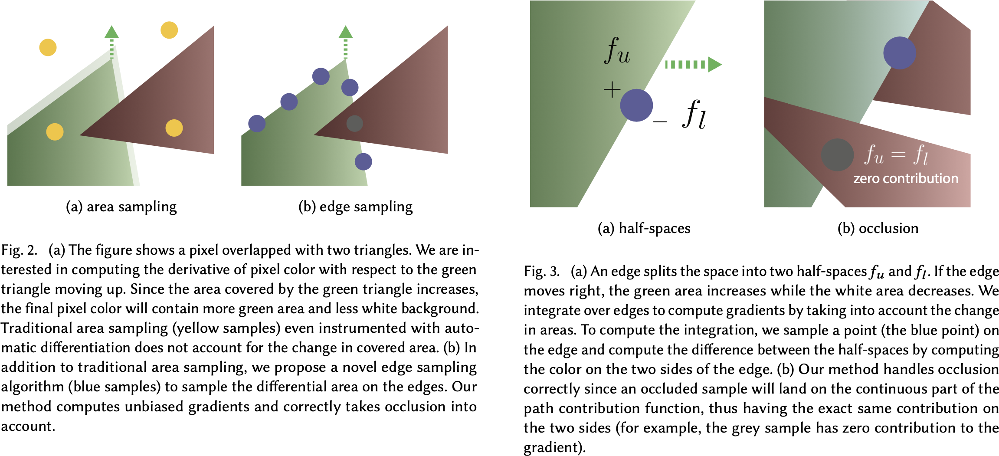

# Differentiable Monte Carlo Ray Tracing through Edge Sampling

## Claim

- 一种新颖的边缘采样算法，它直接对不连续积分的导数所引入的狄拉克 $\delta$ 函数进行采样。
- 我们的解决方案是随机的，建立在蒙特卡洛光线追踪的基础上。为此，我们引入了新的技术，除了传统方法中常见的立体角采样外，还对三角形的边缘进行了明确的采样。这需要新的空间加速策略和重要性采样来有效地对边缘进行采样。我们的方法是通用的，可以对任意反弹的光传输的导数进行采样。

## Motivation

在渲染中，需要对摄像机参数、光源、场景几何或材料外观等变量进行梯度处理。然而，计算渲染的梯度是具有挑战性的，因为渲染积分包括不可微的可见度项。而且以前在可微分渲染方面的工作主要集中在快速的、近似的解决方案上，使用较简单的渲染模型，只处理一阶的可见性，而忽略了诸如阴影和间接光等二阶效果。

## Method

我们的任务如下：给定一个连续参数集合 $\pi$（包括相机姿势、场景几何、材料和照明参数）的三维场景，我们使用路径追踪算法生成一个图像。给定一个从图像中计算出来的标量函数（例如我们想要优化的损失函数），我们的目标是反向传播标量的梯度，相对于所有的场景参数 $\pi$。

我们计算梯度积分的策略是将其分成平滑和不连续的区域。对于积分的平滑部分（如 Phong 着色或双线性纹理重建），我们采用传统的区域采样，并进行自动微分。对于不连续的部分，我们使用一种新的边缘采样方法来捕捉边界的变化。

我们专注于三角形网格，我们假设网格已经被预处理过，因此没有相互交叉。我们还假设没有点光源，也没有完美的镜面反射。我们用面光源和粗糙度很低的 BRDFs 来近似这些。我们还专注于静态场景，并将运动模糊的时间维度上的整合作为未来的工作。

### Primary Visibility

|    Symbol     |                Description                |
| :-----------: | :---------------------------------------: |
|     $\pi$     |              scene parameter              |
|      $k$      |               pixel filter                |
|      $L$      | radiance, integration of scene parameter  |
|      $f$      |       $f(x, y; \pi)=k(x, y)L(x, y; \pi)$       |
|      $I$      |                pixel color                |
| $\mathcal{H}$ |          Heaviside step function          |
|   $\alpha$    | the edge equation formed by the triangles |

一个像素的颜色的计算公式为：
$$
I = \iint k(x, y)L(x, y; \pi) \mathrm{d}x\mathrm{d}y \tag{1}
$$
积分的区域是像素所覆盖的区域。我们的目标是计算像素值 $I$ 对于场景参数 $\pi$ 的梯度：
$$
\partial_{\pi}I = \partial_{\pi} \iint k(x, y)L(x, y; \pi) \mathrm{d}x\mathrm{d}y \tag{2}
$$
我们依靠蒙特卡洛积分来估计像素值$I$。然而，我们不能采取简单的方法，应用同样的蒙特卡洛采样器来估计梯度 $\partial_{\pi}I$，因为场景函数 $f$ 对于场景参数来说不一定可微。

---

一个三角形把空间分成了上半空间和下半空间。我们可以用一个方程来描述这个分割：
$$
\mathcal{H}(\alpha(x, y)) f_u(x, y) + \mathcal{H}(-\alpha(x, y)) f_l(x, y) \tag{3}
$$
对于一条边的两个端点 $(a_x, a_y),(b_x, b_y)$，其方程为
$$
\alpha(x, y) = (a_x - b_x)x + (a_y - b_y)y + (a_xb_y - b_xa_y) \tag{4}
$$
对于一点 $(x, y)$，如果 $\alpha(x, y) > 0$，则该点在上半空间中，$\alpha(x, y) = 0$，则该点在边上，$\alpha(x, y) < 0$，则该点在下半空间中。

---

所以可以把 $f$ 拆解成很多个部分：
$$
\iint f(x, y; \pi) \mathrm{d}x\mathrm{d}y = \sum_{i} \iint \mathcal{H}(\alpha_i(x, y))f_i(x, y; \pi) \mathrm{d}x\mathrm{d}y \tag{5}
$$
然后对积分求导：
$$
\begin{aligned}
\partial_{\pi}\iint f(x, y; \pi) \mathrm{d}x\mathrm{d}y &= \partial_{\pi}\sum_{i}\iint \mathcal{H}(\alpha_i(x, y)) f_i(x, y; \pi) \mathrm{d}x\mathrm{d}y \\
&= \sum_{i}\partial_{\pi}\iint \mathcal{H}(\alpha_i(x, y))f_i(x, y; \pi) \mathrm{d}x\mathrm{d}y \\
&= \sum_{i}\iint \partial_{\pi}[\mathcal{H}(\alpha_i(x, y))f_i(x, y; \pi)] \mathrm{d}x\mathrm{d}y \\
&= \sum_{i}\iint [\delta(\alpha_i(x, y))\partial_{\pi}\alpha_i(x, y)f_i(x, y; \pi)+\mathcal{H}(\alpha_i(x, y))\partial_{\pi}f_i(x, y; \pi)] \mathrm{d}x\mathrm{d}y
\end{aligned}\tag{6}
$$

这表明我们可以用两个 Monte Carlo 估计器的和来估计导数。第一个估计器估计和边界有关，因为与 Dirac 函数相关，因此把面积分转化为线积分：
$$
\begin{aligned}
\iint \delta(\alpha_i(x, y))\partial_{\pi}\alpha_i(x, y)f_i(x, y; \pi)\mathrm{d}x\mathrm{d}y &= \int_{\alpha_i(x, y) = 0} \frac{\partial_{\pi}\alpha_i(x, y)}{\|\partial_{(x, y)}\alpha_i(x, y)\|}f_i(x, y; \pi)\mathrm{d}\sigma(x, y)
\end{aligned}\tag{7}
$$
其中各个导数分别是：
$$
\begin{aligned}
\partial_{a_x}\alpha_i(x, y) &= b_y - y & \partial_{a_y}\alpha_i(x, y) &= x - b_x \\
\partial_{b_x}\alpha_i(x, y) &= y - a_y & \partial_{b_y}\alpha_i(x, y) &= a_x - x \\
\partial_{x}\alpha_i(x, y) &= a_y - b_y & \partial_{y}\alpha_i(x, y) &= b_x - a_x
\end{aligned}\tag{8}
$$
