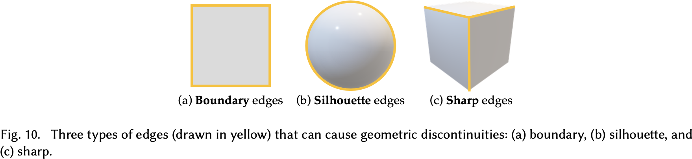

# Physics-Based Differentiable Rendering: A Comprehensive Introduction

## 1 Introduction

在了解什么是可微渲染之前，首先要知道什么是渲染。渲染是模型互相耦合作用变为图像的过程。这张图片展示了渲染过程：首先把场景的建模信息（比如纹理，物体形状，相机参数）编码为 $\mathbf{x}$，作为输入送到某个过程 $f:\mathcal{X}\mapsto\mathcal{Y}$ 进行渲染，随后输出图像 $\mathbf{y}$。假如说这个渲染过程 $f$ 是可逆的，那么就可以通过一张图像 $\mathbf{y}$ 得到场景的建模 $\mathbf{x}$。我们把从模型到图像的过程叫做前向渲染（forward rendering），把图像到模型的过程叫做逆渲染（inverse rendering）。但是通常来说，$f$ 是高度复杂的非线性函数，获得其逆映射一般来说不太可能。

因此，出现了可微渲染。可微渲染并不是尝试去获得渲染过程的逆映射 $f^{-1}$，它的步骤是

1. 假设我们已经有了一个初始场景模型 $\mathbf{x}$，经过渲染过程 $f$ 得到一张图像 $\mathbf{y}$，即前向渲染一次。
2. 把图像 $\mathbf{y}$ 经过一个质量评估函数 $g$，我们就能得到这张图像的质量 $z$。
3. 根据质量 $z$ 我们可以用梯度下降的方法利用 $\partial{z}/\partial\mathbf{x}$ 连续优化场景模型 $\mathbf{x}$。
4. 不断迭代直到质量 $z$ 收敛。

这里，根据链式法则，我们有：
$$
\frac{\partial{z}}{\partial\mathbf{x}}=\frac{\partial{z}}{\partial\mathbf{y}}\frac{\partial\mathbf{y}}{\partial\mathbf{x}}=g'(\mathbf{y})f'(\mathbf{x})
$$
由于输入参数空间的非线性性及其巨大的维度，优化 $\mathbf{x}$ 通常情况下是不可行的。因为网格中的每个 texel、voxel 和 vertex 都是一个自由参数，而场景中很有可能有数以亿计的参数！

不过只要 $f$ 是可微的，即给高维输入参数空间提供了一个梯度下降方向，那么整个场景就可以持续迭代连续优化。很显然，$f$ 也不一定拥有可微这么好的性质，不过相比去得到逆映射来说，要求 $f$ 是可微的明显要简单很多，因为具体的渲染过程是可以人为定义的。此外，可微渲染的另一个好处是，它与端到端训练的概率推理和机器学习流水线是兼容的。

因此，可微渲染的工作基本上围绕着将不可微的渲染过程变得可微。当然，真正的逆渲染管道不仅仅涉及梯度计算，还需要仔细的初始化和参数化，以避免收敛到低质量的局部最小值；处理网格的离散拓扑变化，并分配先验参数以解决逆问题的不理想方面。

#### Challenges

**几何体导数涉及一个独特的挑战：在计算阴影和相互反射时，物体的边界会带来麻烦的不连续性，如果不采取预防措施，会导致不正确的梯度。**

## 2 Motivation and Mathematical Preliminaries

我们首先得清楚：渲染通常建模为一个积分问题。可微渲染里面，我们会对渲染函数求导；因此我们需要证明，虽然被积函数是不连续的，但整个积分（渲染函数）实际上是可微的。不过需要注意的是，基本的数学定理告诉我们，对于不在紧集上连续可导的函数，积分的导数和被积函数导数的积分往往是不一致的，这点将在后续的处理中体现到。

---

以二维的情况为例。设 $P=\{(x,y)\in\mathbb{R}^2\mid (x,y)\in[a,b]\times[c,d]\}$ 是 $\mathbb{R}^2$ 上的一个矩形区域。定义
$$
F(y)=\int_{a}^{b}f(x,y)\mathrm{d}x
$$
如果函数 **$f:P\to\mathbb{R}\in C^{(1)}(P,\mathbb{R})$**，那么其导数满足
$$
\frac{\mathrm{d}F}{\mathrm{d}y}=\frac{\partial}{\partial{y}}\int_{a}^{b}f(x,y)\mathrm{d}x=\int_{a}^{b}\frac{\partial}{\partial{y}}f(x,y)\mathrm{d}x
$$
**证明：**
$$
\begin{aligned}
\left|F(y_0+h)-F(y_0)-\frac{\mathrm{d}F}{\mathrm{d}y}(y_0)h\right|&=\left|F(y_0+h)-F(y_0)-\left(\int_{a}^{b}\frac{\partial}{\partial{y}}f(x,y_0)\mathrm{d}x\right)h\right|\\
 &=\left|\int_{a}^{b}\left(f(x,y_0+h)-f(x,y_0)-\frac{\partial}{\partial{y}}f(x,y_0)h\right)\mathrm{d}x\right|\\
&\le\int_{a}^{b}\left|f(x,y_0+h)-f(x,y_0)-\frac{\partial}{\partial{y}}f(x,y_0)h\right|\mathrm{d}x\\
&\le|h|\int_{a}^{b}\sup_{0<\theta<1}\left|\frac{\partial}{\partial{y}}f(x,y_0+\theta h)-\frac{\partial}{\partial{y}}f(x,y_0)\right|\mathrm{d}x\\
\end{aligned}
$$
由于在紧集上 $\partial{f}/\partial{y}\in C(P,\mathbb{R})$，因此 $\partial{f}/\partial{y}(x,y)\mathop{\rightrightarrows}_{y\to y_0}\partial{f}/\partial{y}(x,y_0)$，因此得证。

---

一个简单的可微渲染的例子：两个纯色的，可能会相互遮挡的三角形，一共有 6 个顶点（12 个数）和 2 个颜色（6 个数）。

|                 ymbols                 |    Descriptions     |
| :------------------------------------: | :-----------------: |
|  $\boldsymbol{\pi}\in\mathbb{R}^{18}$  |  scene parameters   |
| $\boldsymbol{\pi}_v\in\mathbb{R}^{12}$ | vertices parameters |
|  $\boldsymbol{\pi}_c\in\mathbb{R}^6$   |  color parameters   |
|         $I(\boldsymbol{\pi})$          |        image        |
|   $\mathcal{L}(I(\boldsymbol{\pi}))$   |        loss         |

### 2.1 Rendering as an Integration Problem

|                         Symbols                         |                   Descriptions                    |
| :-----------------------------------------------------: | :-----------------------------------------------: |
|                         $(x,y)$                         |           **continuous** 2D coordinates           |
| $m(x,y;\boldsymbol{\pi}):\mathbb{R}^2\mapsto\mathbb{R}$ | underlying imaging function maps $(x,y)$ to color |

最直接获取像素颜色的方法是在每个像素的中心评估 $m$。这种方法容易出现混叠，从而导致锯齿状边缘、瞬时闪烁、摩尔纹和破坏精细细节（混叠）等问题。

从信号处理的角度来看，我们使用离散信号对这个二维空间进行采样，其中采样率由成像函数 $m$ 决定。由于成像函数是不连续的，它在所有频率上都具有能量并且不受频带限制。因此，只要我们在像素中心进行评估，无论我们选择多大的分辨率，我们都会遇到混叠问题。为了解决混叠问题，我们需要从成像函数 $m$ 中移除高频能量。这是通过将成像函数与低通滤波器进行卷积来完成的。对于每个像素 $I_i$，我们评估以像素中心 $(x_i,y_i)$ 为中心的积分：
$$
I_i=\iint k(x,y)m(x_i+x,y_i+y;\boldsymbol{\pi})\mathrm{d}x\mathrm{d}y=\iint f(x,y;\boldsymbol{\pi})\mathrm{d}x\mathrm{d}y\tag{1}
$$
其中 $k$ 是滤波核。这也就是为什么我们将渲染建模为一个积分问题。我们可以解析地或者数值地计算这个积分，但是解析的计算一般来说可遇不可求。

大多数渲染器，无论是实时的、离线的、基于物理的、可微的还是不可微的，都需要处理混叠问题。大多数通过在不同的位置评估成像函数，使用数值解法来解决抗混叠积分，这个过程通常称为**离散化**：
$$
I_i\approx\frac{1}{N}\sum_{j=1}^{N}f(x_j,y_j;\boldsymbol{\pi})\tag{2}
$$
如果求和收敛于积分，即 $\lim_{N\to\infty}1/N\sum_{j=1}^{N}f(x_j,y_j)=I_i$，我们说离散化是**一致的**。样本 $x_j,y_j$ 不需要是随机的。如果我们使用某种概率分布随机采样 $x_j,y_j$，且其期望与积分相同，即 $\mathbb{E}[f(x_j,y_j)]=I_i$，我们说离散化是**无偏的**。

大多数渲染问题是关于 1) 我们如何在这些多维积分中对被积函数 $f$ 建模，以及 2) 我们如何评估、近似、预计算或压缩每个像素的积分 $\int f \mathrm{d}S$。可微渲染提出了第三个问题：我们如何去微分这些积分？

### 2.2 Computing Gradients by Differentiating the Integrals

以下正式开始可微渲染的流程。首先获得像素值关于场景参数的导数：
$$
\frac{\partial}{\partial\pi}\mathcal{L}(I(\boldsymbol{\pi}))=\frac{\partial\mathcal{L}}{\partial{I}(\boldsymbol{\pi})}\frac{\partial{I}(\boldsymbol{\pi})}{\partial\boldsymbol{\pi}}\frac{\partial\boldsymbol{\pi}}{\partial\pi}\tag{3}
$$

$\mathcal{L}$ 可以是任何可微的函数。这里假设
$$
\mathcal{L}(I(\boldsymbol{\pi}))=\|I(\boldsymbol{\pi})-\hat{I}\|^2\tag{4}
$$
那么
$$
\frac{\partial}{\partial\pi}\mathcal{L}(I(\boldsymbol{\pi}))=2\left(I(\boldsymbol{\pi})-\hat{I}\right)^T\left(\frac{\partial{I}(\boldsymbol{\pi})}{\partial\boldsymbol{\pi}}\right)\frac{\partial\boldsymbol{\pi}}{\partial\pi}\tag{5}
$$
考虑两个相互遮挡的三角形，考虑 $\pi_v\in\boldsymbol{\pi}_v$ 部分的导数，如果用数值方法求 $\partial{I}_i/\partial\pi_v$，结果永远是 $0$。因为 $f$ 返回的是 $(x,y)$ 所坐落的三角形的颜色。但是，很明显，三角形顶点的位置，对于像素的颜色是存在影响的，因为像素颜色是 $f$ 值在区域内的积分，用数学语言描述就是：
$$
\frac{\partial{I}_i}{\partial\pi_v}=\frac{\partial}{\partial\pi_v}\iint f(x,y;\boldsymbol{\pi})\mathrm{d}x\mathrm{d}y\not\approx\frac{1}{N}\sum_{j=1}^{N}\frac{\partial}{\partial\pi_v}f(x,y;\boldsymbol{\pi})=0\tag{6}
$$
直观上来说，导数测量的是局部变化，均匀离散化检测到不连续点周围局部变化的机会为零。

---

考虑 1D 的情况，以下表达式：
$$
\frac{\partial}{\partial{p}}\int_0^1\mathbb{1}[x<p]\mathrm{d}x\tag{7}
$$
解析解是 $1$，数值解是 $0$。

---

因此，**即使渲染的被积函数 $f$ （关于 $x$ 或者 $\boldsymbol{\pi}$）是不连续不可微的，但是其积分 $I_i$ 其实是（关于 $\boldsymbol{\pi}$）可微的！**重要的是，渲染本身就是一个积分。实时或离线渲染的所有方法都是近似或离散化渲染积分。

一个直接的想法就是，我们对积分求微分的策略是明确地将在不连续处采样以检测局部变化。

### 2.3 Distributional Derivatives and Dirac Delta

一种做法是定义或者借助特殊的函数来定义导数。在上面的例子中，被积函数关于 $p$ 的分布导数是 Dirac delta $\delta$：
$$
\frac{\partial}{\partial{p}}\mathbb{1}[x<p]=\delta(x-p)\tag{8}
$$

$\delta(x-p)$ 不是函数而是泛函。如果 $0\le p\le 1$，我们将 Dirac delta 的积分定义为 $\int_0^1\delta(x-p)\mathrm{d}x=1$，否则为 $0$。

### 2.4 Leibniz's Rule for Differentiating 1D Integrals

我们的替代策略是在概念上拆分积分，使所有不连续点都位于边界处。
$$
\frac{\partial}{\partial{p}}\int_0^1\mathbb{1}[x<p]\mathrm{d}x=\frac{\partial}{\partial{p}}\int_0^p1\mathrm{d}x+\frac{\partial}{\partial{p}}\int_p^10\mathrm{d}x\tag{9}
$$

拆分后，可以通过微积分基本定理计算导数，即
$$
\frac{\partial}{\partial{p}}\int_0^p1\mathrm{d}x=1,\frac{\partial}{\partial{p}}\int_p^10\mathrm{d}x=0\tag{10}
$$
关于积分边界和被积函数的微分的一般版本是 Lebnitz 规则。

---

Lebnitz 规则：设 $P=\{(x,y)\in\mathbb{R}^2\mid (x,y)\in[a,b]\times[c,d]\}$ 是 $\mathbb{R}^2$ 的一个矩形区域。如果函数 **$f:P\to\mathbb{R}\in C^{(1)}(P,\mathbb{R})$**，且函数 **$a\le\alpha(y),\beta(y)\le b\in C^{(1)}([c,d],\mathbb{R})$**，那么
$$
F(y)=\int_{a}^{b}f(x,y)\mathrm{d}x\tag{11}
$$
在区间 $[\alpha,\beta]$ 上可微，且有
$$
\frac{\mathrm{d}F}{\mathrm{d}y}=\int_{a(y)}^{b(y)}\frac{\partial{f}}{\partial{y}}(x,y)\mathrm{d}x+f(b(y),y)\frac{\mathrm{d}b}{\mathrm{d}y}-f(a(y),y)\frac{\mathrm{d}a}{\mathrm{d}y}\tag{12}
$$
**证明：**

令
$$
G(y,u,v)=\int_{u}^{v}f(x,y)\mathrm{d}x
$$
于是 $f(y)$ 是由 $F(y,u,v)$ 与 $u=a(y),v=b(y)$ 复合而成的函数，由链式法则和可微性可得
$$
\begin{aligned}
\frac{\mathrm{d}G}{\mathrm{d}y}&=\frac{\partial{F}}{\partial{y}}+\frac{\partial{F}}{\partial{u}}\frac{\partial{u}}{\partial{y}}+\frac{\partial{F}}{\partial{v}}\frac{\partial{v}}{\partial{y}}\\
&=\int_{u}^{v}\frac{\partial{f}}{\partial{y}}(x,y)\mathrm{d}x+f(v,y)\frac{\mathrm{d}v}{\mathrm{d}y}-f(u,y)\frac{\mathrm{d}u}{\mathrm{d}y}
\end{aligned}
$$
将 $u=a(y),v=b(y)$ 代入上式就得到我们想要的形式。

---

因此，给定一个一维积分 $\int_0^1f(x;\pi)\mathrm{d}x$，和一组关于参数 $\pi$ 的不连续点 $p_0,p_1,\dots,p_M$，积分的导数为
$$
\begin{aligned}
&\frac{\partial}{\partial{\pi}}\int_{0}^{1}f(x;\pi)\mathrm{d}x\\
&=\frac{\partial}{\partial{\pi}}\left[\int_{0}^{p_0}f(x;\pi)\mathrm{d}x+\sum_{k=0}^{M-1}\int_{p_k}^{p_{k+1}}f(x;\pi)\mathrm{d}x+\int_{p_M}^{1}f(x;\pi)\mathrm{d}x\right]\\
&=\frac{\partial}{\partial{\pi}}\int_{0}^{p_0}f(x;\pi)\mathrm{d}x+\sum_{k=0}^{M-1}\frac{\partial}{\partial{\pi}}\int_{p_k}^{p_{k+1}}f(x;\pi)\mathrm{d}x+\frac{\partial}{\partial{\pi}}\int_{p_M}^{1}f(x;\pi)\mathrm{d}x\\
&=\int_{0}^{p_0}\frac{\partial f}{\partial\pi}(x;\pi)\mathrm{d}x+\frac{\partial p_0}{\partial\pi} f^+(p_0;\pi) - \frac{\partial 0}{\partial\pi} f^-(p_0;\pi)\\
&+\sum_{k=0}^{M-1}\int_{p_k}^{p_{k+1}}\frac{\partial f}{\partial\pi}(x;\pi)\mathrm{d}x+\frac{\partial p_{k+1}}{\partial\pi} f^-(p_{k+1};\pi) - \frac{\partial p_k}{\partial\pi} f^+(p_k;\pi)\\
&+\int_{p_M}^{1}\frac{\partial f}{\partial\pi}(x;\pi)\mathrm{d}x+\frac{\partial1}{\partial\pi} f^-(1;\pi) - \frac{\partial p_M}{\partial\pi} f^+(p_M;\pi)\\
&=\underbrace{\int_{0}^{1}\frac{\partial f}{\partial\pi}(x;\pi)\mathrm{d}x}_{\text{interior}}+\underbrace{\sum_{k=0}^{M}\frac{\partial p_k}{\partial\pi}\left[f^-(p_k;\pi)-f^+(p_k;\pi)\right]}_{\text{boundary}}
\end{aligned}\tag{13}
$$
其中 $f^-(x;\pi)=\lim_{x'\to x^-}f(x';\pi)$ 和 $f^+(x;\pi)=\lim_{x'\to x^+}f(x';\pi)$。为便于记述，当 $f$ 在 $(x; \pi)$ 处不可微时，我们定义 $\partial f(x;\pi)/\partial \pi=0$.

这个公式告诉了我们，不连续点的集合 $p_k$ 可以包括连续的点，因为对于连续区域，差值 $f^-(x;\pi)=f^+(x;\pi)$。当我们不知道一个三角形边界是否被遮挡时，这对于以后在二维中处理遮挡问题是很重要的。其次，我们不需要实际去拆分积分，因为积分区域可以进行统一的处理。

---

例题 1：设
$$
f(x)=\begin{cases}x&x<p\\x-p&p<x<2p\\x-2p&2p<x<1\end{cases}
$$
则先求积分后求导数为：
$$
\begin{aligned}
\int_{0}^{1}f(x)\mathrm{d}x&=\frac{1}{2}[(p-0)^2+(2p-p)^2+(1-2p)^2]\\
\partial_{p}\int_{0}^{1}f(x)\mathrm{d}x&=p+p-2(1-2p)=6p-2\\
\end{aligned}
$$
而先求导数后带入 Leibniz 公式为：
$$
\begin{aligned}
\partial_{p}f(x)&=\begin{cases}0&x<p\\-1&p<x<2p\\-2&2p<x<1\end{cases}\\
\partial_{p}\int_{0}^{1}f(x)\mathrm{d}x&=\int_{0}^{1}\partial_{p}f(x)\mathrm{d}x+\sum_{i=1}^{2}\partial_p(ip)[f^-(ip;p)-f^+(ip;p)]\\
&=-(2p-p)-2(1-2p)+p-0+2p-0\\
&=6p-2\\
\end{aligned}
$$

例题 2：设
$$
f(x)=\begin{cases}x&x<p\\x-p&p<x<q\\x-q&q<x<1\end{cases}
$$
则先求积分后求导数为：
$$
\begin{aligned}
\int_{0}^{1}f(x)\mathrm{d}x&=\frac{1}{2}[(p-0)^2+(q-p)^2+(1-q)^2]\\
\partial_{p}\int_{0}^{1}f(x)\mathrm{d}x&=p-(q-p)=2p-q\\
\partial_{q}\int_{0}^{1}f(x)\mathrm{d}x&=q-p-(1-q)=2q-p-1\\
\end{aligned}
$$
而先求导数后带入 Leibniz 公式为：
$$
\begin{aligned}
\partial_{p}f(x)&=\begin{cases}0&x<p\\-1&p<x<q\\0&q<x<1\end{cases}\\
\partial_{p}\int_{0}^{1}f(x)\mathrm{d}x&=\int_{0}^{1}\partial_{p}f(x)\mathrm{d}x+f^-(p;p)-f^+(p;p)\\
&=-(q-p)+p-0=2p-q\\
\partial_{q}f(x)&=\begin{cases}0&x<p\\0&p<x<q\\-1&q<x<1\end{cases}\\
\partial_{q}\int_{0}^{1}f(x)\mathrm{d}x&=\int_{0}^{1}\partial_{q}f(x)\mathrm{d}x+f^-(q;q)-f^+(q;q)\\
&=-(1-q)+(q-p)-0=2q-p-1\\
\end{aligned}
$$

---

### 2.5 Reynolds Transport Theorem for Differentiating Multi-dimensional Integrals

$f$ 是一个定义在某个 $n$ 维流形 $\Omega(\pi)$ 上的（可能不连续的）标量值函数，参数化为 $\pi\in\mathbb{R}$。此外，$\Gamma(\pi)\subset\Omega(\pi)$ 是由外部边界 $\partial\Omega(\pi)$ 和包含 $f$ 的不连续位置的内部边界联合给出的 $(n - 1)$ 维流形。那么，可以认为
$$
\frac{\partial}{\partial{\pi}}\left(\int_{\Omega(\pi)}f\mathrm{d}\Omega\right)=\underbrace{\int_{\Omega(\pi)}\dot{f}\mathrm{d}\Omega}_{\text{interior}}+\underbrace{\int_{\Gamma(\pi)}\langle\mathbf{n},\dot{\mathbf{x}}\rangle\Delta{f}\mathrm{d}\Gamma}_{\text{boundary}}\tag{14}
$$
其中 $\dot{\mathbf{x}}=\partial\mathbf{x}/\partial\pi$，是一个 $n$ 维向量，代表相对于参数 $\pi$ 的边界运动，$\mathrm{d}\Omega$ 和 $\mathrm{d}\Gamma$ 是对应的标准测度，$\mathbf{n}$ 是 $\mathbf{x}\in\Gamma(\pi)$ 的法向量，
$$
\Delta{f}(\mathbf{x})=\lim_{\epsilon\to0^-}f(\mathbf{x}+\epsilon\mathbf{n})-\lim_{\epsilon\to0^+}f(\mathbf{x}+\epsilon\mathbf{n})\tag{15}
$$

#### Discretizing the integrals

$$
\begin{gather}
\int_{\Omega(\pi)}\dot{f}\mathrm{d}\Omega\approx\frac{1}{N_i}\sum_{j=1}^{N_i}\dot{f}(x_j)\\
\int_{\Gamma(\pi)}\langle\mathbf{n},\dot{\mathbf{x}}\rangle\Delta{f}\mathrm{d}\Gamma\approx\frac{1}{N_b}\sum_{j=1}^{N_b}\langle\mathbf{n},\dot{\mathbf{x}}\rangle\Delta{f}(x_j)
\end{gather}
$$

因此我们定义 $\Gamma$ 为所有三角形边上的点的集合。为了选择边上的点，我们首先随机挑选一条边（2 个三角形中有 6 条边），然后在边上均匀地挑选一个点。为了评估差分 $\Delta{f}$ ，在实践中我们选择一个小的 $\epsilon$，并从两边评估 $f$。此外，我们在同一时间内估计许多像素积分 $I_i$。当我们在边缘上选取一个点时，我们将收集所有滤波支持与我们选取的点相交的像素，并将导数散布到相应的像素积分离散化中。

### 2.6 Relation to Rasterization-basd Differentiable Renderers

OpenDR 使用像素有限差分对边界项 $\langle\mathbf{n},\dot{\mathbf{x}}\rangle\Delta{f}$ 进行逼近，并根据物体 ID 检测的结果选择中心差分、前向差分和后向差分。

Kato 等人通过对所有的边缘进行光栅化处理，同时对颜色缓冲区进行插值来计算差分，从而应用边缘光栅化处理。

- 可见性查询通常不是当前可微渲染系统的最大瓶颈。相反，大部分的渲染时间都花在不连贯的内存访问、不规则散射和导数计算过程中的原子操作上。
- 内部积分和边界积分不需要使用相同的可见度算法来计算。我们可以使用栅格化来计算内部积分，而使用光线追踪来计算边界积分。
- 许多用于光栅化的加速策略，如用于遮挡剔除的分层 Z 缓冲，也可用于基于光线追踪的边界评估（我们可以使用遮挡剔除技术拒绝边缘）。
- 与像素数相比，边界的集合在图像空间中往往是稀疏的。可以想象，我们可以用比像素数少得多的样本来计算边界积分，同时达到很低的误差。

## 3 Physics-Based Differentiable Renderering Theory

### 3.1 Differentiable Rendering of Surfaces

首先是辐射传播公式：
$$
L(\mathbf{x},\boldsymbol{\omega}_o)=L_e(\mathbf{x},\boldsymbol{\omega}_o)+\int_{\mathbb{S}^2}L_i(\mathbf{x},\boldsymbol{\omega}_i)f_s(\mathbf{x},\boldsymbol{\omega}_i,\boldsymbol{\omega}_o)\mathrm{d}\sigma(\boldsymbol{\omega}_i)\tag{17}
$$

这里 $f_s$ 囊括了常见的 $\cos$ 项，$\mathrm{d}\sigma(\boldsymbol{\omega}_i)$ 是单位球面上的微元。

#### 3.1.1 Direct Illumination

然后只考虑反射光照项
$$
L_r(\mathbf{x},\boldsymbol{\omega}_o)=\int_{\mathbb{S}^2}L_e(\mathbf{y},-\boldsymbol{\omega}_i)f_s(\mathbf{x},\boldsymbol{\omega}_i,\boldsymbol{\omega}_o)\mathrm{d}\sigma(\boldsymbol{\omega}_i)\tag{18}
$$
其中 $\mathbf{y}$ 是从 $\mathbf{x}$ 向 $\boldsymbol{\omega}_i$ 发出的光线的最近交点。考虑计算 $L_r(\mathbf{x},\boldsymbol{\omega}_o)$ 关于某个场景参数 $\pi\in\mathbb{R}$ 的导数问题，即

$$
\frac{\mathrm{d}}{\mathrm{d}\pi}[L_r(\mathbf{x},\boldsymbol{\omega}_o)]=\frac{\mathrm{d}}{\mathrm{d}\pi}\left(\int_{\mathbb{S}^2}L_e(\mathbf{y},-\boldsymbol{\omega}_i)f_s(\mathbf{x},\boldsymbol{\omega}_i,\boldsymbol{\omega}_o)\mathrm{d}\sigma(\boldsymbol{\omega}_i)\right)\tag{19}
$$
定义 $f_{\text{direct}}(\boldsymbol{\omega}_i;\mathbf{x},\boldsymbol{\omega}_o)=L_e(\mathbf{y},-\boldsymbol{\omega}_i)f_s(\mathbf{x},\boldsymbol{\omega}_i,\boldsymbol{\omega}_o)$。由 Reynolds Transport Theorem 可得
$$
\begin{aligned}
\frac{\mathrm{d}}{\mathrm{d}\pi}[L_r(\mathbf{x},\boldsymbol{\omega}_o)]&=\underbrace{\int_{\mathbb{S}^2}\frac{\mathrm{d}}{\mathrm{d}\pi}f_{\text{direct}}(\boldsymbol{\omega}_i;\mathbf{x},\boldsymbol{\omega}_o)\mathrm{d}\sigma(\boldsymbol{\omega}_i)}_{\text{interior}}\\
&+\underbrace{\int_{\Delta\mathbb{S}^2}\langle\mathbf{n}_\perp,\dot{\boldsymbol{\omega}_i}\rangle\Delta{f}_{\text{direct}}(\boldsymbol{\omega}_i;\mathbf{x},\boldsymbol{\omega}_o)\mathrm{d}\ell(\boldsymbol{\omega}_i)}_{\text{boundary}}
\end{aligned}\tag{20}
$$
其中 $\mathrm{d}\ell$ 是曲线微元。

式子中，内部项是单位球面 $\mathbb{S}^2$ 上的积分，它与场景参数 $\pi$ 无关，使得积分变量 $\boldsymbol{\omega}_i$ 也与 $\pi$ 无关。边界项是由于 $f_{\text{direct}}$ （关于 $\boldsymbol{\omega}_i$）的（跳跃）不连续点而出现的。这些不连续点形成了一维不连续曲线，我们将其表示为单位球体上的 $\Delta\mathbb{S}^2$。对于任何 $\boldsymbol{\omega}_i\in\mathbb{S}(\mathbf{x},\boldsymbol{\omega}_o)$ 来说，$\mathbf{n}_\perp(\boldsymbol{\omega}_i)$ 是 $\mathbb{S}^2$ 的切空间中 $\boldsymbol{\omega}_i$ 处垂直于不连续曲线的法向量，且具有单位长度。

因为 $\pi$ 的变化导致了一维曲线在单位球面上移动，这种移动必然是沿着球面发展的，因此需要考虑球面切空间。

如果 BSDF 关于 $\pi$​ 是连续的话，那么可以做进一步拆解
$$
\Delta{f}_{\text{direct}}(\boldsymbol{\omega}_i;\mathbf{x},\boldsymbol{\omega}_o)=f_s(\mathbf{x},\boldsymbol{\omega}_i,\boldsymbol{\omega}_o)\Delta L_e(\mathbf{y},-\boldsymbol{\omega}_i)\tag{21}
$$
而 $L_e$ 的不连续变化通常是由遮挡导致的。

#### 3.1.2 Differential Rendering Equation

$$
\begin{aligned}
\frac{\mathrm{d}}{\mathrm{d}\pi}[L(\mathbf{x},\boldsymbol{\omega}_o)]&=\frac{\mathrm{d}}{\mathrm{d}\pi}[L_e(\mathbf{x},\boldsymbol{\omega}_o)]+\underbrace{\int_{\mathbb{S}^2}\frac{\mathrm{d}}{\mathrm{d}\pi}f_{\text{direct}}(\boldsymbol{\omega}_i;\mathbf{x},\boldsymbol{\omega}_o)\mathrm{d}\sigma(\boldsymbol{\omega}_i)}_{\text{interior}}\\
&+\underbrace{\int_{\Delta\mathbb{S}^2}\langle\mathbf{n}_\perp,\dot{\boldsymbol{\omega}_i}\rangle\Delta{f}_{\text{direct}}(\boldsymbol{\omega}_i;\mathbf{x},\boldsymbol{\omega}_o)\mathrm{d}\ell(\boldsymbol{\omega}_i)}_{\text{boundary}}
\end{aligned}\tag{22}
$$

### 3.2 Differentiable Rendering of Participant Media

#### 3.2.1 Radiative Transfer Theory Preliminaries

考虑体积云 $\Omega\subseteq\mathbb{R}^3$​，其边界为 $\partial\Omega$​，则体渲染中的辐射传输方程为
$$
L=(\mathcal{K}_T\mathcal{K}_C+\mathcal{K}_S)L+L(0)\tag{23}
$$
其中 $\mathcal{K}_T:(\Omega\backslash\partial\Omega)\times\mathbb{S}^2\mapsto\mathbb{R}^+$ 是一个传输算子
$$
(\mathcal{K}_Tg)(\mathbf{x},\boldsymbol{\omega})=\int_0^DT(\mathbf{x}',\mathbf{x})g(\mathbf{x}',\boldsymbol{\omega})\mathrm{d}\tau\tag{24}
$$
其中 $\mathbf{x}' = \mathbf{x} - \tau\boldsymbol{\omega}$，$D$ 是云从 $\mathbf{x}$ 出发往 $-\boldsymbol{\omega}$ 方向的最大距离，即
$$
D=\inf\{\tau\in\mathbb{R}^+\mid\mathbf{x}-\tau\boldsymbol{\omega}\in\partial\Omega\}\tag{25}
$$
$T(\mathbf{x}',\mathbf{x})$ 是 $\mathbf{x}$ 和 $\mathbf{x}'$ 之间的透射率，即
$$
T(\mathbf{x}',\mathbf{x})=\exp\left(-\int_{0}^{\tau}\sigma_t(\mathbf{x}-\tau'\boldsymbol{\omega})\mathrm{d}\tau'\right)\tag{26}
$$
$\sigma_t$ 是体积云的消光系数。

