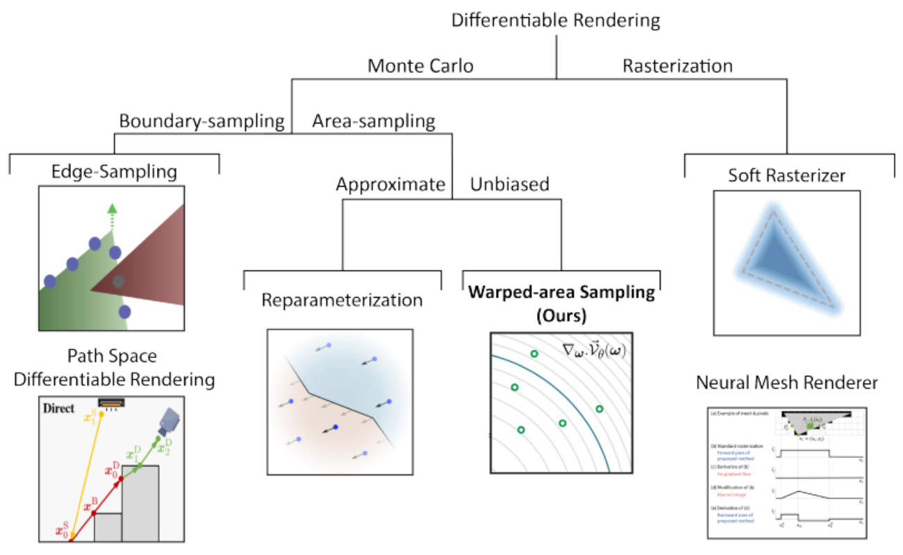

# Unbiased Warped-Area Sampling for Differentiable Rendering

## 0 Abstract

我们将散度定理应用于渲染积分的导数，将边界积分转换成面积分。我们将转换后的面积分重写为适合蒙特卡洛渲染的形式。然后，我们开发了一种高效的蒙特卡洛采样算法来解决面积分。我们的方法可以很容易地插入到传统的路径跟踪器中，并且不需要专门的数据结构来进行边界采样。
We apply the divergence theorem to the derivative of the rendering integral to convert the boundary integral into an area integral. We rewrite the converted area integral to a form that is suitable for Monte Carlo rendering. We then develop an efficient Monte Carlo sampling algorithm for solving the area integral. Our method can be easily plugged into a traditional path tracer and does not require dedicated data structures for sampling boundaries.

## 1 Introduction

可微渲染--计算光传输方程相对于场景参数的导数的任务，如相机位置、三角形网格位置和纹理参数。
Differentiable rendering -- the task of computing derivatives of the light transport equation with respect to scene parameters such as camera position, triangle mesh positions, and texture parameters.

可见性引入的不连续性构成了可微渲染的核心挑战，因为其导数的度量为零，不能用传统的蒙特卡洛方法进行采样。
The discontinuities introduced by visibility pose a central challenge to differentiable rendering because their derivatives have measure zero and cannot be sampled by traditional Monte Carlo methods.

- **光栅化**。许多确定性的可微光栅化器对可见度进行了近似处理，忽略了阴影和全局照明等高阶传输。
    **Rasterization**. Many deterministic differentiable rasterizers approximate visibility and ignore higher-order transport such as shadow and global illumination.
- **边界采样**。这些方法明确地整合了发生在物体轮廓的不连续性。它们可以计算出与场景参数有关的像素颜色的无偏梯度，同时考虑到高阶传输。
    **Boundary sampling**. These methods explicitly integrate over the discontinuities that occur at object silhouettes. They can compute unbiased gradients of pixel colors with respect to the scene parameters, while taking higher-order transport into consideration.
- **区域采样**。通过在单向路径追踪器内追踪辅助射线，对区域而不是轮廓进行采样，并使用启发式方法检测轮廓。然后他们重新参数化积分，通过旋转积分域来消除不连续性。
    **Area sampling**. By sampling the area instead of the silhouette, through tracing auxiliary rays inside a unidirectional path tracer, and detecting silhouettes using heuristics. They then reparameterize the integral to eliminate discontinuities by rotating the integration domain.

