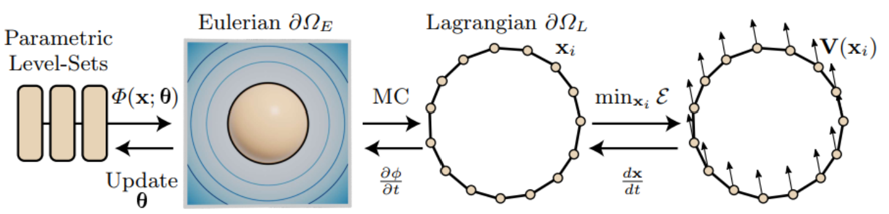

# A Level Set Theory for Neural Implicit Evolution under Explicit Flows
## 0 Abstract
我们提出了一个把为三角形网格定义的形变操作应用到这样的隐式表面上的框架。这些操作可以看作在显式表面上诱导即时流场的能量最小化问题。
We present a framework that allows applying deformation operations defined for triangle meshes onto such implicit surfaces. Several of these operations can be viewed as energy-minimization problems that induce an instantaneous flow field on the explicit surface.

## 1 Introduction
例如，在逆向渲染的情况下，与为隐式曲面设计的渲染器相比，三角形网格的可微渲染器更快，更准确，还可以处理更复杂的光传输效果。
For instance, in case of inverse rendering, differentiable renderers for triangle meshes are a) faster, b) more accurate, and c) can handle more complex light-transport effects, in comparison to the renderers designed for implicit surfaces.

同样，在计算和内存需求方面，用于表面平滑和变形等应用的几何处理算法比用于神经隐式曲面的算法要优越得多。
Similarly, geometry processing algorithms for applications like surface smoothing and deformation are vastly superior in terms of compute and memory requirements than the ones developed for neural implicit surfaces.

一些基于网格的算法定义了一个使用梯度下降来解决的能量最小化问题；优化器用于更新几何图形的梯度可以视为类似于应用于表面的即时显式流场（$\mathbf{V}$）。具有这种流场的表面的形变取决于几何表示。
Several mesh-based algorithms define an energy-minimization problem that is solved using gradient descent; the gradients used by the optimizer to update the geometry can be viewed as analogous to an instantaneous explicit flow-field ($\mathbf{V}$) applied on the surface. Deformation of a surface with such a flow field depends on the geometry representation.

Lagrange 表示包括将曲面显式地跟踪为点（$\mathbf{x}$）和连接（如三角形）的集合。点集是离散的，连通性是静态的，这使得优化相对简单；我们可以在每个点分别对场进行积分（更新顶点 $\mathbf{x}\to\mathbf{x}’$)。但是曲面分辨率的优化不是简单的，而且对于涉及拓扑结构未知的曲面的问题也会变得笨拙。
The Lagrangian representation involves tracking the surface explicitly as a set of a points ($\mathbf{x}$) and connections (like triangles). The point-set is discrete and the connectivity is static, which keeps the optimization relatively simple; we can separately integrate the field at each point (update vertices $\mathbf{x}\to\mathbf{x}’$). But optimization of the resolution of the surface is non-trivial and can also get unwieldy for problems which involve surfaces with unknown topology.

可以使用 Euler 表示。空间中的每个点都有一个与之相关的对象属性 $\phi$，比如到表面的距离或它在封闭体积中的占用率。这里的曲面隐含地定义为动态连通性；在优化过程中可以平滑地改变拓扑结构。通常，$\phi$ 仅在离散体素网格上定义，并且需要对不在网格上的点进行插值。这里，对表面进行即时更新更加复杂，因为它需要更改大量点的 $\phi$ 值。神经隐式是 Euler 表示的连续变体。将流场应用于这样的函数并非简单，因为需要在参数（$\theta$）空间中进行更新，而不是直接将 $\phi$ 更新为 $\phi’$。
Eulerian descriptions can be used. Each point in space has an object-property $\phi$ associated with it, like the distance from the surface or its occupancy inside the enclosed volume. The surface here is implicitly defined with dynamic  connectivity; one can smoothly vary the topology during optimization. Canonically, $\phi$ is defined only on a discrete voxel-grid and needs to be interpolated for points off the grid. Here, making instantaneous updates to the surface is more involved as it requires changing $\phi$ values for a large set of points. A neural implicit is a continuous variant of an Eulerian representation. Applying a flow field to such functions is non-trivial as updates are required in the parameter ($\theta$) space as opposed to directly updating $\phi$ to $\phi’$.

该方法包括三个重复步骤：
Our method comprises of three repeating steps:

1. 使用不可微曲面提取方法（如 Marching Cubes 或 Sphere Tracing）获得与神经隐式相对应的 Lagrange 表示；
    A non-differentiable surface extraction method like Marching Cubes or Sphere Tracing is used to obtain a Lagrangian representation corresponding to a neural implicit;
2. 使用基于网格的算法在显式表面上推导流场；
    A mesh-based algorithm is used to derive a flow field on the explicit surface;
3. 使用相应的 Euler 流场来演化隐式几何。
  A corresponding Eulerian flow field is used to evolve the implicit geometry.

以往的方法是利用 Lagrange 表示的可微分提取思想来处理 Euler 表面上基于网格的能量函数的问题。结果表明，这些方法不符合水平集理论。
Previous methods approach the problem of using mesh-based energy functions on Eulerian surfaces with the idea of differen- tiable extraction of Lagrangian representations. We show these methods are not in accordance with the level-set theory.

我们的方法更正式地与理论联系在一起，我们通过对三个不同问题设置的实验观察来验证它：
Our method is more formally connected to the theory and we validate it with experimental observations made on three diverse problem settings:

1. 基于曲率的形变，我们展示了比以前的方法更精确的表面平滑和平均曲率流；
    Curvature-based deformation, where we demonstrate more accurate surface smoothing and mean-curvature flow than previous methods;

2. 几何的逆渲染，其中我们显示从多视图图像中精确恢复高亏格形状，没有物体掩模
    Inverse rendering of geometry, where we show accurate recovery from multi-view images for high-genus shapes without object masks as in;

3. 用户定义的形状编辑，其中隐式曲面变变比以前的工作快 60 倍。

  User-defined shape editing, where the implicit surface is deformed $60\times$ faster than previous work.
## 2 Related Work
## 3 Background
|    Symbols       | Descriptions |
| :--------------: | :----------: |
| $\partial\Omega$ | a closed surface of arbitrary topology evolving with respect to time |
| $t$ | time |
| $\partial\Omega_L=\{\mathbf{x}_i\mid\mathbf{x}_i\sim\partial\Omega,i\in\{1,\dots,k\}\}$ | a Lagrangian representation of this surface with a finite set of $k$ points in $\mathbb{R}^3$ |
| $\phi:\mathbb{R}^3\mapsto\mathbb{R}$ | a family of level sets, non-parametric, SDF |
| $\Phi$ | parametric level sets, |
| $\partial\Omega_E=\{\mathbf{x}\mid\phi(\mathbf{x})=0\}$ | the zero iso-contour of which represents the surface |
### Parameterizing $\phi$
我们使用 SIREN 作为选择的参数函数，尽管我们的方法对网络参数化是无关的。网络在静止状态（$t = 0$）近似地充当 SDF，但随着曲面的演化，可能保留不住 SDF 属性。
We use SIREN as the parametric function of choice, although our method is agnostic to the network parameterization. The network acts approximately as an SDF at the rest state ($t = 0$), but may not retain the SDF property as the surface evolves.
## 4 Method
使用 Marching Cubes，从用网络参数 $\theta$ 编码的欧拉表示 $\partial\Omega_E$ 中提取出拉格朗日曲面 $\partial\Omega_L$。用梯度下降最小化定义在 $\partial\Omega_L$ 上的能量函数 $\mathcal{E}$ 。优化器的梯度一起作为表面点 $\mathbf{x}$ 上的流场 $\mathbf{V}$，用于使用水平集方程演化非参数 $\phi$。表面上的 $\phi$ 值作为参考来更新网络的参数 $\theta$。
Using Marching Cubes, a Lagrangian surface $\partial\Omega_L$ is extracted from an Eulerian representation $\partial\Omega_E$ encoded in the network parameters $\theta$. An energy function $\mathcal{E}$ is defined on $\partial\Omega_L$ which is minimized using gradient-descent. The gradients of the optimizer together act as a flow-field $\mathbf{V}$ on the surface points $\mathbf{x}$, which is used to evolve the non-parametric $\phi$ using the level set equation. The values of $\phi$ on the surface act as references to update the parameters $\theta$ of the network.
### 4.1 Lagrangian Deformation
使用空间梯度 $\dfrac{\partial\mathcal{E}}{\partial\mathbf{x}}$ 更新曲面。从物理学的角度来说，这些梯度诱导了一个即时流场 $\mathbf{V}(\mathbf{x})$，可以通过积分以下常微分方程（ODE）来演化表面:
The surface is updated using spatial gradients $\dfrac{\partial\mathcal{E}}{\partial\mathbf{x}}$. Through the lens of physics, these gradients induce an instantaneous flow field $\mathbf{V}(\mathbf{x})$, which can be used to evolve the surface by integrating the following ordinary differential equation (ODE):
$$
\frac{\mathrm{d}\mathbf{x}}{\mathrm{d}t}=-\frac{\partial\mathcal{E}}{\partial\mathbf{x}}\to\mathbf{V}(\mathbf{x})\tag{2}
$$

在数值上，这可以使用前向欧拉法 $\mathbf{x}^{t+1}=\mathbf{x}^{t}+\Delta{t}\mathbf{V}^{t}(\mathbf{x})$ 更新。如果点的连通性保持不变，这很容易实现。
Numerically, this can be done using forward-Euler steps $\mathbf{x}^{t+1}=\mathbf{x}^{t}+\Delta{t}\mathbf{V}^{t}(\mathbf{x})$. This is easy to accomplish if the connectivity of the points remains static. 

在这里，对于使用梯度下降解决的优化问题，$\Delta{t}$ 相当于学习率。
Here, in case of optimization problems solved using gradient descent, $\Delta{t}$ is equivalent to the learning rate.
### 4.2 Eulerian Deformation
为了避免与 Lagrange 形变相关的拓扑复杂性，我们可以定义一个相应的 Euler 形变场。
To avoid the topological complications associated with Lagrangian deformations, we can instead define a corresponding Eulerian deformation field.
$$
\begin{align*}
\frac{\mathrm{d}\phi(\mathbf{x})}{\mathrm{d}t}=\frac{\partial\phi}{\partial{t}}+\frac{\partial\phi}{\partial\mathbf{x}}\frac{\partial\mathbf{x}}{\partial{t}}&=\frac{\partial\phi}{\partial{t}}+\nabla\phi\cdot\mathbf{V}(\mathbf{x})=0\\
\frac{\partial\phi}{\partial{t}}&=-\nabla\phi\cdot\mathbf{V}(\mathbf{x})
\end{align*}\tag{3}
$$

这个偏微分方程（PDE）有时被称为水平集方程。
This partial differential equation (PDE) is sometimes referred to as the level-set equation.

首先，对于每个时间步长 $t$，我们使用 MC 从 $\Phi$ 中提取一个 Lagrange 表面表示 $\partial\Omega_L^t$。根据任务，在 $\partial\Omega_L^t$ 上定义一个能量函数 $\mathcal{E}$（例如，逆渲染的光度误差）。假设 $\mathcal{E}$ 是可微的，我们对于每个顶点 $\mathbf{x}_i\in\partial\Omega_L$ 计算 $\dfrac{\partial\mathcal{E}}{\partial\mathbf{x}}=-\mathbf{V}^t(\mathbf{x})$。有了 $\mathbf{V}(\mathbf{x})$ 的流场，我们就像在非参数情况下使用正向 Euler 法那样更新水平集函数。
First, for each time step $t$, we extract a Lagrangian surface representation $\partial\Omega_L^t$ from $\Phi$ using MC. Depending on the task at hand, an energy function $\mathcal{E}$ (e.g., photometric error for inverse rendering) is defined on $\partial\Omega_L^t$. Assuming $\mathcal{E}$ is differentiable, we compute $\dfrac{\partial\mathcal{E}}{\partial\mathbf{x}}=-\mathbf{V}^t(\mathbf{x})$ for each vertex $\mathbf{x}_i\in\partial\Omega_L$. With the flow field $\mathbf{V}(\mathbf{x})$, we update the level-set function as we would in the non-parametric case using forward-Euler steps:
$$
\phi^{t+1}=\Phi^{t}-\Delta{t}\nabla\Phi^t\cdot\mathbf{V}^t\tag{4}
$$
这里的时间步长 $\Delta{t}$ 是一个参数，取决于流场的动态。如果 $\mathbf{V}$ 是高度非线性的，就需要采取较小的步长（即 $\Delta{t}$ 较小），而对于简单的场，较大的 $\Delta{t}$ 值应该足够了。
The time step $\Delta{t}$ here is a parameter which is dependent on the dynamics of the flow-field. If $\mathbf{V}$ is highly non-linear, taking smaller steps (i.e., $\Delta{t}$ is small) is required, while for a simple field, larger values of $\Delta{t}$ should suffice.

对于每个时间步骤，我们把非参数 $\phi^{t+1}$ 的值作为参考，并相应地更新 $\Phi$ 的参数。这是通过梯度下降最小化以下目标来实现的：
For each time step, we take the values of non-parametric $\phi^{t+1}$ as the reference and update the parameters of $\Phi$ accordingly. This is achieved by using gradient descent to minimize the following objective:
$$
\min_{\theta}J(\theta)=\frac{1}{|\partial\Omega_L|}\sum_{\mathbf{x}\in\partial\Omega_L}\|\phi^{t+1}(\mathbf{x})-\Phi(\mathbf{x};\theta)\|^2\tag{5}
$$
由于每个时间步长的曲面更新都很小，因此所需的下降步数为 $10^2$ 的数量级。
Since the surface updates are small for each time step, the number of descent steps required is in the order of $10^2$.

## 5 Theoretical Comparisons

### 5.1 Differentiable Iso-Surface Extraction

**Result 1**

可微等值面提取需要一个单步的梯度下降来最小化水平集目标函数 $J$（等式 5）。
Differentiable Iso-Surface Extraction takes a single gradient descent step to minimize the level-set objective function $J$ (Equation 5).

MeshSDF 定义了一个在一个三角形网格上的损失函数 $\mathcal{L}$，三角形网格是使用 Marching Cubes 从一个用 MLP 表达的 SDF 中提取的。他们使用 MLP $\Phi(\mathbf{x};\theta,\mathbf{z})$，以描述形状的潜在编码 $\mathbf{z}$ 为条件。他们使用 $\mathcal{L}$ 更新潜在编码 $\mathbf{z}$，这与我们为无条件 $\Phi$ 更新 $\theta$ 的目标不同。为了澄清这一区别，我们用 MeshSDF$^\theta$ 来表示我们更新 $\theta$ 的变体。
MeshSDF defines a loss function $\mathcal{L}$ on a triangle mesh extracted using Marching Cubes from an SDF parameterized with an MLP. They use an MLP $\Phi(\mathbf{x};\theta,\mathbf{z})$ conditioned on a latent-code $\mathbf{z}$ characterizing the shape. Using $\mathcal{L}$ they update the latent-code $\mathbf{z}$, which is different from our goal of updating $\theta$ for an unconditional $\Phi$. To clarify this distinction, we use MeshSDF$^\theta$ to denote our variant which updates $\theta$.
$$
\frac{\partial\mathcal{L}}{\partial\theta}=\sum_{\mathbf{x}\in\partial{\Omega}_L}\frac{\partial\mathcal{L}}{\partial\mathbf{x}}\frac{\partial\mathbf{x}}{\partial\Phi}\frac{\partial\Phi}{\partial\theta}\tag{6}
$$
The parameters of the MLP are then updated as:
$$
\begin{align*}
\theta&\gets\theta-\lambda\frac{\partial\mathcal{L}}{\partial\theta}\\
&=\theta-\lambda\sum_{\mathbf{x}\in\partial{\Omega}_L}\frac{\partial\mathcal{L}}{\partial\mathbf{x}}\frac{\partial\mathbf{x}}{\partial\Phi}\frac{\partial\Phi}{\partial\theta}\\
&=\theta-\lambda\sum_{\mathbf{x}\in\partial{\Omega}_L}(-\mathbf{V})\cdot(-\nabla\Phi)\frac{\partial\Phi}{\partial\theta}\\
&=\theta-\lambda\sum_{\mathbf{x}\in\partial{\Omega}_L}\mathbf{V}\cdot\nabla\Phi\frac{\partial\Phi}{\partial\theta}
\end{align*}\tag{7}
$$
我们也可以用梯度下降公式 5 的方法更新 $\theta$：
We can also update $\theta$ using the objective function defined in Equation 5 using gradient descent:
$$
\begin{align*}
\theta&\gets\theta-\lambda\frac{\partial\mathcal{L}}{\partial\theta}\\
&=\theta-\lambda\sum_{\mathbf{x}\in\partial{\Omega}_L}2(\phi^{t+1}(\mathbf{x})-\Phi(\mathbf{x};\theta))\left(-\frac{\partial\Phi}{\partial\theta}\right)\\
&=\theta-\epsilon\sum_{\mathbf{x}\in\partial{\Omega}_L}\mathbf{V}\cdot\nabla\Phi\frac{\partial\Phi}{\partial\theta}\quad(\text{Eq. 4})
\end{align*}\tag{8}
$$
我们得出结论，MeshSDF$^\theta$ 中的优化效果是采取单步梯度下降来最小化 $J$。
We conclude that the optimization in MeshSDF$^\theta$ has the effect of taking a single gradient descent step to minimize $J$.

**Result 2**

可微等值面提取并不像流场所决定的那样传播表面前沿。
Dfferentiable iso-surface extraction does not propagate the surface front as dictated by the flow field.

考虑在法向上以恒定的速度 $\beta$ 传播的表面前部。相应的 Euler 形变在整个表面上是恒定的。
Consider the surface-front propagating with a constant speed $\beta$ in the direction of the normal. The corresponding Eulerian deformation is constant across the surface:
$$
\frac{\partial\phi}{\partial{t}}=-|\nabla\phi|\beta=-\beta\tag{9}
$$
假设 $\phi$ 是 SDF。

With the same flow field, we can estimate the instantaneous change in $\Phi$ (parametric) for MeshSDF$^\theta$ as:
$$
\frac{\partial\Phi}{\partial{t}}=\frac{\partial\Phi}{\partial\theta}\frac{\partial\theta}{\partial{t}}=\frac{\partial\Phi}{\partial\theta}\frac{\partial\theta}{\partial{t}}
$$

