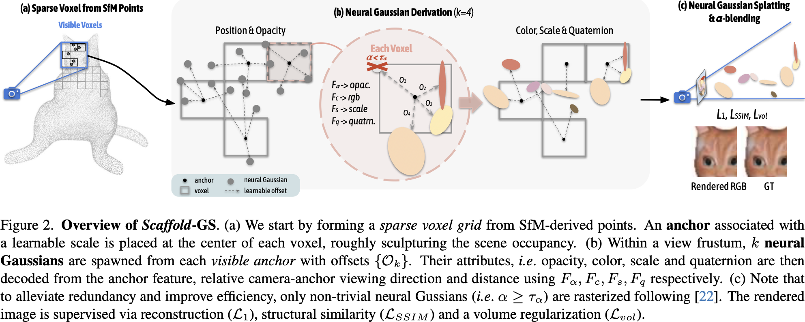
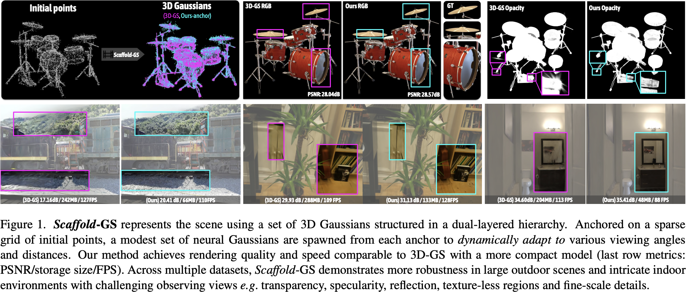

# 2023 Scaffold-GS: Structured 3D Gaussians for View-Adaptive Rendering

## Claim

- 利用了场景的结构信息，用 SfM 生成的点云来初始化锚点，用来约束 GS 球的分布，使得场景更加结构化，层次化。
- 在视锥内，实时去预测 GS 球的视角相关和距离相关的属性，让新视角合成的结果更加准确。
- 提出了锚点随着训练迭代的变化策略。
- 可以减少 GS 球数量，提高渲染效率，但保持渲染质量。

## Motivation

- GS 在训练时候会尽可能拟合训练视角，因此产生大量的 GS 球去拟合训练视角的细节。
- 由于没有对于场景结构的约束，GS 球忽视了场景的结构信息，导致了大量的 GS 球被分配到了同一个区域。
- 高阶的视角相关的效果已经被嵌入了 GS 球的参数中，在新视角下这些效果的表现会变得不准确。

## Method

### Anchor Point Initialization

1. 把 SfM 生成的点云放到场景中，用来初始化格点。格点的位置是由 SfM 点云取整得到的，格点的大小是预先设定的。
2. 格点中心当作锚点，并且放置了 32 维的 local texture feature，3 维的 scaling factor，k 个 3 维的 offset vector。Local texture feature 还是多分辨率的。
3. 计算相机到锚点的距离、到锚点的视角，过 MLP 得到 local texture feature 的权重。

### Neural Gaussian Derivation

Local texture feature 和距离、视角一起过 MLP 来预测 k 个 GS 球的参数。

### Anchor Points Refinement

1. 对于每个格子，计算 N 个训练阶段的平均梯度，如果大于某个阈值，就生成新的锚点。
2. 对于每个格子，计算 N 个训练阶段的累计不透明度，如果小于某个阈值，就删除锚点。

## Result

