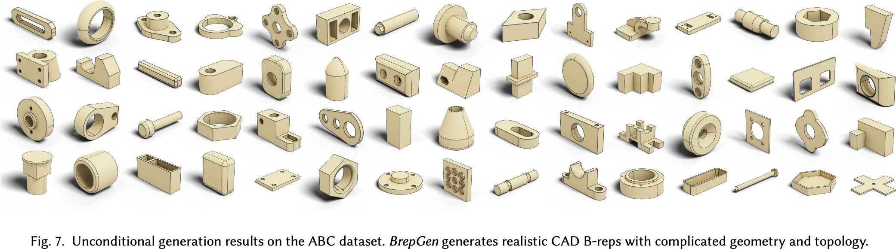

# BrepGen: A B-rep Generative Diffusion Model with Structured Latent Geometry

## Claim

BrepGen 是以边界表示 (boundary representation; B-rep) 形式生成 3D CAD 模型的生成模型。

- BrepGen 基于一个结构化编码几何表示，其树形结构，以及节点重复，将 B-rep 的几何和拓扑信息统一到一个形式下。
- BrepGen 的网络是 LDM-DiT，可以生成任意形式的参数曲面和曲线。
- 提出了一个新的 B-rep 数据集：Furniture B-rep Dataset。

## Motivation

几乎所有的人造物体都是从 CAD 模型开始的，B-rep 是最常见的 CAD 模型表示形式。B-rep 中，面是参数曲面，被边界曲线包围；边是参数曲线，被顶点连接。

- B-rep 包含的参数曲面和曲线的种类繁多，而且点线面的连接关系也很复杂。

## Method

### Structured Latent Geometry

Face 可以用 $s: \mathbb{R}^2 \mapsto \mathbb{R}^3$ 的参数曲面描述。
- Face 上的形状特征 $F_s \in \mathbb{R}^{N \times N \times 3}$ 是在 UV 上均匀采样后得到的。
- $F_s$ 过 VAE 得到 $F_z \in \mathbb{R}^{48}$。
- Face 上的位置特征 $F_p \in \mathbb{R}^{6}$ 是其 AABB。

Edge 可以用 $c: \mathbb{R} \mapsto \mathbb{R}^3$ 的参数曲线描述。
- Edge 上的形状特征 $E_s \in \mathbb{R}^{N \times 3}$ 是在 U 上均匀采样后得到的。
- $E_s$ 过 VAE 得到 $E_z \in \mathbb{R}^{12}$，和两个端点合并得到 $E_{zv} \in \mathbb{R}^{18}$。
- Edge 上的位置特征 $E_p \in \mathbb{R}^{6}$ 是其 AABB。

Vertex 本身就是 $\mathbb{R}^3$ 的点。

节点重复（Node Duplication）的作用是：
1. 编码点线面之间的拓扑关系。
2. 把线和面的数量补到一个固定的数值。

节点重复是通过两个操作做到的：
1. Mating：有共边或者共点就复制一份。这样就有了面-线-点的从属关系，即树形结构。
2. Association：随机把一个子节点复制一次。这样适合于网络的固定输出，比补 0 好。

### Shape Geometry VAE & Latent Diffusion Module

Face 和 Edge 的 VAE 是分开的，$N = 32$。

LDM 基于 DDPM。由于一次生成整个 B-rep 的几何是不现实的，所以采用了逐步生成面、边、点的方法。按照生成的顺序分别有 4 个 LDM：$F_p$ 去噪器、$F_z$ 去噪器、$E_p$ 去噪器、$E_{zv}$ 去噪器。这四个 LDM 是分开训练的，Loss 都是 L2。

## Results

