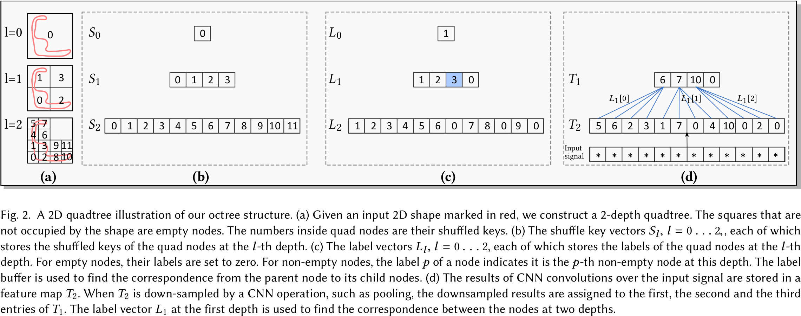

# O-CNN: Octree-based Convolutional Neural Networks for 3D Shape Analysis

## 1 Introduction

神经网络的输入需要的是高度格式化的输入，对于 3D 的模型，特别是网格和点云模型，转换成格式化的输入特别麻烦。
1. 转成体积的缺点是其存储消耗随着分辨率的立方增加。
2. 转成流形的缺点是对噪声和畸变比较敏感，需要计算流形相关的特征（曲率）。
3. 转成多视角的图片的缺点是无法预先确定视角的位置和数量，来避免模型的自遮挡。
相对的，OCNN 的八叉树的存储和计算随着八叉树的深度的平方增加，而且是多分辨率的。

OCNN 具体步骤是
1. 构建 3D 模型对应的八叉树。
2. 把八叉树最底层的节点内的平均法向量取出来，做 3D CNN 的输入，转化为特征。
3. Pooling 后，特征下采样，放到父节点中，做下一层 CNN 的输入。直到最上层。

八叉树的存储和计算都可以在 GPU 上操作，并且适用于各种 3D CNN 类型。

## 3 3D CNNS on Octree-based 3D Shapes

| Symbols |  Descriptions  |
| :-----: | :------------: |
|   $l$   |      当前深度      |
|   $d$   |      最大深度      |
|  $S_l$  | Shuffle Key 数组 |
|  $L_l$  |    Label 数组    |
|  $T_l$  |      特征数组      |

### 3.1 Octree for 3D CNNs

八叉树建造步骤如下
1. 构造八叉树。缩放到 AABB 中，以 BFS 的顺序构造八叉树。其深度是预先设定的。
2. 计算 Shuffle Key。第 $l$ 层的 Shuffle Key是 $3l$ 长度的**位串** $x_1y_1z_1\dots x_ly_lz_l$，从八叉树节点的整数坐标构造而来，可以用 32 位整数存下。然后每一层都按照 Shuffle Key 的升序来排序八叉树节点，排序完的 Shuffle Key 也存在 $S_l$ 之中。
3. 计算标签。为了下采样的时候，能够快速对应上下级节点，需要计算标签。每一层的每个非空节点从 1 开始，按照在 $S_l$ 之中的顺序依次标号，空节点用 0 占位。结果存在 $L_l$ 之中。排序完的 Shuffle Key 保证了非空节点的子节点们都是排列在一起的，可以用 $8\times(L_l[x]-1)$ 索引到。
4. 计算 CNN 输入。非空节点用最底层的八叉树节点的平均法向量、颜色作为特征；空节点用 0 占位。
5. 计算 CNN 输出。每一层的 CNN 的输出都放在 $L_l$ 中。

训练 CNN 时候同一批次的三维物体，它们的八叉树并不相同。我们将这些八叉树合并为一个超级八叉树。对于每个深度为 $l$ 的八叉树，将所有三维物体的属性向量（$S_l, L_l, T_l$）连接到超级八叉树的 $S_l^∗, L_l^*, T_l^∗$。然后更新 $S_l^∗$ 中的洗牌键，使用每个洗牌键的最高 8 位来存储对象索引。更新 $L_l^*$ 表示整个超八叉树中每个非空八叉树的索引。

### 3.2 CNN Operations on the Octree

