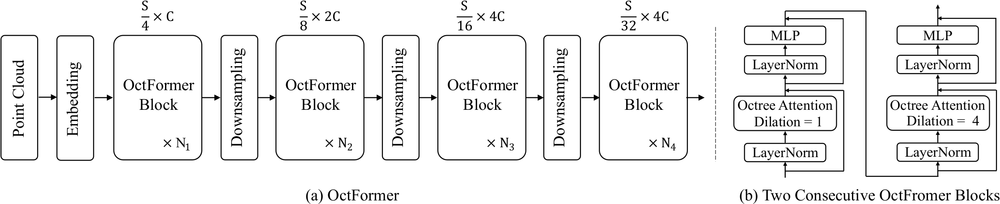

# OctFormer: Octree-based Transformers for 3D Point Clouds

## 0 Abstraction

OctFormer 目标是 3D 点云的理解问题，可以作为主干网络，而且计算复杂度随输入变化是线性的。作者观察到注意力机制并不在意局部窗口的形状，因此他利用了八叉树的排序打乱键来将点云划分为**包含相同数量点**的局部窗口，同时允许窗口形状自由变化。作者还引入了扩展的八叉树注意力机制以进一步扩展感受野。

## 1 Introduction

Transformer-based 点云理解问题当前的难点：
- 和 CNN 在较大的数据集上效果接近了，但是计算量太大了。
- 利用局部窗口减小计算量，但是局部窗口内点的数量变化很大，影响 GPU 效率。
- 将点云抽象成降采样的特征图又降低了网络的能力。

作者观察到
- 注意力机制并不在意局部窗口的形状，因此局部窗口不必是相同大小的立方体，并且能控制不同的局部窗口内点的数量相近。因此可以直接用 PyTorch 实现，而不是自定义 CUDA 算子。
- 用并行算法构建的八叉树节点已经排列成 Z 型顺序了，因此空间中相近的点在内存中也比较相近。作者按照八叉树节点的顺序将特征存储在张量中。在每个窗口中，作者填充了一些零值，以使张量的空间尺寸能够被每个窗口中指定的点数整除，然后可以通过简单地调整张量的形状来高效地生成窗口划分，几乎不增加成本。
- 为了进一步增加 OctFormer 的感受野，作者引入了一种带有空间维度上膨胀划分的扩展八叉树注意力机制，这也可以通过张量的 reshape 和转置来高效实现。

## 3 Octree-Based Transformers

#### 3.0.1 Overview

输入点云，归一化，转化成八叉树。八叉树的每个**非空叶节点**存储的特征是点的平均坐标、颜色、法向。转化八叉树的节点的存储特征，先降采样，随后变成高维向量。输入到 OctFormer 的编码器里面，生成 FPN，应用到下游任务。

### 3.1 Octree Attention

#### 3.1.1 Attention

设输入的 token 数量为 $N$，
$$
\mathrm{Attention(X)}=\mathrm{softmax}\left((XW_Q)(XW_K)^T/\sqrt{D}\right)(XW_V)
$$
计算量 $O(N^2)$ 太大了，用 Window Attention 来只关注**不重叠的局部窗口**。假设局部窗口的数量是 $K$，那么计算量就变成了 $O(NK)$。与图像的 Window Attention 不同，点云的 Window Attention 的每个窗口中的点的数量过于地不平均了，影响计算。因此采用含有差不多点的数量但不同大小的窗口。

#### 3.1.2 Octree

首先是 GPU 并行算法建八叉树，并且同一深度的节点用定义的 key 排序
$$
\mathrm{key}(x,y,z)=x_1y_1z_1x_2y_2z_2\dots x_dy_dz_d
$$
$d$ 是节点的深度。这样子产生了 Morton Code 的排序。好处是，八叉树同属一个父节点的节点们，更一般地说，同属一个子树的八叉树节点按照 Z 顺序毗邻存储在内存中。

#### 3.1.3 Octree Attention

先将所有的非空八叉树节点的特征堆叠成一个 2D 张量 $X$，大小为 $(N,C)$。然后补 0 得到 $\hat{X}$，大小为 $(\hat{N},C)$，使得 $\hat{N}$ 可以被 $K=32$ 整除。然后把 $\hat{X}$ 形变成 $(B,K,C)$，$B=\hat{N}/K$。然后就可以在第 2 个维度上做注意力。

显然这样的 Window Attention 局限了 Attention 的作用范围，因此要做更加全局的注意力。作者称这样的注意力叫 Dilation Attention。Window Attention 是 $D=1$ 时候的 Dilation Attention。$D>1$ 时候，补 0 得到 $\tilde{X}$，大小为 $(\tilde{N},C)$，使得 $\tilde{N}$ 可以被 $K\times D$ 整除。然后把 $\tilde{X}$ 形变成 $(\tilde{B},K,D,C)$，$\tilde{B}=\tilde{N}/(K\times D)$，再转置 $(\tilde{B},D,K,C)$，再压平 $(\tilde{B}\times D,K,C)$。然后就可以在第 2 个维度上做注意力。Dilation Attention 作用就是让局部窗口关注到不同的区域。

> 我觉得可能 Kaiming 的 ViTDet 的方法更好。

#### 3.1.4 Positional Encoding

用到了相对 PE。

#### 3.1.5 Summary

```python
def octree_attention(x: torch.Tensor, D = 1, K = 32) -> torch.Tensor:
    # Conditional positional encoding
    x = x + batch_norm(depth_wise_conv(x))

    # Window partition
    N, C = x.shape
    Nz = (k * D) - N % (K * D)
    x = torch.cat([x, x.new_zeros(Nz, c)]) # [N + Nz, C]
    x = x.reshape(-1, K, D, C).transpose(1, 2).flatten(0, 1) # [B * D, K, C]

    # Attention mask
    m = torch.cat([x.new_zeors(N, dtype=bool), x.new_ones(Nz, dtype=bool)]) # [N + Nz]
    m = m.reshape(-1, K, D).transpose(1, 2).flatten(0, 1) # [B * D, K]

    # Attention
    x = torch.nn.MultiHeadAttention(...)(q=x, k=x, v=x, key_padding_mask=m) # [B * D, K, C]

    # Window unpartition
    x = x.reshape(-1, D, K, C).transpose(1, 2).reshape(-1, C) # [N + Nz, C]
    return x[:N]
```

### 3.2 Network Details



- 初始八叉树的分辨率是 $S$，每次过 Encoder Block 将分辨率除 2，特征维度乘 2。
- Embedding 不是单纯的一个卷积，而是多个小卷积的组合，每个小卷积之间用 Batch Norm。
- Encoder Block 包含两个 Octree Attention，第一个是 Window Attention，第二个是 Dilation Attention。
- 降采样用卷积，所有降采样的结果拼成一个 FPN。
- $C=96$, $N_{i}=\{2,2,18,2\}$, $H=16$, $K=32$。

## 4 Experimrnts

### 4.1 3D Semantic Segmentation

#### 4.1.2 Settings

600 epoches, 16 batch size, 0.006 initial learning rate, 360 and 480 decrease by 10, 4 * RTX 3090, 15 hours.

点云首先缩放然后再生成 11 层的 Octree，数据增强有随机旋转，拉伸，弹性形变，球形 mask。

### 4.2 3D Object Detection

## 5 Conclusion

#### Small-Scale Dataset

在小型数据集上的效果中等水平，可以用预训练来解决。

#### Positional Encoding

现在的 CPE 依赖于 Octree 的结构，需要设计更好的。

#### Cross Attention

用 Cross Attention 加入额外的信息。


