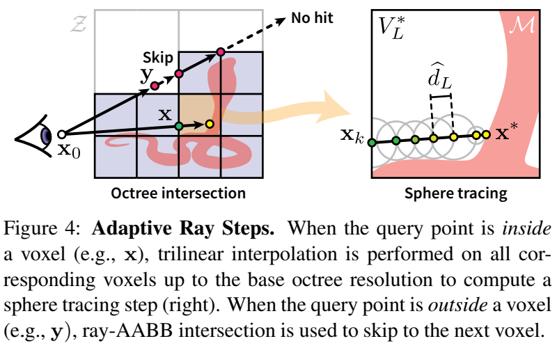

# Neural Geometric Level of Detail Real-time Rendering with Implicit 3D Shapes

## 0 Abstract

我们使用一个基于八叉树的特征体来表示隐含的表面，该特征体能适应具有多个离散细节级别（LOD）的形状，并能通过 SDF 插值实现连续的 LOD。
We represent implicit surfaces using an octree-based feature volume which adaptively fits shapes with multiple discrete levels of detail (LODs), and enables continuous LOD with SDF interpolation.

## 1 Introduction

直接渲染和探测神经 SDF 通常依赖于球体追踪，这是一种求根算法，可能需要对每个像素进行数百次 SDF 求值才能收敛。
Directly rendering and probing neural SDFs typically relies on sphere tracing, a root-finding algorithm that can require hundreds of SDF evaluations per pixel to converge.

我们的方法可以在不同尺度的几何体之间平滑地插值，并且可以在合理的内存占用下实时渲染。我们还使用了一个小型的 MLP，使球体追踪变得实用，但不牺牲质量和通用性。
Our method can smoothly interpolate between different scales of geometry and can be rendered in real-time with a reasonable memory footprint. We also use a small MLP to make sphere tracing practical, but without sacrificing quality or generality.

我们通过使用稀疏体素八叉树（SVO）来离散空间，并存储学习到的特征向量而不是有符号的距离值。这些向量可以通过浅层 MLP 解码为标量距离，使我们能够截断树的深度，同时继承经典方法（如 LOD）的优点。
We discretize the space by using a sparse voxel octree (SVO) and we store learned feature vectors instead of signed distance values. These vectors can be decoded into scalar distances using a shallow MLP, allowing us to truncate the tree depth while inheriting the advantages of classic approaches (e.g., LOD).

## 2 Related Work

### Level of Detail

### Neural Implicit Surfaces

### Neural Rendering for Implicit Surfaces

这些可微分渲染器与光线追踪算法无关；它们只要求与光线-表面交汇处有关的可微分性。
These differentiable renderers are agnostic to the ray-tracing algorithm; they only require the differentiability with respect to the ray-surface intersection.

## 3 Method

### 3.1 Neural Signed Distance Functions (SDFs)

### 3.2 Neural Geometry Levels of Detail

#### Framework

|               Symbols                |                         Description                          |
| :----------------------------------: | :----------------------------------------------------------: |
|            $\mathcal{Z}$             | a feature volume which contains a collection of feature vectors |
|      $\mathcal{B} = [-1, 1]^3$       |   a sparse voxel octree (SVO) spanning the bounding volume   |
|                 $V$                  |                       voxel in the SVO                       |
| $\mathbf{z}^{(j)}_V \in \mathcal{Z}$ |         a learnable feature vector (indexed by $j$)          |
|           $L\in\mathbb{N}$           |            a LOD for the geometry, or tree depth             |
|              $L_{\max}$              |                    he maximum tree depth                     |
|      $f_{\theta_{1:L_{\max}}}$       | decoder, a small MLP neural networks, **with parameters $\theta_{1:L_{\max}}$ for each LOD** |

只有当体素 $V$ 包含一个表面时，才会分配体素，使 SVO 变得稀疏。随着 SVO 中树的深度 $L$ 的增加，表面的离散度更细，允许重建质量随着内存的使用而扩展。
Voxels are allocated only if the voxel $V$ contains a surface, making the SVO sparse. As the tree depth $L$ in the SVO increases, the surface is represented with finer discretization, allowing reconstruction quality to scale with memory usage.


为了计算一个查询点 $\mathbf{x}\in\mathbb{R}^3$ 的 SDF，我们遍历树到 $L$ 层，找到所有包含 $\mathbf{x}$ 的体素 $V_{1:L}=\{V_1,\dots, V_L\}$。对于每个级别的 $\ell\in\{1,\dots, L\}$，我们通过三线插值 $\mathbf{x}$ 处体素的顶点特征，计算出每个体素的形状向量 $\psi(\mathbf{x};\ell,\mathcal{Z})$。我们将各层的特征相加，得到 $\mathbf{z}(\mathbf{x};L,\mathcal{Z})=\sum_{\ell=1}^{L}\psi(\mathbf{x};\ell,\mathcal{Z})$，并将它们传入具有 LOD 特定参数 $\theta_L$ 的 MLP。具体来说，我们计算 SDF 的方式为：
To compute an SDF for a query point $\mathbf{x}\in\mathbb{R}^3$ at the desired LOD $L$, we traverse the tree up to level $L$ to find all voxels $V_{1:L} = \{V_1,\dots, V_L\}$ containing $\mathbf{x}$. For each level $\ell\in\{1,\dots, L\}$, we compute a per-voxel shape vector $\psi(\mathbf{x};\ell,\mathcal{Z})$ by trilinearly interpolating the corner features of the voxels at $\mathbf{x}$. We sum the features across the levels to get $\mathbf{z}(\mathbf{x};L,\mathcal{Z})=\sum_{\ell=1}^{L}\psi(\mathbf{x};\ell,\mathcal{Z})$, and pass them into the MLP with LOD-specific parameters $\theta_L$. Concretely, we compute the SDF as:
$$
\hat{d}_L=f_{\theta_L}([\mathbf{x},\mathbf{z}(\mathbf{x};L,\mathcal{Z})])
$$

#### Level Blending

$$
\hat{d}_{\tilde{L}}=(\lfloor\tilde{L}\rfloor+1-\tilde{L})\hat{d}_L+(\tilde{L}-\lfloor\tilde{L}\rfloor)\hat{d}_{L+1}
$$

### 3.3 Training

我们通过联合训练每个 LOD 来确保 SVO 的每个离散水平 $L$ 代表有效的几何图形。我们通过计算每个级别的单个损失并将其在各级别中相加来实现这一目的：
We ensure that each discrete level $L$ of the SVO represents valid geometry by jointly training each LOD. We do so by computing individual losses at each level and summing them across levels:
$$
J(\theta,\mathcal{Z})=\mathbb{E}_{\mathbf{x},d}\sum_{L=1}^{L_{\max}}\|f_{\theta_L}([\mathbf{x},\mathbf{z}(\mathbf{x};L,\mathcal{Z})])-d\|^2
$$

### 3.4 Interactive Rendering

#### Sphere Tracing

典型的 SDFs 是在 $\mathbb{R}^3$ 的所有地方定义的。相比之下，我们的 SVO SDF 只对与表面几何形状相交的体素 $V$ 进行定义。在每帧的开始，我们首先进行光线-SVO 交叉（详情见下文），以获得每个分辨率 $\ell$ 上与光线相交的体素 $V$。
Typical SDFs are defined on all of $\mathbb{R}^3$. In contrast, our SVO SDFs are defined only for voxels $V$ which intersect the surface geometry. At the beginning of the frame we first perform a ray-SVO intersection (details below) to retrieve every voxel $V$ at each resolution $\ell$ that intersects with the ray.

|                 Symbols                  |                    Description                     |
| :--------------------------------------: | :------------------------------------------------: |
| $\mathbf{r}(t)=\mathbf{x}_0+t\mathbf{d}$ |                       a ray                        |
|      $\mathcal{V}_{l}(\mathbf{r})$       | the depth-ordered set of intersected voxels by ray |

#### Adaptive Ray Stepping



对于球体追踪迭代中的一条给定光线，我们对目标 LOD 级别 $L$ 中的体素进行光线-AABB 求交，以获得击中的第一个体素 $V^∗_L\in\mathcal{V}_L(\mathbf{r})$。如果 $\mathbf{x}_k\notin\mathcal{V}_L^∗$，我们将 $\mathbf{x}$ 推进到光线-AABB 交点。如果$\mathbf{x}_k\in\mathcal{V}_L^∗$，我们查询我们的特征体。我们递归检索所有父体素 $V^∗_\ell$，对应于较粗的层次$\ell\in\{1,\dots,L-1\}$，从而得到体素集合 $V_{1:L}^*$。然后，我们在每个节点上对三线插值的特征进行求和。
For a given ray in a sphere trace iteration $k$, we perform a ray-AABB intersection against the voxels in the target LOD level $L$ to retrieve the first voxel $V^∗_L\in\mathcal{V}_L(\mathbf{r})$ that hits. If $\mathbf{x}_k\notin\mathcal{V}_L^∗$, we advance $\mathbf{x}$ to the ray-AABB intersection point. If $\mathbf{x}_k\in\mathcal{V}_L^∗$, we query our feature volume. We recursively retrieve all parent voxels $V^∗_\ell$ corresponding to the coarser levels $\ell\in\{1,\dots,L-1\}$, resulting in a collection of voxels $V_{1:L}^*$. We then sum the trilinearly interpolated features at each node.

然后 MLP $f_{\theta_{L}}$ 产生一个向 $\mathbf{d}$ 方向移动的保守距离 $\hat{d}_L$，我们采取一个标准的球体追踪步骤：$\mathbf{x}_{k+1}\gets\mathbf{x}_k+\hat{d}_L\mathbf{d}$。
The MLP $f_{\theta_{L}}$ then produces a conservative distance $\hat{d}_L$ to move in direction $\mathbf{d}$, and we take a standard sphere tracing step: $\mathbf{x}_{k+1}\gets\mathbf{x}_k+\hat{d}_L\mathbf{d}$.

如果 $\mathbf{x}_{k+1}$ 现在处于空的空间，我们就沿着光线跳到 $\mathcal{V}_L(\mathbf{r})$ 的下一个体素，如果不在，就丢弃 $\mathbf{r}$。如果 $\mathbf{x}_{k+1}$ 位于体素内，我们就进行球体追踪步骤。这样重复进行，直到所有的光线都错过，或者达到停止标准，恢复一个命中点 $\mathbf{x}^*\in\mathcal{S}$。
If $\mathbf{x}_{k+1}$ is now in empty space, we skip to the next voxel in $\mathcal{V}_L(\mathbf{r})$ along the ray and discard the ray $\mathbf{r}$ if none exists. If $\mathbf{x}_{k+1}$ is inside a voxel, we perform a sphere trace step. This repeats until all rays miss or if a stopping criterion is reached to recover a hit point $\mathbf{x}^*\in\mathcal{S}$.

#### Sparse Ray-Octree Intersection

```python
def iterative_parallel_bfs_octree_traversal(L: int, R: list[Ray]):
    N = [[i, 0] for i in range(len(R))]
    for l in range(L):
        D = decide(R, N[l], l)
        S = exclusive_sum(D)
        if l == L:
            N[l] = compactify(N[l], D, S)
        else:
            N[l + 1] = sub_divide(N[l], D, S)
```

该算法首先生成一组光线 $\mathcal{R}$（以 $i$ 为索引），并将其存储在光线-体素对的数组 $\mathbf{N}^{(0)}$ 中，这是对光线-体素交叉点的建议。我们用根节点，即八叉树的顶级体素来初始化每个 $\mathbf{N}^{(0)}_i\in\mathbf{N}^{(0)}$。接下来，我们在八叉树级别 $\ell$ 上进行迭代（第3行）。在每次迭代中，我们在 `DECIDE` 中确定导致相交的光线-体素对，并返回一个决定列表 $\mathbf{D}$，如果光线与体素相交，则其中 $\mathbf{D}_j=1$，否则 $\mathbf{D}_j=0$（第4行）。然后，我们使用 `EXCLUSIVESUM` 来计算列表 $\mathbf{D}$ 的前缀和 $\mathbf{S}$，并将其送入下两个子程序（第5行）。如果我们还没有达到我们想要的 LOD 级别$L$，我们使用 `SUBDIVIDE` 来填充下一个列表 $\mathbf{N}^{(\ell+1)}$ 中光线相交的那些 $\mathbf{N}^{(\ell)}_j$ 的子体，并继续进行迭代（第9行）。否则，我们使用 `COMPACTIFY` 来移除所有没有产生交集的 $\mathbf{N}^{(\ell)}_j$（第7行）。其结果是一个紧凑的、按深度排序的八叉树每一级的光线-体素交点的列表。请注意，通过分析光线原点在体素内部的八隅体，我们可以对子体素进行排序，从而使光线体素对的列表 $\mathbf{N}^{(L)}$ 将按照到光线原点的距离排序。
This algorithm first generates a set of rays $\mathcal{R}$ (indexed by $i$) and stores them in an array $\mathbf{N}^{(0)}$ of ray-voxel pairs, which are proposals for ray-voxel intersections. We initialize each $\mathbf{N}^{(0)}_i\in\mathbf{N}^{(0)}$ with the root node, the octree's top-level voxel (line 2). Next, we iterate over the octree levels $\ell$ (line 3). In each iteration, we determine the ray-voxel pairs that result in intersections in `DECIDE`, which returns a list of decisions $\mathbf{D}$ with $\mathbf{D}_j=1$ if the ray intersects the voxel and $\mathbf{D}_j=0$ otherwise (line 4). Then, we use `EXCLUSIVESUM` to compute the exclusive sum $\mathbf{S}$ of list $\mathbf{D}$, which we feed into the next two subroutines (line 5). If we have not yet reached our desired LOD level $L$, we use `SUBDIVIDE` to populate the next list $\mathbf{N}^{(\ell+1)}$ with child voxels of those $\mathbf{N}^{(\ell)}_j$ that the ray intersects and continue the iteration (line 9). Otherwise, we use `COMPACTIFY` to remove all $\mathbf{N}^{(\ell)}_j$ that do not result in an intersection (line 7). The result is a compact, depth-ordered list of ray-voxel intersections for each level of the octree. Note that by analyzing the octant of space that the ray origin falls into inside the voxel, we can order the child voxels so that the list of ray voxel pairs $\mathbf{N}^{(L)}$ will be ordered by distance to the ray origin.

#### LOD Selection

