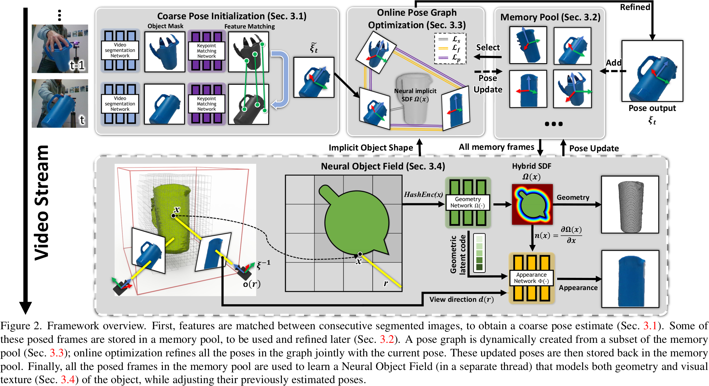
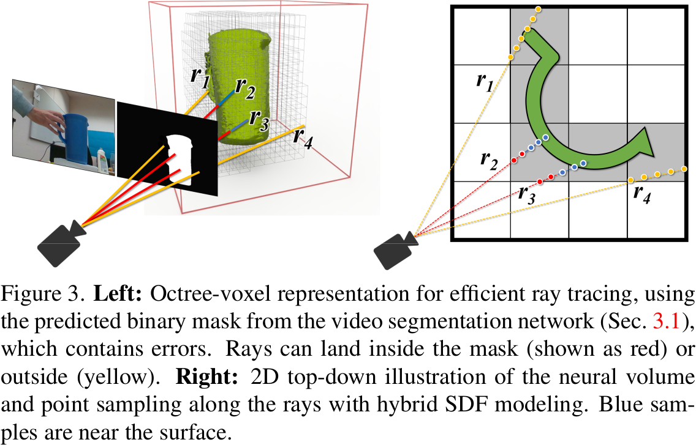

# BundleSDF: Neural 6-DoF Tracking and 3D Reconstruction of Unknown Objects

## 0 Abstract

BundleSDF 可以以 10 fps 的速度从单目 RGBD 视频序列中跟踪未知物体的 6-DoF 运动，同时对物体进行神经三维重建。该方法适用于任意刚性物体，即使在视觉纹理大部分缺失的情况下也可以使用。物体只在第一帧中进行分割。

我们方法的关键是神经物体场（Neural Object Field），它与位姿图优化过程一同学习，以便将信息稳健地累积到一致的、捕捉了几何和外观的三维表示中。动态的位姿存储帧池被自动维护，以促进这些线程之间的通信。

## 1 Introduction

- 一种用于因果 6-DoF 位姿跟踪和三维重建的新方法，用于跟踪和神经重建过程的并行设计，实时运行，同时大大减少了跟踪漂移。
- 我们引入了混合 SDF 表达来处理动态物体中唯一困难的不确定自由空间，例如带噪声的分割和来自交互的外部遮挡。

## 2 Related Work

## 3 Approach

我们的方法针对单目 RGBD 视频序列，仅在第一帧中需要被追踪物体的 mask，通过后续帧跟踪物体的 6-DoF 位姿并重建带纹理的物体 3D 模型。所有处理都是因果的，即处理某一帧只用之前帧的信息。物体被假定为刚体，纹理信息任意，不需要提前建模。

### 3.1 Coarse Pose Initialization

为了为后续的在线位姿图优化提供一个良好的初始猜测，我们在当前帧 $\mathcal{F}_t$ 和上一帧 $\mathcal{F}_{t-1}$ 之间计算了粗糙的物体位姿估计 $\tilde{\xi}_t\in\mathrm{SE}(3)$：

1. 利用与物体无关的视频分割网络（XMem） 分割 $\mathcal{F}_t$ 中的物体。
2. 利用基于 transformer 的特征匹配网络（Loftr）在 $\mathcal{F}_t$ 和 $\mathcal{F}_{t-1}$ 之间建立 RGB 特征对应关系，该网络在 MegaDepth 数据集上进行了预训练。
3. 特征对应关系和深度一起经过了一种基于 RANSAC 的位姿估计器进行最小二乘过滤。然后，选择最大化内点数量的位姿假设作为当前帧的粗略位姿估计 $\tilde{\xi}_t$。

### 3.2 Memory Pool

为了减轻灾难性遗忘导致的长序列跟踪漂移，保留过去帧的信息是很重要的。常用的方法是维护一个全局的模型，但是对于当前设定有缺陷：

1. 当融合到全局模型时，纹理或几何特征不明显时位姿的估计会产生误差，这种误差会累积且不可逆转。
2. 在长时间完全遮挡的情况下，大的运动变化使得配准全局模型和重新出现的帧观察之间变得困难。

我们引入了一个关键帧存储池 $\mathcal{P}$，用于存储最具信息量的历史观察数据。

1. 第一帧 $\mathcal{F}_0$ 会被自动添加，从而为新的未知物体设置了规范坐标系。
2. 对于每一帧新的图像，其粗略位姿 $\tilde{\xi}_t$ 会与存储池中的现有帧进行比较，以得到更新的位姿 $\xi_t$。
3. 仅当该帧的视角（由 $\xi_t$ 描述）被认为足够增加存储池中的多视角多样性且保持存储池紧凑时，该帧才会被添加到 $\mathcal{P}$ 中。

具体来说，$\xi_t$ 与存储池中所有存储帧的位姿进行比较。由于平面内物体的旋转不会提供额外的信息，因此比较会考虑旋转测地距离，并且忽略了围绕摄像机光轴的旋转。忽略这种差异使系统能够在空间中更稀疏地分配存储帧，同时保持相似数量的多视角一致性信息。

### 3.3 Online Pose Graph Optimization

对于具有粗略位姿估计 $\tilde{\xi}_t$ 的新帧 $\mathcal{F}_t$，我们从存储池中选择不超过 $K$ 个存储帧参与在线位姿图优化。优化后与 $\mathcal{F}_t$ 对应的位姿成为输出的估计位姿 $\xi_t$。这一步骤在 CUDA 中实现，以实现接近实时的处理速度，因此可以应用于每一帧新图像，从而在整个视频中更准确地估计物体的位姿。

#### Selecting Subset of Memory Frames

1. 视频前几帧的时候，$|\mathcal{P}|\le K$，存储池中的所有帧都被用到。
2. 存储池大小增长到大于 $K$ 的时候，会以最大化多视角一致性信息为目标进行选择。
3. 我们建议利用当前帧的粗略位姿 $\tilde{\xi}_t$ 来有效地选择存储帧子集 $\mathcal{P}_{pg}\subset\mathcal{P}$。
4. 对于存储池中的每一帧 $\mathcal{F}^{(k)}$，首先计算点法线图，并计算这些法线与新帧 $\mathcal{F}_t$ 摄像机视角中的光线方向之间的点积，以测试它们的可见性。
5. 如果新帧 $\mathcal{F}_t$ 中的点云可见性比例超过阈值（$0.1$），我们进一步计算 $\xi^{(k)}$ 和 $\tilde{\xi}_t$ 之间的旋转测地距离来评估与 $\mathcal{F}_t$ 之间的观察重叠，同时忽略平面旋转。
6. 最后，选择具有最大观察重叠（即最小距离）的 $K$ 个存储帧参与 $\mathcal{F}_t$ 的在线位姿优化。

#### Optimization

在位姿图 $\mathcal{G}=(\mathcal{V},\mathcal{E})$ 中，节点由 $\mathcal{F}_t$ 和上述选择的存储帧的子集组成：$\mathcal{V}=\mathcal{F}_t\cup\mathcal{P}_{pg}$，因此 $|\mathcal{V}| = K + 1$。目标是找到最优的位姿，以最小化位姿图的总损失：
$$
\mathcal{L}_{pg}=w_s\mathcal{L}_s(t)+\sum_{i,j\in\mathcal{V},i\ne j}\left[w_f\mathcal{L}_f(i,j)+w_p\mathcal{L}_p(i,j)\right]\tag{1}
$$
其中 $w_s,w_f,w_p$ 都设置成了 $1$。
$$
\mathcal{L}_f(i,j)=\sum_{(p_m,p_n)\in C_{i,j}}\rho\left(\|\xi_i^{-1}p_m-\xi_j^{-1}p_n\|_2\right)\tag{2}
$$
度量了 RGBD 特征对应点 $p_m,p_n\in\mathbb{R}^3$ 之间的欧几里德距离，其中 $\xi_i$ 表示帧 $\mathcal{F}^{(i)}$ 中的物体位姿，$\rho$ 是 Huber 损失，用于提高鲁棒性。帧 $\mathcal{F}^{(i)}$ 和 $\mathcal{F}^{(j)}$ 之间的对应点集合 $C_{i,j}$ 是通过第3.1节介绍的网络检测到的。
$$
\mathcal{L}_p(i,j)=\sum_{p\in I_i}\rho\left(\left|n_i(p)\cdot\left(T_{ij}^{-1}\pi_{D_j}^{-1}(\pi_j(T_{ij}p))-p\right)\right|\right)\tag{3}
$$
度量了像素级的点到平面的距离，其中 $T_{ij}\equiv\xi_j\xi_i^{-1}$ 从 $\mathcal{F}^{(i)}$ 变换到 $\mathcal{F}^{(j)}$，$\pi_j$ 表示与 $\mathcal{F}^{(j)}$ 相关联的图像 $I_j$ 上的透视投影，$\pi_D$ 表示通过查找像素位置处的深度图 $D_j$ 进行的逆投影映射，$n_i(p)$ 表示通过查找与 $\mathcal{F}^{(i)}$ 相关联的像素位置 $p \in I_i$ 处的法线映射而得到的法线。
$$
\mathcal{L}_s(t)=\sum_{p\in I_t}\rho\left(\left|\Omega(\xi_t^{-1}(\pi_D^{-1}p))\right|\right)\tag{4}
$$
度量了当前帧点到神经隐式物体的距离，其中 $\Omega(\cdot)$ 表示神经物体场的 SDF。神经物体场的权重在此步骤中被冻结。这个一元损失只在神经物体场的初始训练收敛后才加入。

位姿以物体的相机位姿的逆表示，使用李代数进行参数化，将初始帧的坐标系固定为锚点。通过迭代加权的高斯牛顿算法来解决整个位姿图优化问题。对于其余选定的存储帧，它们在存储池中的优化位姿也会被更新，以纠正先前在视频中计算的可能的错误，除非 $b(\mathcal{F})=\mathrm{True}$。

> 神经物体场也用于协助此优化过程。存储池中的每一帧都有一个二进制标志 $b(\mathcal{F})$，表示这一帧的位姿是否已经受益于神经物体场的更新。当某一帧首次添加到存储池时，$b(\mathcal{F})=\mathrm{False}$。这个标志在随后的在线更新中保持不变，直到该帧的位姿被神经物体场更新，此时它将永远设置为 $b(\mathcal{F})=\mathrm{True}$。更新新帧 $\mathcal{F}_t$ 位姿的同时，也会更新在线位姿图优化所选帧的所有位姿到存储池，只要它们的标志设置为 FALSE。那些标志设置为 TRUE 的帧将继续由更可靠的神经对象场过程进行更新，但它们不再被在线位姿图优化修改。

### 3.4 Neural Object Field

这是针对每个视频进行学习的，不需要预先训练以适应新的未知对象。这个神经物体场在与在线位姿跟踪并行的独立线程中进行训练。

1. 在每个训练周期开始时，神经物体场会使用来自存储池的所有存储帧（以及它们的位姿）并开始学习。
2. 当训练收敛时，优化的位姿将被更新到存储池，以帮助后续的在线位姿图优化。在线位姿图优化会每次获取这些更新的存储帧位姿，以减轻跟踪漂移。
3. 神经物体场的训练过程会通过从池中获取新的存储帧来重复。

#### Object Field Representation

1. 几何函数 $\Omega:x\mapsto s$ 以 3D 点 $x \in \mathbb{R}^3$ 为输入，输出 SDF 值 $s \in \mathbb{R}$。
2. 颜色函数 $\Phi : (f_{\Omega(x)}, n, d) \mapsto c$ 以来自几何网络的中间特征向量 $f_{\Omega(x)} \in \mathbb{R}^3$，点法线 $n \in \mathbb{R}^3$，以及视角方向 $d \in \mathbb{R}^3$为输入，输出颜色 $c \in \mathbb{R}^3_+$。
3. 我们在 $x$ 到网络之前对其应用多分辨率哈希编码。
4. 物体场中点的法线可以通过对 SDF 进行一阶导数操作得到：$n(x) = \frac{\partial \Omega(x)}{\partial x}$，我们通过利用 PyTorch 中的自动微分来实现这一点。
5. 对于法线 $n$ 和视图方向 $d$，我们通过一组固定的低阶球谐系数（在我们的情况下为2阶）来嵌入它们，以防止过拟合。

SDF 的优势在于：

1. 与深度引导截断的高效光线采样结合使用时，它可以在几秒钟内使在线跟踪训练收敛。
2. 由法线引导的隐式正则化鼓励平滑和准确的表面提取。

#### Rendering

光线 $r$ 的颜色 $c$ 通过接近表面的区域进行积分：
$$
c(r)=\int _{z(r)-\lambda }^{z(r)+0.5\lambda } w(x_i)\Phi (f_{\Omega (x_i)},n(x_i),d(x_i))\mathrm{d}t \tag{6}
$$

$$
w(x_i)= \frac {1}{1+e^{-\alpha \Omega (x_i)}}\frac {1}{1+e^{\alpha \Omega (x_i)}}\tag{7}
$$

$\alpha$ 设置成不优化的常数，控制 $w(x_i)$ 的峰值。

$z(r)$ 是来自深度图的对应的光线深度，$\lambda$ 是截断距离。为了减少神经场中的过拟合，减少了来自距离表面超过 $\lambda$ 的空白区域的贡献。我们只积分到 $0.5\lambda$ 的穿透距离以模拟自遮挡。

与直接使用深度读数 $z(r)$ 来指导积分相比，使用深度的另一种方法是从 $\Omega(x_i)$ 推断零交叉表面。然而，我们发现这需要更密集的点采样和更慢的训练收敛速度。

#### Efficient Hierarchical Ray Sampling

1. 在训练之前通过简单地合并有位姿的存储帧的点云，我们构建一个八叉树表示。
2. 我们首先均匀采样了由占用体素限定的 $N$ 个点，终止于 $z(r) + 0.5\lambda$。我们实现了一个自定义的 CUDA 内核来跳过中间未占用的体素的采样。
3. 我们从以深度读数 $N(z(r), \lambda^2)$ 为中心的正态分布中采了 $N'$ 个样本点。这导致了总共的 $N + N'$ 个样本，而无需查询更昂贵的多分辨率哈希编码或网络。

#### Hybrid SDF Modeling

我们将空间分为三个区域来学习 SDF：

1. 不确定的空间。图中的黄色点，对应于 mask 中的背景，或者对于深度值缺失的像素，观测结果不可靠。例如，光线 $r_1$ 的像素位置在 binary mask 中由于手指的遮挡而被预测为了背景，尽管实际上它对应于水壶的把手。如果简单地忽略了这块区域将丢失轮廓信息，导致偏差。因此，与其完全信任或忽略不确定的空间，我们给一个小的正值 $\epsilon$，以便在以后有更可靠的观测结果可用时能够快速适应：
   $$
   \mathcal {L}_{\textit {u}}=\frac {1}{|\mathcal {X}_{\textit {u}}|}\sum _{x\in \mathcal {X}_{\textit {u}}} (\Omega (x)-\epsilon )^2\tag{8}
   $$

2. 空的空间。图中的红色点，对应于有深度读数但不到表面的点，几乎可以确定它们是外部于物体表面的。我们对 TSDF 应用 $L_1$ loss 以促使稀疏：
   $$
   \mathcal {L}_{\textit {e}}=\frac {1}{|\mathcal {X}_{\textit {e}}|}\sum _{x\in \mathcal {X}_{\textit {e}}} | \Omega (x)-\lambda |\tag{9}
   $$
   
3. 近表面的空间。图中的蓝色点，靠近表面，距离深度读数不超过 $z(r)+0.5\lambda$ 的距离，用于建模自遮挡。这个空间对于学习 SDF 中的符号翻转和表面非常关键。为了提高效率，我们通过投影来近似表面附近的 SDF：
   $$
   \mathcal {L}_{\textit {surf}}=\frac {1}{|\mathcal {X}_{\textit {surf}}|}\sum _{x\in \mathcal {X}_{\textit {surf}}}\left (\Omega (x) +d_x - d_D \right )^2\tag{10}
   $$
   其中 $d_x=\|x-o(r)\|_2$，$d_D=\|\pi^{-1}(z(r))\|$ 分别是从光线起点到采样点和观测深度点的距离。

#### Training

训练 loss 为：
$$
\mathcal {L}=w_{\textit {u}}\mathcal {L}_{\textit {u}}+w_{\textit {e}}\mathcal {L}_{\textit {e}}+w_{\textit {surf}}\mathcal {L}_{\textit {surf}}+w_{c}\mathcal {L}_{c}+w_{\textit {eik}}\mathcal {L}_{\textit {eik}}\tag{11}
$$
$\mathcal{L}_c$ 表示颜色网络监督的前景颜色的 $L_2$ loss：
$$
\mathcal {L}_{c}=\frac {1}{|\mathcal {R}|}\sum _{r\in \mathcal {R}}\left \| \Phi (f_{\Omega (x)},n(x),d(r))-\bar {c}(r) \right \|\tag{12}
$$
$\mathcal {L}_{\textit {eik}}$ 为 Eikonal loss：
$$
\mathcal {L}_{\textit {eik}}=\frac {1}{|\mathcal {X}_{\textit {surface}}|}\sum _{x\in \mathcal {X}_{\textit {surface}}} ( \left \|\nabla \Omega (x)\right \|_2-1 )^2\tag{13}
$$
且我们不加入 mask 监督，因为网络预测的 mask 通常带有噪声。

## 4 Experiments

### 4.1 Datasets

### 4.2 Metrics

我们分别评估位姿估计和形状重建。对于物体 6-DoF 位姿，我们使用 GT 物体几何形状计算 ADD 和 ADD-S 指标下的曲线下面积（AUC）百分比。对于 3D 重建，我们在由每个视频的第一帧定义的规范坐标框架中计算最终重建的网格与 GT 网格之间的 Chamfer 距离。