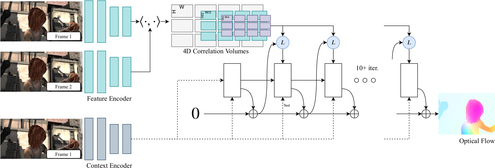
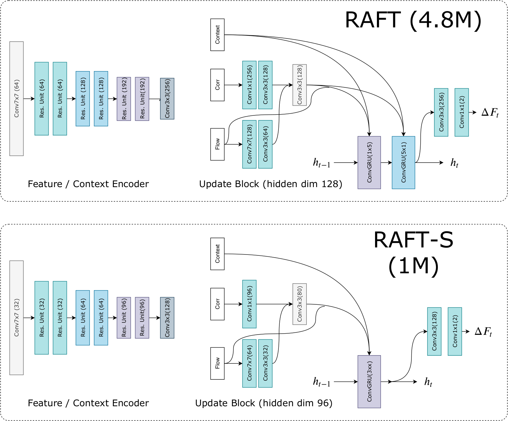

# 2020 RAFT: Recurrent All-Pairs Field Transforms for Optical Flow

## 0 Abstract

RAFT 可提取像素级别的特征，为所有像素对建立多尺度 4D 相关性体像，并利用在相关性体像上进行查找的递归单元迭代更新光流场。

## 1 Introduction

一般来说，优化目标权衡了鼓励视觉上相似的图像区域对齐的数据项和对运动的可信性施加先验的正则化项。这种方法已经取得了相当大的成功，但要取得进一步的进展似乎还具有挑战性，这是因为很难手工设计出一个能够适应各种特殊情况的优化目标。

- 准确性： 在 KITTI 上，RAFT 的 F1 全误差为 5.10%，比已公布的最佳结果（6.10%）减少了 16%。在 Sintel（final pass）上，RAFT 的端点误差为 2.855 像素，比已公布的最佳结果（4.098 像素）减少了 30%。
- 泛化能力： 仅在合成数据上进行训练时，RAFT 在 KITTI 上的终点误差为 5.04 像素，比之前在相同数据上训练的最佳深度网络（8.36 像素）的误差减少了 40%。
- 效率高： RAFT 在 1080Ti GPU 上以每秒 10 帧的速度处理 1088 $\times$ 436 视频。它的训练迭代次数是其他架构的 10 倍。使用 1/5 参数的缩小版 RAFT 在 Sintel 上以每秒 20 帧的速度运行，性能仍优于之前的所有方法。

RAFT 由三个主要部分组成：

1. 一个特征编码器，为每个像素提取一个特征向量；
2. 一个相关层，为所有像素对建立一个 4D 相关性体像，随后汇聚（pooling）成分辨率较低的体像；
3. 一个基于递归 GRU 的更新运算器，从相关性体像中检索值，并迭代更新一个初始值为零的流场。

相比于之前的方法，RAFT：

1. RAFT 维护并更新高分辨率下的单一固定流场。这与以前工作中流行的从粗到细的设计不同，在以前的设计中，首先在低分辨率下估计流场，然后在高分辨率下进行上采样和细化。通过在单个高分辨率流场上运行，RAFT 克服了从粗到细级联的几个局限性：难以从粗分辨率下的错误中恢复、容易遗漏快速移动的小物体，以及通常需要进行大量训练迭代（通常超过 1M 次）来训练多级级联的限制。
2. RAFT 的更新算子是循环的、轻量级的。我们的更新算子只有 2.7M 个参数，在推理过程中可以应用 100 多次而不会出现发散。
3. 更新算子设计新颖，由卷积 GRU 组成，可对四维多尺度相关性体像进行查找；相比之下，之前工作中的优化模块通常只使用普通卷积层或相关层。

## 2 Related Work

#### Optical Flow as Energy Minimization

为了确保目标函数的平滑，使用了一阶泰勒近似来拟合数据项。因此，它们只能很好地处理小位移。为了处理大位移，使用了从粗到细的策略，即使用图像金字塔在低分辨率下估计大位移，然后在高分辨率下细化小位移。但是，这种从粗到细的策略可能会遗漏快速移动的小物体，而且很难从早期的错误中纠正过来。

## 3 Approach

光流的任务就是估计前后帧图像 $I_1, I_2$ 之间的密集位移场 $(f^1, f^2)$，将 $I_1$ 中的像素 $(u,v)$ 映射到 $I_2$ 中的 $(u',v')=(u+f^1(u), v+f^2(v))$。

### 3.1 Feature Extraction

- 特征编码网络 $g_{\theta}:\mathbb{R}^{H\times W\times3}\mapsto\mathbb{R}^{H/8\times W/8\times D}$，包含 6 个残差块，作用在前后帧的两张图像上。
- 上下文网络 $h_\theta$，和 $g_\theta$ 架构一致，作用在前一帧图像上。

### 3.2 Computing Visual Similarity

相关性体积 $\mathbf{C}:\mathbb{R}^{H\times W\times3}\times\mathbb{R}^{H\times W\times3}\mapsto\mathbb{R}^{H\times W\times H\times W}$，计算了给定图像特征对的相关度。
$$
\mathbf{C}(g_\theta(I_1),g_\theta(I_2))=\mathrm{dot}\left(g_\theta(I_1),g_\theta(I_2),\mathrm{axis = -1}\right)\tag{1}
$$

#### Correlation Pyramid

计算完相关性体积 $\mathbf{C}$ 之后，用大小为 1, 2, 4, 8 的卷积核和同等大小的步长降采样最后两个维度它得到 4 层金字塔 $\{\mathbf{C}^1, \mathbf{C}^2, \mathbf{C}^4, \mathbf{C}^8\}$。每个的大小是 $H\times W\times H/2^k\times W/2^k$ 。

金字塔提供了大位移和小位移的信息；然而，保留前两个维度就保留了高分辨率信息，使我们的方法能够恢复快速移动的小物体的运动。

#### Correlation Lookup

查表操作符 $L_{\mathbf{C}}$：给定当前的光流场的估计 $(f^1, f^2)$，定义 $\mathbf{x}'$ 周围的局部网格为以 $\mathbf{x}'$ 为中心 $r$ 为半径范围内的整数偏移量集合，用 Manhattan 距离。
$$
\mathcal{N}(\mathbf{x}')_r=\{\mathbf{x}'+\mathrm{d}\mathbf{x}\mid\mathrm{d}\mathbf{x}\in\mathbb{Z}^2,\|\mathrm{d}\mathbf{x}\|_1\le r\}\tag{2}
$$
然后用 $\mathcal{N}(\mathbf{x}')_r$ 来索引相关性体积。使用双线性插值获得 $\mathcal{N}(\mathbf{x}')_r$ 的整数值来索引。

我们在金字塔的所有层级上查表，例如，在第 $k$ 层索引相关性体积 $\mathbf{C}^k$ 使用网格 $\mathcal{N}(\mathbf{x}'/2^k)_r$。每个层级查表的半径恒定意味着在较低层级具有更大的上下文：对于最低层级 $k = 4$，使用半径为 4 相当于原始分辨率上 256 像素的范围。然后，从每个级别获取的值被连接成一个单一的特征。

#### Efficient Computation for High Resolution Images

**不关键**。$M$ 次迭代 $N$ 个像素的图片复杂度是 $O(MN^2)$，但是可以减少到 $O(MN)$ 的复杂度。考虑第 $k$ 层的相关性体积 $\mathbf{C}^{2^k}$，改进后的算法是
$$
\mathbf{C}^{2^k}_{ijst}=\frac{1}{2^{2k}}\sum_{p}^{2^k}\sum_{q}^{2^k}\left\langle g_\theta(I_1)_{i,j}, g_\theta(I_2)_{2^{k}s+p.2^kt+q}\right\rangle=\left\langle g_\theta(I_1)_{i,j}, \frac{1}{2^{2k}}\sum_{p}^{2^k}\sum_{q}^{2^k}g_\theta(I_2)_{2^{k}s+p.2^kt+q}\right\rangle
$$
即先用平均值降采样 $g_\theta(I_2)$，然后在查表时候才计算需要的值。

### 3.3 Iterative Updates

从 $\mathbf{f}_0=\mathbf{0}$ 开始，迭代估计光流序列 $\{\mathbf{f}_1,\dots,\mathbf{f}_N\}$。每一次迭代都得到一个增量 $\Delta\mathbf{f}$ 更新到当前估计的光流 $\mathbf{f}_{k+1}=\Delta\mathbf{f}+\mathbf{f}_{k+1}$。

1. 初始化：将光流初始化为全 0，但是也可以将上一帧的光流复制过来（warm-start）。
2. 输入：对于当前的光流估计 $\mathbf{f}^k$，获取对应的相关性体积的特征。该特征还过了 2 层卷积层，当前光流估计也过了 2 层卷积。最后的输入就是相关性特征、光流特征、上下文特征的合并。
3. 更新：GRU 迭代，以 $x_t$ 为输入
  $$
   \begin{align*}
   z_t&=\sigma(\mathrm{Conv}_{3\times3}([h_{t-1},x_{t}],W_z))\\
   r_t&=\sigma(\mathrm{Conv}_{3\times3}([h_{t-1},x_{t}],W_r))\\
   \tilde{h}_t&=\tanh(\mathrm{Conv}_{3\times3}([r_t\odot h_{t-1},x_{t}],W_h))\\
   h_t&=(1-z_t)\odot h_{t-1}+z_t\odot\tilde{h}_t
   \end{align*}
   $$
4. 光流预测：GRU 输出再过两层卷积层预测更新 $\Delta\mathbf{f}$，其大小为原图大小的 1/8。但训练时候会上采样到原图大小做 loss，上采样方法如下。
5. 上采样：过两层卷积层预测一个 $H/8\times W/8\times(8\times8\times9)$ 的 mask，即，将全分辨率光流的每个像素视为其粗分辨率邻居的 $3\times3$ 的凸组合。9 个邻居的权重进行 softmax 处理。随后重排成 $H\times W\times2$。

### 3.4 Supervision

用 L1 loss，对于序列里面每个都做监督，但是赋予指数下降的权重
$$
\mathcal{L}=\sum_{i=1}^{N}\gamma^{N-i}\|\mathbf{f}_{gt}-\mathbf{f}_i\|_1\tag{7}
$$
其中 $\gamma=0.8$。
