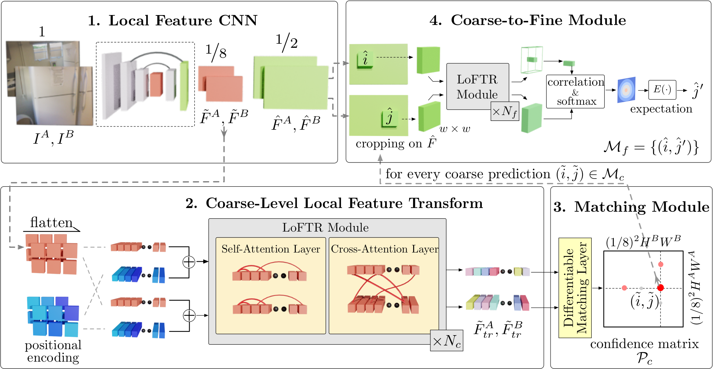
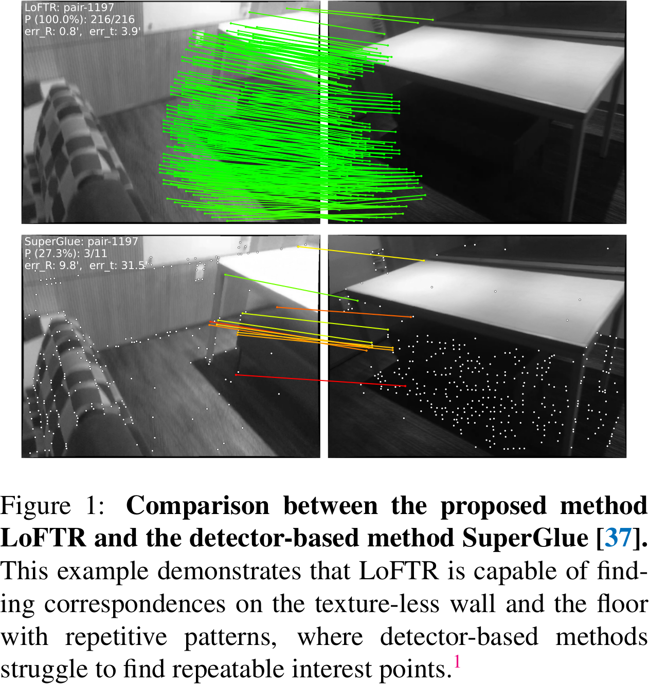
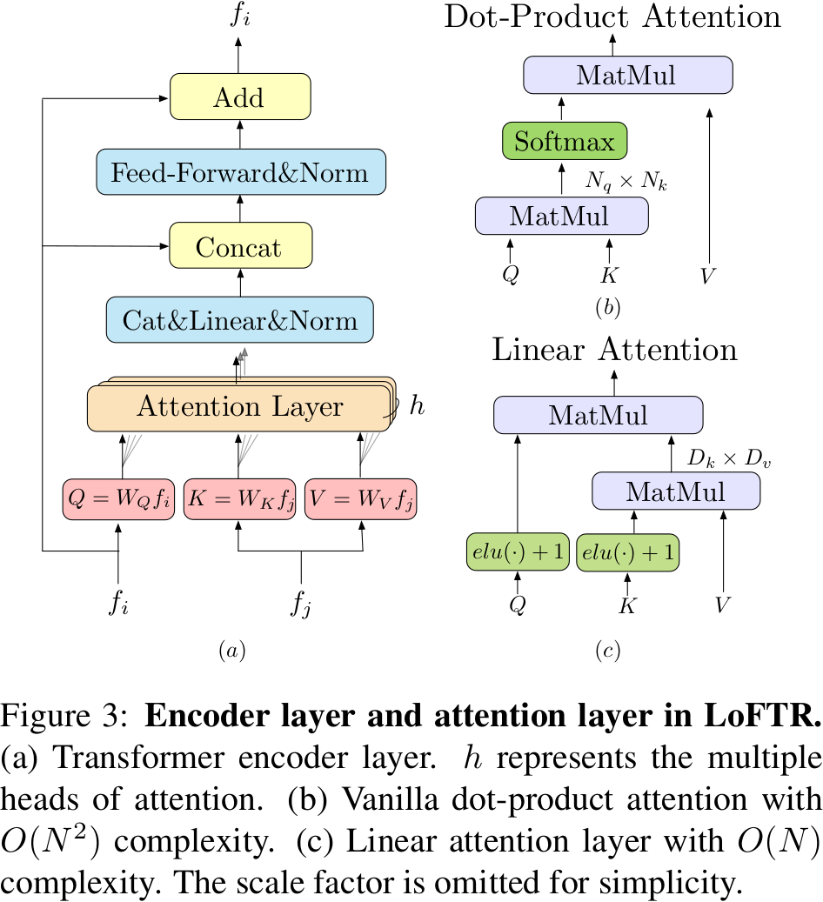

# LoFTR: Detector-Free Local Feature Matching with Transformers

## 0 Abstract

我们建议首先在粗级别建立像素级的密集匹配，然后在细级别对好的匹配进行优化。与使用成本体像搜索对应关系的密集方法不同，我们使用 Transformer 中的自注意力和交叉注意力层来获得在两个图像上都有条件的特征描述符。Transformer 提供的全局感受野使我们的方法能够在低纹理区域产生密集匹配，而在这些区域中，特征检测器通常难以产生可重复的兴趣点。对室内和室外数据集的实验证明，LoFTR 在性能上大幅优于现有方法。

## 1 Introduction

大多数现有的匹配方法由三个独立的阶段组成：特征检测、特征描述和特征匹配。由于各种因素，例如缺乏纹理、重复图案、视点变化、光照变化和运动模糊，特征检测器可能无法提取足够在图像之间重复的兴趣点。

最近的一些研究尝试通过建立像素级的密集匹配来解决这个问题。由 CNN 提取的密集特征具有有限的感受野，可能无法区分不明显的区域。相反，人类在这些不明显的区域中寻找对应关系，不仅基于局部邻域，还考虑了更大的全局背景。

1. 我们使用 Transformer 的自注意力层和交叉注意力层来处理从 CNN 骨架提取的密集局部特征。
2. 在低特征分辨率（bin 8 图像）上提取两组处理过的特征之间的密集匹配。从这些密集匹配中选择高置信度的匹配项，然后使用基于相关性的方法将它们精炼到亚像素级别。

Transformer 的全局感受野和位置编码使得处理过的特征表达能够依赖于上下文和位置。通过交替的自注意力和交叉注意力层，LoFTR 学习到了 GT 匹配中呈现出的密集全局匹配先验。为了降低计算复杂性，还采用了线性 Transformer。

**与基于检测器的 baseline 相比，LoFTR 可以在纹理较低、有运动模糊或重复图案的区域产生高质量的匹配。**

## 2 Related Work

## 3 Method

<table>
    <tr>
        <td>
            
        </td>
        <td>
            
        </td>
    </tr>
</table>

|                Symbols                 |       Descriptions       |
| :------------------------------------: | :----------------------: |
|              $I_A$，$I_B$              |          图像对          |
|      $\tilde{F}^A$，$\tilde{F}^B$      | 1/8 原始图像维度的粗特征 |
|        $\hat{F}^A$，$\hat{F}^B$        | 1/2 原始图像维度的细特征 |
| $\tilde{F}^A_{tr}$，$\tilde{F}^B_{tr}$ |    LoFTR 转换后的特征    |

### 3.1 Local Feature Extraction

我们使用标准的卷积架构与 FPN （记为局部特征 CNN）从两个图像中提取多级特征。CNN 具有平移不变性和局部性的归纳偏置，非常适合提取局部特征。CNN 引入的下采样还减少了 LoFTR 的输入长度，可减少计算成本。

### 3.2 Local Feature Transformer (LoFTR) Module

在局部特征提取之后，$\tilde{F}^A$，$\tilde{F}^B$ 传入 LoFTR，以提取位置和上下文相关的局部特征。直观地说，LoFTR 将这些特征转换为易于匹配的表达。

#### Preliminaries: Transformer

#### Linear Transformer

Dot-Product Attention
$$
\mathrm{Softmax}\left(\frac{QK^T}{\sqrt{d_k}}\right)V
$$
计算复杂度为 $O(N^2)$。

Linear Attention
$$
(\mathrm{Elu}(Q)+1)[(\mathrm{Elu}(K)+1)^TV]
$$
计算复杂度为 $O(N)$。

#### Positional Encoding

我们使用标准的二维位置编码，只在骨架网络输出上加一次。通过将位置编码添加到 $\tilde{F}^A$ 和 $\tilde{F}^B$，转换后的特征将变成位置相关的，尽管输入的 RGB 颜色在白色墙上是均匀的，但 $\tilde{F}^A_{tr}$ 和 $\tilde{F}^B_{tr}$ 的转换特征对于每个位置是唯一的。

#### Self-attention and Cross-attention Layers

对于自注意力层，输入 LoFTR 的特征是相同的，可以是 $\tilde{F}^A$ 或 $\tilde{F}^B$。对于交叉注意力层，输入 LoFTR 的特征是 $(\tilde{F}^A,\tilde{F}^B)$ 或 $(\tilde{F}^B,\tilde{F}^A)$ ，具体取决于交叉注意力的方向。我们在 LoFTR 模块中交替使用自注意力和交叉注意力层，共 $N_c$ 次。

### 3.3 Establish Coarse-level Matches

可以应用两种不同可微匹配方法，一种是使用最优输运方法，另一种是使用双 softmax 操作符。

1. 计算转换后特征之间的分数矩阵 $\mathcal{S}$​，可以表示为
   $$
   \mathcal{S}(i,j)=\frac{1}{\tau}\cdot\langle\tilde{F}^A_{tr}(i),\tilde{F}^B_{tr}(j)\rangle
   $$

2. 最优输运：部分分配问题的成本矩阵可以用 $-\mathcal{S}$ 表示。

3. 双 softmax：在 $\mathcal{S}$ 的两个维度上应用 softmax，获取软互相最近邻匹配的概率 $\mathcal{P}_c$
   $$
   \mathcal{P}_c(i,j)=\mathrm{softmax}(\mathcal{S}(i,\cdot))_j\cdot\mathrm{softmax}(\mathcal{S}(\cdot,j))_i
   $$

#### Match Selection

基于置信度矩阵 $\mathcal{P}_c$，我们选择置信度高于阈值 $\theta_c$​ 的匹配，并进一步强制执行相互最近邻（MNN）准则，以过滤可能的粗匹配中的异常值。
$$
\mathcal{M}_c=\{(\tilde{i},\tilde{j})\mid\forall(\tilde{i},\tilde{j})\in\mathrm{MNN}(\mathcal{P}_c),\mathcal{P}_c(\tilde{i},\tilde{j})\ge\theta_c\}
$$

### 3.4 Coarse-to-Fine Module

粗匹配之后，使用粗到细模块将这些匹配优细化到原始图像分辨率。粗到细模块使用基于相关性的方法。

1. 对于每个粗匹配 $(\tilde{i},\tilde{j})$，首先在细级别特征图 $\hat{F}^A$ 和 $\hat{F}^B$ 上定位其位置 $(\hat{i},\hat{j})$，然后以 $\hat{i}$ 和 $\hat{j}$ 为中心在 $\hat{F}^A$ 和 $\hat{F}^B$ 上裁剪两组尺寸为 $w\times w$ 的局部窗口。
2. 用小的 LoFTR 模块变换每个窗口内的裁剪特征 $N_f$ 次，在 $\hat{i}$ 和 $\hat{j}$ 为处生成两个经过变换的局部特征图 $\hat{F}^A_{tr}(\hat{i})$ 和 $\hat{F}^B_{tr}(\hat{j})$。
3. 将 $\hat{F}^A_{tr}(\hat{i})$ 的中心特征向量和 $\hat{F}^B_{tr}(\hat{j})$ 中的所有向量进行相关，从而生成一个热图，表示 $\hat{j}$ 的邻域中每个像素与 $\hat{i}$ 的匹配概率。
4. 通过计算概率分布的期望，我们可以获得在图像 $I_B$ 上具有亚像素精度的最终位置 $\bar{j}$ 。
5. 收集所有匹配项 $\{(\hat{i},\bar{j})\}$ 产生最终的细级别匹配 $\mathcal{M}_f$。

### 3.5 Supervision

#### Coarse-level Supervision

粗级别的 loss 函数是 $\mathcal{P}_c$ 的负对数似然 loss。SuperGlue 在训练过程中使用相机位姿和深度图来计算 $\mathcal{P}_c$ 的 GT 标签。我们定义了两组 1/8 分辨率网格的相互最近邻作为 GT 粗匹配 $\mathcal{M}_c^{gt}$。两个网格之间的距离由它们中心位置的投影距离来衡量。

当使用最优传输层时，loss 用 SuperGlue 的。

当使用双 softmax 进行匹配时，loss 为
$$
\mathcal{L}_c=-\frac{1}{|\mathcal{M}_c^{gt}|}\sum_{(\tilde{i},\tilde{j})\in\mathcal{M}_c^{gt}}\log\mathcal{P}_c(\tilde{i},\tilde{j})
$$

#### Fine-level Supervision

对于每个查询点 $\hat{i}$，我们还通过计算相应热图的总方差 $\sigma^2(\hat{i})$ 来测量其不确定性。目标是优化具有低不确定性的精位置，
$$
\mathcal{L}_f=\frac{1}{|\mathcal{M}_c^{gt}|}\sum_{\{(\hat{i},\bar{j})\}\in\mathcal{M}_f}\frac{1}{\sigma^2(\hat{i})}\|\bar{j}-\bar{j}_{gt}\|_2
$$
$\bar{j}_{gt}$ 是投影而来的，$\sigma^2(\hat{i})$ 的梯度停止回传。

### 3.6 Implementation Details

24 小时，64 1080 Ti （8 ~ 16 A100）。640 $\times$ 480 的图片在 2080 Ti 推理 116 ms。
