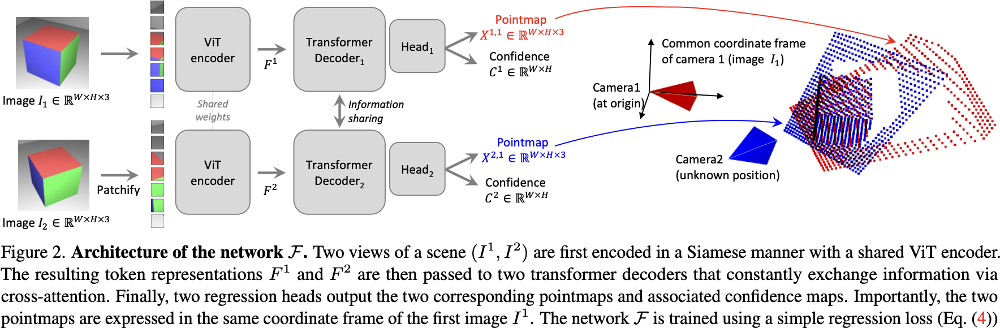

# DUSt3R: Geometric 3D Vision Made Easy

## 0 Abstract

DUSt3R (Dense and Unconstrained Stereo 3D Reconstruction). 作者把成对重建问题看作是点阵图的回归，放宽了通常投影相机模型的硬约束。作者证明，这种表述方式能顺利地统一单目和双目重建情况。在提供两幅以上图像的情况下，作者进一步提出了一种简单而有效的全局配准策略，在一个共同的参考框架中表达所有成对的点阵图。网络架构基于标准的变换器编码器和解码器，因此可以利用强大的预训练模式。作者的方案直接提供了场景的三维模型以及深度信息，但有趣的是，作者可以从中无缝恢复像素匹配、相对和绝对相机。

## 1 Introduction

归根结底，现代 SfM 和 MVS 管道可归结为解决一系列最基本的问题：匹配点、寻找基本矩阵、三角化点、稀疏地重新构建场景、估算摄像机，最后进行密集重建。每个子问题的解决都不完美，会对下一步产生干扰，从而增加管道的复杂性和整体运行所需的工程工作量。

DUSt3R 的主要组成部分是一个网络，能够仅通过一对图像，在没有关于场景或摄像机（甚至没有内在参数）的先验信息的情况下，回归出密集而精确的场景表示。生成的场景表示基于三维点阵图，具有丰富的属性：它们同时囊括了 (a) 场景几何图形，(b) 像素与场景点之间的关系，以及 (c) 两个视点之间的关系。

作者的模型是通过简单的回归损失以完全监督的方式进行训练的，利用的是大型公共数据集，这些数据集的地面实况注释要么是合成生成的，要么是由 SfM 软件重建的，要么是使用专用传感器捕获的。

作者引入了一种全局配准程序，与 BA 不同的是，它不涉及重投影误差最小化。取而代之的是，作者直接在三维空间中优化相机姿态和几何配准，这种方法速度快，在实践中表现出极佳的收敛性。

1. 作者提出了首个从未定标图像的整体端到端三维重建管道，它统一了单目和双目三维重建。
2. 作者为 MVS 应用引入了点阵图表示法，使网络能够预测标准帧中的三维形状，同时保留像素与场景之间的隐含关系。这有效地消除了通常透视摄像机表述的许多限制。
3. 在多视角三维重建的背景下，作者引入了全局对齐点阵图的优化程序。作者的程序可以毫不费力地提取经典 SfM 和 MVS 管道的所有常规中间输出。从某种意义上说，作者的方法统一了所有三维视觉任务，大大简化了传统的重建管道，使 DUSt3R 相比之下显得简单易行。特别是，我们的一体化模型在单目和多目深度基准以及多目相机姿态估计方面取得了最先进的结果。

## 3 Method

- 点阵图 Pointmap：$X\in\mathbb{R}^{H\times W\times 3}$，与对应的图像 $I$ 逐像素对应。
- 相机和场景 Camera & Scene：内参 $K\in\mathbb{R}^{3\times 3}$ + 深度图 $\mathbb{R}^{W\times H}$ = 点阵图。$X^{n,m}$ 表示相机 $n$ 的点阵图在相机 $m$ 的样子：
  $$
  \begin{equation}
  X^{n,m}=P_{m}P_{n}^{-1}h(X^{n})
  \end{equation}
$$
  $P_{m},P_{n}\in\mathbb{R}^{3\times4}$ 是 pose，$h$ 是变成齐次坐标。

### 3.1 Overview

学一个网络 $\mathcal{F}:(I^{1},I^{2})\mapsto((X^{1,1},X^{2,1}),(C^{1,1},C^{2,1}))$。

#### Network Architecture

两张图先用 ViT Encoder 得到图像的特征 $F^{1},F^{2}$，然后两个 Decoder 交叉做自、互注意力
$$
\begin{align*}
G_{0}^{1}&= F^{1}\\
G_{0}^{2}&= F^{2}\\
G_{i}^{1}&= \text{DecoderBlock}_{i}^{1}(G_{i-1}^{1},G_{i-1}^{2})\\
G_{i}^{2}&= \text{DecoderBlock}_{i}^{2}(G_{i-1}^{2},G_{i-1}^{1})
\end{align*}
$$
最后输出到 MLP 头
$$
\begin{align*}
X^{1,1},C^{1,1}&= \text{Head}^{1}(G_{0}^{1},\dots,G_{0}^{B})\\
X^{2,1},C^{2,1}&= \text{Head}^{1}(G_{2}^{1},\dots,G_{2}^{B})
\end{align*}
$$

#### Discussion

输出点阵图 $X^{1,1},X^{2,1}$ 的回归系数未知。此时的点阵图并不一定对应于任何物理上合理的摄像机模型。相反，我们让网络从训练集中学习所有相关的先验，而训练集只包含几何上一致的点阵图。使用通用架构可以充分利用强大的预训练技术，最终超越现有的特定任务架构所能达到的效果。

### 3.2 Training Objective

#### 3D Regression Loss

GT 点阵图 $\bar{X}^{1,1},\bar{X}^{2,1}$，从有深度的图可以得到，以及可见像素的 mask $\mathcal{D}^{1},\mathcal{D}^{2}$。回归的 loss 是定义在 $\mathcal{D}$ 的
$$
\mathcal{L}(v,i)=\left\|\frac{1}{z}X_{i}^{v,1}-\frac{1}{\bar{z}}\bar{X}_{i}^{v,1}\right\|
$$
其中 $z=\text{norm}(X^{1,1},X^{2,1}),\bar{z}=\text{norm}(\bar{X}^{1,1},\bar{X}^{2,1})$ 来平衡场景大小
$$
\text{norm}(X^1,X^2)=\frac{1}{|\mathcal{D}^{1}|+|\mathcal{D}^{2}|}\sum_{v\in\{1,2\}}\sum_{i\in\mathcal{D}^{v}}\|X_{i}^{v}\|
$$

#### Confidence-aware Loss

用来处理某些极端位置的点

$$
\mathcal{L}_{\text{conf}}=\sum_{v\in\{1,2\}}\sum_{i\in\mathcal{D}^{v}}C_{i}^{v,1}\mathcal{L}(v,i)-\alpha\log C_{i}^{v,1}
$$
其中 $\alpha$ 是超参数，$C_{i}^{v,1}=1+\exp\tilde{C}_{i}^{v,1}$ 激活过。

### 3.3 Downstream Applications

#### Point Matching

2D 图像的特征点匹配任务可以转换为 3D 点的最邻近匹配：
$$
\begin{align*}
\mathcal{M}_{1,2}&= \{(i,j)\mid i=\text{NN}_{1}^{1,2}(j)\wedge j=\text{NN}_{1}^{2,1}(i)\}\\
\text{NN}_{k}^{n,m}(i)&= \mathop{\arg\min}_{j\in\{0,\dots,WH\}}\left\|X_{j}^{n,k}-X_{i}^{m,k}\right\|\\
\end{align*}
$$

#### Recovering Intrinsics

对于一张图（$X^{1,1}$）的内参，假设主点在中心，像素是方的，那么只有焦距是需要通过优化估计的：
$$
f^{*}_{1}=\mathop{\arg\min}_{f_{1}}\sum_{i=0}^{W}\sum_{j=0}^{H}C_{i,j}^{1,1}\left\|(i',j')-f_{1}\frac{(X_{i,j,0}^{1,1},X_{i,j,1}^{1,1})}{X_{i,j,2}^{1,1}}\right\|
$$
其中 $i'=i-W/2,j'=j-H/2$。然后用迭代算法就可以得到一个满足的解。

#### Relative Pose Estimation

可以用对极几何估计，也可以用 Procrustes 对齐：
$$
R^{*},t^{*}=\mathop{\arg\min}_{\sigma,R,t}\sum_{i}C_{i}^{1,1}C_{i}^{1,2}\left\|\sigma(RX_{i}^{1,1}+t)-X_{i}^{1,2}\right\|
$$
有解析解。

#### Absolute Pose Estimation

结合上述步骤就可以做一般的 pose estimation。

### 3.4 Global Alignment

#### Pairwise Graph

给定 $\{I^{1},\dots,I^{N}\}$，构建一个连通图 $\mathcal{G}(\mathcal{V},\mathcal{E})$，$\mathcal{V}$ 是图片，$\mathcal{E}$ 是两个有视觉关联的图片。为了得到图片间关系，可以提前设定关系，也可以过网络得到。

#### Global Optimization

目标是使得点云能在全局对齐，得到 $\chi$
$$
\chi^{*}=\mathop{\arg\min}_{\chi,P,\sigma}\sum_{e\in\mathcal{E}}\sum_{v\in e}\sum_{i=1}^{HW}C_{i}^{v,e}\left\|\chi_{i}^{v}-\sigma_{e}P_{e}X_{i}^{v,e}\right\|
$$
额外的约束还有：$\prod_{e}\sigma_{e}=1$.

#### Recovering Camera Parameter

有了全局的点云就可以恢复每个相机的参数：
$$
\chi_{i,j}^{n}:=P_{n}^{-1}h(K_{n}^{-1}[iD_{i,j}^{n};jD_{i,j}^{n};D_{i,j}^{n}])
$$

#### Discussion

与传统的捆绑调整不同，这种全局优化在实际操作中既快又简单。事实上，我们不是像通常的捆绑调整那样最小化二维重投影误差，而是最小化三维投影误差。优化采用标准梯度下降法，通常在几百步后就会收敛，在标准 GPU 上只需要几秒钟。

## 4 Experiments

#### Training Data

9 个数据集 8.5 M 对。

#### Training Details

输入长边 512，会做随机的宽高比的增强，ViT-L 做 Encoder，ViT-B 做 Decoder，外加 DPT 预测头。用 CroCo 权重做初始化。
