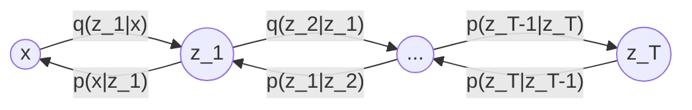

# Variational Auto-Encoder

|                 Symbol                  |                    Description                    |
| :-------------------------------------: | :-----------------------------------------------: |
|                 $t$/$T$                 |                 step/total steps                  |
|              $\theta,\phi$              |                 model parameters                  |
| $\mathbf{x}$/$\mathbf{X}$/$\mathcal{X}$ |    data sample/data random variable/data space    |
| $\mathbf{z}$/$\mathbf{Z}$/$\mathcal{Z}$ | latent vector/latent random variable/latent space |

---

> VAE 解决了自编码器中非正则化潜空间的问题。自编码器中，数据被压缩到潜空间中的部分区域，在这部分区域外的采样无法生成有意义的数据。VAE 的编码器输出的是潜空间的分布参数，并且强迫潜空间为 Gaussian 分布，这样就确保了潜空间的正则性。

EM 算法解决了获取数据分布的问题。因此我们可以通过已知的数据分布

回顾一下 EM 算法中的核心公式
$$
\log p(\mathbf{x};\theta)=\mathrm{ELBO}(q,\mathbf{x};\theta)+\mathrm{KL}\left(q(\mathbf{z})\parallel p(\mathbf{z}\mid\mathbf{x};\theta)\right)
$$
在 EM 算法里面，为了获取最优的变分分布 $q(\mathbf{z})$，我们需要积分得到后验概率 $p(\mathbf{z}\mid\mathbf{x};\theta)$。如果 $\mathbf{z}$ 的形式比较复杂，那么求精确解就会非常困难，因此需要近似估计。VAE 就是一种利用神经网络来估计分布的模型，其思想是利用神经网络来分别建模两个复杂的条件概率密度函数：

1. 用推断网络（编码器）$\mathrm{enc}$ 估计变分分布 $q(\mathbf{z};\phi)$。理论上 $q(\mathbf{z})$ 可以独立于 $\mathbf{x}$，但是由于最优的变分分布是后验概率 $p(\mathbf{z}\mid\mathbf{x};\theta)$，因此网络被建模成 $\mathrm{enc}(\mathbf{x};\phi)=q(\mathbf{z}\mid\mathbf{x};\phi)$ 得到隐变量 $\mathbf{z}$。
2. 用生成网络（解码器）$\mathrm{dec}$ 估计条件概率 $p(\mathbf{x}\mid\mathbf{z};\theta)$ 得到生成的数据 $\mathbf{x}$。

因此，VAE 可以看作是一种可微的 EM 算法。

## Inference Network

推断网络 $\mathrm{enc}$ 的目标是找到一组网络参数 $\phi^*$，使得变分分布 $q(\mathbf{z}\mid\mathbf{x};\phi)$ 接近后验概率 $p(\mathbf{z}\mid\mathbf{x};\theta)$，即
$$
\phi^*=\mathop{\arg\min}_{\phi}\,\mathrm{KL}\left(q(\mathbf{z}\mid\mathbf{x};\phi)\parallel p(\mathbf{z}\mid\mathbf{x};\theta)\right)
$$
我们已经知道，对于绝大部分问题来说，精确推断后验概率 $p(\mathbf{z}\mid\mathbf{x};\theta)$ 非常困难。而变分推断告诉我们，问题可以转化为：
$$
\begin{align*}
\phi^*&=\mathop{\arg\max}_{\phi}\,\mathrm{ELBO}(q,\mathbf{x};\theta,\phi)
\end{align*}
$$
即找到 $\phi^*$ 使得 ELBO 最大，类似于 EM 算法的 E 步。

## Generate Network

生成网络 $\mathrm{dec}$ 的目标是找到一组网络参数 $\theta^*$，使得 ELBO 最大，即
$$
\theta^*=\mathop{\arg\max}_{\theta}\,\mathrm{ELBO}(q,\mathbf{x};\theta,\phi)
$$
类似于 EM 算法的 M 步。

## Cost Function

至此，模型的目标就是最大化 ELBO，最终的目标函数就是
$$
\begin{align*}
\max_{\theta,\phi}\,\mathrm{ELBO}(q,\mathbf{x};\theta,\phi)&=\max_{\theta,\phi}\,\mathbb{E}_{\mathbf{z}\sim q(\mathbf{z}\mid\mathbf{x};\phi)}\log\left[\frac{p(\mathbf{x}\mid\mathbf{z};\theta)p(\mathbf{z};\theta)}{q(\mathbf{z}\mid\mathbf{x};\phi)}\right]\\
&=\max_{\theta,\phi}\,\mathbb{E}_{\mathbf{z}\sim q(\mathbf{z}\mid\mathbf{x};\phi)}\left[\log p(\mathbf{x}\mid\mathbf{z};\theta)\right]-\mathrm{KL}\left(q(\mathbf{z}\mid\mathbf{x};\phi)\parallel p(\mathbf{z};\theta)\right)
\end{align*}
$$

### First Term

对于第一项，VAE 通过采样的方式近似。对于每个样本 $\mathbf{x}$，根据变分分布 $q(\mathbf{z}\mid\mathbf{x};\phi)$ 采样 $M$ 个样本 $\mathbf{z}^{(m)}$，用 Monte Carlo 估计
$$
\mathbb{E}_{\mathbf{z}\sim q(\mathbf{z}\mid\mathbf{x};\phi)}\left[\log p(\mathbf{x}\mid\mathbf{z};\theta)\right]\approx\frac{1}{M}\sum_{m=1}^{M}\log p(\mathbf{x}\mid\mathbf{z}^{(m)};\theta)
$$
上面的近似中，采样步骤对 $\phi$ 是不可导的，因此上述步骤无法优化 $\phi$。VAE 采用了**重参数化**的方法来规避这个问题。VAE 引入了一个分布为 $p(\epsilon)$ 的随机变量 $\epsilon$，上面的式子就可以转化为
$$
\mathbb{E}_{\mathbf{z}\sim q(\mathbf{z}\mid\mathbf{x};\phi)}\left[\log p(\mathbf{x}\mid\mathbf{z};\theta)\right]=\mathbb{E}_{\epsilon\sim p(\epsilon)}\left[\log p(\mathbf{x}\mid g(\phi, \epsilon);\theta)\right]
$$
其中 $\mathbf{z}=g(\phi,\epsilon)$ 是一个固定的映射。VAE 假设变分分布 $q(\mathbf{z}\mid\mathbf{x};\phi)$ 是正态分布 $\mathcal{N}(\boldsymbol{\mu},\boldsymbol{\sigma}^2I)$，其中 $\boldsymbol{\mu},\boldsymbol{\sigma}$ 是 $\mathrm{enc}$ 的输出。根据正态分布的性质，取 $\epsilon\sim\mathcal{N}(0,I)$，就可以转化到 $\mathbf{z}$
$$
\mathbf{z}=\boldsymbol{\mu}+\boldsymbol{\sigma}\odot\epsilon
$$

### Second Term

对于第二项，VAE 可以计算解析解。VAE 假设变分分布 $q(\mathbf{z}\mid\mathbf{x};\phi)$ 是正态分布 $\mathcal{N}(\boldsymbol{\mu},\boldsymbol{\sigma}^2I)$，先验分布 $p(\mathbf{z};\theta)$ 是正态分布 $\mathcal{N}(0,I)$，则它们的 KL 散度为
$$
\begin{align*}
&\mathrm{KL}\left(\mathcal{N}(\boldsymbol{\mu},\boldsymbol{\sigma}^2I)\parallel\mathcal{N}(0,I)\right)\\
&=\frac{1}{2}\left[-\log|\boldsymbol{\sigma}^2I|-\mathrm{trace}(I)+\mathrm{trace}\left(\boldsymbol{\sigma}^2I\right)+(\boldsymbol{\mu}^T\boldsymbol{\mu})\right]
\end{align*}
$$

最后的损失函数就是：
$$
\begin{align*}
\max_{\theta,\phi}\,\mathrm{ELBO}(q,\mathbf{x};\theta,\phi)&=\max_{\theta,\phi}\,\mathbb{E}_{\mathbf{z}\sim q(\mathbf{z};\phi)}\left[\log p(\mathbf{x}\mid\mathbf{z};\theta)\right]-\mathrm{KL}\left(q(\mathbf{z}\mid\mathbf{x};\phi)\parallel p(\mathbf{z};\theta)\right)\\
&\approx\frac{1}{M}\sum_{m=1}^{M}\log p(\mathbf{x}\mid\mathbf{z}^{(m)};\theta)-\frac{1}{2}\left[-\log|\boldsymbol{\sigma}^2I|-\mathrm{trace}(I)+\mathrm{trace}\left(\boldsymbol{\sigma}^2I\right)+(\boldsymbol{\mu}^T\boldsymbol{\mu})\right]
\end{align*}
$$
实践中，条件概率 $p(\mathbf{x}\mid\mathbf{z};\theta)$ 一般用其他函数来近似，例如 Bernoulli 分布、正态分布等。图像重建任务中，一般用正态分布来近似，可以想象成是对图像的每个像素点都建立了一个正态分布，这样就可以用正态分布的概率密度函数来近似像素点的概率。

## Vector Quantized VAE

Vector Quantized VAE 中，变分分布 $q(z\mid\mathbf{x};\phi)$ 被假设成离散的分布
$$
q(z=k\mid\mathbf{x};\phi)=\begin{cases}1&k=\arg\min_j\|\phi(x)-e_{j}\|\\0&\text{otherwise}\end{cases}
$$
其中 $\{e_{j}\}_{j=1}^{K}$ 是一系列预设的、可训练的编码。相应的，规定先验分布 $p(\mathbf{z};\theta)$ 是离散均匀分布 $U(1,K)$，则它们的 KL 散度为
$$
\mathrm{KL}(q\parallel p)=\sum_{k=1}^{K}q(k)\log\frac{q(k)}{p(k)}=-1\cdot\log\frac{1}{K}+(K-1)\cdot0\cdot\log\frac{1}{K}=\log K
$$
是一个常数。最后送入解码器的 $z$ 就是距离编码器得到的结果最近的一个离散编码 $e_k$。

## Hierarchical VAE

Hierarchical VAE，特别是 Markovian Hierarchical VAE，在潜空间上将多个 VAE 串联起来，每个 VAE 的潜空间都是之前一个的潜空间（除了第一个 VAE 是从数据空间）编码而来。这样的想法和 diffusion 几乎完全一致。



因此，联合分布可以写成
$$
\begin{align*}
p(\mathbf{x}\mid\mathbf{z}_{1:T};\theta)&=p(\mathbf{z}_1;\theta)p(\mathbf{x}\mid\mathbf{z}_1;\theta)\prod_{t=2}^{T}p(\mathbf{z}_t\mid\mathbf{z}_{t-1};\theta)\\
q(\mathbf{z}_{1:T}\mid\mathbf{x};\phi)&=q(\mathbf{z}_1\mid\mathbf{x};\phi)\prod_{t=2}^{T}q(\mathbf{z}_t\mid\mathbf{z}_{t-1};\phi)
\end{align*}
$$
对应的 ELBO 为
$$
\begin{align*}
\log p(\mathbf{x};\theta)&=\log\int p(\mathbf{x},\mathbf{z}_{1:T};\theta)\mathrm{d}\mathbf{z}_{1:T}\\
&=\log\int\frac{p(\mathbf{x},\mathbf{z}_{1:T};\theta)q(\mathbf{z}_{1:T}\mid\mathbf{x};\phi)}{q(\mathbf{z}_{1:T}\mid\mathbf{x};\phi)}\mathrm{d}\mathbf{z}_{1:T}\\
&=\log\mathbb{E}_{q(\mathbf{z}_{1:T}\mid\mathbf{x};\phi)}\left[\frac{p(\mathbf{x},\mathbf{z}_{1:T};\theta)}{q(\mathbf{z}_{1:T}\mid\mathbf{x};\phi)}\right]\\
&\geq\mathbb{E}_{q(\mathbf{z}_{1:T}\mid\mathbf{x};\phi)}\log\left[\frac{p(\mathbf{x},\mathbf{z}_{1:T};\theta)}{q(\mathbf{z}_{1:T}\mid\mathbf{x};\phi)}\right]
\end{align*}
$$
其中
$$
\mathrm{ELBO}(q,\mathbf{x};\theta,\phi)=\mathbb{E}_{q(\mathbf{z}_{1:T}\mid\mathbf{x};\phi)}\log\left[\frac{p(\mathbf{x},\mathbf{z}_{1:T};\theta)}{q(\mathbf{z}_{1:T}\mid\mathbf{x};\phi)}\right]=\mathbb{E}_{q(\mathbf{z}_{1:T}\mid\mathbf{x};\phi)}\log\left[\frac{p(\mathbf{z}_1;\theta)p(\mathbf{x}\mid\mathbf{z}_1;\theta)\prod_{t=2}^{T}p(\mathbf{z}_t\mid\mathbf{z}_{t-1};\theta)}{q(\mathbf{z}_1\mid\mathbf{x};\phi)\prod_{t=2}^{T}q(\mathbf{z}_t\mid\mathbf{z}_{t-1};\phi)}\right]
$$

---

> VAE 的伪代码。

```python
class VariationalAutoEncoder(nn.Module):
    def __init__(self) -> None:
        super().__init__()
        self.encoder = VAEEncoder()
        self.decoder = VAEDecoder()

    def forward(self, x: torch.Tensor) -> torch.Tensor:
        mu, logvar = self.encoder(x)
        std = torch.exp(0.5 * logvar)
        eps = torch.randn_like(std)
        z = mu + eps * std

        y = self.decoder(z)
        loss = (y - x).square().mean() + KL_wight * KL_divergence(mu, std)
        return y, loss
```
