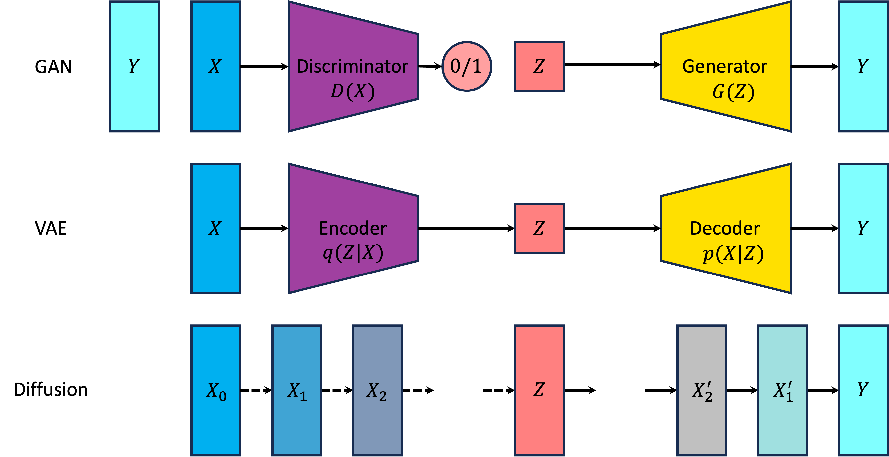

# Generative Model

生成模型是一类强大的算法，它们的目标是学习如何从给定数据集生成新的数据点。具体来说，生成模型的核心是从一组样本中学习到一个可以采样的分布 $P(\cdot)$，并且努力拉近学习到的分布与真实数据的分布。生成模型的难点在于，两个分布的距离只能由两个分布的样本来估计。

当前的生成模型在图像、文本、语音生成方面展现出了极强的能力。此外，生成模型还可以用于数据增强。

对于图像生成的任务来说，计算机图形学的渲染模型可以看成一种生成模型。在给定了待渲染场景的各种参数和渲染的方式（光栅化、光追），即先验的情况下，模型能够确定性地生成一张图片。统计生成模型则不依赖于强先验知识，而是学习了图像数据的分布，随后从学习到的分布中采样即可生成一张图片。

这里我们从极大似然估计、期望最大化算法开始介绍估计数据分布的方法。随后介绍常见的深度生成模型：对抗生成网络、变分自编码器、扩散模型。

我们推荐读者按以下顺序阅读：

## [Maximum Likelihood Estimation](1%20Maximum%20Likelihood%20Estimation.md)

## [Expectation Maximization](2%20Expectation%20Maximization.md)

## [Variational Auto-Encoder](3%20Variational%20Auto-encoder.md)

## [Diffusion Model](4%20Diffusion.md)

## [Generative Adversarial Network](5%20Generative%20Adversarial%20Network.md)

---

我们还提供了某些[概率分布相关性质](appendix/Fancy%20Distribution.md)的总结。

## References

1. [Tutorial on Variational Autoencoders](https://arxiv.org/abs/1606.05908)
2. [Understanding Diffusion Models: A Unified Perspective](https://arxiv.org/abs/2208.11970)
3. [Neural Networks and Deep Learning](https://nndl.github.io/)
