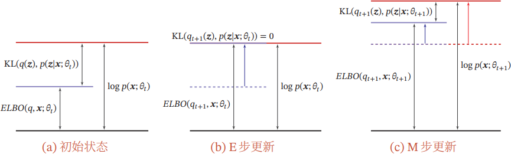

# Expectation-Maximization

记号同 [Maximum Likelihood Estimation](maximum%20likelihood%20estimation.md)。

---

EM 算法是一种迭代算法，用于求解**含有隐变量**的概率模型的极大似然估计。对于训练集 $\mathcal{D}$，我们可以将其看作是由隐变量 $\mathbf{Z}$ 和显变量 $\mathbf{X}$ 组成的联合分布 $p(\mathbf{X},\mathbf{Z})$ 采样得到的。假设 $\mathbf{Z}$ 是离散的，一个样本 $\mathbf{x}^{(n)}$ 的边际似然函数（类比于边际概率函数）为
$$
p\left(\mathbf{x}^{(n)};\theta\right)=\sum_{i}p\left(\mathbf{x}^{(n)},\mathbf{z}^{(i)};\theta\right)
$$
假设 $\mathbf{Z}$ 是连续的，
$$
p\left(\mathbf{x}^{(n)};\theta\right)=\int p\left(\mathbf{x}^{(n)},\mathbf{z};\theta\right)\mathrm{d}\mathbf{z}
$$
边际似然函数也称为**证据**（Evidence）。以离散的隐变量 $\mathbf{Z}$ 为例，EM 算法的目标是求解边际似然函数的极大似然估计，即
$$
\begin{align*}
\theta^*&=\arg\max_{\theta}\mathcal{L}(\mathcal{D};\theta)\\
&=\arg\max_{\theta}\sum_{n=1}^N\log p\left(\mathbf{x}^{(n)};\theta\right)\\
&=\arg\max_{\theta}\sum_{n=1}^N\log\sum_{i}p\left(\mathbf{x}^{(n)},\mathbf{z}^{(i)};\theta\right)
\end{align*}
$$
增加了隐变量 $\mathbf{Z}$ 之后，模型参数 $\theta$ 导数的形式会变得非常复杂，因此很难求解 $\theta$。EM 算法的思想就是利用 Jensen 不等式描述 $\mathbb{E}[f(X)] 和 f(\mathbb{E}[X])$ 的关系，将 $\log$ 函数提到最内层，简化计算的难度
$$
\begin{align*}
\sum_{n=1}^N\log p\left(\mathbf{x}^{(n)};\theta\right)&=\sum_{n=1}^N\log\sum_{i}p\left(\mathbf{x}^{(n)},\mathbf{z}^{(i)};\theta\right)\\
&=\sum_{n=1}^N\log\mathbb{E}_{\mathbf{z}\sim q(\mathbf{z})}\left[\frac{p\left(\mathbf{x}^{(n)},\mathbf{z};\theta\right)}{q(\mathbf{z})}\right]\\
&\geq\sum_{n=1}^N\mathbb{E}_{\mathbf{z}\sim q(\mathbf{z})}\left[\log\frac{p\left(\mathbf{x}^{(n)},\mathbf{z};\theta\right)}{q(\mathbf{z})}\right]&&\text{Logarithm is Concave}\\
\end{align*}
$$
这里引入了一个分布函数 $q(\cdot)$，这个分布称为**变分分布**（Variational Distribution），它是一个**任意的**分布。最后一个不等号定义了证据下界（Evidence Lower Bound，ELBO）为
$$
\begin{align*}
\mathrm{ELBO}(q,\mathbf{x};\theta)&=\color{red}{\mathbb{E}_{\mathbf{z}\sim q(\mathbf{z})}\log\left[\frac{p(\mathbf{x},\mathbf{z};\theta)}{q(\mathbf{z})}\right]}\\
&=\int q(\mathbf{z})\log\left[\frac{p(\mathbf{x},\mathbf{z};\theta)}{q(\mathbf{z})}\right]\mathrm{d}\mathbf{z}\\
&=\sum_{i}q\left(\mathbf{z}^{(i)}\right)\log\left[\frac{p\left(\mathbf{x},\mathbf{z}^{(i)};\theta\right)}{q\left(\mathbf{z}^{(i)}\right)}\right]
\end{align*}
$$
由 Jensen 不等式可得，不等号取等的条件为随机变量为常数，即
$$
\frac{p\left(\mathbf{x}^{(n)},\mathbf{z}^{(i)};\theta\right)}{q\left(\mathbf{z}^{(i)}\right)}=C
$$
因此
$$
\begin{align*}
q\left(\mathbf{z}^{(i)}\right)&=\frac{p\left(\mathbf{x}^{(n)},\mathbf{z}^{(i)};\theta\right)}{C}\\
&=\frac{p\left(\mathbf{x}^{(n)},\mathbf{z}^{(i)};\theta\right)}{C\sum_{i}q\left(\mathbf{z}^{(i)}\right)}&&\left(\sum_{i}q\left(\mathbf{z}^{(i)}\right)=1\right)\\
&=\frac{p\left(\mathbf{x}^{(n)},\mathbf{z}^{(i)};\theta\right)}{\sum_{i}p\left(\mathbf{x}^{(n)},\mathbf{z}^{(i)};\theta\right)}&&\left(C\sum_{i}q\left(\mathbf{z}^{(i)}\right)=\sum_{i}p\left(\mathbf{x}^{(n)},\mathbf{z}^{(i)};\theta\right)\right)\\
&=p\left(\mathbf{z}^{(i)}\mid\mathbf{x}^{(n)};\theta\right)
\end{align*}
$$
即**当 $q(\mathbf{z})$ 为 $p(\mathbf{z}\mid\mathbf{x};\theta)$ 时，ELBO 取得极大值**。这样，EM 算法的迭代过程如下

1. （E 步）：固定参数 $\theta$，求出最优的变分分布 $q(\mathbf{z})=p(\mathbf{z}\mid\mathbf{x};\theta)$，即后验分布，使得 ELBO 取得极大值，即边际似然函数的下界最大。
2. （M 步）：固定变分分布 $q(\mathbf{z})$，用极大似然估计求解参数 $\theta$，使得 ELBO 取得极大值。

## Proof of Convergence

假设第 $t$ 次迭代时候的参数为 $\theta_t$，在 E 步找到了变分分布 $q_{t+1}(\mathbf{z})$，使得 $\log p\left(\mathbf{x};\theta_{t}\right)=\mathrm{ELBO}\left(q_{t+1},\mathbf{x};\theta_{t}\right)$。在 M 步找到了参数 $\theta_{t+1}$，极大化了 ELBO，使得 $\mathrm{ELBO}\left(q_{t+1},\mathbf{x};\theta_{t+1}\right)\geq\mathrm{ELBO}\left(q_{t+1},\mathbf{x};\theta_{t}\right)$。因此
$$
\log p\left(\mathbf{x};\theta_{t+1}\right)\ge\mathrm{ELBO}\left(q_{t+1},\mathbf{x};\theta_{t+1}\right)\geq\mathrm{ELBO}\left(q_{t+1},\mathbf{x};\theta_{t}\right)=\log p\left(\mathbf{x};\theta_{t}\right)
$$
即每次迭代后，似然函数都会增加，由于似然函数是有上界的（$\log p\left(\mathbf{x};\theta_{t+1}\right)\le0$），因此 EM 算法是收敛的。

## Perspective of Information Theory

为什么 ELBO 是一个值得优化的目标，即为什么 ELBO 越大，$\log p(\mathbf{x})$ 越大。这里我们用信息论的角度来解释这个问题。
$$
\begin{align*}
\log p(\mathbf{x};\theta)&=\log p(\mathbf{x};\theta)\int q(\mathbf{z})\mathrm{d}\mathbf{z}&&\text{Multiply by 1}\\
&=\int q(\mathbf{z})\log p(\mathbf{x};\theta)\mathrm{d}\mathbf{z}\\
&=\mathbb{E}_{q(\mathbf{z})}\left[\log p(\mathbf{x};\theta)\right]&&\text{Expectation}\\
&=\mathbb{E}_{q(\mathbf{z})}\left[\log\frac{p(\mathbf{x},\mathbf{z};\theta)}{p(\mathbf{z}\mid\mathbf{x};\theta)}\right]&&\text{Marginal Distribution}\\
&=\mathbb{E}_{q(\mathbf{z})}\left[\log\frac{p(\mathbf{x},\mathbf{z};\theta)}{q(\mathbf{z})}\frac{q(\mathbf{z})}{p(\mathbf{z}\mid\mathbf{x};\theta)}\right]&&\text{Multiply by 1}\\
&=\mathbb{E}_{q(\mathbf{z})}\left[\log\frac{p(\mathbf{x},\mathbf{z};\theta)}{q(\mathbf{z})}\right]+\mathbb{E}_{q(\mathbf{z})}\left[\log\frac{q(\mathbf{z})}{p(\mathbf{z}\mid\mathbf{x};\theta)}\right]&&\text{Logarithm Product Rule}\\
&=\mathrm{ELBO}(q,\mathbf{x};\theta)+\mathrm{KL}\left(q(\mathbf{z})\parallel p(\mathbf{z}\mid\mathbf{x};\theta)\right)
\end{align*}
$$

由于 KL 散度非负，因此 $\mathrm{ELBO}(q,\mathbf{x};\theta)\leq\log p(\mathbf{x};\theta)$，即 ELBO 是似然函数的下界，这也是其名字证据下界的来源。仅当 $q(\mathbf{z})=p(\mathbf{z}\mid\mathbf{x};\theta)$ 时，KL 散度为 $0$，此时 ELBO 取得最大值，即 $\mathrm{ELBO}(q,\mathbf{x};\theta)=\log p(\mathbf{x};\theta)$。每次迭代前，KL 散度都大于 0；E 步后，KL 散度为 0；M 步后，KL 散度大于 0，而 ELBO 也会增加。因此，EM 算法的每次迭代都会增加 ELBO，直到 ELBO 达到最大值，即似然函数的最大值。

## Variational Inference

对于绝大部分问题来说，精确推断后验概率 $p(\mathbf{z}\mid\mathbf{x};\theta)$ 非常困难，因此一般会寻找一个形式或者计算简单的变分分布 $q^*$ 来近似后验概率。因此推断问题就转化为了一个泛函优化问题：
$$
q^*(\mathbf{z})=\mathop{\arg\min}_{q\in\mathcal{Q}}\,\mathrm{KL}\left(q(\mathbf{z})\parallel p(\mathbf{z}\mid\mathbf{x};\theta)\right)
$$
要想优化这个目标函数，首先必须知道后验概率 $p(\mathbf{z}\mid\mathbf{x};\theta)$ 的具体形式，于是问题循环依赖了起来。但是好在 EM 算法的核心公式告诉了我们，
$$
\begin{align*}
q^*(\mathbf{z})&=\mathop{\arg\min}_{q\in\mathcal{Q}}\,\mathrm{KL}\left(q(\mathbf{z})\parallel p(\mathbf{z}\mid\mathbf{x};\theta)\right)\\
&=\mathop{\arg\min}_{q\in\mathcal{Q}}\,\left(\log p(\mathbf{x};\theta)-\mathrm{ELBO}(q,\mathbf{x};\theta)\right)\\
&=\mathop{\arg\max}_{q\in\mathcal{Q}}\,\mathrm{ELBO}(q,\mathbf{x};\theta)\\
\end{align*}
$$
这样就能把问题转化为最大化 ELBO。传统方法会通过分别迭代 $q(\mathbf{z})$ 的各个分量来寻找。

---

> Gaussian Mixture Model 是由多个 Gaussian 分布组成的模型，总体密度函数为多个 Gaussian 密度函数加权组合。考虑一维情况，假设样本 $x$ 是从 $K$ 个 Gaussian 分布中随机采样得到的，但无法得知是从哪个 Gaussian 分布中采样得到的。引入隐变量 $z\in\{1,\dots,K\}$ 表示样本 $x$ 是从哪个 Gaussian 分布中采样得到的，$z$ 服从多项分布，即 $p(z=k)=\pi_k$，其中 $\pi_k$ 表示由第 $k$ 个 Gaussian 分布生成样本的概率。

该模型中，参数为 $\boldsymbol{\pi},\boldsymbol{\mu},\boldsymbol{\sigma}$，显变量为 $\left\{x^{(n)}\right\}_{n=1}^{N}$，隐变量为 $\left\{z^{(k)}\right\}_{k=1}^{K}$。首先获得对数边际似然函数
$$
\begin{align*}
\log p\left(x^{(n)};\boldsymbol{\pi},\boldsymbol{\mu},\boldsymbol{\sigma}\right)&=\log\sum_{k=1}^K p\left(x^{(n)},z^{(k)};\boldsymbol{\pi},\boldsymbol{\mu},\boldsymbol{\sigma}\right)\\
&=\log\sum_{k=1}^K p\left(x^{(n)}\mid z^{(k)};\boldsymbol{\mu},\boldsymbol{\sigma}\right)p\left(z^{(k)};\boldsymbol{\pi}\right)\\
&=\log\sum_{k=1}^K\mathcal{N}\left(x^{(n)};\mu_k,\sigma_k\right)\pi_k
\end{align*}
$$
随后是 E 步，固定参数，求解变分分布，即后验分布
$$
\begin{align*}
q\left(z^{(k)}\right)&=p\left(z^{(k)}\mid x^{(n)};\boldsymbol{\pi},\boldsymbol{\mu},\boldsymbol{\sigma}\right)\\
&=\frac{p\left(x^{(n)},z^{(k)};\boldsymbol{\pi},\boldsymbol{\mu},\boldsymbol{\sigma}\right)}{p\left(x^{(n)};\boldsymbol{\mu},\boldsymbol{\sigma}\right)}\\
&=\frac{p\left(x^{(n)},z^{(k)};\boldsymbol{\pi},\boldsymbol{\mu},\boldsymbol{\sigma}\right)}{\sum_{k=1}^K p\left(x^{(n)},z^{(k)};\boldsymbol{\pi},\boldsymbol{\mu},\boldsymbol{\sigma}\right)}\\
&=\frac{\mathcal{N}\left(x^{(n)};\mu_k,\sigma_k\right)\pi_k}{\sum_{k=1}^K\mathcal{N}\left(x^{(n)};\mu_k,\sigma_k\right)\pi_k}
\end{align*}
$$
随后是 M 步，固定变分分布，更新参数
$$
\begin{align*}
\mathrm{ELBO}\left(q,\left\{x^{(n)}\right\}_{n=1}^{N},\boldsymbol{\pi},\boldsymbol{\mu},\boldsymbol{\sigma}\right)&=\sum_{n=1}^{N}\sum_{k=1}^K q\left(z^{(k)}\right)\log\frac{p\left(x^{(n)},z^{(k)};\boldsymbol{\pi},\boldsymbol{\mu},\boldsymbol{\sigma}\right)}{q\left(z^{(k)}\right)}\\
&=\sum_{n=1}^{N}\sum_{k=1}^K q\left(z^{(k)}\right)\log\frac{\mathcal{N}\left(x^{(n)};\mu_k,\sigma_k\right)\pi_k}{q\left(z^{(k)}\right)}\\
&=\sum_{n=1}^{N}\sum_{k=1}^K q\left(z^{(k)}\right)\left[\log\frac{1}{\sqrt{2\pi}}-\log\sigma_k-\frac{\left(x^{(n)}-\mu_k\right)^2}{2\sigma_k^2}+\log\pi_k-\log q\left(z^{(k)}\right)\right]\\
&=\sum_{n=1}^{N}\sum_{k=1}^K q\left(z^{(k)}\right)\left[-\frac{\left(x^{(n)}-\mu_k\right)^2}{2\sigma_k^2}-\log\sigma_k+\log\pi_k\right]+\mathrm{Constant}
\end{align*}
$$
利用 Lagrange 乘数法，求解参数，得到
$$
\begin{align*}
\mu_k^*&=\frac{\sum_{n=1}^{N}q\left(z^{(k)}\right)x^{(n)}}{\sum_{n=1}^{N}q\left(z^{(k)}\right)}\\
\sigma_k^*&=\frac{\sum_{n=1}^{N}q\left(z^{(k)}\right)\left(x^{(n)}-\mu_k^*\right)^2}{\sum_{n=1}^{N}q\left(z^{(k)}\right)}\\
\pi_k^*&=\frac{\sum_{n=1}^{N}q\left(z^{(k)}\right)}{N}
\end{align*}
$$

> Story Telling

1. 假设某地区男性人群的身高服从正态分布 $\mathcal{N}_1$，女性人群的身高服从正态分布 $\mathcal{N}_2$，因此随机抽取 $n$ 个人，其中性别就是一个隐变量。
2. KMeans 算法可以看作是 Gaussian Mixture Model 算法的一个特例，其中显变量是其中的数据点，隐变量是属于哪一个聚类簇，参数是聚类簇的质心和半径。
