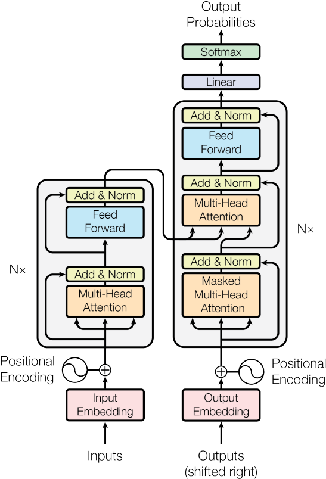
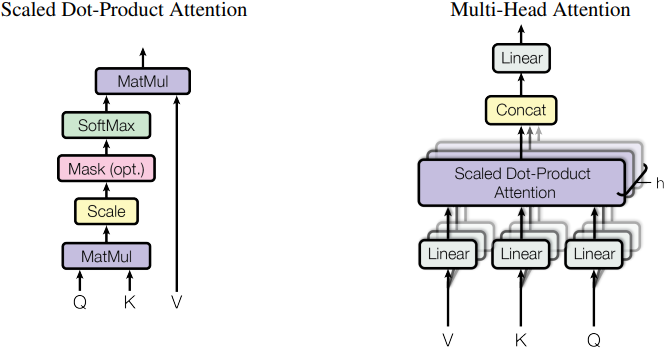

# Attention Is All You Need

Transformer 处理序列输入，序列输出。其中输入和输出的可以不等长。

Non-Autoregressive

交叉注意力机制 Cross-Attention Mechanism

连接 Transformer Encoder 和 Decoder 的模块。

Query 来自于 Decoder，Key 和 Value 来自于 Encoder。

## 0 Abstract

我们提出了一种新的简单网络架构——Transformer，它完全基于注意力机制，无需循环和卷积。
We propose a new simple network architecture, the Transformer, based solely on attention mechanisms, dispensing with recurrence and convolutions entirely.

## 1 Introduction

循环模型通常按照输入和输出序列的符号位置进行计算。它们将位置与计算时间的步长对齐，生成隐藏状态 $h_{t}$ 的序列，作为前一个隐藏状态 $h_{t-1}$ 和位置 $t$ 的输入的函数。**这种固有的序列性质排除了在训练实例中进行并行化的可能性，而在序列长度较长的情况下，这一点变得至关重要，因为内存约束限制了跨实例的批处理。**
Recurrent models typically factor computation along the symbol positions of the input and output sequences. Aligning the positions to steps in computation time, they generate a sequence of hidden states $h_{t}$, as a function of the previous hidden state $h_{t−1}$ and the input for position $t$. **This inherently sequential nature precludes parallelization within training examples, which becomes critical at longer sequence lengths, as memory constraints limit batching across examples.**

在各种任务中，注意力机制已成为引人注目的序列建模和转导模型的一个组成部分，它可以对依赖关系进行建模，而无需考虑其在输入或输出序列中的距离。然而，除了少数情况，这种注意机制都是与循环网络结合使用的。
Attention mechanisms have become an integral part of compelling sequence modeling and transduction models in various tasks, allowing modeling of dependencies without regard to their distance in the input or output sequences. In all but a few cases, however, such attention mechanisms are used in conjunction with a recurrent network.

## 2 Background

## 3 Model Architecture

编码器将输入的符号表示序列 $(x_1,\dots, x_n)$ 映射为连续表示序列 $\mathbf{z} = (z_1,\dots, z_n)$ 。给定 $\mathbb{z}$ 后，解码器会一次一个元素地生成一个由符号组成的输出序列 $(y_1,\dots,y_m)$。在每一步中，模型都是自动回归的，在生成下一步时，会利用之前生成的符号作为额外输入。
The encoder maps an input sequence of symbol representations $(x_1,\dots, x_n)$ to a sequence of continuous representations $\mathbf{z} = (z_1,\dots, z_n)$. Given $\mathbb{z}$, the decoder then generates an output sequence $(y_1,\dots, y_m)$ of symbols one element at a time. At each step the model is auto-regressive , consuming the previously generated symbols as additional input when generating the next.

### 3.1 Encoder and Decoder Stacks

**编码器：** 编码器由 $N = 6$ 层相同的层堆叠组成。每层有两个子层。第一个子层是多头自注意机制，第二个子层是简单的位置全连接前馈网络。我们在两个子层的每个周围都采用了残差连接，然后进行层归一化。也就是说，每个子层的输出都是 $\mathrm{LayerNorm}(x + \mathrm{Sublayer}(x))$，其中 $\mathrm{Sublayer}(x)$ 是子层本身实现的函数。为了方便这些残差连接，模型中的所有子层以及嵌入层都会产生维度为 $d_{\text{model}} = 512$ 的输出。
**Encoder:** The encoder is composed of a stack of $N = 6$ identical layers. Each layer has two sub-layers. The first is a multi-head self-attention mechanism, and the second is a simple, position-wise fully connected feed-forward network. We employ a residual connection around each of the two sub-layers, followed by layer normalization. That is, the output of each sub-layer is $\mathrm{LayerNorm}(x + \mathrm{Sublayer}(x))$, where $\mathrm{Sublayer}(x)$ is the function implemented by the sub-layer itself. To facilitate these residual connections, all sub-layers in the model, as well as the embedding layers, produce outputs of dimension $d_{\text{model}} = 512$.

**解码器：** 解码器也是由 $N = 6$ 个相同层组成。除了每个编码器层中的两个子层外，解码器还插入了第三个子层，对编码器堆栈的输出执行多头关注。与编码器类似，我们在每个子层周围采用残差连接，然后进行层归一化。我们还修改了解码器堆栈中的自关注子层，以防止位置关注到后续位置。这种遮罩，加上输出嵌入偏移一个位置的事实，确保了对位置 $i$ 的预测只能依赖于小于 $i$ 位置的已知输出。
**Decoder:** The decoder is also composed of a stack of $N = 6$ identical layers. In addition to the two sub-layers in each encoder layer, the decoder inserts a third sub-layer, which performs multi-head attention over the output of the encoder stack. Similar to the encoder, we employ residual connections around each of the sub-layers, followed by layer normalization. We also modify the self-attention sub-layer in the decoder stack to prevent positions from attending to subsequent positions. This masking, combined with fact that the output embeddings are offset by one position, ensures that the predictions for position $i$ can depend only on the known outputs at positions less than $i$.

### 3.2 Attention

#### 3.2.1 Scaled Dot-Production Attention

输入包括维度为 $d_k$ 的 Q 和 K，以及维度为 $d_v$ 的 V。我们计算 Q 与所有 K 的点积，将每个点积除以 $\sqrt{d_k}$，然后应用 softmax 获得 V 的权重。
The input consists of queries and keys of dimension $d_k$, and values of dimension $d_v$. We compute the dot products of the query with all keys, divide each by $\sqrt{d_k}$, and apply a softmax function to obtain the weights on the values.
$$
\mathrm{Attention}(Q,K,V)=\mathrm{softmax}\left(\frac{QK^T}{\sqrt{d_k}}\right)V
$$

我们怀疑，对于大的 $d_k$ 值，点积的幅度会越来越大，从而将 softmax 函数推向梯度极小的区域。为了消除这种影响，我们用 $1/\sqrt{d_k}$ 来缩放点积。
We suspect that for large values of $d_k$, the dot products grow large in magnitude, pushing the softmax function into regions where it has extremely small gradients . To counteract this effect, we scale the dot products by $1/\sqrt{d_k}$ .

#### 3.2.2 Multi-Head Attention

多个输出，再过一次全连接得到单个输出。

我们发现，与其使用 $d_{\text{model}}$ 维的 K、V 和 Q 来执行单个注意力函数，不如将 Q、V 和 V 分别线性投影到 $d_k$、$d_k$ 和 $d_v$ 维，并将其线性投影到 $h$ 次。然后，我们对每个 Q、K 和 V 的投影版本并行执行注意力函数，得到 $d_v$ 维的输出值。这些值被串联起来并再次投影，从而得到最终值。
Instead of performing a single attention function with $d_{\text{model}}$-dimensional keys, values and queries, we found it beneficial to linearly project the queries, keys and values $h$ times with different, learned linear projections to $d_k$, $d_k$ and $d_v$ dimensions, respectively. On each of these projected versions of queries, keys and values we then perform the attention function in parallel, yielding $d_v$-dimensional output values. These are concatenated and once again projected, resulting in the final values.
$$
\begin{align*}
\mathrm{MultiHead}(Q, K, V) &= \mathrm{Concat}W^O(\mathrm{head}_1,\dots,\mathrm{head}_h)\\
\mathrm{head}_i&=\mathrm{Attention}(QW_i^Q,KW_i^K,VW_i^V)
\end{align*}
$$

> 输入 $X=(x_1,\dots,x_n)\in\mathbb{R}^{d_k\times n}$
> $$
\begin{align*}
Q&=W^QX\in\mathbb{R}^{d_k\times n}\\
K&=W^KX\in\mathbb{R}^{d_k\times n}\\
V&=W^VX\in\mathbb{R}^{d_v\times n}\\
\mathrm{Attention}(Q,K,V)&=\mathrm{softmax}\left(\frac{QK^T}{\sqrt{d_k}}\right)V\in\mathbb{R}^{d_v\times n}\\
W^Q_i&\in\mathbb{R}^{d_{\text{model}}\times d_k}\\
W^K_i&\in\mathbb{R}^{d_{\text{model}}\times d_k}\\
W^V_i&\in\mathbb{R}^{d_{\text{model}}\times d_v}\\
W^O_i&\in\mathbb{R}^{hd_v\times d_{\text{model}}}\\
\mathrm{head}_i&=\mathrm{Attention}(QW_i^Q,KW_i^K,VW_i^V)\\
\mathrm{MultiHead}(Q, K, V) &= \mathrm{Concat}W^O(\mathrm{head}_1,\dots,\mathrm{head}_h)\in\mathbb{R}^{d_v\times n}
\end{align*}
 $$

其中 $h=8,d_k=d_v=d_{\text{model}}/h=64$.
#### 3.2.3 Application of Attention in our Model

