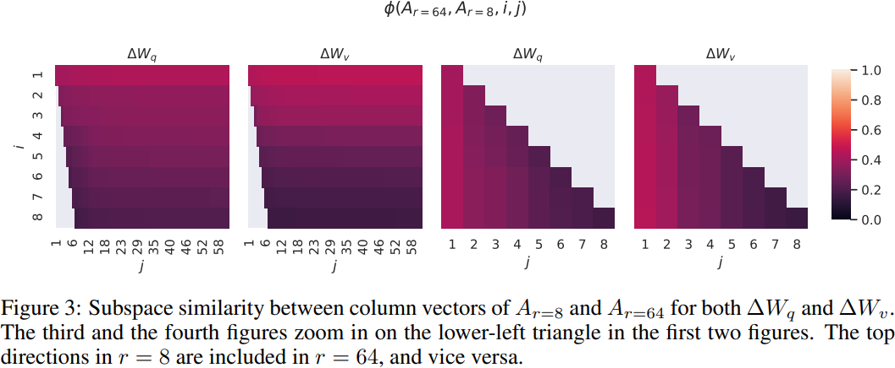

# LoRA: Low-Rank Adaptation of Large Language ModelsLoRA Low-Rank Adaptation of Large Language Models

## 0 Abstract

随着更大的预训练模型，对所有模型参数进行完全微调变得不太可行。我们提出了低秩适应（Low-Rank Adaptation，简称 LoRA）方法，该方法冻结预训练模型的权重，并将可训练的秩分解矩阵注入到 Transformer 架构的每一层中，从而大大减少了用于下游任务的可训练参数的数量。
As we pre-train larger models, full fine-tuning, which retrains all model parameters, becomes less feasible. We propose Low-Rank Adaptation, or LoRA, which freezes the pretrained model weights and injects trainable rank decomposition matrices into each layer of the Transformer architecture, greatly reducing the number of trainable parameters for downstream tasks.

## 1 Introduction

我们假设模型适应过程中权重的变化也具有较低的“内在秩”，从而导致了我们提出的低秩适应（Low-Rank Adaptation，简称LoRA）方法。LoRA 允许我们通过在适应过程中优化密集层的秩分解矩阵，间接地训练神经网络中的一些密集层，同时保持预训练的权重冻结。以 GPT-3 175B 为例，我们展示了即使全秩（即d）高达12,288，仅使用非常低的秩（即 r 可以为一或两）就足够，从而使 LoRA 在存储和计算效率方面都非常高效。
We hypothesize that the change in weights during model adaptation also has a low "intrinsic rank", leading to our proposed Low-Rank Adaptation (LoRA) approach. LoRA allows us to train some dense layers in a neural network indirectly by optimizing rank decomposition matrices of the dense layers’ change during adaptation instead, while keeping the pre-trained weights frozen. Using GPT-3 175B as an example, we show that a very low rank (i.e., r can be one or two) suffices even when the full rank (i.e., d) is as high as 12,288, making LoRA both storage- and compute-efficient.

- 预训练模型可以被共享和用于构建许多不同任务的小型 LoRA 模块。我们可以冻结共享模型，并通过替换矩阵 A 和 B 来高效地切换任务，显著降低了存储需求和任务切换开销。
  A pre-trained model can be shared and used to build many small LoRA modules for different tasks. We can freeze the shared model and efficiently switch tasks by replacing the matrices A and B, reducing the storage requirement and task-switching overhead significantly.
- LoRA 使训练更加高效，并且在使用自适应优化器时，由于我们不需要计算大多数参数的梯度或维护优化器状态，因此硬件入门门槛最多降低了 3 倍。相反，我们只优化注入的、远小于原始模型的低秩矩阵。
  LoRA makes training more efficient and lowers the hardware barrier to entry by up to 3 times when using adaptive optimizers since we do not need to calculate the gradients or maintain the optimizer states for most parameters. Instead, we only optimize the injected, much smaller low-rank matrices.
- 我们简单的线性设计使得在部署时可以将可训练矩阵与冻结权重合并，与完全微调的模型相比，没有引入推断延迟，这是通过构建实现的。
  Our simple linear design allows us to merge the trainable matrices with the frozen weights when deployed, introducing no inference latency compared to a fully fine-tuned model, by construction.
- LoRA与许多先前的方法是正交的，可以与许多方法进行结合，例如前缀微调（prefix-tuning）。
  LoRA is orthogonal to many prior methods and can be combined with many of them, such as prefix-tuning.

## 2 Problem Statement

假设我们有一个由 $\Phi$ 参数化的预训练的自回归语言模型 $P_{\Phi}(y|x)$。每个下游任务都由一个训练数据集 $\mathcal{Z}={(x_i,y_i)}_{N}$ 表示，其中 $x_i$ 和 $y_i$ 都是标记序列。
Suppose we are given a pre-trained autoregressive language model $P_{\Phi}(y|x)$ parametrized by $\Phi$. Each downstream task is represented by a training dataset of context-target pairs: $\mathcal{Z}=\{(x_i,y_i)\}_{N}$, where both $x_i$ and $y_i$ are sequences of tokens.

在完全微调过程中，模型初始化为预训练的权重 $\Phi_0$，并通过重复迭代梯度来最大化条件语言建模目标，更新为 $\Phi_0+\Delta\Phi$：
During full fine-tuning, the model is initialized to pre-trained weights $\Phi_0$ and updated to $\Phi_0+\Delta\Phi$ by repeatedly following the gradient to maximize the conditional language modeling objective:
$$
\max_{\Phi}\sum_{(x,y)\in\mathcal{Z}}\sum_{t=1}^{|y|}\log(P_{\Phi}(y_t|x,y_{<t}))
$$
完全微调的主要缺点之一是，对于每个下游任务，我们学习了一个不同的参数集 $\Delta\Phi$，其维度 $|\Delta\Phi|$ 等于 $|\Phi_0|$。
One of the main drawbacks for full fine-tuning is that for each downstream task, we learn a different set of parameters $\Delta\Phi$ whose dimension $|\Delta\Phi|$  equals $|\Phi_0|$.

这里的任务特定参数增量 $\Delta\Phi=\Delta\Phi(\Theta)$ 被一个更小尺寸的参数集 $\Theta$ 进一步编码，其中 $|\Theta|\ll|\Phi_0|$。
Here the task-specific parameter increment $\Delta\Phi=\Delta\Phi(\Theta)$ is further encoded by a much smaller-sized set of parameters $\Theta$ with $|\Theta|\ll|\Phi_0|$.
$$
\max_{\Phi}\sum_{(x,y)\in\mathcal{Z}}\sum_{t=1}^{|y|}\log(P_{\Phi+\Delta\Phi(\Theta)}(y_t|x,y_{<t}))
$$

## 3 Aren't Existing Solution Good Enough

### Adapter Layers Introduce Inference Latency

### Directly Optimizing the Prompt is Hard

## 4 Our Method

### 4.1 Low-Rank-Parameterized Update Matrices

受到预训练语言模型具有低“内在维度”并且即使随机投影到较小的子空间仍然可以有效学习的启发，我们假设在适应过程中权重的更新也具有低“内在秩”。
Inspired by the pre-trained language models have a low "instrisic dimension" and can still learn efficiently despite a random projection to a smaller subspace, we hypothesize the updates to the weights also have a low "intrinsic rank" during adaptation.

对于预训练的权重矩阵 $W_0\in\mathbb{R}^{d\times k}$，我们通过使用低秩分解 $W_0 + \Delta W = W_0 + BA$ 来限制其更新，其中 $B \in \mathbb{R}^{d\times r}$，$A \in \mathbb{R}^{r\times k}$，并且秩 $r \ll \min(d, k)$。在训练过程中，$W_0$ 是冻结的并且不接收梯度更新，而 $A$ 和 $B$ 包含可训练的参数。注意 $W_0$ 和 $\Delta W = BA$ 都与相同的输入相乘，并且它们各自的输出向量按坐标逐项求和。对于 $h = W_0x$，我们修改后的前向传播产生：
For a pre-trained weight matrix $W_0\in\mathbb{R}^{d\times k}$ , we constrain its update by representing the latter with a low-rank decomposition $W_0 + \Delta W = W_0 + BA$, where $B \in \mathbb{R}^{d\times r}$, $A \in \mathbb{R}^{r\times k}$ , and the rank$r \ll \min(d, k)$. During training, $W_0$ is frozen and does not receive gradient updates, while $A$ and $B$ contain trainable parameters. Note both $W_0$ and $\Delta W = BA$ are multiplied with the same input, and their respective output vectors are summed coordinate-wise. For $h = W_0x$, our modified forward pass yields:
$$
h=W_0x+\Delta Wx=W_0x+BAx
$$

我们对 $A$ 使用随机高斯初始化，对 B 使用零初始化，因此在训练开始时，$\Delta W = BA$ 为零。然后，我们将 $\Delta Wx$ 按照 $\alpha/r$ 进行缩放，其中 $\alpha$ 是 $r$ 表达的常数。当使用 Adam 进行优化时，如果我们适当地调整初始化，则调整 $\alpha$ 大致上与调整学习率相同。因此，我们简单地将 $\alpha$ 设置为我们尝试的第一个 $r$，并且不对其进行调整。这种缩放有助于减少在改变 $r$ 时重新调整超参数的需要。
We use a random Gaussian initialization for $A$ and zero for $B$, so $\Delta W = BA$ is zero at the beginning of training. We then scale $\Delta Wx$ by $\alpha/r$, where $\alpha$ is a constant in $r$. When optimizing with Adam, tuning $\alpha$ is roughly the same as tuning the learning rate if we scale the initialization appropriately. As a result, we simply set $\alpha$ to the first $r$ we try and do not tune it. This scaling helps to reduce the need to retune hyperparameters when we vary $r$.

#### A Generalization of Full Fine-tuning

#### No Additional Inference Latency

### 4.2 Applying LoRA to Transformer

在 Transformer 架构中，自注意力模块中有四个权重矩阵（$W_q$，$W_k$，$W_v$，$W_o$）和 MLP 模块中的两个。我们将 $W_q$（或 $W_k$, $W_v$）视为一个维度为 $d_{\text{model}} \times d_{\text{model}}$ 的单一矩阵，尽管输出维度通常被切片成注意力头。我们将我们的研究限制在仅适应下游任务的注意力权重，并冻结 MLP 模块（因此它们在下游任务中不进行训练），既为了简单性也为了参数效率。
In the Transformer architecture, there are four weight matrices in the self-attention module ($W_q$, $W_k$, $W_v$, $W_o$) and two in the MLP module. We treat $W_q$ (or $W_k$, $W_v$) as a single matrix of dimension $d_{\text{model}} \times d_{\text{model}}$, even though the output dimension is usually sliced into attention heads. We limit our study to only adapting the attention weights for downstream tasks and freeze the MLP modules (so they are not trained in downstream tasks) both for simplicity and parameter-efficiency.

#### Practical Benifits and Limitations

## 5 Empirical Experiments

## 6 Related Works

## 7 Understanding the Low-Rank Updates

- 给定参数预算约束，我们应该调整预训练 Transformer 中的哪个权重子集以最大化下游性能？
  Given a parameter budget constraint, which subset of weight matrices in a pre-trained Transformer should we adapt to maximize downstream performance?
- “最优”适应矩阵 $\Delta W$ 真的是秩不足的吗？如果是，那么在实践中使用什么秩比较好？
  Is the “optimal” adaptation matrix $\Delta W$ really rankdeficient? If so, what is a good rank to use in practice?
- $\Delta W$ 和 $W$ 之间有什么联系？$\Delta W$ 与 $W$ 高度相关吗？与 $W$ 相比，$\Delta W$ 有多大？
  What is the connection between $\Delta W$ and $W$? Does $\Delta W$ highly correlate with $W$? How large is $\Delta W$ comparing to W?

### 7.1 Which Weight Matrices in Transformer Should We Apply LoRA to

我们为 GPT-3 175B 设置了一个参数预算为 18M（如果以 FP16 存储，大约为 35MB），对于所有 96 层，如果我们调整一种类型的注意力权重，则 $r = 8$，或者如果我们调整两种类型，则 $r = 4$，。
We set a parameter budget of 18M (roughly 35MB if stored in FP16) on GPT-3 175B, which corresponds to $r = 8$ if we adapt one type of attention weights or $r = 4$ if we adapt two types, for all 96 layers.

|Weight Type|$W_q$|$W_k$|$W_v$|$W_o$|$W_q,W_k$|$W_q,W_v$|$W_q,W_k,W_v,W_o$|
|:-----------:|:---:|:---:|:---:|:---:|:-------:|:-------:|:---------------:|
|Rank $r$|8|8|8|8|4|4|2|
|WikiSQL|70.4|70.0|73.0|73.2|71.4|**73.7**|**73.7**|
|MultiNLI|91.0|90.8|91.0|91.3|91.3|91.3|91.7|

请注意，将所有参数放入 $\Delta W_q$ 或 $\Delta W_v$ 会导致性能显著降低，而同时调整 $W_q$ 和 $W_v$ 会产生最好的结果。这表明，即使是 $r=4$ 也能在 $\Delta W$ 中捕获足够的信息，因此比起使用更大秩的单一类型权重进行调整，更倾向于调整更多的权重矩阵。
Note that putting all the parameters in $\Delta W_q$ or $\Delta W_q$ results in significantly lower performance, while adapting both $W_q$ and $W_v$ yields the best result. This suggests that even a rank of four captures enough information in $\Delta W$ such that it is preferable to adapt more weight matrices than adapting a single type of weights with a larger rank.

### 7.2 What is the Optimal Rank $r$ for LoRA

| |Weight Type|$r=1$|$r=2$|$r=4$|$r=8$|$r=16$|
|:------:|:-----------:|:---:|:---:|:---:|:---:|:---:|
|WikiSQL|$W_q$|68.8|69.6|70.5|70.4|70.0|
|WikiSQL|$W_q,W_v$|73.4|73.3|73.7|73.8|73.5|
|WikiSQL|$W_q,W_k,W_v,W_o$|**74.1**|73.7|74.0|74.0|73.9|
|MultiNLI|$W_q$|90.7|90.9|91.1|90.7|90.7|
|MultiNLI|$W_q,W_v$|91.3|91.4|91.3|91.6|91.4|
|MultiNLI|$W_q,W_k,W_v,W_o$|91.2|91.7|**91.7**|91.5|91.4|

#### Subspace similarity between different $r$

给定 $A_{r=8}$ 和 $A_{r=64}$，它们是使用同一预训练模型学习得到的秩为 $r = 8$ 和 $64$ 的适应矩阵，我们进行奇异值分解并得到右奇异单位矩阵 $U_{A_{r=8}}$ 和 $U_{A_{r=64}}$。我们希望回答：在 $U_{A_{r=8}}$ 中由前 $i$ 个奇异向量（$1 \le i \le 8$）张成的子空间有多少包含在由 $U_{A_{r=64}}$ 的前 $j$ 个奇异向量（$1 \le j \le 64$）张成的子空间中？我们使用基于 Grassmann 距离的归一化子空间相似度来衡量这个数量：
Given $A_{r=8}$ and $A_{r=64}$ which are the learned adaptation matrices with rank $r = 8$ and $64$ using the same pre-trained model, we perform singular value decomposition and obtain the right-singular unitary matrices $U_{A_{r=8}}$ and $U_{A_{r=64}}$. We hope to answer: how much of the subspace spanned by the top $i$ singular vectors in $U_{A_{r=8}}$ (for $1 \le i \le 8$) is contained in the subspace spanned by top $j$ singular vectors of $U_{A_{r=64}}$ (for $1 \le i \le 64$)? We measure this quantity with a normalized subspace similarity based on the Grassmann distance:
$$
\phi(A_{r=8},A_{r=64},i,j)=\frac{\|{U^i_{A_{r=8}}}^TU^j_{A_{r=64}}\|^2_F}{\min(i,j)}\in[0,1]
$$
$U^i_{A_{r=8}}$ 是第 $i$ 个奇异向量对应的列向量。0 表示不接近，1 表示完全匹配。

对应于顶部奇异向量的方向在 $A_{r=8}$ 和 $A_{r=64}$ 之间有显著的重叠，而其他的则没有。具体来说， $A_{r=8}$ 的 $\Delta W_v$（或 $\Delta W_q$）和 $A_{r=64}$ 的 $\Delta W_v$（或 $\Delta W_q$）共享一个维度为 1 的子空间，其归一化相似度大于 0.5，这为我们在 GPT-3 下游任务中 $r = 1$ 表现相当好提供了解释。
Directions corresponding to the top singular vector overlap significantly between $A_{r=8}$ and $A_{r=64}$, while others do not. Specifically, $\Delta W_v$ (resp. $\Delta W_q$) of $A_{r=8}$ and $\Delta W_v$ (resp. $\Delta W_q$) of $A_{r=64}$ share a subspace of dimension 1 with normalized similarity $> 0.5$, providing an explanation of why $r = 1$ performs quite well in our downstream tasks for GPT-3.

#### Subspace similarity between different random seed

$\Delta W_q$ appears to have a higher "intrinsic rank" than $\Delta W_v$.

### 7.3 How Does the Adaptation Matrix $\Delta W$ Compare to $W$?

首先，$\Delta W$ 与 $W$ 的相关性比随机矩阵更强，这表明 $\Delta W$ 放大了 $W$ 中已有的一些特征。其次，$\Delta W$ 并未重复 $W$ 的顶部奇异方向，而只是放大了 $W$ 中未被强调的方向。第三，放大因子相当大：对于 $r = 4$，其值为 $21.5 \approx \frac{6.91}{0.32}$。
First, $\Delta W$ has a stronger correlation with $W$ compared to a random matrix, indicating that $\Delta W$ amplifies some features that are already in $W$. Second, instead of repeating the top singular directions of $W$, $\Delta W$ only amplifies directions that are not emphasized in $W$. Third, the amplification factor is rather huge: $21.5 \approx 6.91/0.32$ for $r = 4$.
