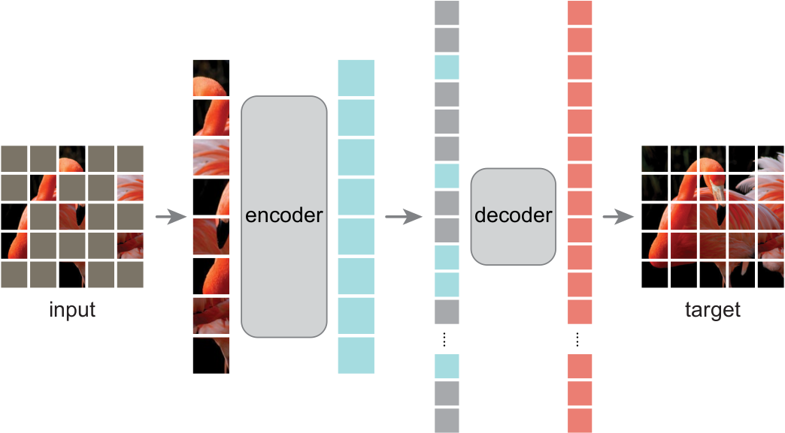
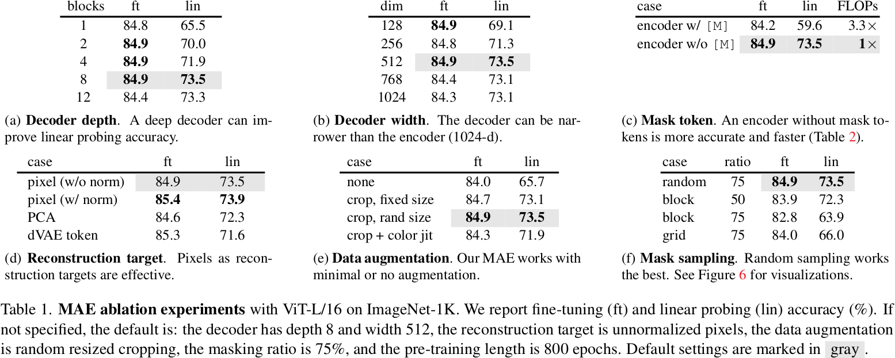

# Mask Autoencoder Are Scalable Vision Learners

MAE 最突出的贡献就是提出了预训练视觉大模型。第二个贡献就是纠正了 Linear Probing 的错误观点。

## 0 Abstract

我们遮蔽输入图像中的随机块，并重建缺失的像素。
We mask random patches of the input image and reconstruct the missing pixels.

首先，我们开发了一种非对称编码器-解码器架构，其中的编码器只对可见块子集（不含遮罩标记）进行编码，而轻量级解码器则根据潜在表示和遮罩标记重建原始图像。
First, we develop an asymmetric encoder-decoder architecture, with an encoder that operates only on the visible subset of patches (without mask tokens), along with a lightweight decoder that reconstructs the original image from the latent representation and mask tokens.

其次，我们发现，对输入图像的高比例（例如 75%）进行遮蔽，可以产生非难且有意义的自我监督任务。
Second, we find that masking a high proportion of the input image, e.g., 75%, yields a nontrivial and meaningful self-supervisory task.

我们的可扩展方法允许学习具有良好泛化能力的高容量模型：例如，在仅使用 ImageNet-1K 数据的方法中，ViT-Huge 模型的准确率最高（87.8%）。
Our scalable approach allows for learning high-capacity models that generalize well: e.g., a vanilla ViT-Huge model achieves the best accuracy (87.8%) among methods that use only ImageNet-1K data.

在下游任务中的转移性能优于监督预训练，并显示出良好的扩展性。
Transfer performance in downstream tasks outperforms supervised pre-training and shows promising scaling behavior.

## 1 Introduction

这些解决方案基于 GPT 中的自回归语言建模和 BERT 中的遮罩自动编码，概念上非常简单：它们移除部分数据并学习预测移除的内容。现在，这些方法可以训练包含一千多亿个参数的通用 NLP 模型。
The solutions, based on autoregressive language modeling in GPT and masked autoencoding in BERT, are conceptually simple: they remove a portion of the data and learn to predict the removed content. These methods now enable training of generalizable NLP models containing over one hundred billion parameters.

是什么让视觉和语言之间的遮罩自编码有所不同？
What makes masked autoencoding different between vision and language?

1. 架构不同： 卷积通常是在规则网格上运行的，将遮罩标记或位置嵌入等“指标”整合到卷积网络中并不简单。不过，随着视觉转换器（ViT）的引入，这一架构上的缺陷已经得到解决，应该不会再构成障碍。
   Architectures were different: Convolutions typically operate on regular grids and it is not straightforward to integrate 'indicators' such as mask tokens or positional embeddings into convolutional networks. This architectural gap, however, has been addressed with the introduction of Vision Transformers (ViT) and should no longer present an obstacle.
2. 信息密度： 语言是人类生成的信号，具有高度的语义和信息密度。相反，图像是空间冗余度很高的自然信号。
   Information density: Languages are human-generated signals that are highly semantic and information-dense. Images, on the contrary, are natural signals with heavy spatial redundancy.
3. 解码器：在视觉中，解码器重建的是像素，因此其输出的语义水平低于普通的识别任务。这与语言不同，在语言中，解码器会预测包含丰富语义信息的缺失单词。在 BERT 中，解码器可以是微不足道的（一个 MLP），但我们发现，对于图像而言，解码器的设计在决定所学潜在表征的语义水平方面起着关键作用。
   Decoder: In vision, the decoder reconstructs pixels, hence its output is of a lower semantic level than common recognition tasks. This is in contrast to language, where the decoder predicts missing words that contain rich semantic information. While in BERT the decoder can be trivial (an MLP), we found that for images, the decoder design plays a key role in determining the semantic level of the learned latent representations.

我们的 MAE 遮罩输入图像中的随机块，并在像素空间中重建缺失的块。它采用非对称编码器-解码器设计。我们的编码器只对可见的补丁子集（不含遮罩标记）进行操作，而我们的解码器是轻量级的，可从潜在表示和遮罩标记中重建输入。在我们的非对称编码器-解码器中，将遮罩标记转移到小型解码器上可大大减少计算量。
Our MAE masks random patches from the input image and reconstructs the missing patches in the pixel space. It has an asymmetric encoder-decoder design. Our encoder operates only on the visible subset of patches (without mask tokens), and our decoder is lightweight and reconstructs the input from the latent representation along with mask tokens. Shifting the mask tokens to the small decoder in our asymmetric encoder-decoder results in a large reduction in computation. 

## 2 Related Work

## 3 Approach

编码器将观察到的信号映射到潜在表示，解码器则从潜在表示重建原始信号。
An encoder that maps the observed signal to a latent representation, and a decoder that reconstructs the original signal from the latent representation.

### Masking

按照 ViT 的方法，我们将图像划分为规则的非重叠块。我们按照均匀分布，对随机块进行无替换抽样。
Following ViT, we divide an image into regular non-overlapping patches. We sample random patches without replacement, following a uniform distribution.

### MAE encoder

我们的编码器是一种 ViT，但只适用于可见的、未遮挡的补丁。与标准的 ViT 一样，我们的编码器也是通过线性投影嵌入补丁，并添加位置嵌入，然后通过一系列变换器模块处理生成的集合。
Our encoder is a ViT but applied only on visible, unmasked patches. Just as in a standard ViT, our encoder embeds patches by a linear projection with added positional embeddings, and then processes the resulting set via a series of Transformer blocks.

### MAE decoder

MAE 解码器的输入是一整套标记，包括 (i) 已编码的可见块和 (ii) 遮罩标记。每个遮罩标记都是一个共享的、经过学习的向量，用于指示是否存在待预测的缺失补丁。我们为全套标记中的所有标记添加了位置嵌入；如果没有位置嵌入，遮罩标记在图像中就没有位置信息。解码器还有一系列变换器模块。
The input to the MAE decoder is the full set of tokens consisting of (i) encoded visible patches, and (ii) mask tokens. Each mask token is a shared, learned vector that indicates the presence of a missing patch to be predicted. We add positional embeddings to all tokens in this full set; without this, mask tokens would have no information about their location in the image. The decoder has another series of Transformer blocks.

MAE 解码器仅在预训练期间用于执行图像重建任务（只有编码器用于生成用于识别的图像表征）。因此，解码器结构可以灵活设计，与编码器设计无关。我们试验了非常小的解码器，比编码器更窄更浅。
The MAE decoder is only used during pre-training to perform the image reconstruction task (only the encoder is used to produce image representations for recognition). Therefore, the decoder architecture can be flexibly designed in a manner that is independent of the encoder design. We experiment with very small decoders, narrower and shallower than the encoder.

### Reconstruction target

预测每个遮蔽补丁的像素值： 解码器输出中的每个元素都是代表一个补丁的像素值向量。解码器的最后一层是一个线性投影，其输出通道数等于补丁中像素值的数量。
Predicting the pixel values for each masked patch: Each element in the decoder’s output is a vector of pixel values representing a patch. The last layer of the decoder is a linear projection whose number of output channels equals the number of pixel values in a patch.

我们的损失函数计算的是像素空间中重建图像和原始图像之间的均方误差 (MSE)。我们只对遮蔽块计算损失。这种选择纯粹是结果驱动的：计算所有像素的损失会导致精确度的轻微下降（例如，0.5%）。
Our loss function computes the mean squared error (MSE) between the reconstructed and original images in the pixel space. We compute the loss only on masked patches. This choice is purely result-driven: computing the loss on all pixels leads to a slight decrease in accuracy (e.g., ∼0.5%).

我们还研究了一种变体，其重建目标是每个遮罩块的归一化像素值。具体来说，我们计算了一个块中所有像素的平均值和标准偏差，并用它们对该块进行归一化处理。在我们的实验中，使用归一化像素作为重建目标可以提高表示质量。
We also study a variant whose reconstruction target is the normalized pixel values of each masked patch. Specifically, we compute the mean and standard deviation of all pixels in a patch and use them to normalize this patch. Using normalized pixels as the reconstruction target improves representation quality in our experiments.

### Simple implementation

首先，我们为每个输入补丁生成一个标记（通过线性投影并添加位置嵌入）。接下来，我们根据遮罩率随机洗牌标记列表，并移除列表的最后一部分。编码完成后，我们会将遮罩标记列表添加到已编码的补丁列表中，然后取消洗牌（反转随机洗牌操作），使所有标记与其目标对齐。解码器将应用于这个完整列表（添加了位置嵌入）。
First we generate a token for every input patch (by linear projection with an added positional embedding). Next we randomly shuffle the list of tokens and remove the last portion of the list, based on the masking ratio. After encoding, we append a list of mask tokens to the list of encoded patches, and unshuffle this full list (inverting the random shuffle operation) to align all tokens with their targets. The decoder is applied to this full list (with positional embeddings added).

## 4 ImageNet Experiments

#### Baseline: ViT-Large

我们注意到，从头开始训练有监督的 ViT-L 并非易事，需要一个具有强正则化（82.5%）的好方法。即便如此，我们的 MAE 预训练还是带来了很大的改进。这里的微调仅为 50 个 epoch（与从头开始的 200 个 epoch 相比），这意味着微调的准确性在很大程度上取决于预训练。
We note that it is nontrivial to train supervised ViT-L from scratch and a good recipe with strong regularization is needed (82.5%). Even so, our MAE pre-training contributes a big improvement. Here fine-tuning is only for 50 epochs (vs. 200 from scratch), implying that the fine-tuning accuracy heavily depends on pre-training.

### 4.1 Main Properties

75% 的遮罩比对于线性探测和微调都很有利。这种表现与 BERT 形成鲜明对比，后者的典型遮蔽率为 15%。我们的遮蔽率也远高于计算机视觉领域的相关研究（20% 至 50%）。
The ratio of 75% is good for both linear probing and fine-tuning. This behavior is in contrast with BERT, whose typical masking ratio is 15%. Our masking ratios are also much higher than those in related works in computer vision (20% to 50%).

该模型可以推断出缺失的块，从而产生不同但合理的输出结果。该模型能够理解物体和场景的整体结构，而这些结构并不能简单地通过扩展线条或纹理来完成。
The model infers missing patches to produce different, yet plausible, outputs. It makes sense of the gestalt of objects and scenes, which cannot be simply completed by extending lines or textures.

对于线性探测，准确率会随着遮挡率的增加而稳步上升，直至达到最佳点：准确率差距高达约 20%（54.6% 对 73.5%）。对于微调，结果对比率的敏感度较低，各种掩蔽比率（40%-80%）都能很好地发挥作用。图 5 中的所有微调结果都优于从头开始训练的结果（82.5%）。
For linear probing, the accuracy increases steadily with the masking ratio until the sweet point: the accuracy gap is up to ~20% (54.6% vs. 73.5%). For fine-tuning, the results are less sensitive to the ratios, and a wide range of masking ratios (40-80%) work well. All fine-tuning results in Figure 5 are better than training from scratch (82.5%).

#### Decoder design

足够深度的解码器对于线性探测非常重要。这可以用像素重构任务与识别任务之间的差距来解释：自动编码器的最后几层对于重构更为专业，但与识别的相关性较低。合理深度的解码器可以考虑重构专业化，将潜在表征留在更抽象的层次上。这种设计可使线性探测效率提高 8%。
A sufficiently deep decoder is important for linear probing. This can be explained by the gap between a pixel reconstruction task and a recognition task: the last several layers in an autoencoder are more specialized for reconstruction, but are less relevant for recognition. A reasonably deep decoder can account for the reconstruction specialization, leaving the latent representations at a more abstract level. This design can yield up to 8% improvement in linear probing.

如果使用微调，编码器的最后几层也可以进行调整，以适应识别任务。解码器深度对改进微调的影响较小。
If fine-tuning is used, the last layers of the encoder can be tuned to adapt to the recognition task. The decoder depth is less influential for improving fine-tuning.

有趣的是，我们采用单块解码器的 MAE 在微调后的表现非常出色（84.8%）。需要注意的是，将信息从可见标记传播到遮罩标记只需要一个变换器块。这种小型解码器可以进一步加快训练速度。
Interestingly, our MAE with a single-block decoder can perform strongly with fine-tuning (84.8%). Note that a single Transformer block is the minimal requirement to propagate information from visible tokens to mask tokens. Such a small decoder can further speed up training.

解码器深度为 8，宽度为 512，重建目标为未归一化像素，数据增强为随机大小裁剪，遮蔽率为 75%，预训练长度为 800 epoch。
The decoder has depth 8 and width 512, the reconstruction target is unnormalized pixels, the data augmentation is random resized cropping, the masking ratio is 75%, and the pre-training length is 800 epochs.

#### Mask token

如果编码器使用遮罩标记，它的表现会更糟：在线性探测中，它的准确率下降了 14%。在这种情况下，预训练和部署之间存在差距：在预训练中，该编码器的输入中有很大一部分遮罩标记，而在未损坏的图像中不存在这种标记。此外，通过跳过编码器中的遮罩标记，我们大大减少了训练计算量。
If the encoder uses mask tokens, it performs worse: its accuracy drops by 14% in linear probing. In this case, there is a gap between pre-training and deploying: this encoder has a large portion of mask tokens in its input in pre-training, which does not exist in uncorrupted images. Moreover, by skipping the mask token in the encoder, we greatly reduce training computation.

#### Reconstruction target

使用归一化像素可提高精确度。这种按块归一化的方法可以增强局部对比度。在另一种变体中，我们在块空间中执行 PCA，并使用最大的 PCA 系数（此处为 96）作为目标。这样做会降低准确度。这两项实验都表明，高频成分在我们的方法中非常有用。
Using pixels with normalization improves accuracy. This per-patch normalization enhances the contrast locally. In another variant, we perform PCA in the patch space and use the largest PCA coefficients (96 here) as the target. Doing so degrades accuracy. Both experiments suggest that the high-frequency components are useful in our method.

我们还比较了预测标记的 MAE 变体，即 BEiT 中使用的目标。具体到这个变体，我们使用 DALLE 预训练的 dVAE 作为标记符。在这里，MAE 解码器使用交叉熵损失来预测标记索引。与未归一化的像素相比，这种标记化方法将微调精度提高了 0.4%，但与归一化的像素相比则没有优势。它还降低了线性探测精度。
We also compare an MAE variant that predicts tokens, the target used in BEiT. Specifically for this variant, we use the DALLE pre-trained dVAE as the tokenizer. Here the MAE decoder predicts the token indices using cross-entropy loss. This tokenization improves fine-tuning accuracy by 0.4% vs. unnormalized pixels, but has no advantage vs. normalized pixels. It also reduces linear probing accuracy.

dVAE 标记器需要多一个预训练阶段，这可能取决于额外的数据（2.5 亿张图像）。dVAE 编码器是一个大型卷积网络（FLOPs 是 ViT-L 的 40%），会增加不小的开销。使用像素则不存在这些问题。
The dVAE tokenizer requires one more pre-training stage, which may depend on extra data (250M images). The dVAE encoder is a large convolutional network (40% FLOPs of ViT-L) and adds nontrivial overhead. Using pixels does not suffer from these problems.

#### Data augmentation

我们的 MAE 在使用固定尺寸或随机尺寸（都有随机水平翻转）的纯裁剪增强时效果很好。添加颜色抖动会降低效果，因此我们在其他实验中没有使用。
Our MAE works well using cropping-only augmentation, either fixed-size or random-size (both having random horizontal flipping). Adding color jittering degrades the results and so we do not use it in other experiments.

在 MAE 中，数据扩增的作用主要是通过随机遮罩来实现的。每次迭代的遮罩都是不同的，因此无论数据扩增与否，它们都会产生新的训练样本。遮罩会增加前置任务的难度，因此需要较少的增强来规范化训练。
In MAE, the role of data augmentation is mainly performed by random masking. The masks are different for each iteration and so they generate new training samples regardless of data augmentation. The pretext task is made difficult by masking and requires less augmentation to regularize training.

#### Mask sampling strategy

Simple random sampling works the best for our MAE.

#### Training scheduler

### 4.2 Comparisons with Previous Results

#### Comparisons with self-supervised methods

1600 epochs, 31 hours, 128 TPU-v3 cores.

#### Comparisons with supervised pre-training

### 4.3 Partial Fine-tuning

表 1 显示，线性探测和微调结果基本不相关。在过去几年中，线性探测一直是一种流行的协议；然而，它错失了追求强大但非线性特征的机会--而这正是深度学习的优势所在。作为中间方案，我们研究了一种部分微调协议：在冻结其他层的同时，微调最后几层。
Table 1 shows that linear probing and fine-tuning results are largely uncorrelated. Linear probing has been a popular protocol in the past few years; however, it misses the opportunity of pursuing strong but non-linear features--which is indeed a strength of deep learning. As a middle ground, we study a partial fine-tuning protocol: fine-tune the last several layers while freezing the others.

值得注意的是，只对一个 Transformer 块进行微调，准确率就会从 73.5% 显著提高到 81.0%。此外，如果我们只微调最后一个块的 "一半"（即它的 MLP 子区块），我们可以得到 79.1%，比线性探测要好得多。这一变体实质上是对 MLP 头进行微调。微调几个区块（如 4 或 6 个）可以达到接近完全微调的精度。
Notably, fine-tuning only one Transformer block boosts the accuracy significantly from 73.5% to 81.0%. Moreover, if we fine-tune only "half" of the last block (i.e., its MLP sub-block), we can get 79.1%, much better than linear probing. This variant is essentially fine-tuning an MLP head. Fine-tuning a few blocks (e.g., 4 or 6) can achieve accuracy close to full fine-tuning.

这些观察结果表明，线性可分性并不是评估表征质量的唯一标准。我们还观察到，线性探测与迁移学习性能的相关性并不高，例如在物体检测方面。据我们所知，线性评估并不常用于 NLP 的预训练基准。
These observations suggest that linear separability is not the sole metric for evaluating representation quality. It has also been observed that linear probing is not well correlated with transfer learning performance, e.g., for object detection. To our knowledge, linear evaluation is not often used in NLP for benchmarking pre-training.

## 5 Transfer Learning Experiments

#### Object detection and segementation

#### Semantic segmentation

#### Classification tasks

#### Pixels vs. tokens

## 6 Discussion and Conclusion

