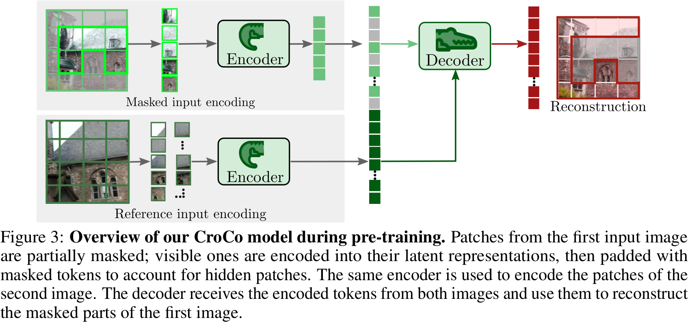
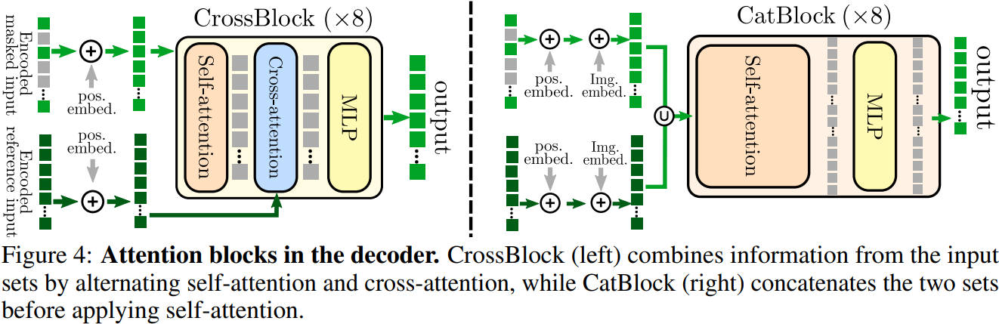

# CroCo: Self-Supervised Pre-training for 3D Vision Tasks by Cross-View Completion

## 0 Abstract

将视觉表达的学习任务迁移到 3D 视觉相关的任务上，而 3D 视觉相关的任务大多是像素级别的任务，例如深度估计和光流估计。因此提出了相同场景，不同视角的图像对，无监督学习的训练范式。具体来说，第一张输入图像被部分遮挡，而被遮挡的内容必须从可见内容和第二张图像中重建。如果模型能够理解两幅图像之间的空间关系，就可以通过第二幅未遮挡图像的跨视角补全来解决这种模糊性。

## 1 Introduction

90% Mask Ratio 效果最好。

## 3 Cross-view Completion Pre-training

Encoder:
1. Image Size $224 \times 224$，Patch Size $16 \times 16$。
2. 10% 的图一 + 100% 的图二作输入。

Decoder: 选择了图例 4 中的左边的
1. 先图一自注意力，再图一和图二交叉注意力，再 MLP。
2. 10% 的图一 + 90 % Learnable Mask Token + 100% 的图二作输入。

Loss: 和 MAE 相同。
