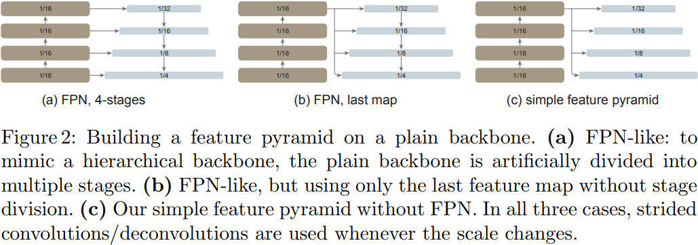
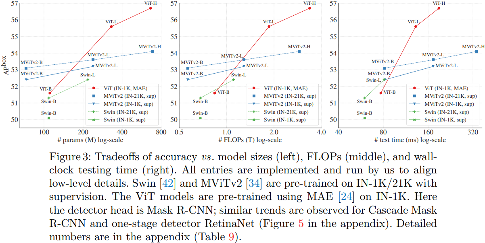

# Exploring Plain Vision Transformer Backbones

这篇文章想说明以下几件事情：

1. 如果想要把主干网络和检测头分离开，那么普通、无层次结构的 ViT 可以作为目标检测任务的主干网络。这是和基于 CNN 方法的目标检测任务和 Swin Transformer 等工作做对比。
2. 可以作为不代表足够优秀，因此作者进一步探索发现，取 ViT Encoder 最后一层的特征做特征金字塔（取代传统 FPN 的形式）送入 Mask R-CNN/ Cascade Mask R-CNN 网络也能达到比较好的效果。
3. 物体检测任务中，高分辨率图像能产生更好的效果，但是高分辨率图像的全局自注意力计算量太大了。改进的方法可以是直接更改注意力的方法计算方式，但是就需要从预训练步骤开始改变。在调优的任务中，作者尝试尽量使用窗口注意力，并且不使用滑动窗口，而是在选定的几个 Encoder Block 中使用全局自注意力或者卷积残差。预训练模型 Encoder 的权重可以很好的注入到下游任务的 Encoder 中。
4. 预训练，或者是自监督模型通用的理由：标注数据的稀缺性。特别是经过实验发现，自监督预训练的效果比监督的效果还要好。但是如何将预训练模型塞入下游任务还需要结合代码查看。

## 0 Abstract

普通、无层次的 ViT 可以微调后进行物体检测，而无需重新设计用于预训练的层次化主干。
1. 从单一尺度的特征图中建立一个简单的特征金字塔即可（无需常见的 FPN 设计）
2. 只需使用窗口注意力（无滑动窗口），并辅以极少量的跨窗口传播块即可。
3. ViTDet 使用简单的 ViT 骨架和 MAE 进行预训练的情况下，可以与之前所有基于分层骨架的领先方法相媲美，在 COCO 数据集上仅使用 ImageNet-1K 进行预训练就可达到 61.3 APbox。

## 1 Introduction

现代物体检测器一般由一个与检测任务无关的主干特征提取器和一组包含特定检测先验知识的颈部和头部组成，一般来说是 ROI、RPN、FPN。长期以来，由于卷积网络的设计，这些主干都是多尺度、分层式架构，这在很大程度上影响了用于检测多尺度物体（如 FPN）的颈部/头部设计。

我们探索了只使用普通、无层次的主干的物体检测器，并且将预训练设计与微调需求分离开来，保持了上游与下游任务的独立性，这也是更少的“归纳偏置”的体现。全局的自注意力计算可以学习平移不变特征，也可以从某些形式的监督或自监督预训练种学习尺度不变特征。

我们的检测器仅从普通 ViT 主干的最后一个特征图中构建一个简单的特征金字塔。为了从高分辨率图像中高效提取特征，我们的检测器使用了简单的非重叠窗口关注（无滑动窗口）。少量的交叉窗口块（如 4 个）（可能是全局注意力或卷积）用于传播信息。这些调整仅在微调过程中进行，不会改变预训练。

在普通 ViT 主干的情况下，FPN 的设计并不是必需的，通过一个由大跨度（16）、单尺度地图构建的简单金字塔，可以有效地获得其优势。我们还发现，只要信息在少量层中的窗口间传播良好，窗口注意力就足够了。

## 2 Related Work

## 3 Method

### 3.1 Simple Feature Pyramid

1. 如果主干是分层的，那么 FPN 的动机就是将前期阶段的高分辨率特征和后期阶段的强特征结合起来。
2. 如果主干是无层次的，我们只使用主干中的最后一个特征图，它应该具有最强的特征。在这个图上，我们并行应用一组卷积或反卷积，以生成多尺度特征图。具体来说，默认的 ViT 特征图比例尺为 $1/16$（步长 = 16），我们使用步长 $\{2, 1, 1/2, 1/4\}$ 的卷积生成比例尺为 $\{1/32, 1/16, 1/8, 1/4\}$ 的特征图，其中分数步长表示反卷积。我们称之为“简单特征金字塔”。

在分层主干中，上采样通常需要横向连接的帮助；而在普通 ViT 主干中，我们根据经验发现这不必要，简单的反卷积就足够了。我们假设这是因为 ViT 可以依靠位置嵌入（positional embedding）来编码位置，而且高维 ViT 补丁嵌入并不一定会丢弃信息。

### Backbone Adaption

物体检测器可以从高分辨率的输入图像中获益，但在整个主干系统中计算全局自注意力会占用大量内存，而且速度很慢。在本研究中，我们将重点放在预训练主干执行全局自注意力的情景上，然后在微调过程中适应更高分辨率的输入。

1. 我们探索使用窗口注意力和一些交叉窗口块。在微调过程中，给定一个高分辨率的特征图，我们将其划分为规则的非重叠窗口。
2. 为了允许信息传播，我们使用极少数（默认为 4 个）可以跨窗口的区块。
	1. 全局传播。在每个子集的最后一个块中执行全局自注意力。
	2. 卷积传播。我们在每个子集之后添加一个额外的卷积块。卷积块中的最后一层被初始化为零，这样卷积块的初始状态就是一个恒等映射。将区块初始化为恒等映射后，我们就可以将其插入预训练主干的任何位置，而不会破坏主干的初始状态。

### Discussion

### Implementation

## 4 Experiments

### 4.1 Ablation Study and Analysis

#### 4.1.1 A Simple Feature Pyramid is Sufficient

最初的 FPN 是通过将较低分辨率、较强的特征图与较高分辨率、较弱的特征图相结合而产生的。如果主干是普通的，没有高分辨率映射，那么这一基础就会丧失，这也可以解释为什么我们的简单金字塔就足够了。

#### 4.1.2 Window Attention is Sufficient When Aided by a Few Propagation Blocks

有趣的是，尽管卷积是一种局部操作，但如果它的感受野覆盖了两个相邻的窗口，原则上就足以连接两个窗口的所有像素。这种连接性要归功于两个窗口在后续区块中的自我关注。这或许可以解释为什么加入卷积残差可以像全局传播一样表现出色。

有趣的是，在最后 4 个 block 中进行传播几乎与均匀放置一样好—— ViT 在较后的 block 中注意力距离更长，而在较早的 block 中则更加局部。

#### 4.1.3 Mask Autoencoders Provide Strong Pre-trained Backbone

在 IN-1K 上进行监督预训练比不进行预训练稍差。对于 ViT-L 而言，在 IN-21K 上进行有监督的预训练略好一些。在 IN-1K（无标签）上进行的 MAE 预训练显示了巨大的收益，ViT-B 的 APbox 增加了 3.1，ViT-L 增加了 4.6。

我们假设，归纳偏差较少的普通 ViT，可能需要更高的容量来学习平移和尺度不变特征，而更高容量的模型则容易出现较严重的过拟合。MAE 预训练有助于缓解这一问题。

### 4.2 Comparisons with Hierarchical Backbones

与分层主干相比，普通 ViT 主干可能从 MAE 预训练中获益更多，这表明 MAE 的自监督训练可以弥补尺度归纳偏差的不足。
