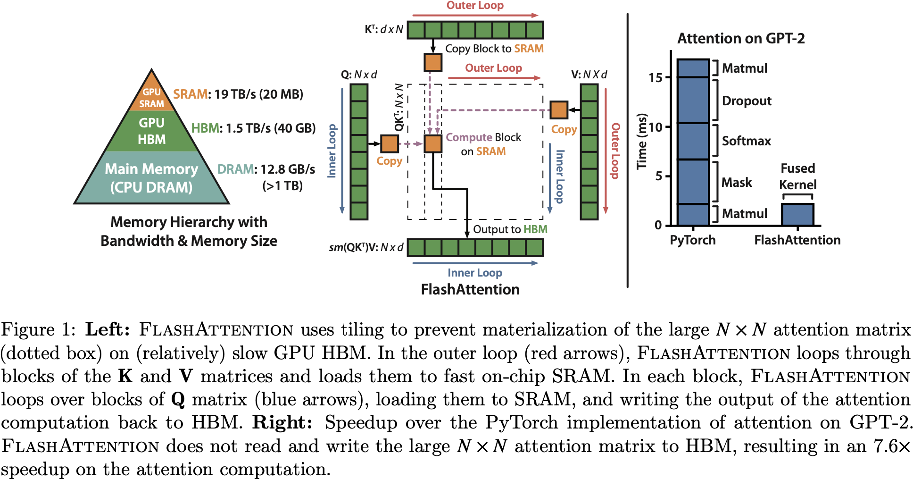

# FlashAttention: Fast and Memory-Efficient Exact Attention with IO-Awareness

## 0 Abstract

Transformer 的 Attention 在时间和内存的复杂度上是 $O(N^2)$，其中 $N$ 是序列长度。作者认为提速的一个要点是考虑 GPU 的内存层级，即 IO-awareness。为此提出了考虑 IO 的标准 Attention 计算方法，通过分块来减少 GPU 高带宽内存（HBM）和 GPU 片上 SRAM 之间的内存读/写次数。FlashAttention
1. 访问 HBM 的次数比原版 Attention 少。
2. 适用于不同的 SRAM 大小。
3. 可以扩展到其他的 Attention 近似算法，如 Block Sparse Attention。
4. 适用于长序列输入的推理任务。

|                   Task                   | Speedup |
| :--------------------------------------: | :-----: |
|        BERT-large（512 序列长度）        |  1.15   |
|          GPT-2（1024 序列长度）          |    3    |
| Long Range Arena（1024 - 4096 序列长度） |   2.4   |

## 1 Introduction



各种 Attention 的近似算法，不管是基于稀疏近似还是基于低秩近似，都不减少实际的运行时间。这是因为它们的关注点在于减少 FLOP 而不是更直接的减少计算时间，以至于可能增加了 IO 开销。

因此 FlashAttention 减少了 HBM 的访问。具体来说，
1. 计算 Softmax 时候无需访问整个输入。
2. 不为反向传播存储巨大的 Attention 中间结果。

对此在实现层面，FlashAttention
1. Tiling：实现矩阵的分块处理，增量式 Softmax 计算。
2. Recomputation：用重新计算代替访问 HBM 来获取中间结果。

- 标准 Attention 的 HBM 访问量：$\Omega(Nd +N^2)$
- FlashAttention 的 HBM 访问量：$O(N^2d^2M^{-1})$
- $N$ token 数量，$d$ head 维度，$M$ SRAM 大小。

## 3 FlashAttention: Algorithm, Analysis, and Extensions

### Standard Attention

标准 Attention 的前向：
$$
\begin{align*}
S &= QK^T\\
P &= \text{softmax}(S)\\
O &= PV\\
\end{align*}
$$

```python
def standard_attention_forward(Q, K, V):
	"""
	Args:
		Q, K, V: [N, d]
	Returns:
		O: [N, d]
	"""
    S = Q @ K.T    # Load Q, K from HBM. Store S to HBM.
    P = softmax(S) # Load S from HBM. Store P to HBM.
    O = P @ V      # Load P, V from HBM. Store S to HBM.
    return O
```

标准 Attention 的反向（分子布局）：
$$
\begin{align*}
\frac{\mathrm{d}l}{\mathrm{d}V} &= P^T\frac{\mathrm{d}l}{\mathrm{d}O} \in \mathbb{R}^{N \times d}\\
\frac{\mathrm{d}l}{\mathrm{d}P} &= \frac{\mathrm{d}l}{\mathrm{d}O}V^T \in \mathbb{R}^{N \times N}\\
\frac{\mathrm{d}l}{\mathrm{d}S_{ij}} &= P_{ij}\left[\frac{\mathrm{d}l}{\mathrm{d}P_{ij}}-\sum_{k}\frac{\mathrm{d}l}{\mathrm{d}P_{ik}}P_{ik}\right]\\
\frac{\mathrm{d}l}{\mathrm{d}Q} &= \frac{\mathrm{d}l}{\mathrm{d}S}\frac{\mathrm{d}S}{\mathrm{d}Q} = \frac{\mathrm{d}l}{\mathrm{d}S}K\\
\frac{\mathrm{d}l}{\mathrm{d}K} &= \frac{\mathrm{d}l}{\mathrm{d}S}\frac{\mathrm{d}S}{\mathrm{d}Q} = \left(\frac{\mathrm{d}l}{\mathrm{d}S}\right)^TQ
\end{align*}
$$

```python
def standard_attention_backward(Q, K, V, dl_dO, P):
	"""
	Denominator layout.

	Args:
		Q, K, V: [N, d]
		P: [N, N]
		dl_dO: [N, d]
	Returns:
		dl_dQ, dl_dK, dl_dV: [N, d]
	"""
	dl_dV = P.T @ dl_dO # Load P, dl_dO from HBM. Store dl_dV to HBM.
	dl_dP = dl_dO @ V.T # Load dl_dO, V from HBM. Store dl_dP to HBM.
	dl_dS = P * (dl_dP - (dl_dP * P).sum(dim=1)) # Load dl_dP, P from HBM. Store dl_dS to HBM.
	dl_dQ = dl_dS @ K   # Load dl_dS, K from HBM. Store dl_dQ to HBM.
	dl_dK = dl_dS.T @ Q # Load dl_dS, Q from HBM. Store dl_dK to HBM.
	return dl_dQ, dl_dK, dl_dV
```

### FlashAttention

FlashAttention 的前向：

```c++
```

### IO Analysis of Standard Attention


---

这里用分子布局：
$$
\begin{align*}
\left[\frac{\mathrm{d}l}{\mathrm{d}V}\right]_{ij} &= \frac{\mathrm{d}l}{\mathrm{d}V_{ij}} &&\text{Demonimator layout}\\
&= \sum_{k}\frac{\mathrm{d}l}{\mathrm{d}O_{kj}}\frac{\mathrm{d}O_{kj}}{\mathrm{d}V_{ij}} &&\text{Matrix multiplication in forward}\\
&= \sum_{k}\frac{\mathrm{d}l}{\mathrm{d}O_{kj}}P_{ki} &&\text{Derivation of matrix multiplication}\\
&= \sum_{k}P_{ik}^T\frac{\mathrm{d}l}{\mathrm{d}O_{kj}} &&\text{Rearange}\\
&= \left[P^T\right]_{i\cdot}\left[\frac{\mathrm{d}l}{\mathrm{d}O}\right]_{\cdot j} &&\text{Demonimator layout}\\
&= \left[P^T\frac{\mathrm{d}l}{\mathrm{d}O}\right]_{ij} &&\text{Merge}
\end{align*}
$$

$$
\begin{align*}
\left[\frac{\mathrm{d}l}{\mathrm{d}S}\right]_{ij} &= \frac{\mathrm{d}l}{\mathrm{d}S_{ij}} &&\text{Demonimator layout}\\
&= \sum_{k}\frac{\mathrm{d}l}{\mathrm{d}P_{ik}}\frac{\mathrm{d}P_{ik}}{\mathrm{d}S_{ij}} &&\text{Row-wise softmax in forward}\\
&= \frac{\mathrm{d}l}{\mathrm{d}P_{ij}}P_{ij}(1-P_{ij})-\sum_{k\ne j}\frac{\mathrm{d}l}{\mathrm{d}P_{ik}}P_{ik}P_{ij} &&\text{Derivative of softmax}\\
&= P_{ij}\left[\frac{\mathrm{d}l}{\mathrm{d}P_{ij}}-\sum_{k}\frac{\mathrm{d}l}{\mathrm{d}P_{ik}}P_{ik}\right] &&\text{Merge together}\\
&= P_{ij}\left[\left[\frac{\mathrm{d}l}{\mathrm{d}P}\right]_{ij}-\sum_{k}\left[\frac{\mathrm{d}l}{\mathrm{d}P}\right]_{ik}P_{ik}\right] &&\text{Demonimator layout}
\end{align*}
$$
