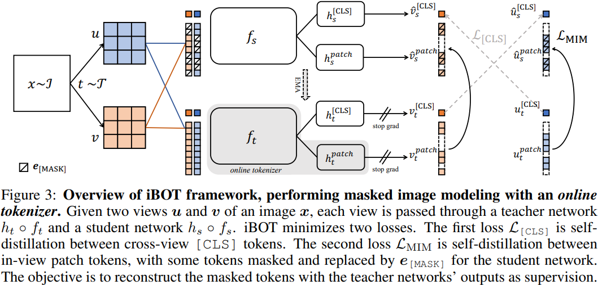

# DINOv2: Learning Robust Visual Features without Supervision

## 0 Abstract

主要聚焦于加速和稳定训练，并且构建了一个数据整理工作流，生成了 LVD-142M。

## 1 Introduction

计算机视觉中 "Foundation Model" 这个词指的是：能够生成在任何任务中立即发挥作用的视觉特征的模型，视觉特征包括图像层面的（如图像分类）和像素层面的（如分割）。

文字指导的预训练限制了可保留的图像信息，文字只能近似反映图像中的丰富信息，无法关注到像素级的细节信息。

在未经整理的数据集上，模型生成的特征质量大幅下降。这是因为缺乏对数据质量和多样性的控制，而数据质量和多样性是产生良好特征的关键。预训练数据的质量较差，大部分结果仍然通过微调特征获得的。

## 3 Data Processing

- 特点：不使用预先训练好的编码器、元数据或监督来过滤图像，并利用图像之间的视觉相似性。
- 数据源：
	- 整理好的：ImageNet-22k, ImageNet-1k 训练集，Google Landmarks 等
	- 未整理的：敏感性过滤过的网图
	- 总计 12 亿张图片。
- 对于未整理的图，先找出与整理好的图接近的图。具体来说，先用在 ImageNet-22k 上预训练的 ViT-16 算每张图片的 embedding，然后计算 cos 相似度，然后用 Kmeans 聚类。对于一张给定图片，找它最相似的 4 张图片。
- 在 20 节点 + 8 V100 用 2 天生成了 LVD-142M。

## 4 Discriminative Self-supervicsed Pre-training



网络整体是 iBOT。

|            Symbols             |       Descriptions       |
| :----------------------------: | :----------------------: |
|              $x$               |       input image        |
| $g_{\theta_s}$, $g_{\theta_t}$ | student, teacher network |
|          $P_s$, $P_t$          |      $K$ dim output      |
|       $\tau_s$, $\tau_t$       |       temperature        |

```python
def train_step():
    for x in loader:
        x1, x2 = augment(x), augment(x) # [N, ...]
        cls_s1, patch_s1, mask_s1, cls_s2, patch_s2, mask_s2 = gs(x1), gs(x2) # [N, K], [N, P, K], [N, P]
        cls_t1, patch_t1, cls_t2, patch_t2 = gt(x1), gt(x2) # [N, K], [N, P, K]

        # Update student
        cl_loss = get_cl_loss(cls_t1, cls_s2) + get_loss(cls_t2, cls_s1)
        mim_loss = get_mim_loss(patch_s1, mask_s1, patch_t1) + get_mim_loss(patch_s2, mask_s2, patch_t2)
        loss = cl_loss + mim_loss
        loss.backward()
        optimizer.zero_grad()
        optimizer.step()

        # Update teacher
        gt.param = l * gt.param + (1 - l) * gs.param
        c = m * c + (1 - m) * torch.cat([t1, t2]).mean(0)

def get_cl_loss(t, s):
    t = t.detach() # [N, K]
    s = torch.softmax(s / s_temperature, dim=1) # [N, K]
    t = torch.softmax((t - c) / t_temperature, dim=1) # [N, K]
    return -(t * torch.log(s)).sum(dim=1).mean()

def get_mim_loss(s, m, t):
    return (m * t * torch.log(s)).sum(dim=[1, 2]).mean()
```

其他的改进包括：
- 将 DINO 和 iBOT 输出头统一到同一个 MLP。
- 用了 Sinkhorn-Knopp 中心化。
- 用了 KoLeo 正则化。
- Teacher 网络输入 224 * 224，student 网络 98 * 98。
- ViT-g：嵌入维度 1536，多头数量 24，1.1 B 参数。
- 在训练的最后阶段用了 518 * 518 的分辨率。
