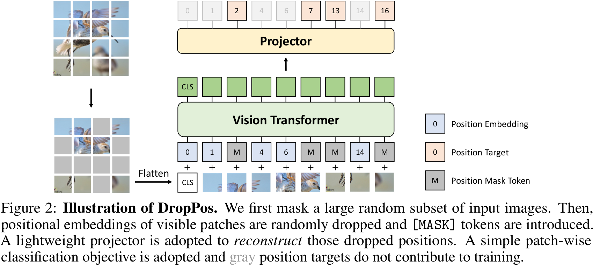

# DropPos: Pre-Training Vision Transformers by Reconstructing Dropped Positions

## 0 Abstract

Transformer-based 网络架构对于 token 的位置信息，比如 token 的顺序，**非常地不敏感**，因此需要 Positional Embedding 来提示。于是提出了 DropPos 来增强 ViT 的位置感知能力。DropPos 首先随机丢弃部分的 Positional Embedding，然后模型仅根据视觉外观，在所有可能位置中预测每个不重叠 patch 的实际位置。将 MAE 的回归问题转换成了分类问题。此外，考虑到可能存在视觉外观相似的不同补丁，DropPos 提出了位置平滑和贴心的重建策略来放松这一分类问题，因为在这些情况下没有必要重建它们的精确位置。

## 1 Introduction

直观地说，丢弃 Positional Embedding，只利用视觉外观，让模型输出每个 patch 的位置，应该可以学习到图像内容的形状关系和布局，从而提高空间视觉内容的编码能力。但是事实上远不如加入了 Positional Embedding 的模型的效果。造成这一差异的原因可能是：
1. 如果预训练阶段从来没接触过 Positional Embedding，但调优阶段必须存在 Positional Embedding，因此两个任务的差异就非常大。
2. ViT 在长程依赖关系建模方面的优势可能会导致他们在解决任务时流于表面，从而产生平凡的解决方案，无法通过解决这一简单任务来学习高度语义表征。
3. 视觉外观相似的 patch 可能会导致重建目标混淆，无需被精准重建。

DropPos 是这样解决这个问题的：
1. 不是全部丢弃 Positional Embedding，而是丢弃一部分的 Positional Embedding。而且仍旧采取大量的 patch mask。
2. 我们在预训练过程中只保留了可见 patch 的 Positional Embedding，迫使 ViT 仅通过部分输入来重建每个可见 patch 的位置。
3. 用位置平滑和贴心的重建策略来放松视觉外观相似的 patch。
4. 把位置预测问题建模成了分类问题。

## 3 Method

### 3.1 DropPos

1. 丢弃部分的图像 patch，只剩下可见的 patch 送入下一步。
2. 丢弃部分可见 patch 的 positional embedding，用 position mask token 代替，class token 的 positional embedding 永远被保留。
3. 可见的 patch 加上 positional embedding 或者 position mask token 送入 ViT。

### 3.2 Pre-training DropPos

| Symbols | Descriptions |
| :--: | :--: |
| $N$ | Number of patches |
| $\gamma$ | Patch masking ratio |
| $\xi$ | Position dropping ratio |
| $M\in\{1,\dots,N\}$ | Mask of patch |
| $M_{\text{pos}}\in\{1,\dots,N\}$ | Mask of droped position |
| $\mathbf{y}\in\mathbb{R}^{(1-\gamma)N}$ | Ground truth position of visible patches |
| $\mathbf{o}\in\mathbb{R}^{(1-\gamma)N\times N}$ | Output feature of visible patches |

这里只需要一个 Cross Entropy Loss 即可分类：
$$
\mathcal{L}=-\sum_{i=1}^{(1-\gamma)N}\mathrm{onehot}(\mathbf{y}_{i})\cdot\log\mathrm{softmax}(\mathbf{o}_{i})
$$
没有 positional embedding 的 patch 会回传网络梯度，因此最后的 Loss 是：
$$
\mathcal{L}=-\sum_{i=1}^{(1-\gamma)N}(1-M^{i}_{\text{pos}})\cdot\mathrm{onehot}(\mathbf{y}_{i})\cdot\log\mathrm{softmax}(\mathbf{o}_{i})
$$
#### Positional Smoothing

考虑到 patch 之间的相似性，作者选择用
$$
w(i,j)=\exp\left(-\frac{\mathrm{dist}(i,j)}{\sigma^2}\right)
$$
软化了 onehot 向量，其中 $i,j$ 是对应位置的 patch，dist 函数是欧几里德距离。$\sigma$ 可以是常数也可以是衰减的变量。最后归一化得到 $w^*$，加入 Loss 中：
$$
\mathcal{L}=-\sum_{i=1}^{(1-\gamma)N}(1-M^{i}_{\text{pos}})[w^*(\mathbf{y}_{i},j)]_{j\in\{1,\dots,N\}}\cdot\log\mathrm{softmax}(\mathbf{o}_{i})
$$

#### Attentive Reconstruction

考虑到 patch 之间的相似性，作者选择用 token 和 class token 之间的相似性
$$
A(i)=\frac{\exp(\cos(\mathrm{cls},\mathrm{patch}_{i})/\tau)}{\sum_{j=1}^{N}\exp(\cos(\mathrm{cls},\mathrm{patch}_{i})/\tau)}\in\mathbb{R}^{N}
$$
来作为权重加入网络调和相似 patch。

$$
\mathcal{L}=-\sum_{i=1}^{(1-\gamma)N}(1-M^{i}_{\text{pos}})\cdot A(i)\cdot[w^*(\mathbf{y}_{i},j)]_{j\in\{1,\dots,N\}}\cdot\log\mathrm{softmax}(\mathbf{o}_{i})
$$

## 4 Experiments

### 4.1 Ablation Studies

#### Performance on the Position Reconstruction Task

Position 预测准确率和下游任务性能有点正相关，但不绝对。过分关注于预测每一个 patch 的精确的位置，会导致局部最优，对于下游任务不利。

#### Patch Mask Ratio $\gamma$

$\gamma$ 小的话对于预测任务太简单了，反而不利于下游任务。

### 4.3 Analysis

冻结 Moco-v3 和 MAE 的 pre-train 和 finetune 网络权重，用线性探测方法，随机丢弃 75% 的 positional embedding，预测 patch 的位置。结果发现 finetune 网络的准确率远远大于 pre-train 网络。这说明**强大的对位置的建模能力，对于图像分类任务是有益的**。