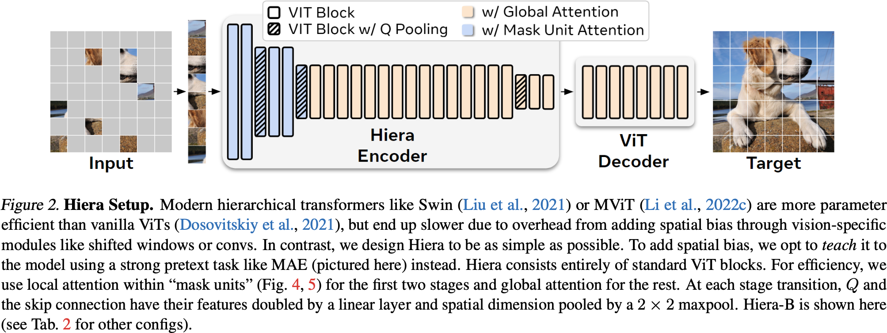

# Hiera: A Hierarchical Vision Transformer without the Bells-and-Whistles

机构：META

## Claim

提出了 Hiera，一个不带繁琐部件的分层视觉 Transformer，只用 MAE 的预训练方式即可。具体来说，用 MViTv2 的架构 + MAE 的预训练方式开始，然后逐步移除某些组件，最终得到 Hiera：没有卷积、没有滑动窗口、没有相对位置编码。

## Motivation

1. 在 ViT 上增加的部件拖累了 ViT 的处理速度，作者认为这些部件并不是必要的。
2. 原版 ViT 没有合理利用上 CNN 时代的经验，如浅层空间尺度大，通道数少，深层空间尺度小，通道数多。
3. 要充分利用 MAE 的速度优势和性能优势。

## Method

