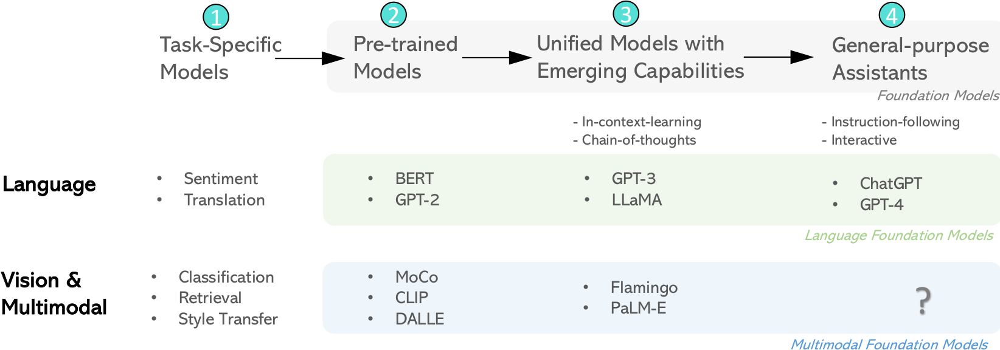

# Multimodal Foundation Models: From Specialists to General-Purpose Assistants

## 0 Abstract

两类五个核心主题
1. 已建立的研究领域：用于视觉理解的视觉骨干、文本到图像生成。
2. 正在探索的研究领域：由大型语言模型启发的统一视觉模型，多模态 LLM 的端到端训练，以及 LLM 多模态工具链

## 1 Introduction

多模态 LLM 的发展历程：
1. 在早期，为了处理特定任务，通常从头开始训练适用于个别数据集和任务的特定模型。
2. 通过大规模的预训练，语言模型在许多已建立的语言理解和生成任务上取得了最先进的性能，这些预训练模型为下游任务的适应提供了基础。
3. 大型语言模型将各种语言理解和生成任务统一到一个模型中。通过大规模的网络训练和统一，出现了一些新兴的能力，如上下文学习和思维链。
4. 随着人工智能与人类意图的对齐的最新进展，LLM 开始扮演通用助手的角色，以满足人类意图，在广泛的语言任务中完成各种任务。

### 1.1 What are Multimodal Foundation Models

### 1.2 Definition and Transition from Specialists to General-Purpose Assistants

### 1.3 Who Should Read this Paper?

