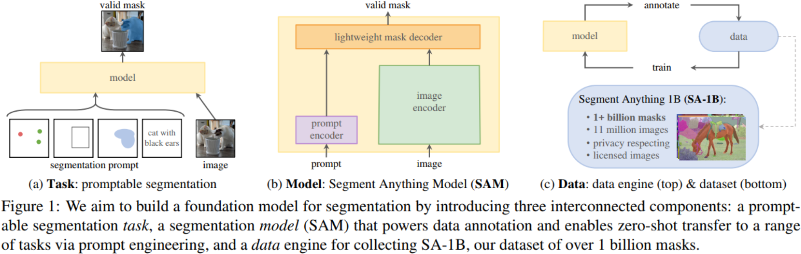
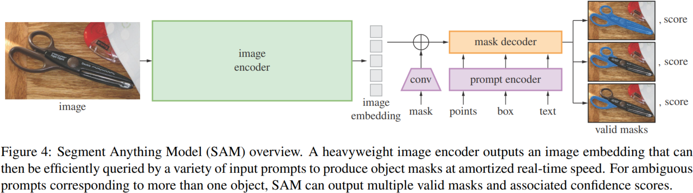
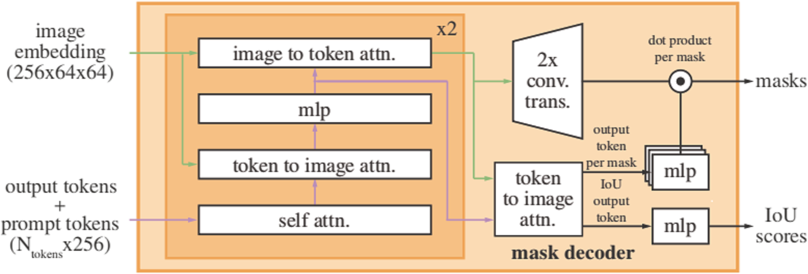

# Segment Anything

## 0 Abstract

在数据收集循环中使用我们的高效模型，我们构建了迄今为止最大的分割数据集，在 1100 万张许可和尊重隐私的图像上有超过 10 亿个遮罩。
Using our efficient model in a data collection loop, we built the largest segmentation dataset to date (by far), with over 1 billion masks on 11M licensed and privacy respecting images.

该模型被设计和训练为可提示的，因此它可以将零样本迁移到新的图像分布和任务中。
The model is designed and trained to be promptable, so it can transfer zero-shot to new image distributions and tasks.

## 1 Introduction

提示工程，其中使用手工制作的文本来提示语言模型为手头的任务生成有效的文本响应。
Prompt engineering in which hand-crafted text is used to prompt the language model to generate a valid textual response for the task at hand.

我们寻求开发一个可提示的模型，并使用能够实现强大泛化的任务在广泛的数据集上对其进行预训练。有了这个模型，我们的目标是使用提示工程解决新数据分布上的一系列下游分割问题。
We seek to develop a promptable model and pre-train it on a broad dataset using a task that enables powerful generalization. With this model, we aim to solve a range of downstream segmentation problems on new data distributions using prompt engineering.

该计划的成功取决于三个组成部分：**任务**、**模型**和**数据**。为了开发它们，我们解决了以下有关图像分割的问题：
The success of this plan hinges on three components: **task**, **model**, and **data**. To develop them, we address the following questions about image segmentation:

1. 什么**任务**可以实现零样本泛化？
    What **task** will enable zero-shot generalization?
2. 对应的**模型**架构是怎样的？
    What is the corresponding **model** architecture?
3. 哪些**数据**可以为这项任务和模型提供支持？
    What **data** can power this task and model?

不幸的是，没有用于细分的网络规模数据源；为了解决这个问题，我们构建了一个 **“数据引擎”**，即，我们使用我们的高效模型来协助数据收集并使用新收集的数据来改进模型以进行迭代。
Unfortunately, there is no web-scale data source for segmentation; to address this, we build a **"data engine"**, i.e., we iterate between using our efficient model to assist in data collection and using the newly collected data to improve the model.

#### Task

我们提出了可提示的分割任务，其目标是在任何分割提示下返回一个有效的分割遮罩。
We propose the promptable segmentation task, where the goal is to return a valid segmentation mask given any segmentation prompt.

输出有效遮罩的要求意味着，即使提示是模糊的，可能指代多个物体（例如，一件衬衫上的一个点可能表示衬衫或穿着它的人），输出应该是这些物体中至少一个的合理遮罩。
The requirement of a valid output mask means that even when a prompt is ambiguous and could refer to multiple objects (for example, a point on a shirt may indicate either the shirt or the person wearing it), the output should be a reasonable mask for at least one of those objects.

#### Model

特别是，该模型必须支持灵活的提示，需要分摊实时计算遮罩以允许交互式使用，并且必须具有歧义感知。
In particular, the model must support flexible prompts, needs to compute masks in amortized real-time to allow interactive use, and must be ambiguity-aware.

一个强大的图像编码器计算一个图像嵌入向量，一个提示编码器嵌入提示，然后这两个信息源被组合在一个预测分割遮罩的轻量级遮罩解码器中。
A powerful image encoder computes an image embedding, a prompt encoder embeds prompts, and then the two information sources are combined in a lightweight mask decoder that predicts segmentation masks.

通过将 SAM 分离成一个图像编码器和一个快速提示编码器/遮罩解码器，相同的图像嵌入可以在不同的提示下重复使用（及其成本分摊）。给定一个图像嵌入，提示编码器和遮罩解码器在网络浏览器中在大约 50 毫秒内预测提示遮罩。
By separating SAM into an image encoder and a fast prompt encoder / mask decoder, the same image embedding can be reused (and its cost amortized) with different prompts. Given an image embedding, the prompt encoder and mask decoder predict a mask from a prompt in ~50ms in a web browser.

#### Data Engine

我们的数据引擎分为三个阶段：辅助手动、半自动和全自动。在第一阶段，SAM 协助注释者注释遮罩，类似于经典的交互式分割设置。在第二阶段，SAM 可以通过提示可能的物体位置来自动为部分物体生成遮罩，并且注释者专注于注释剩余的物体，从而有助于增加遮罩的多样性。在最后阶段，我们用前景点的规则网格提示 SAM，每张图像平均产生约 100 个高质量遮罩。
Our data engine has three stages: assisted-manual, semi-automatic, and fully automatic. In the first stage, SAM assists annotators in annotating masks, similar to a classic interactive segmentation setup. In the second stage, SAM can automatically generate masks for a subset of objects by prompting it with likely object locations and annotators focus on annotating the remaining objects, helping increase mask diversity. In the final stage, we prompt SAM with a regular grid of foreground points, yielding on average ~100 high-quality masks per image.

#### Dataset

#### Responsible AI

#### Experiments

## 2 Segment Anything Task

#### Task

提示可以是一组前景/背景点、粗略的框或遮罩、自由格式的文本，或者一般来说，指示图像中要分割的内容的任何信息。然后，可提示的分割任务是在给定任何提示的情况下返回有效的分割遮罩。“有效”遮罩的要求仅意味着即使提示不明确并且可能指向多个物体，输出也应该是至少一个物体的合理遮罩。
A prompt can be a set of foreground/background points, a rough box or mask, free-form text, or, in general, any information indicating what to segment in an image. The promptable segmentation task, then, is to return a valid segmentation mask given any prompt. The requirement of a "valid" mask simply means that even when a prompt is ambiguous and could refer to multiple objects the output should be a reasonable mask for at least one of those objects.

我们选择这个任务是因为它会产生一个自然的预训练算法和一个通过提示达到零样本迁移到下游分割任务的通用方法。
We choose this task because it leads to a natural pre-training algorithm and a general method for zero-shot transfer to downstream segmentation tasks via prompting.

#### Pre-training

可提示的分割任务提出了一种自然的预训练算法，该算法为每个训练样本模拟一系列提示（例如，点、框、遮罩），并将模型的遮罩预测与 ground truth 进行比较。
The promptable segmentation task suggests a natural pre-training algorithm that simulates a sequence of prompts (e.g., points, boxes, masks) for each training sample and compares the model's mask predictions against the ground truth.

与交互式分割不同，交互式分割的目的是在获得足够的用户输入后最终预测一个有效的遮罩。我们的目标是始终为任何提示预测一个有效的遮罩，即使提示是模棱两可的。这确保了预训练模型在涉及歧义的用例中有效。
Unlike interactive segmentation whose aim is to eventually predict a valid mask after enough user input. Our aim is to always predict a valid mask for any prompt even when the prompt is ambiguous. This ensures that a pre-trained model is effective in use cases that involve ambiguity.

#### Zero-shot transfer

#### Related tasks

交互式分割、边缘检测、超像素化、物体提议生成、前景分割、语义分割、实例分割、全景分割。
Interactive segmentation, edge detection, super pixelization, object proposal generation, foreground segmentation, semantic segmentation, instance segmentation, panoptic segmentation.

经过提示分割训练的模型可以在推理时通过充当更大系统中的组件来执行新的不同任务，例如，为了执行实例分割，可提示分割模型与现有物体检测器相结合。
A model trained for promptable segmentation can perform a new, different task at inference time by acting as a component in a larger system, e.g., to perform instance segmentation, a promptable segmentation model is combined with an existing object detector.

#### Discussion

提示和组合是强大的工具，可以使单个模型以可扩展的方式使用，有可能完成模型设计时未知的任务。
Prompting and composition are powerful tools that enable a single model to be used in extensible ways, potentially to accomplish tasks unknown at the time of model design.

## 3 Segment Anything Model

SAM 包含三个组件：图像编码器、灵活提示编码器和快速遮罩解码器。我们建立在 ViT 之上，并针对（摊销的）实时性能进行了特定的权衡。
SAM has three components: an image encoder, a flexible prompt encoder, and a fast mask decoder. We build on Transformer vision models with specific tradeoffs for (amortized) real-time performance.

#### Image encoder

在可扩展性和强大的预训练方法的推动下，我们使用 MAE 预训练的 ViT，最低限度地适应处理高分辨率输入。
Motivated by scalability and powerful pretraining methods, we use an MAE pre-trained Vision Transformer (ViT) minimally adapted to process high resolution inputs.

#### Prompt encoder

我们考虑两组提示：稀疏（点、框、文本）和密集（遮罩）。我们通过位置编码和每个提示类型的学习嵌入相加来表示点和框，并使用来自 CLIP 的现成文本编码器来表示自由格式文本。密集提示（即遮罩）使用卷积嵌入，并与图像嵌入逐元素求和。
We consider two sets of prompts: sparse (points, boxes, text) and dense (masks). We represent points and boxes by positional encodings summed with learned embeddings for each prompt type and free-form text with an off-the-shelf text encoder from CLIP. Dense prompts (i.e., masks) are embedded using convolutions and summed element-wise with the image embedding.

#### Mask decoder

遮罩解码器有效地将图像嵌入、提示嵌入和输出标记映射到遮罩。该设计修改了 Transformer 解码器块，后跟动态遮罩预测头。我们修改后的解码器块在两个方向（提示到图像嵌入和图像到提示嵌入）使用提示自注意力和交叉注意力来更新所有嵌入。运行两个块后，我们对图像嵌入进行上采样，MLP 将输出标记映射到动态线性分类器，然后计算每个图像位置的遮罩前景概率。
The mask decoder efficiently maps the image embedding, prompt embeddings, and an output token to a mask. This design employs a modification of a Transformer decoder block followed by a dynamic mask prediction head. Our modified decoder block uses prompt self-attention and cross-attention in two directions (prompt-to-image embedding and vice-versa) to update all embeddings. After running two blocks, we upsample the image embedding and an MLP maps the output token to a dynamic linear classifier, which then computes the mask foreground probability at each image location.

#### Resolving ambiguity

为了解决这个问题，我们修改模型以预测单个提示的多个输出遮罩。我们发现 3 个遮罩输出足以解决大多数常见情况（嵌套遮罩通常最多三个深度：整体、部分和子部分）。在训练期间，我们仅反向传播遮罩的最小损失。为了对遮罩进行排名，该模型预测每个遮罩的置信度分数（即估计的 IoU）。
To address this, we modify the model to predict multiple output masks for a single prompt. We found 3 mask outputs is sufficient to address most common cases (nested masks are often at most three deep: whole, part, and subpart). During training, we backprop only the minimum loss over masks. To rank masks, the model predicts a confidence score (i.e., estimated IoU) for each mask.

#### Efficiency

给定一个预先计算的图像嵌入，提示编码器和遮罩解码器在 CPU 上的 Web 浏览器中运行约 50 毫秒。
Given a precomputed image embedding, the prompt encoder and mask decoder run in a web browser, on CPU, in ~50ms.

#### Losses and training

我们用 focal loss 和 dice loss 的线性组合来监督 mask 预测。我们使用混合的几何提示来训练可提示的分割任务。我们通过在每个遮罩 11 轮中随机抽样提示来模拟交互式设置，从而使 SAM 能够无缝集成到我们的数据引擎中。
We supervise mask prediction with the linear combination of focal loss and dice loss. We train for the promptable segmentation task using a mixture of geometric prompts.We simulate an interactive setup by randomly sampling prompts in 11 rounds per mask, allowing SAM to integrate seamlessly into our data engine.

## 4 Segment Anything Data Engine

#### Assisted-manual stage

我们没有对标记物体施加语义约束，注释者可以自由标记 “stuff” 和 “things”。我们建议注释者标记他们可以命名或描述的物体，但不收集这些名称或描述。注释者被要求按照突出的顺序标记物体，并被鼓励在遮罩花费超过 30 秒进行注释后继续处理下一张图像。
We did not impose semantic constraints for labeling objects, and annotators freely labeled both "stuff" and "things". We suggested annotators label objects they could name or describe, but did not collect these names or descriptions. Annotators were asked to label objects in order of prominence and were encouraged to proceed to the next image once a mask took over 30 seconds to annotate.

在此阶段开始时，SAM 使用常见的公共分割数据集进行训练。在完成足够的数据注释后，SAM 仅使用新注释的遮罩进行再训练。随着收集到更多遮罩，图像编码器从 ViT-B 扩展到 ViT-H，其他架构细节也随之演变；我们总共重新训练了模型 6 次。
At the start of this stage, SAM was trained using common public segmentation datasets. After sufficient data annotation, SAM was retrained using only newly annotated masks. As more masks were collected, the image encoder was scaled from ViT-B to ViT-H and other architectural details evolved; in total we retrained our model 6 times.

随着模型的改进，每个遮罩的平均注释时间从 34 秒减少到 14 秒。
Average annotation time per mask decreased from 34 to 14 seconds as the model improved.

随着 SAM 的改进，每张图像的平均遮罩数量从 20 个增加到 44 个遮罩。总的来说，我们在这个阶段从 12 万张图像中收集了 430 万个遮罩。
As SAM improved, the average number of masks per image increased from 20 to 44 masks. Overall, we collected 4.3M masks from 120k images in this stage.

#### Semi-automatic stage

在这个阶段，我们的目标是增加遮罩的多样性，以提高我们的模型分割任何东西的能力。为了将注释器集中在不太显眼的物体上，我们首先自动检测了可信遮罩。然后我们向注释者展示了预先填充了这些遮罩的图像，并要求他们对任何其他未注释的物体进行注释。为了检测可信遮罩，我们使用通用的“物体”类别在所有第一阶段遮罩上训练了一个边界框检测器。在此阶段，我们在 18 万张图像中额外收集了 590 万个遮罩（总共 1020 万个遮罩）。
In this stage, we aimed to increase the diversity of masks in order to improve our model's ability to segment anything. To focus annotators on less prominent objects, we first automatically detected confident masks. Then we presented annotators with images prefilled with these masks and asked them to annotate any additional unannotated objects. To detect confident masks, we trained a bounding box detector on all first stage masks using a generic "object" category. During this stage we collected an additional 5.9M masks in 180k images (for a total of 10.2M masks).

与第一阶段一样，我们定期根据新收集的数据重新训练我们的模型（5 次）。每个遮罩的平均注释时间回溯到 34 秒（不包括自动遮罩），因为这些物体的标记更具挑战性。每张图像的平均遮罩数量从 44 个增加到 72 个遮罩（包括自动遮罩）。
As in the first stage, we periodically retrained our model on newly collected data (5 times). Average annotation time per mask went back up to 34 seconds (excluding the automatic masks) as these objects were more challenging to label. The average number of masks per image went from 44 to 72 masks (including the automatic masks).

#### Fully automatic stage

首先，在这个阶段开始时，我们收集了足够多的遮罩来大大改进模型，包括上一阶段的各种遮罩。
First, at the start of this stage, we had collected enough masks to greatly improve the model, including the diverse masks from the previous stage.

其次，在这个阶段，我们已经开发了歧义感知模型，这使我们即使在模棱两可的情况下也能预测有效的遮罩。具体来说，我们使用 $32\times32$ 规则点网格提示模型，并为每个点预测一组可能对应于有效物体的遮罩。使用歧义感知模型，如果一个点位于部分或子部分上，我们的模型将返回子部分、部分和整个物体。我们模型的 IoU 预测模块用于选择置信遮罩； 此外，我们只识别并选择了稳定的遮罩（如果将概率图阈值设置为 $0.5-\delta$ 和 $0.5+\delta$ 的时候产生相近的遮罩，我们就认为遮罩是稳定的）。
Second, by this stage we had developed the ambiguity-aware model, which allowed us to predict valid masks even in ambiguous cases. Specifically, we prompted the model with a $32\times32$ regular grid of points and for each point predicted a set of masks that may correspond to valid objects. With the ambiguity-aware model, if a point lies on a part or subpart, our model will return the subpart, part, and whole object. The IoU prediction module of our model is used to select confident masks; moreover, we identified and selected only stable masks (we consider a mask stable if thresholding the probability map at $0.5-\delta$ and $0.5+\delta$ results in similar masks).

最后，在选择了可信和稳定的遮罩后，我们应用非最大抑制 (NMS) 来过滤重复项。为了进一步提高较小遮罩的质量，我们还处理了多个重叠的放大图像裁剪。
Finally, after selecting the confident and stable masks, we applied non-maximal suppression (NMS) to filter duplicates. To further improve the quality of smaller masks, we also processed multiple overlapping zoomed-in image crops.

## 5 Segment Anything Dataset

#### Images

这些图像具有高分辨率（平均 $3300\times4950$ 像素），由此产生的数据大小可能会带来可访问性和存储方面的挑战。因此，我们发布最短边设置为 $1500$ 像素的下采样图像。
These images are high resolution ($3300\times4950$ pixels on average), and the resulting data size can present accessibility and storage challenges. Therefore, we are releasing downsampled images with their shortest side set to $1500$ pixels.

#### Masks

我们的数据引擎产生了 11 亿个遮罩，其中 $99.1\%$ 是全自动生成的。SA-1B 仅包括自动生成的遮罩。
Our data engine produced 1.1 billion masks, $99.1\%$ of which were generated fully automatically. SA-1B only includes automatically generated masks.

#### Mask quality

这个过程产生了成对的自动预测和专业校正的遮罩。我们计算了每对之间的 IoU，发现 $94\%$ 对的 IoU 大于 $90\%$（$97\%$ 对的 IoU 大于 $75\%$）。
This procedure resulted in pairs of automatically predicted and professionally corrected masks. We computed IoU between each pair and found that $94\%$ of pairs have greater than $90\%$ IoU (and $97\%$ of pairs have greater than $75\%$ IoU).

#### Mask properties

我们的数据集每张图像有更多遮罩，因此它也倾向于包含更大比例的中小型相对大小遮罩。遮罩的凹度分布与其他数据集的凹度分布大致相似。
Our dataset has more masks per image, it also tends to include a greater percentage of small and medium relative-size masks. The concavity distribution of our masks is broadly similar to that of other datasets.

## 6 Segment Anything RAI Analysis

#### Geographic and income representation

#### Fairness in segmenting people

## 7 Zero-shot Transfer Experiments

我们的实验首先测试可提示分割的核心目标：从任何提示生成有效的遮罩。
Our experiments begin by testing the core goal of promptable segmentation: producing a valid mask from any prompt.

#### Implementation

除非另有说明：(1) SAM 使用 MAE 预训练的 ViT-H 图像编码器和 (2) SAM 在 SA-1B 上训练，请注意该数据集仅包含从我们的数据引擎的最后阶段自动生成的遮罩。
Unless otherwise specified: (1) SAM uses an MAE pre-trained ViT-H image encoder and (2) SAM was trained on SA-1B, noting that this dataset includes only automatically generated masks from the final stage of our data engine.

### 7.1 Zero-shot Single Point Valid Mask Evaluation

#### Task

大多数数据集中的 Ground truth 遮罩不会枚举所有可能的遮罩，这会使自动度量变得不可靠。因此，我们用一项人类研究来补充标准的 mIoU 指标（即，预测遮罩和真实遮罩之间所有 IoU 的平均值），其中注释者将遮罩质量从 1（无意义）到 10（像素完美）进行评分。
Ground truth masks in most datasets do not enumerate all possible masks, which can make automatic metrics unreliable. Therefore, we supplement the standard mIoU metric (i.e., the mean of all IoUs between predicted and ground truth masks) with a human study in which annotators rate mask quality from 1 (nonsense) to 10 (pixel-perfect).

#### Datasets

#### Results

我们还提供了一个“oracle”结果，其中最相关的 SAM 的 3 个遮罩是通过将它们与 ground truth 进行比较来选择的，而不是选择最可信的遮罩。
We also present an "oracle" result, in which the most relevant of SAM’s 3 masks is selected by comparing them to the ground truth, rather than selecting the most confident mask.

### 7.2 Zero-shot Edge Detection

#### Approach

我们使用我们的自动遮罩生成流程的简化版本。具体来说，我们使用 $16\times16$ 的前景点规则网格提示 SAM，从而产生 768 个预测遮罩（每个点 3 个）。用 NMS 删除冗余遮罩。然后，使用无阈值遮罩概率图的 Sobel 算子和标准轻量级后处理（包括边缘 NMS）计算边缘图。
We use a simplified version of our automatic mask generation pipeline. Specifically, we prompt SAM with a $16\times16$ regular grid of foreground points resulting in 768 predicted masks (3 per point). Redundant masks are removed by NMS. Then, edge maps are computed using Sobel filtering of unthresholded mask probability maps and standard lightweight postprocessing, including edge NMS.

#### Results

### 7.3 Zero-shot Object Proposals

#### Approach

#### Results

### 7.4 Zero-shot Instance Segmentation

#### Approach

我们运行物体检测器（之前使用的 ViTDet）并使用其输出框提示 SAM。这展示了在更大的系统中使用 SAM。
We run a object detector (the ViTDet used before) and prompt SAM with its output boxes. This illustrates composing SAM in a larger system.

#### Results

### 7.5 Zero-shot Text-to-Mask

#### Approach

对于每个面积大于 $100^2$ 的手动收集遮罩，我们提取 CLIP 图像嵌入。然后，在训练期间，我们使用提取的 CLIP 图像嵌入提示 SAM 作为其第一次交互。
For each manually collected mask with area larger than $100^2$ we extract the CLIP image embedding. Then, during training, we prompt SAM with the extracted CLIP image embeddings as its first interaction.

这里的关键是，由于 CLIP 的图像嵌入经过训练以与其文本嵌入对齐，我们可以使用图像嵌入进行训练，但使用文本嵌入进行推理。也就是说，在推理时，我们通过 CLIP 的文本编码器运行文本，然后将生成的文本嵌入作为提示提供给 SAM。
The key observation here is that because CLIP's image embeddings are trained to align with its text embeddings, we can train with image embeddings, but use text embeddings for inference. That is, at inference time we run text through CLIP's text encoder and then give the resulting text embedding as a prompt to SAM.

#### Results

当 SAM 无法仅从文本提示中选择正确的物体时，附加点通常可以修复预测。
When SAM fails to pick the right object from a text prompt only, an additional point often fixes the prediction.

### 7.6 Ablations

在对所有三个阶段进行训练时，自动遮罩的数量远远超过手动和半自动遮罩。因此，我们测试了第四种设置，它仅使用自动生成的掩码。使用此数据，SAM 的性能仅略低于使用所有数据（$\sim0.5$ mIoU）。因此，默认情况下我们只使用自动生成的掩码来简化训练设置。
When training with all three stages, the automatic masks vastly outnumber the manual and semi-automatic masks. We therefore tested a fourth setup that uses only the automatically generated masks. With this data, SAM performs only marginally lower than using all data ($\sim0.5$ mIoU). Therefore, by default we use only the automatically generated masks to simplify the training setup.

在 0.1M 图像处，我们观察到在所有设置下 mIoU 都有很大的下降。然而，对于 100 万张图像，约占完整数据集的 10%，我们观察到的结果与使用完整数据集相当。
At 0.1M images, we observe a large mIoU decline under all settings. However, with 1M images, about 10% of the full dataset, we observe results comparable to using the full dataset.

ViT-H 比 ViT-B 有显着改善，但仅比 ViT-L 有边际收益。
ViT-H improves substantially over ViT-B, but has only marginal gains over ViT-L.

## 8 discussion

#### Foundation models

虽然我们的模型是使用自监督技术 (MAE) 初始化的，但其绝大多数功能都来自大规模的监督训练。在数据引擎可以扩展可用注释的情况下，比如我们的，监督训练提供了一个有效的解决方案。
While our model is initialized with a selfsupervised technique (MAE), the vast majority of its capabilities come from large-scale supervised training. In cases where data engines can scale available annotations, like ours, supervised training provides an effective solution.

#### Compositionality

预训练模型可以提供新功能，甚至超出训练时的想象。
Pre-trained models can power new capabilities even beyond ones imagined at the moment of training.

#### Limitation

它可能会错过精细的结构，有时会产生不连贯的小组件的幻觉，并且不会像“放大”的计算密集型方法那样清晰地产生边界。
It can miss fine structures, hallucinates small disconnected components at times, and does not produce boundaries as crisply as more computationally intensive methods that "zoom-in".

#### Conclusion

## A Segment Anything Model and Task Details

#### Image encoder

受可扩展性和获得强大预训练的推动，我们使用经过最少的调整的 MAE 预训练的 Vision Transformer (ViT) 来处理高分辨率输入。
Motivated by scalability and access to strong pre-training, we use an MAE pre-trained Vision Transformer (ViT) with minimal adaptations to process high resolution inputs.

具有 $14\times14$ 窗口注意力和四个等距全局注意力块的 ViT-H/16。图像编码器的输出是输入图像的 $16$ 倍缩小的嵌入。
A ViT-H/16 with $14\times14$ windowed attention and four equally-spaced global attention blocks. The image encoder's output is a $16\times$ downscaled embedding of the input image.

我们使用通过重新缩放图像并填充较短边获得的 $1024\times1024$ 的输入分辨率。因此，图像嵌入是 $64\times64$。为了减少通道维度，我们使用 $1\times1$ 卷积来获得 $256$ 个通道，然后使用 $3\times3$ 卷积也有 $256$ 个通道。每个卷积之后是层归一化。
We use an input resolution of $1024\times1024$ obtained by rescaling the image and padding the shorter side. The image embedding is therefore $64\times64$. To reduce the channel dimension, we use a $1\times1$ convolution to get to $256$ channels, followed by a $3\times3$ convolution also with $256$ channels. Each convolution is followed by a layer normalization.

#### Prompt encoder

稀疏提示映射到 $256$ 维向量嵌入。一个点被表示为该点位置的位置编码和两个学习的嵌入之一的总和，这两个嵌入表示该点是在前景中还是在背景中。一个框由一个嵌入对表示：(1) 其左上角的位置编码与表示“左上角”的学习嵌入相加，以及 (2) 相同的结构，但使用表示“右下角”的学习嵌入。最后，为了表示自由格式的文本，我们使用来自 CLIP 的文本编码器（通常任何文本编码器都是可能的）。
Sparse prompts are mapped to $256$-dimensional vectorial embeddings. A point is represented as the sum of a positional encoding of the point's location and one of two learned embeddings that indicate if the point is either in the foreground or background. A box is represented by an embedding pair: (1) the positional encoding of its top-left corner summed with a learned embedding representing "top-left corner" and (2) the same structure but using a learned embedding indicating "bottomright corner". Finally, to represent free-form text we use the text encoder from CLIP (any text encoder is possible in general).

密集提示（即遮罩）与图像具有空间对应关系。我们以比输入图像低 $4$ 倍的分辨率输入遮罩，然后使用两个 $2\times2$、步幅为 2 、输出通道为 $4$ 和 $16$ 的卷积使得额外缩小 $4$ 倍。最终的 1×1 卷积将通道维度映射到 256。每一层都由 GELU 激活和层归一化分开。然后遮罩和图像嵌入按元素相加。如果没有遮罩提示，则将表示“无遮罩”的学习嵌入添加到每个图像嵌入位置。
Dense prompts (i.e., masks) have a spatial correspondence with the image. We input masks at a $4\times$ lower resolution than the input image, then downscale an additional $4\times$ using two $2\times2$, stride-2 convolutions with output channels $4$ and $16$, respectively. A final $1\times1$ convolution maps the channel dimension to $256$. Each layer is separated by GELU activations and layer normalization. The mask and image embedding are then added element-wise. If there is no mask prompt, a learned embedding representing "no mask" is added to each image embedding location.

#### Lightweight mask decoder

该模块有效地将图像嵌入和一组提示嵌入映射到输出遮罩。
This module efficiently maps the image embedding and a set of prompt embeddings to an output mask.

在应用我们的解码器之前，我们首先将学习到的输出 token 嵌入插入到一组提示嵌入中，它将在解码器的输出中使用。为简单起见，我们将这些嵌入（不包括图像嵌入）统称为“token”。
Before applying our decoder, we first insert into the set of prompt embeddings a learned output token embedding that will be used at the decoder's output. For simplicity, we refer to these embeddings (not including the image embedding) collectively as "tokens".

每个解码器层执行 4 个步骤：(1) 对 token 的自注意力，(2) 从 token（作为查询）到图像嵌入的交叉注意力，(3) 逐点 MLP 更新每个 token，以及 (4) 从图像嵌入（作为查询）到 token 的交叉注意力。最后一步使用提示信息更新图像嵌入。
Each decoder layer performs 4 steps: (1) self-attention on the tokens, (2) cross-attention from tokens (as queries) to the image embedding, (3) a point-wise MLP updates each token, and (4) cross-attention from the image embedding (as queries) to tokens. This last step updates the image embedding with prompt information.

在交叉注意期间，图像嵌入被视为一组 $64\times64\times256$ 维向量。每个自注意力/交叉注意力和 MLP 在训练时都有一个残差连接、层归一化和 0.1 的 dropout。下一个解码器层从上一层获取更新的标记和更新的图像嵌入。我们使用双层解码器。
During cross-attention, the image embedding is treated as a set of $64\times64\times256$-dimensional vectors. Each   The next decoder layer takes the updated tokens and the updated image embedding from the previous layer. We use a two-layer decoder.

为了确保解码器能够访问关键的几何信息，只要位置编码参与注意力层，就会将位置编码添加到图像嵌入中。此外，每当它们参与注意力层时，整个原始提示 token（包括它们的位置编码）都会重新添加到更新的 token 中。这促进了提示 token 的几何位置和类型之间的强依赖性。
To ensure the decoder has access to critical geometric information the positional encodings are added to the image embedding whenever they participate in an attention layer. Additionally, the entire original prompt tokens (including their positional encodings) are re-added to the updated tokens whenever they participate in an attention layer. This allows for a strong dependence on both the prompt token's geometric location and type.

运行解码器后，我们使用两个反卷积层将更新后的图像嵌入上采样 4 倍（现在它相对于输入图像缩小了 4 倍）。然后， token 再次参与图像嵌入，我们将更新后的输出 token 嵌入传递给小型 $3$ 层 MLP，该 MLP 输出与放大图像嵌入的通道维度相匹配的向量。最后，我们预测了一个遮罩，该遮罩具有放大图像嵌入和 MLP 输出之间的空间逐点乘积。
After running the decoder, we upsample the updated image embedding by $4\times$ with two transposed convolutional layers (now it's downscaled $4\times$ relative to the input image). Then, the tokens attend once more to the image embedding and we pass the updated output token embedding to a small $3$-layer MLP that outputs a vector matching the channel dimension of the upscaled image embedding. Finally, we predict a mask with a spatially point-wise product between the upscaled image embedding and the MLP's output.

Transformer 使用 $256$ 的嵌入维度。Transformer MLP 块的内部维度很大，为 2048，但 MLP 仅应用于提示 token，而提示 token 相对较少（很少超过 20）。然而，在我们有 $64\times64$ 图像嵌入的交叉注意力层中，我们将查询、键和值的通道维度减少 $2$ 倍至 $128$ 以提高计算效率。所有注意力层都使用 8 头。
The transformer uses an embedding dimension of $256$. The transformer MLP blocks have a large internal dimension of $2048$, but the MLP is applied only to the prompt tokens for which there are relatively few (rarely greater than $20$). However, in cross-attention layers where we have a $64\times64$ image embedding, we reduce the channel dimension of the queries, keys, and values by $2\times$ to $128$ for computational efficiency. All attention layers use 8 heads.

用于放大输出图像嵌入的转置卷积为 $2\times2$，步幅为 $2$，输出通道维度为 $64$ 和 $32$，并由 GELU 激活。它们由层归一化分开。
The transposed convolutions used to upscale the output image embedding are $2\times2$, stride $2$ with output channel dimensions of $64$ and $32$ and have GELU activations. They are separated by layer normalization.

#### Making the model ambiguity-aware

我们不是预测单个遮罩，而是使用少量输出 token 并同时预测多个遮罩。默认情况下，我们预测三个遮罩，因为我们观察到三层（整体、部分和子部分）通常足以描述嵌套遮罩。在训练期间，我们计算真实值和每个预测遮罩之间的损失（稍后描述），但仅从最低损失反向传播。
Instead of predicting a single mask, we use a small number of output tokens and predict multiple masks simultaneously. By default we predict three masks, since we observe that three layers (whole, part, and subpart) are often enough to describe nested masks. During training, we compute the loss (described shortly) between the ground truth and each of the predicted masks, but only backpropagate from the lowest loss.

为了在应用程序中使用，我们希望对预测的遮罩进行排序，因此我们添加了一个小头（对额外的输出 token 进行操作）来估计每个预测遮罩与其覆盖的物体之间的 IoU。
For use in applications, we'd like to rank predicted masks, so we add a small head (operating on an additional output token) that estimates the IoU between each predicted mask and the object it covers.

多重提示的歧义很少见，三个输出遮罩通常会变得相似。为了最大限度地减少训练时退化损失的计算并确保单个明确的遮罩接收到规则的梯度信号，我们仅在给出多个提示时预测单个遮罩。这是通过为额外的遮罩预测添加第四个输出标记来实现的。这第四个遮罩永远不会为单个提示返回，并且是为多个提示返回的唯一遮罩。
Ambiguity is much rarer with multiple prompts and the three output masks will usually become similar. To minimize computation of degenerate losses at training and ensure the single unambiguous mask receives a regular gradient signal, we only predict a single mask when more than one prompt is given. This is accomplished by adding a fourth output token for an additional mask prediction. This fourth mask is never returned for a single prompt and is the only mask returned for multiple prompts.

#### Losses

我们使用 focal loss 和 dice loss 的线性组合来监督遮罩预测，focal loss 与 dice loss 的比例为 20:1。
We supervise mask prediction with a linear combination of focal loss and dice loss in a 20:1 ratio of focal loss to dice loss.

IoU 预测头在 IoU 预测和预测遮罩与真值遮罩的 IoU 之间使用均方误差损失进行训练。它以 1.0 的恒定比例因子添加到遮罩损失中。
The IoU prediction head is trained with mean-square-error loss between the IoU prediction and the predicted mask's IoU with the ground truth mask. It is added to the mask loss with a constant scaling factor of 1.0.

#### Training algorithm

首先，以相同的概率为目标遮罩随机选择前景点或边界框。从真值遮罩中均匀采样点。框作为真值遮罩的边界框，在每个坐标中添加随机噪声，标准差等于框边长的 $10\%$，最大 $20$ 个像素。这种噪声分布是实例分割等应用程序之间的合理折衷，它在目标物体周围产生一个紧密的盒子，而交互式分割，用户可以在其中绘制一个松散的盒子。
First, with equal probability either a foreground point or bounding box is selected randomly for the target mask. Points are sampled uniformly from the ground truth mask. Boxes are taken as the ground truth mask's bounding box, with random noise added in each coordinate with standard deviation equal to $10\%$ of the box sidelength, to a maximum of $20$ pixels. This noise profile is a reasonable compromise between applications like instance segmentation, which produce a tight box around the target object, and interactive segmentation, where a user may draw a loose box.

根据第一个提示做出预测后，后续点从先前遮罩预测和真值遮罩之间的错误区域中统一选择。如果错误区域分别是假阴性或假阳性，则每个新点是对应的前景或背景。我们还提供了前一次迭代的遮罩预测作为我们模型的附加提示。为了为下一次迭代提供最大信息，我们提供无阈值遮罩 logits 而不是二值化遮罩。当返回多个遮罩时，传递给下一次迭代并用于对下一个点进行采样的遮罩是具有最高预测 IoU 的遮罩。
After making a prediction from this first prompt, subsequent points are selected uniformly from the error region between the previous mask prediction and the ground truth mask. Each new point is foreground or background if the error region is a false negative or false positive, respectively. We also supply the mask prediction from the previous iteration as an additional prompt to our model. To provide the next iteration with maximal information, we supply the unthresholded mask logits instead of the binarized mask. When multiple masks are returned, the mask passed to the next iteration and used to sample the next point is the one with the highest predicted IoU.

我们发现在 $8$ 迭代采样点后收益递减（我们测试了高达 $16$）。此外，为了鼓励模型从提供的遮罩中受益，我们还使用了两次以上的迭代，其中没有对额外的点进行采样。这些迭代中的一个随机插入到 $8$ 个迭代采样点中，另一个总是在最后。这给出了 $11$ 的总迭代次数：一次采样的初始输入提示，$8$ 的迭代采样点，以及两次没有向模型提供新的外部信息的迭代，因此它可以学习改进自己的遮罩预测。我们注意到使用相对大量的迭代是可能的，因为我们的轻量级遮罩解码器需要不到图像编码器计算的 $1\%$，因此每次迭代只增加很小的开销。
We find diminishing returns after $8$ iteratively sampled points (we have tested up to $16$). Additionally, to encourage the model to benefit from the supplied mask, we also use two more iterations where no additional points are sampled. One of these iterations is randomly inserted among the $8$ iteratively sampled points, and the other is always at the end. This gives $11$ total iterations: one sampled initial input prompt, $8$ iteratively sampled points, and two iterations where no new external information is supplied to the model so it can learn to refine its own mask predictions. We note that using a relatively large number of iterations is possible because our lightweight mask decoder requires less than $1\%$ of the image encoder's compute and, therefore, each iteration adds only a small overhead.

#### Training recipe

我们使用 AdamW 优化器（$\beta_1=0.9，\beta_2=0.999$）和线性学习率预热 $250$ 迭代和逐步学习率衰减计划。预热后的初始学习率 (lr) 为 $8\times10^{-4}$。我们训练 $90k$ 迭代（~$2$ SA-1B 时期），并在 $60k$ 迭代和 $86666$ 迭代时将 lr 除以 $10$。批量大小为 $256$ 个图像。为了规范 SAM，我们将权重衰减 (wd) 设置为 $0.1$ 并应用速率为 $0.4$ 的下降路径 (dp)。我们使用 $0.8$ 的分层学习率衰减 (ld)。没有应用数据扩充。我们从 MAE 预训练的 ViT-H 初始化 SAM。我们使用每个 GPU 最多 $64$ 的随机采样遮罩进行训练。此外，我们发现轻微过滤 SA-1B 遮罩以丢弃任何覆盖图像超过 $90\%$ 的遮罩可以定性地改善结果。
We use the AdamW optimizer ($\beta_1=0.9,\beta_2=0.999$) and a linear learning rate warmup for $250$ iterations and a step-wise learning rate decay schedule. The initial learning rate (lr), after warmup, is $8\times10^{-4}$. We train for $90k$ iterations (~$2$ SA-1B epochs) and decrease the lr by a factor of $10$ at $60k$ iterations and again at $86666$ iterations. The batch size is $256$ images. To regularize SAM, we set weight decay (wd) to $0.1$ and apply drop path (dp) with a rate of $0.4$. We use a layer-wise learning rate decay (ld) of $0.8$. No data augmentation is applied. We initialize SAM from an MAE pre-trained ViT-H. we train with up to $64$ randomly sampled masks per GPU. Additionally, we find that lightly filtering SA-1B masks to discard any that cover more than $90\%$ of the image qualitatively improves results.

当仅使用来自第一和第二数据引擎阶段的数据进行训练时，我们使用尺度范围为 $[0.1, 2.0]$ 的大规模抖动来增加输入。直观地说，当训练数据更有限时，数据增强可能会有所帮助。为了训练 ViT-B 和 ViT-L，我们使用 $180k$ 的迭代，批量大小为 $128$，分布在 $128$ 个 GPU 上。我们分别为 ViT-B/L 设置 lr = $8\times10^{-4}/4\times10^{-4}$、ld = $0.6/0.8$、wd = $0.1$ 和 dp = $0.6/0.4$。
When training with data from the first and second data engine stages only, we augment the input with large-scale jitter with a scale range of $[0.1, 2.0]$. Intuitively, data augmentation may be helpful when training data is more limited. To train ViT-B and ViT-L, we use $180k$ iterations with batch size $128$ distributed across $128$ GPUs. We set lr = $8\times10^{-4}/4\times10^{-4}$, ld = $0.6/0.8$, wd = $0.1$, and dp = $0.6/0.4$ for ViT-B/L, respectively.

## B. Automatic Mask Generation Details

#### Cropping

遮罩是由全图上 $32\times32$ 的规则网格和 20 个额外放大图像裁剪产生的，这些裁剪是由 $2\times2$ 和 $4\times4$ 个部分重叠的窗口产生的，分别使用 $16\times16$ 和 $8\times8$ 的规则点网格。原始的高分辨率图像被用于剪裁（这是我们唯一一次使用它们）。我们删除了触及窗口内部边界的遮罩。我们分两个阶段应用了标准的基于贪婪箱的 NMS（箱是为了提高效率）：首先在每个窗口内，其次是跨窗口。当在一个窗口内应用 NMS 时，我们使用模型预测的 IoU 来排列遮罩。当跨窗口应用 NMS 时，我们根据其源窗口，从最大放大（即从 $4\times4$ 作物）到最小放大（即原始图像）对遮罩进行排序。在这两种情况下，我们使用了 $0.7$ 的 NMS 阈值。
Masks were generated from a regular grid of $32\times32$ points on the full image and $20$ additional zoomed in image crops arising from $2\times2$ and $4\times4$ partially overlapping windows using $16\times16$ and $8\times8$ regular point grids, respectively. The original high-resolution images were used for cropping (this was the only time we used them). We removed masks that touch the inner boundaries of the crops. We applied standard greedy box-based NMS (boxes were used for efficiency) in two phases: first within each crop and second across crops. When applying NMS within a crop, we used the model's predicted IoU to rank masks. When applying NMS across crops, we ranked masks from most zoomed-in (i.e., from a $4\times4$ crop) to least zoomed-in (i.e., the original image), based on their source crop. In both cases, we used an NMS threshold of $0.7$.

#### Filtering

我们使用三个过滤器来提高遮罩质量。首先，为了只保留确信的遮罩，我们以 $88.0$ 的阈值对模型的预测 IoU 得分进行过滤。第二，为了只保留稳定的遮罩，我们通过在不同的值上对同一底层软遮罩的阈值进行比较，得出两个二进制遮罩。只有在其一对 -1 和 +1 阈值遮罩之间的 IoU 等于或大于 $95.0$ 时，我们才保留预测（即对数阈值为 0 的二元遮罩）。第三，我们注意到，偶尔一个自动遮罩会覆盖整个图像。这些遮罩通常是无趣的，我们通过删除覆盖 95% 或更多图像的遮罩来过滤它们。
We used three filters to increase mask quality. First, to keep only confident masks we filtered by the model's predicted IoU score at a threshold of $88.0$. Second, to keep only stable masks we compared two binary masks resulting from the same underlying soft mask by thresholding it at different values. We kept the prediction (i.e., the binary mask resulting from thresholding logits at 0) only if the IoU between its pair of -1 and +1 thresholded masks was equal to or greater than $95.0$. Third, we noticed that occasionally an automatic mask would cover the entire image. These masks were generally uninteresting, and we filtered them by removing masks that covered 95% or more of an image.

#### Postprocessing

我们观察到两种错误类型，通过后处理很容易缓解。首先，估计有 $4\%$ 的遮罩包括小的、虚假的成分。为了解决这些问题，我们删除了面积小于 $100$ 像素的连接部件（包括删除整个遮罩，如果最大的部件低于这个阈值）。第二，另一个估计为 $4\%$ 的遮罩包括小的、虚假的孔。为了解决这些问题，我们填补了面积小于 $100$ 像素的洞。洞被确定为倒置遮罩的组成部分。
We observed two error types that are easily mitigated with postprocessing. First, an estimated $4\%$ of masks include small, spurious components. To address these, we removed connected components with area less than $100$ pixels (including removing entire masks if the largest component is below this threshold). Second, another estimated $4\%$ of masks include small, spurious holes. To address these, we filled holes with area less than $100$ pixels. Holes were identified as components of inverted masks.

#### Automatic mask generation model

我们为全自动遮罩生成训练了一个特殊版本的 SAM，它牺牲了一些推理速度，以改善遮罩生成的特性。我们注意到默认 SAM 与此处用于数据生成的 SAM 之间的差异：它只在手动和半自动数据上进行训练，它的训练时间更长（$177656$ 迭代而不是 $90k$），有大规模的抖动数据增强、 模拟交互式训练只使用点和遮罩提示（无框），并且在训练期间每个遮罩仅采样 $4$ 点（从我们默认的 $9$ 减少到 $4$ 加速训练迭代并且对 $1$ 点性能没有影响 ，尽管如果用更多的点进行评估会损害 mIoU），最后遮罩解码器使用 $3$ 层而不是 $2$ 层。
We trained a special version of SAM for fully automatic mask generation that sacrifices some inference speed for improved mask generation properties. We note the differences between our default SAM and the one used for data generation here: it was trained on manual and semi-automatic data only, it was trained for longer ($177656$ iterations instead of $90k$) with large-scale jitter data augmentation, simulated interactive training used only point and mask prompts (no boxes) and sampled only $4$ points per mask during training (reducing from our default of $9$ to $4$ sped up training iterations and had no impact on $1$-point performance, though it would harm mIoU if evaluating with more points), and finally the mask decoder used $3$ layers instead of $2$.
