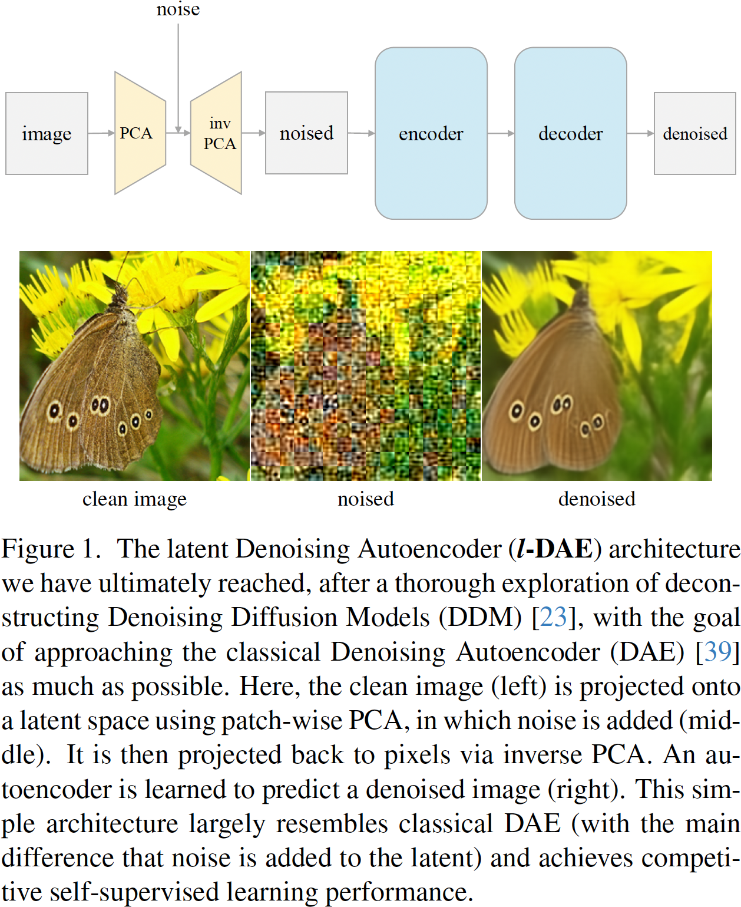
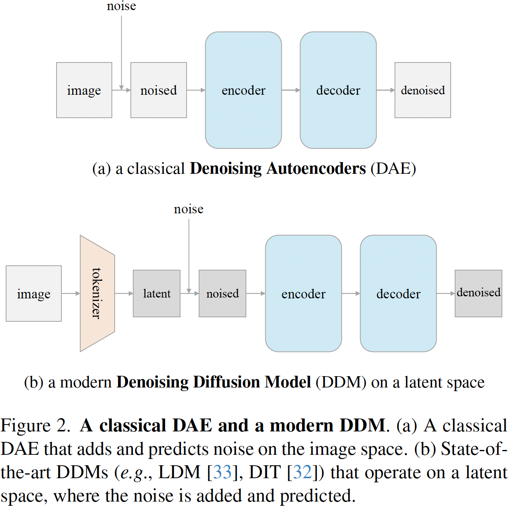
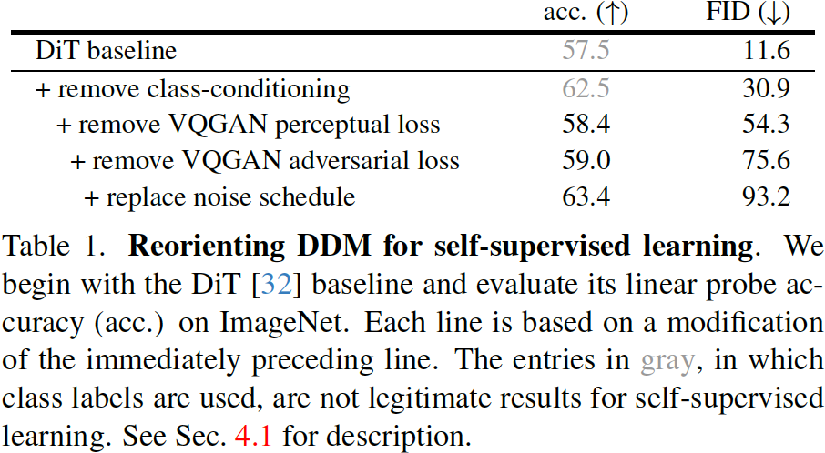
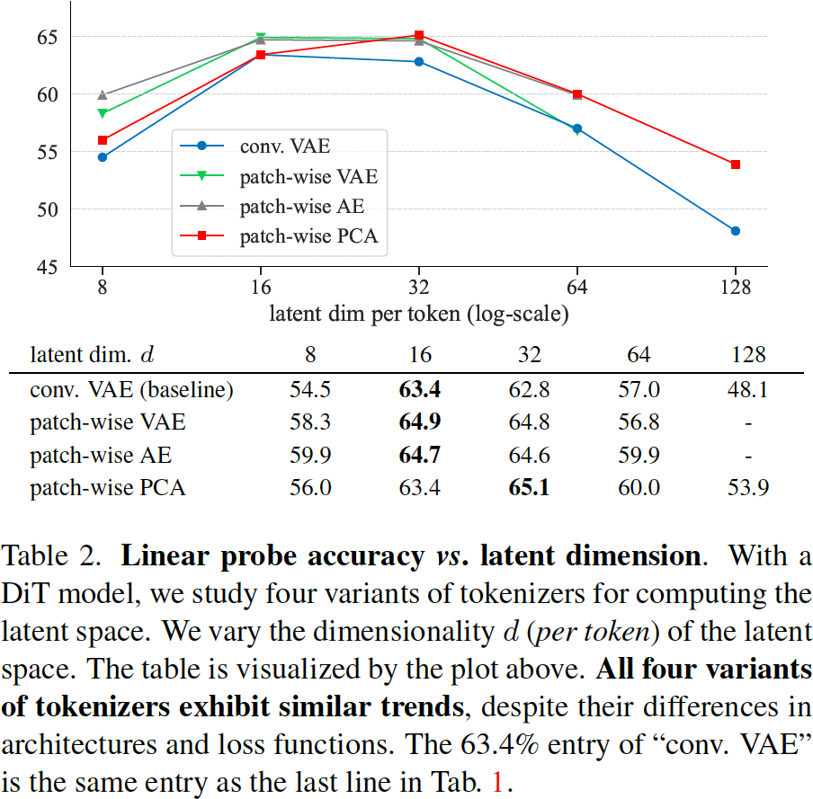

# Deconstructing Denoising Diffusion Models for Self-Supervised Learning

机构：FAIR

## Claim

1. 将 Denoising Diffusion Models 逐步拆解为 Denoising Autoencoder，以便找出其中对于自监督学习的关键因素。
2. 只有一部份现代的模块可以说是真正的关键因素，而其他部分则是不必要的。比如用来产生低维潜表示的 Tokenizer 是一个关键，并且关键是低维潜表示而不是 Tokenizer 本身。因此，可以用最简单的，非学习的 PCA 来代替 Tokenizer。

## Motivation

1. DAE 现在被用在生成模型上，但是一开始是用在表示学习上的。
2. 现在的表示学习方法通常是通过补全 mask 来做到的，但是和加噪去噪还是有一定的区别，即 mask 不会保留原始信息。
3. 现有的预训练 DDM 也可以用于表示学习，但是这就很难解释到底是什么让 DDM 在表示学习上有着好的表现。

## Method

本文针对性地拆解了 Latent Diffusion Models，主干用的是 DiT。

## Results

首先是网络训练组成部分的重要性，作者认为自监督的效果和生成的效果无关。

然后是潜空间维度的重要性，作者认为潜空间维度非常关键。

