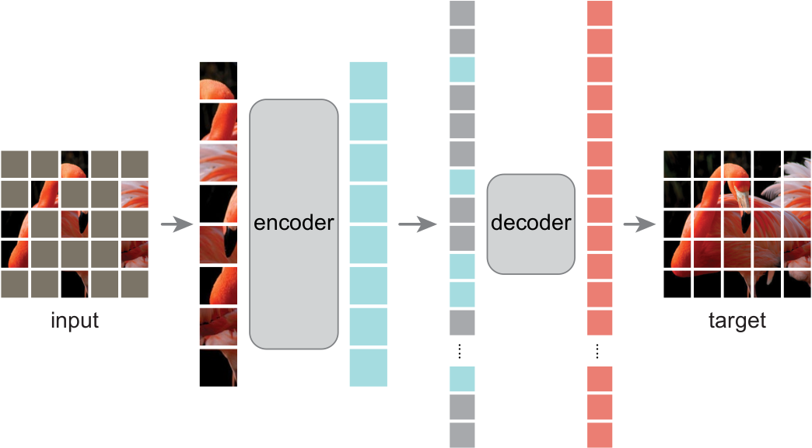

# Self-Supervised Learning

视觉的自监督学习最主要的任务就是构建前置任务（Pretext Task），让图像产生信息丰富的自监督信号。丰富的信号不仅能够指导模型的预训练，还能无缝地和下游任务调优衔接，包括图像层面的任务和像素层面的任务。视觉的自监督学习分成两大流派，对比学习（Contrastive Learning）和生成学习（Generative Learning）。

但是我隐约感到，Scaling Law 在这之中占的分量还是特别重。

## Contrastive Learning

对比学习主要是找到同一张图像在多个不同的视角下的最大公约数。对比学习最主流的流派是设计各种数据增强的方式。

对比学习特点是：
- 需要特别大的 batch size 和内存需求。
- 可以是图像之间的对比，也可以是多模态的融合。

SimCLR、MoCo v3、CLIP

#### [2021 Emerging Property in Self-Supervised Vision Transformers (CVPR 2021)](2021%20Emerging%20Property%20in%20Self-Supervised%20Vision%20Transformers.md)

DINO 的出处。文章主要讨论了 ViT 自监督的能力：
- ViT 自监督的特征图可以包含场景的布局，特别是物体的轮廓；
- ViT 自监督可以直接用于 KNN 分类，可以在分类任务上调优。

此外 DINO 还有知识蒸馏的部分。知识蒸馏一般固定教师网络，但是在 DINO 中，教师网络是动态更新的，二者的网络结构也是相同的。

## Generative Learning

生成学习最主流的流派是图像补全模型（Masked Image Modeling）。

### Masked Image Modeling

#### 2021 BEiT: Bidirectional Encoder representation from Image Transformers (ICLR 2022)

NLP 的方式做 token：
- Tokenization：将输入划分为一个个小的单元，保证这小的单元具有一定的语义。
- Numeralization：将 token 转化为输入的向量，一般需要一个词表，可能需要训练词表。

图像的 patch 是一种 token，而且用卷积网络就可以比较好的 tokenized 了。不过用 NLP 的方式做 token 也可以，代表就是 DALLE 中的 dVAE 处理图像的方式，得到 vision token。BEiT 是和 BERT 类似的思路。BEiT 随机 mask 40% 的 patch，全部输入 ViT，dVAE 是 DALLE 中直接获取的，不训练。

#### [2021 Mask Autoencoder Are Scalable Vision Learners (CVPR 2022)](2021%20Mask%20Autoencoder%20Are%20Scalable%20Vision%20Learners.md)

FAIR、何恺明。敢于把 mask 率提高到 75%，且在 encoder 阶段丢弃被 mask 的 patch，在 decoder 阶段才加入 mask，形式特别简单。

#### [2022 BEiT v2: Masked Image Modeling with Vector-Quantized Visual Tokenizers (ICLR 2023)](2022%20BEiT%20v2%20Masked%20Image%20Modeling%20with%20Vector-Quantized%20Visual%20Tokenizers.md)

之前 VQ-VAE 是做重建任务，现在是用 CLIP、DINO 做指导。

#### [2023 DropPos: Pre-Training Vision Transformers by Reconstructing Dropped Positions (Neurips 2023)](2023%20DropPos%20Pre-Training%20Vision%20Transformers%20by%20Reconstructing%20Dropped%20Positions.md)

国科大、自动化所。计算量更小，但是效果下降了。

## Combination

对比学习和生成学习的结合。

#### 2021 iBOT: Image BERT Pre-Training with Online Tokenizer

BEiT 和 DINO 的结合。

#### [2023 DINOv2 Learning Robust Visual Features without Supervision](2023%20DINOv2%20Learning%20Robust%20Visual%20Features%20without%20Supervision.md)

DINO 和 iBOT 的结合。总体来说是工程上的改进。

## Related Works

这里记录了一些可能需要关注的工作。

- 2022 Position prediction as an effective pretraining strategy.
- 2022 Representation Learning by Detecting Incorrect Location Embeddings

## Rank

这里记录了各种模型在各种数据集上的排名。

### ImageNet-1K

|  Model  |    Type     | Scale | Score | Epoch |
| :-----: | :---------: | :---: | :---: | :---: |
| BEiT-v2 | Generative  | ViT-L | 87.3  |  300  |
|   MAE   | Generative  | ViT-L | 85.7  | 1600  |
| BEiT-v2 | Generative  | ViT-B | 85.5  |  300  |
| BEiT-v1 | Generative  | ViT-L | 85.2  |  800  |
|   MAE   | Generative  | ViT-L | 84.8  |  800  |
| MoCo-v3 | Contrastive | ViT-L | 84.1  |  600  |
|   MAE   | Generative  | ViT-B | 83.6  |  800  |
| BEiT-v1 | Generative  | ViT-B | 83.2  |  800  |
| DropPos | Generative  | ViT-L | 83.2  |  800  |
|  DINO   | Contrastive | ViT-B | 83.2  | 1600  |
|   ViT   |  Supervise  | ViT-L | 73.8  |  50   |

### COCO Detection

