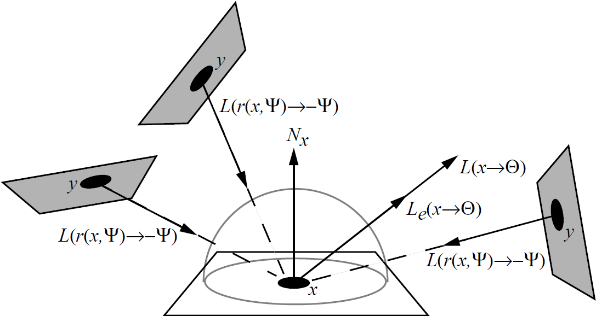
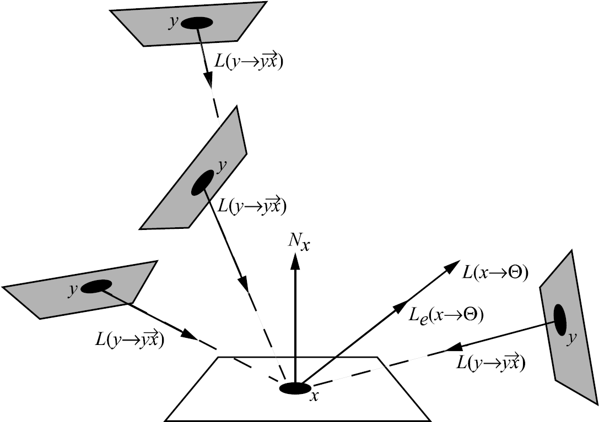
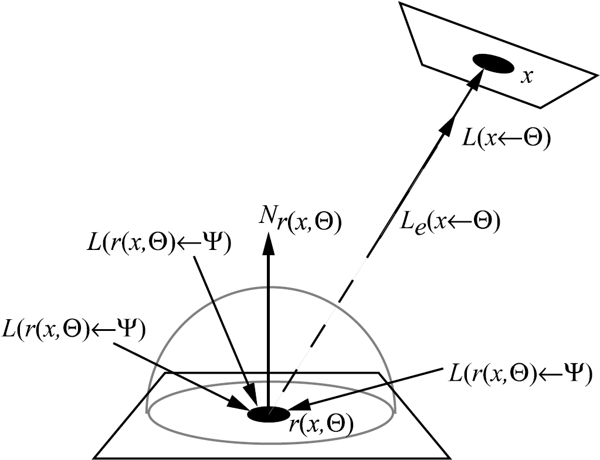
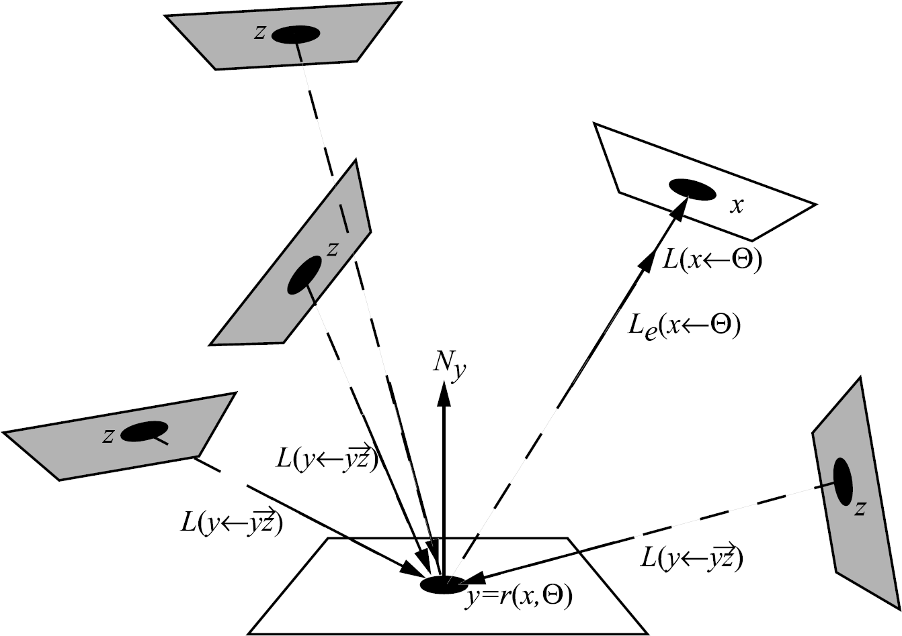

# Chapter 4 Strategies for Computing Light Transport

## 4.1 Formulation of the Rendering Equation

Original Rendering Equation:
$$
L(x\to\Theta)=L_e(x\to\Theta)+\int_{\Omega_x}f_r(x,\Psi\leftrightarrow\Theta)L(x\gets\Psi)\cos(N_x,\Psi)\mathrm{d}\omega_{\Psi}
$$

### 4.1.1 Exitant Radiance, Integration over the Hemisphere

渲染方程经典形式中的入射辐射度由最近可见点的等效出射辐射度 $y=r(x,\Psi)$ 代替。
The incident radiance in the classic form of the rendering equation is replaced by the equivalent exitant radiance at the nearest visible point $y=r(x,\Psi)$.
$$
L(x\to\Theta)=L_e(x\to\Theta)+\int_{\Omega_x}f_r(x,\Psi\leftrightarrow\Theta)L(y\to-\Psi)\cos(N_x,\Psi)\mathrm{d}\omega_{\Psi}
$$

在设计基于此公式的算法时，我们将在半球上进行积分，作为积分域中每个点的函数评估的一部分，将投射一条射线并找到最近的交点。
When designing an algorithm based on this formulation, one will integrate over the hemisphere, and as part of the function evaluation for each point in the integration domain, a ray will be cast and the nearest intersection point located.

由于辐射传播不变性，$L(x\gets\Psi)$ 可以替换为 $L(y\to-\Psi)$。因此我们直接在半球上采样一个方向，然后投射一根光线去寻找对应的 $y$ 即可。

### 4.1.2 Exitant Radiance, Integration over Surfaces

半球方程转换为对所有表面点的积分：
The hemispherical equation is transformed to an integral over all surface points:
$$
L(x\to\Theta)=L_e(x\to\Theta)+\int_{A}f_r(x,\Psi\leftrightarrow\Theta)L(y\to\overrightarrow{yx})V(x,y)G(x,y)\mathrm{d}A_{y}\\
G(x,y)=\frac{\cos(N_x,\Psi)\cos(N_y,-\Psi)}{r^2_{xy}}
$$

与先前公式的主要区别在于，$x$ 处的入射辐射被视为源于场景中的所有表面，而不是来自半球 $\Omega_x$。使用此公式的算法将需要检查可见性 $V (x, y)$，这与从 $x$ 向 $\Theta$ 方向投射射线略有不同。
The main difference with the previous formulation is that incident radiance at $x$i s seen as originating at all surfaces in the scene and not only at the hemisphere $\Omega_x$. Algorithms using this formulation will need to check the visibility $V (x, y)$, which is slightly different than casting a ray from $x$ in a direction $\Theta$.

还是由于辐射传播不变性。不过不是随机采样方向了，而是随机采样某个辐射面的上的点。相比于半球采样，需要多做一步可见性检查，以免有偏。

### 4.1.3 Incident Radiance, Integration over the Hemisphere

$$
L(x\gets\Theta)=L_e(x\gets\Theta)+\int_{\Omega_x}f_r(y,\Psi\leftrightarrow-\Theta)L(y\gets\Psi)\cos(N_y,\Psi)\mathrm{d}\omega_{\Psi}
$$

为了路径追踪做准备。之前都是在测量从 $x$ 点往 $\Theta$ 出去的辐射量，现在要考虑接收到从 $x$ 点到 $\Theta$ 接收的辐射量。

### 4.1.4 Incident Radiance, Integration over Surfaces

$$
L(x\gets\Theta)=L_e(x\gets\Theta)+\int_{A}f_r(y,\overrightarrow{yz}\leftrightarrow-\Theta)L(y\gets\overrightarrow{yz})V(y,z)G(y,z)\mathrm{d}A_z
$$

### 4.1.5 Radiant Flux

全局光照问题的理想解决方案是为所有可能的（表面）点和相对于这些点的所有方向找到辐射函数的所有值。不难看出，这在实践中是不可能的。这需要计算五维空间中属于片断连续四维集合的所有点的（离散）函数值。
The ideal solution to the global illumination problem would consist of finding all values of the radiance function for all possible (surface) points and all directions relative to those points. It is easy to see that this is not possible in practice. This would require the computation of (discrete) function values over all points belonging to a piecewise-continuous four-dimensional set in the five-dimensional space.

让 $S = A_s \times \Omega_s$ 表示我们感兴趣的表面点 $A_s$ 和方向 $\Omega_s$ 的集合。那么离开 $S$ 的通量 $\Phi(S)$ 可以用测量方程来表示
Let $S = A_s \times \Omega_s$ denote the set of surface points $A_s$ and directions $\Omega_s$ we are interested in. Then the flux $\Phi(S)$ leaving $S$ can be written using the measurement equation
$$
\Phi(S)=\int_{A_s}\int_{\Omega_s}L(x\to\Theta)\cos(N_x,\Theta)\mathrm{d}_{\omega_{\Theta}}\mathrm{d}_{A_x}
$$
通过引入初始重要函数 $W_e(x\gets\Theta)$，我们可以通过对场景中的所有曲面 $A$ 进行积分，以及对所有曲面点的完整半球 $\Omega$ 进行积分来重写上述积分：
By introducing the initial importance function $W_e(x \gets \Theta)$, we can rewrite the above integral by integrating over all surfaces $A$ in the scene, and by integrating over the complete hemisphere $\Omega$ for all surface points:
$$
\begin{align*}
\Phi(S)&=\int_{A_s}\int_{\Omega_s}L(x\to\Theta)W_e(x\gets\Theta)\cos(N_x,\Theta)\mathrm{d}_{\omega_{\Theta}}\mathrm{d}_{A_x}\\
W_e(x\gets\Theta)&=\begin{cases}1&(x,\Theta)\in S\\0&(x,\Theta)\not\in S\end{cases}
\end{align*}
$$
与这个集合相关的平均辐射度值用以下公式表示
The average radiance value associated with the set is then expressed by
$$
L_{\text{avg}}=\frac{\int_{A_s}\int_{\Omega_s}L(x\to\Theta)W_e(x\gets\Theta)\cos(N_x,\Theta)\mathrm{d}_{\omega_{\Theta}}\mathrm{d}_{A_x}}{\int_{A_s}\int_{\Omega_s}W_e(x\gets\Theta)\cos(N_x,\Theta)\mathrm{d}_{\omega_{\Theta}}\mathrm{d}_{A_x}}
$$
根据集合 $S$ 的几何形状，有时可以解析计算出这个分数的分母。
Depending on the geometry of the set $S$, the denominator of this fraction can sometimes be computed analytically.

## 4.2 The Importance Function

### 4.2.1 Definition

#### Self-contribution

#### Contribution through one or more reflections

