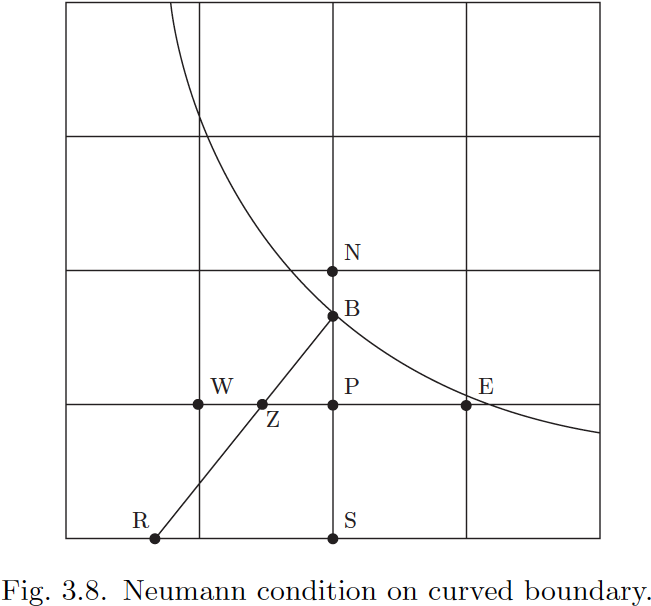

# 3 Parabolic Equation in Two and Three Dimensions

## 3.1 The Explicit Method in a Rectlinear Box

求解二维热传导方程
$$
\partial{u}_{t} = b[\partial{u}_{xx} + \partial{u}_{yy}]
$$
其中 $b > 0$，在一个矩形区域 $0 \leq x \leq X$，$0 \leq y \leq Y$，且用 Dirichlet 边界条件。

离散化为
$$
U_{r,s}^{n} \approx u(x_{r}, y_{s}, t_{n})
$$
其中 $r \in \{0, 1, \ldots, J_{x}\}$，$s \in \{0, 1, \ldots, J_{y}\}$。

定义中心差分算子
$$
\begin{aligned}
\delta_{x}^{2} &= U_{r + 1, s}^{n} - 2U_{r, s}^{n} + U_{r - 1, s}^{n} \\
\delta_{y}^{2} &= U_{r, s + 1}^{n} - 2U_{r, s}^{n} + U_{r, s - 1}^{n}
\end{aligned}
$$

则有
$$
\frac{U^{n + 1} - U^{n}}{\Delta t} = b\left[\frac{\delta_{x}^{2} U^{n}}{(\Delta x)^{2}} + \frac{\delta_{y}^{2} U^{n}}{(\Delta y)^{2}}\right]
$$
其中 $U^{n}$ 忽略了下标。

截断误差为
$$
T(x, y, t) = \frac{1}{2} u_{tt} \Delta{t} - \frac{1}{12}b\left[u_{xxxx} (\Delta{x})^{2} + u_{yyyy} (\Delta{y})^{2}\right]
$$
设各个偏微分绝对值的上界为 $M_{tt}$, $M_{xxxx}$, $M_{yyyy}$，则收敛性
$$
E^{n} \le \left\{\frac{1}{2} M_{tt} \Delta{t} + \frac{1}{12}b\left[M_{xxxx} (\Delta{x})^{2} + M_{yyyy} (\Delta{y})^{2}\right]\right\} t_{F}
$$

用 Fourier 变换来考虑收敛
$$
U^{n} \sim (\lambda)^{n} \exp\left(\mathrm{i}[k_{x}x + k_{y}y]\right)
$$
带入差分格式得到
$$
\lambda(k_{x}, k_{y}) \equiv 1 - 4\left[\mu_{x}\left(\sin^{2}\frac{k_{x}}{2}\right) + \mu_{y}\left(\sin^{2}\frac{k_{y}}{2}\right)\right]
$$
因为 $|\lambda| \le 1$，所以
$$
\underbrace{b\frac{\Delta{t}}{(\Delta x)^{2}}}_{\mu_{x}} + \underbrace{b\frac{\Delta{t}}{(\Delta y)^{2}}}_{\mu_{y}} \le \frac{1}{2}
$$

## 3.2 An ADI Method in Two Dimensions

用 $\theta$ 方法或 Crank-Nicolson 方法来处理
$$
\left(1 - \frac{1}{2}\mu_{x}\delta_{x}^{2} - \frac{1}{2}\mu_{y}\delta_{y}^{2}\right)U^{n + 1} = \left(1 + \frac{1}{2}\mu_{x}\delta_{x}^{2} + \frac{1}{2}\mu_{y}\delta_{y}^{2}\right)U^{n}
$$
要求解一个 $(J_{x} - 1) \times (J_{y} - 1)$ 的稀疏线性方程组，计算量巨大，不好。

因此把一个维度用 Crank-Nicolson 方法，另一个维度用显式方法，即
$$
\left(1 - \frac{1}{2}\mu_{x}\delta_{x}^{2}\right)U^{n + 1} = \left(1 + \frac{1}{2}\mu_{x}\delta_{x}^{2} + \mu_{y}\delta_{y}^{2}\right)U^{n}
$$
这样未知数的个数减少到 $J_{x} - 1$，计算量减少。因此引出下面的方法。

首先把 Crank-Nicolson 方法写成
$$
\left(1 - \frac{1}{2}\mu_{x}\delta_{x}^{2}\right)\left(1 - \frac{1}{2}\mu_{y}\delta_{y}^{2}\right)U^{n + 1} = \left(1 + \frac{1}{2}\mu_{x}\delta_{x}^{2}\right)\left(1 + \frac{1}{2}\mu_{y}\delta_{y}^{2}\right)U^{n}
$$
这引入了一项 $\mu_{x}\mu_{y}(\delta_{x}^{2}\delta_{y}^{2})$，在后续的误差分析中我们会看到这一项的作用。然后再引入中间结果 $U^{n + 1/2}$，得到
$$
\begin{aligned}
\left(1 - \frac{1}{2}\mu_{x}\delta_{x}^{2}\right)U^{n + 1/2} &= \left(1 + \frac{1}{2}\mu_{y}\delta_{y}^{2}\right)U^{n} \\
\left(1 - \frac{1}{2}\mu_{y}\delta_{y}^{2}\right)U^{n + 1} &= \left(1 + \frac{1}{2}\mu_{y}\delta_{x}^{2}\right)U^{n + 1/2}
\end{aligned}
$$
这个和改写后的 Crank-Nicolson 方法是等价的。因此我们把二维的问题转化为两个一维的问题，计算量减少。

用 Fourier 变换来考虑收敛，得到
$$
\lambda = \frac{\left(1 - 2\mu_{x}\sin^{2}\frac{k_{x}}{2}\right)\left(1 - 2\mu_{y}\sin^{2}\frac{k_{y}}{2}\right)}{\left(1 + 2\mu_{x}\sin^{2}\frac{k_{x}}{2}\right)\left(1 + 2\mu_{y}\sin^{2}\frac{k_{y}}{2}\right)}
$$
显然是无条件稳定的。

以一个 $5 \times 5$ 的格子来描述这个方法。首先是格子：
$$
\begin{bmatrix}
U_{0, 0}^{n} & U_{0, 1}^{n} & U_{0, 2}^{n} & U_{0, 3}^{n} & U_{0, 4}^{n} \\
U_{1, 0}^{n} & U_{1, 1}^{n} & U_{1, 2}^{n} & U_{1, 3}^{n} & U_{1, 4}^{n} \\
U_{2, 0}^{n} & U_{2, 1}^{n} & U_{2, 2}^{n} & U_{2, 3}^{n} & U_{2, 4}^{n} \\
U_{3, 0}^{n} & U_{3, 1}^{n} & U_{3, 2}^{n} & U_{3, 3}^{n} & U_{3, 4}^{n} \\
U_{4, 0}^{n} & U_{4, 1}^{n} & U_{4, 2}^{n} & U_{4, 3}^{n} & U_{4, 4}^{n}
\end{bmatrix}
$$
然后是按照第一行去更新，因此就会有方程：
$$
\begin{bmatrix}
1 + \mu_{x} & -\frac{1}{2}\mu_{x} & \\
-\frac{1}{2}\mu_{x} & 1 + \mu_{x} & -\frac{1}{2}\mu_{x} \\
& -\frac{1}{2}\mu_{x} & 1 + \mu_{x} \\
&&&1 + \mu_{x} & -\frac{1}{2}\mu_{x} & \\
&&&-\frac{1}{2}\mu_{x} & 1 + \mu_{x} & -\frac{1}{2}\mu_{x} \\
&&&& -\frac{1}{2}\mu_{x} & 1 + \mu_{x} \\
&&&&&&1 + \mu_{x} & -\frac{1}{2}\mu_{x} & \\
&&&&&&-\frac{1}{2}\mu_{x} & 1 + \mu_{x} & -\frac{1}{2}\mu_{x} \\
&&&&&&& -\frac{1}{2}\mu_{x} & 1 + \mu_{x} \\
\end{bmatrix}
\begin{bmatrix}
U_{1, 1}^{n} \\ U_{1, 2}^{n} \\ U_{1, 3}^{n} \\ U_{2, 1}^{n} \\ U_{2, 2}^{n} \\ U_{2, 3}^{n} \\ U_{3, 1}^{n} \\ U_{3, 2}^{n} \\ U_{3, 3}^{n}
\end{bmatrix}
=\\
\begin{bmatrix}
(1 - \mu_{y})U_{1, 1}^{n} + \frac{1}{2}\mu_{y}U_{2, 1}^{n} \\
(1 - \mu_{y})U_{1, 2}^{n} + \frac{1}{2}\mu_{y}U_{2, 2}^{n} \\
(1 - \mu_{y})U_{1, 3}^{n} + \frac{1}{2}\mu_{y}U_{2, 3}^{n} \\
\frac{1}{2}\mu_{y}U_{1, 1}^{n} + (1 - \mu_{y})U_{2, 1}^{n} + \frac{1}{2}\mu_{y}U_{3, 1}^{n} \\
\frac{1}{2}\mu_{y}U_{1, 2}^{n} + (1 - \mu_{y})U_{2, 2}^{n} + \frac{1}{2}\mu_{y}U_{3, 2}^{n} \\
\frac{1}{2}\mu_{y}U_{1, 3}^{n} + (1 - \mu_{y})U_{2, 3}^{n} + \frac{1}{2}\mu_{y}U_{3, 3}^{n} \\
\frac{1}{2}\mu_{y}U_{2, 1}^{n} + (1 - \mu_{y})U_{3, 1}^{n} \\
\frac{1}{2}\mu_{y}U_{2, 2}^{n} + (1 - \mu_{y})U_{3, 2}^{n} \\
\frac{1}{2}\mu_{y}U_{2, 3}^{n} + (1 - \mu_{y})U_{3, 3}^{n}
\end{bmatrix}
$$
第二行的更新同理。

## 3.4 Curved Boundaries

考虑一个 2D 热方程
$$
u_{t} = u_{xx} + u_{yy}
$$
其区域范围 $\Omega$ 是
$$
\Omega = \{(x, y) | (x, y) \in [0, 1]^{2}\} \cap \{(x, y) | (x - 0.5)^{2} + (y - 0.5)^{2} > 0.33^{2}\}
$$
边界条件为
$$
\begin{aligned}
u(x, y, t) &= 0 \text{ on } \{x + y \ge 1\} \cap \partial\Omega \\
\frac{\partial{u}}{\partial{n}} &= 0 \text{ on } \{x + y < 1\} \cap \partial\Omega
\end{aligned}
$$
其中 $n$ 是法向量。
初值条件为
$$
u(x, y, 0) = \max(0, 1 - a((x - x_{1})^{2} + (y - y_{1})^{2})) + \max(0, 1 - a((x - x_{2})^{2} + (y - y_{2})^{2}))
$$
其中 $a = 1 / 0.08^{2} = 156.25$，$(x_{1}, y_{1}) = (0.14, 0.14)$，$(x_{2}, y_{2}) = (0.86, 0.86)$。

图 3.7 需要去近似 P 点的 $u_{yy}$。有限差分方法的做法是
$$
\begin{aligned}
\frac{u_{N} - u_{P}}{y_{N} - y_{P}} &\approx u_{y}(P_{+}) \\
\frac{u_{P} - u_{B}}{y_{P} - y_{B}} &\approx u_{y}(P_{-})
\end{aligned}
$$
因此
$$
\begin{aligned}
u_{yy}(P) &\approx 2\frac{u_{y}(P_{+}) - u_{y}(P_{-})}{y_{N} - y_{B}}
&\approx \frac{2}{y_{N} - y_{B}}\left[\frac{u_{N} - u_{P}}{y_{N} - y_{P}} - \frac{u_{P} - u_{B}}{y_{P} - y_{B}}\right]
\end{aligned}
$$
令 $y_{P} - y_{B} = \alpha(y_{P} - y_{S}) = \alpha\Delta{y}$，则有
$$
\begin{aligned}
u_{yy}(P) &\approx \frac{2}{(\alpha + 1)\Delta{y}}\left[\frac{u_{N} - u_{P}}{\Delta{y}} - \frac{u_{P} - u_{B}}{\alpha\Delta{y}}\right] \\
&\approx \frac{2}{(\alpha + 1)(\Delta{y})^{2}}u_{N} - \frac{2}{\alpha(\Delta{y})^{2}}u_{P} + \frac{2}{\alpha(\alpha + 1)(\Delta{y})^{2}}u_{B}
\end{aligned}
$$
图 3.7 的点 D 的 $u_{xx}$ 可以用类似的方法得到。

因此，在边界附近的显式差分格式为
$$
\begin{aligned}
\frac{U_{r, s}^{n + 1} - U_{r, s}^{n}}{\Delta t} &= \frac{2}{(\alpha + 1)(\Delta y)^{2}}U_{r, s + 1}^{n} + \frac{2}{\alpha(\Delta y)^{2}}u_{B} \\
&+ \frac{2}{(\beta + 1)(\Delta x)^{2}}U_{r + 1, s}^{n} + \frac{2}{\beta(\Delta x)^{2}}u_{D} \\
&- \left[\frac{2}{\alpha(\Delta y)^{2}} + \frac{2}{\beta(\Delta x)^{2}}\right]U_{r, s}^{n}
\end{aligned}
$$
$u_{B}$ 和 $u_{D}$ 是边界点的值。此时稳定性条件为
$$
\frac{\mu_{x}}{\beta} + \frac{\mu_{y}}{\alpha} \le \frac{1}{2}
$$
$\alpha$, $\beta$ 事实上可以任意小，所以显式格式非常不稳定，因此要用隐式格式。

图 3.8 需要近似 P 点的 $u_{yy}$。有限差分方法的做法是考虑法向量和网格的交点 $Z$，其中
$$
ZP = p\Delta{x}, \quad PB = \alpha\Delta{y}, \quad BZ = q\Delta{y}
$$
其中 $q \le \sqrt{1 + (\Delta{x} / \Delta{y})^{2}}$。因此
$$
\frac{\partial{u}}{\partial{n}} \approx \frac{u_{B} - u_{Z}}{q\Delta{y}} = g(B)
$$
而 $u_{Z}$ 可以用 W 和 P 的值来近似，即
$$
u_{Z} \approx p u_{W} + (1 - p)u_{P}
$$
带入显式差分格式得到
$$
\begin{aligned}
\frac{U_{P}^{n + 1} - U_{P}^{n}}{\Delta t} &= \frac{U_{E} - 2U_{P} + U_{W}}{(\Delta x)^{2}} \\
&+ \frac{1}{(\Delta y)^{2}}\left[\frac{2}{\alpha(\alpha + 1)}U_{B} - \frac{2}{\alpha}U_{P} + \frac{2}{\alpha + 1}U_{S}\right] \\
&= \frac{U_{E} - 2U_{P} + U_{W}}{(\Delta x)^{2}} \\
&+ \frac{1}{(\Delta y)^{2}}\left[-\frac{2}{\alpha}U_{P} + \frac{2}{\alpha + 1}U_{S} \right] \\
&+ \frac{2}{\alpha(\alpha + 1)(\Delta y)^{2}}\left[pU_{W} + (1 - p)U_{P} + qg(B)\Delta y\right] \\
&= \frac{1}{(\Delta x)^{2}}U_{E} + \left[\frac{1}{(\Delta x)^{2}} + \frac{2p}{\alpha(\alpha + 1)(\Delta y)^{2}}\right]U_{W} \\
&+ \frac{2}{(\alpha + 1)(\Delta y)^{2}}U_{S} - \left[\frac{2}{(\Delta x)^{2}} + \frac{2(\alpha + p)}{\alpha(\alpha + 1)(\Delta y)^{2}}\right]U_{P} \\
&+ \frac{2q}{\alpha(\alpha + 1)\Delta y}g(B)
\end{aligned}
$$
