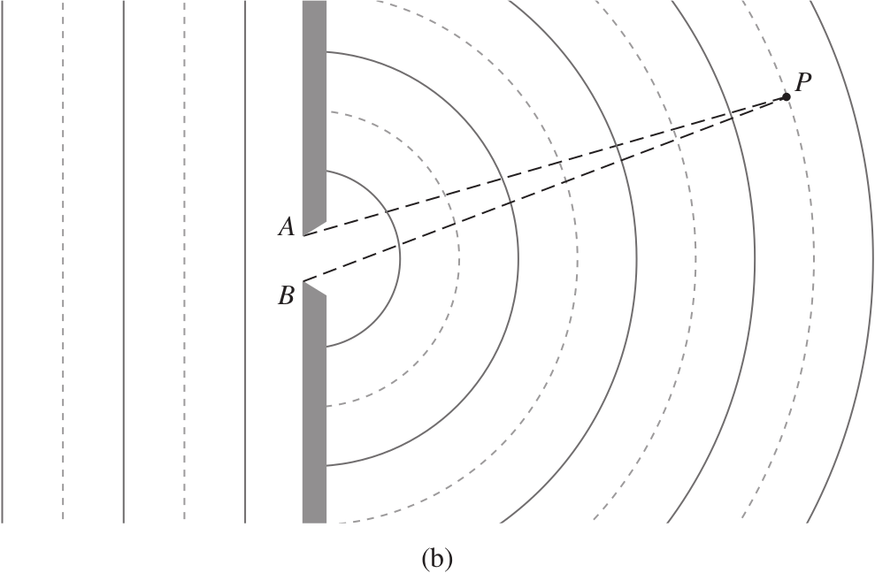
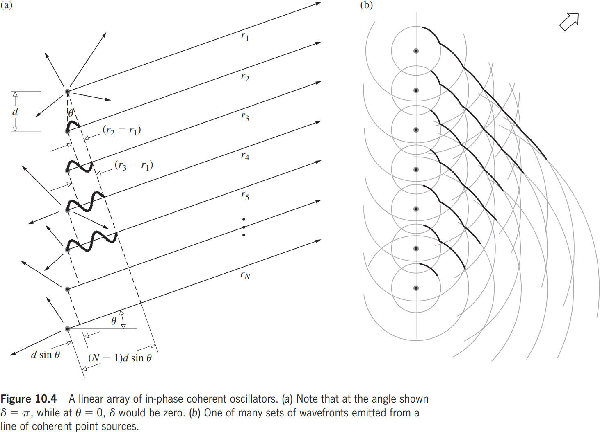
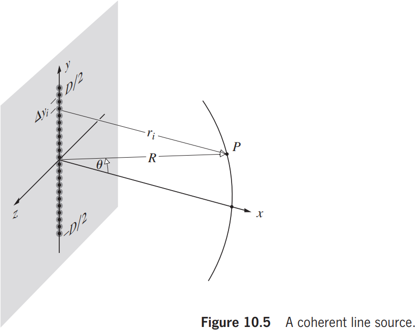
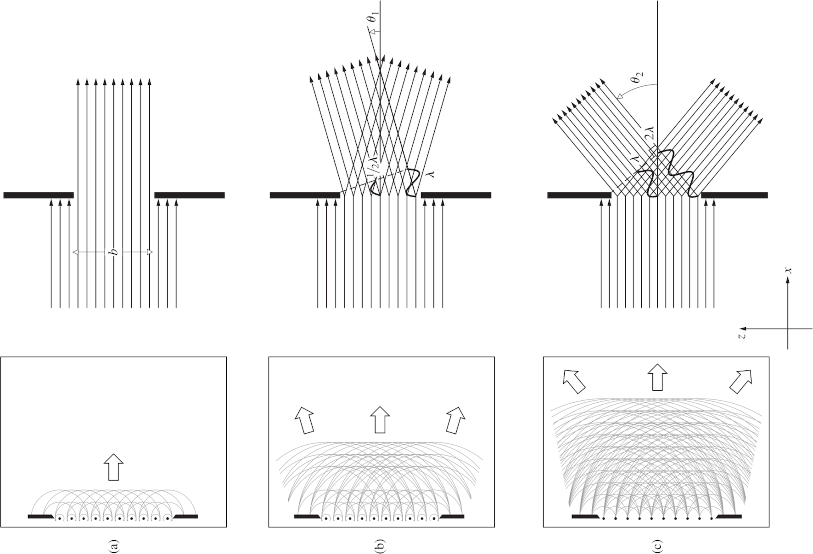
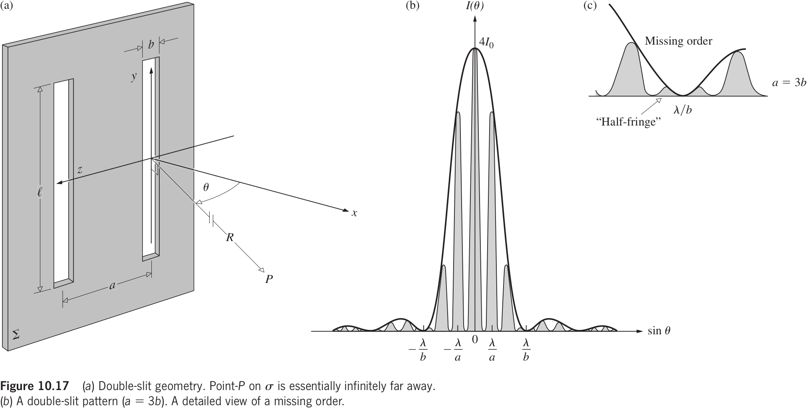
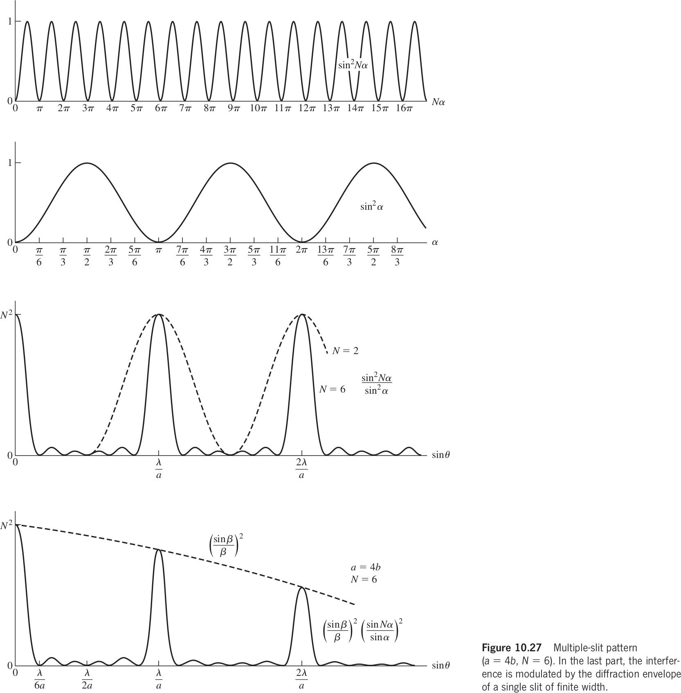
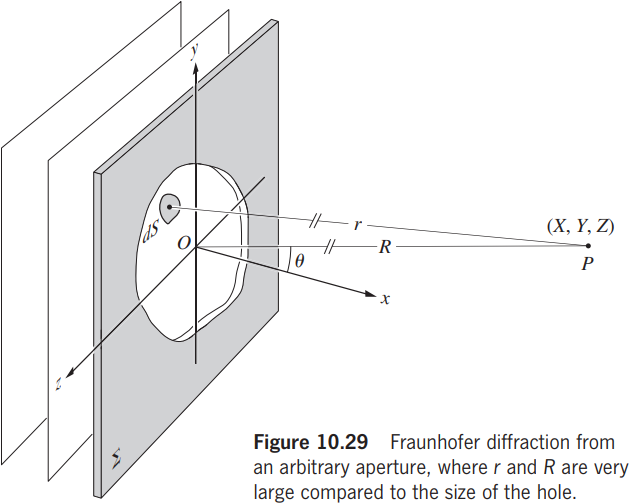

# Chapter 10 Diffraction

## 10.1 Preliminary Consideration

衍射是波现象的一般特征，无论是声波、物质波还是光，只要波前的一部分，遇到透明或者不透明的障碍物时，其振幅或相位发生变化，就会发生衍射。**波前的各个部分在遇到障碍物后传播，相互干涉，形成了所谓的衍射图案，即特定的能量密度分布。**干涉和衍射之间没有明显的物理区别。然而，当考虑只有少数几束光线的叠加时，有时会习惯性地使用“干涉”这个词，而在处理大量光线时则使用“衍射”。

#### The Huygens-Fresnel Principle

惠更斯原理：在波的传播过程中，波阵面（波前）上的每一点都可看做是发射子波的波源，在其后的任一时刻，这些子波的包络面就成为新的波阵面。

惠更斯-菲涅耳原理指出，所有子波来自于同一波前，因此后一时刻的波前是所有子波的干涉叠加。

$P$ 点处最大的光程差 $\Lambda_{\max}=|\overline{AP}-\overline{BP}|\le\overline{AB}$。如果光的波长 $\lambda>\overline{AB}$，且因为它们相位相同，因此在 $P$ 点处发生相长干涉。如果与波长大于孔径，则波将以大角度扩散到障碍物后的区域。

### 10.1.1 Opaque Obstructions

### 10.1.2 Fraunhofer and Fresnel Diffraction

Fresnel/near field; Fraunhofer/far field.

只要在衍射孔径（或障碍物）的范围内，入射波和出射波都接近平面波（与平面波相差不到一个波长的小部分），就会得到 Fraunhofer 衍射。

### 10.1.3 Several Coherent Oscillators

图示显示了一个由 $N$ 个相干点振子（或辐射天线）组成的线性阵列，它们都是相同的，甚至包括它们的偏振。暂时假设振子之间没有固有的相位差异；也就是说，它们的初始相位角相同。所示的光线几乎都是平行的，在某个非常遥远的点 $P$ 相交。如果阵列的空间范围相对较小，则到达 $P$ 的波幅将基本相等，传播的距离几乎相等，即
$$
E_0(r_1)=E_0(r_2)=\dots=E_0(r_N)=E_0(r)
$$
干涉的球面波波前的叠加在 $P$ 处产生了电场，其实部由以下表达式给出：
$$
\tilde{E}=E_0(r)e^{i(kr_1-\omega t)}+E_0(r)e^{i(kr_2-\omega t)}+\dots+E_0(r)e^{i(kr_N-\omega t)}\tag{10.1}
$$
我们有
$$
\tilde{E}=E_0(r)e^{i(kr_1-\omega t)}\times\left[1+e^{ik(r_2-r_1)}+\dots+e^{ik(r_N-r_1)}\right]
$$
相邻源之间的相位差由表达式 $r_i-r_{i-1}=\delta=k_0\Lambda$ 获得，并且在折射率为 $n$ 的介质中 $\Lambda=nd\sin\theta$，因此 $\delta=kd\sin\theta $。
$$
\begin{align*}
\tilde{E}&=E_0(r)e^{i(kr_1-\omega t)}\times\left[1+e^{i\delta}+\dots+e^{i\delta(N-1)}\right]\\
&=E_0(r)e^{i(kr_1-\omega t)}\times\frac{e^{i\delta N}-1}{e^{i\delta}-1}\\
&=E_0(r)e^{i(kr_1-\omega t)}\times\frac{e^{i\delta N/2}[e^{i\delta N/2}-e^{-i\delta N/2}]}{e^{i\delta/2}[e^{i\delta/2}-e^{-i\delta/2}]}\\
&=E_0(r)e^{i(kr_1-\omega t)}e^{i\delta(N-1)/2}\frac{\sin N\delta/2}{\sin\delta/2}
\end{align*}\tag{10.2}
$$
我们有
$$
\tilde{E}=E_0(r)e^{-i\omega t}e^{i[kr_1+(N-1)\delta/2]}\frac{\sin N\delta/2}{\sin\delta/2}\tag{10.3}
$$
如果我们将 $R$ 定义为从振荡器阵列的中心到点 $P$ 的距离，即
$$
R=\frac{1}{2}(N-1)d\sin\theta+r_1
$$
我们有
$$
\tilde{E}=E_0(r)e^{i(kR-\omega t)}\frac{\sin N\delta/2}{\sin\delta/2}\tag{10.4}
$$
辐照度为
$$
I=\tilde{E}\tilde{E}^*/2=I_0\frac{\sin^2N\delta/2}{\sin^2\delta/2}\tag{10.5}
$$
$N=0, I=0$, $N=1,I=I_0$, $N=2,I=4I_0\cos^2(\delta/2)$.

$I$ 关于 $\theta$ 的函数更为明显，带入 $\delta=kd\sin\theta$
$$
I=I_0\frac{\sin^2[N(kd/2)\sin\theta]}{\sin^2[(kd/2)\sin\theta]}\tag{10.6}
$$
表达式产生了一系列由小极大值分隔的尖锐主峰。主极大值出现在使 $\delta=2m\pi$ 的 $\theta_m$ 方向上，其中 $m\in\mathbb{Z}$：
$$
\delta=2m\pi=kd\sin\theta_m\Longrightarrow d\sin\theta_m=m\lambda\tag{10.7}
$$

此时
$$
I=I_0\frac{\sin^2[N\delta/2]}{\sin^2[\delta/2]}\quad(\delta=2m\pi)
$$
由洛必达法则可得主极大值处的光强 $I=N^2I_0$。随着 $\theta$ 的增大，$\delta$ 增大，$I$ 在 $Nd/2 = \pi$ 时下降至零，即第一个极小值。请注意，如果在公式（10.7）中 $d < \lambda$，只有 $m = 0$ 或零阶主最大值存在。如果我们观察的是一个理想化的线源，由原子间距离分隔的电子振子，我们只能期望在光场中有一个主要的最大值。

平面波引起的惠更斯-菲涅尔原理的次级源，每个点都发射一个球面波，我们将其写为：
$$
E=\left(\frac{\varepsilon_0}{r}\right)\sin(\omega t-kr)
$$
明确表示振幅与 $r$ 成反比的关系。$\varepsilon_0$ 被称为源强度。这些源非常弱；它们的数量 $N$ 非常大；它们之间的距离微不足道。阵列 $\Delta y_i$ 的一个微元片段将包含 $\Delta y_i(N/D)$ 个源，其中 $D$ 是整个阵列的长度。想象一下，阵列被分成 $M$ 个这样的片段（即 $i\in\{1,\dots,M\}$）。因此，从第 $i$ 段到 $P$ 的电场强度的贡献为：

$$
E_i=\left(\frac{N\Delta y_i}{D}\right)\left(\frac{\varepsilon_0}{r_i}\right)\sin(\omega t-kr_i)
$$
前提是 $\Delta y_i$ 非常小，以至于其中的振子具有可以忽略的相对相位差（$r_i$ 可看作常数），并且它们的场可以简单地相长性地叠加。当 $N$ 趋近于无穷大时，如果总输出是有限的，单个振子的源强度必须减小到接近零。因此，我们可以将一个常数 $\varepsilon_L$ 定义为阵列每单位长度的源强度，即：
$$
\varepsilon_L\equiv\frac{1}{D}\lim_{N\to\infty}(\varepsilon_0N)\tag{10.8}
$$

$P$ 点处 $M$ 段场强总和为
$$
E=\sum_{i=1}^{M}E_i=\sum_{i=1}^{M}\frac{\varepsilon_L}{r_i}\sin(\omega t-kr_i)\Delta y_i
$$
$M$ 趋于无穷得到
$$
E=\varepsilon_L\int^{+D/2}_{-D/2}\frac{\sin(\omega t-kr)}{r}\mathrm{d}y\tag{10.9}
$$

## 10.2 Fraunhofer Diffraction

### 10.2.1 The Single Slit

现在观察点距离相干线源非常遥远，$R \gg D$。在这些情况下，$r(y)$ 从来不会明显偏离其中点值 $R$，因此在点 $P$，所有元素 $dy$ 的数量 ($\varepsilon_L / R$) 基本上是恒定的。根据公式（10.9），由于源的微元分段 $dy$ 引起的点 $P$ 处的场为：

$$
\mathrm{d}E=\frac{\varepsilon_L}{R}\sin(\omega t-kr)\mathrm{d}y\tag{10.10}
$$

相位对于 $r(y)$ 的变化比振幅更敏感。设 $\theta$ 是高度角，由余弦定理可得
$$
\frac{r}{R}=\sqrt{1-2\left(\frac{y}{R}\right)\sin\theta+\left(\frac{y}{R}\right)^2}
$$
Taylor 展开

---

$$
\sqrt{1-x}=\sum_{n=0}^{\infty}(-1)^{n}\frac{1}{n!}\frac{(2n-1)!!}{2^n}x^n
$$

$$
\begin{align*}
\sqrt{1-2\left(\frac{y}{R}\right)\sin\theta+\left(\frac{y}{R}\right)^2}&=1-\frac{1}{2}\left[2\left(\frac{y}{R}\right)\sin\theta+\left(\frac{y}{R}\right)^2\right]+\frac{1}{8}\left[2\left(\frac{y}{R}\right)\sin\theta+\left(\frac{y}{R}\right)^2\right]^2+O(y^3)\\
&=1+\left(\frac{y}{R}\right)\sin\theta-\frac{1}{2}\left(\frac{y}{R}\right)^2+\frac{1}{2}\left(\frac{y}{R}\right)^2\sin^2\theta+O(y^3)\\
&=1+\left(\frac{y}{R}\right)\sin\theta+\frac{1}{2}\left(\frac{y}{R}\right)^2\cos^2\theta
\end{align*}
$$

---

$$
r=R-y\sin\theta+(y^2/2R)\cos^2\theta+\dots\tag{10.11}
$$

**夫琅禾费条件：距离 $r$ 是 $y$ （到观察点的距离）的线性函数，因此相位可以写成孔径变量的线性函数。**忽略 $y$ 的高阶项得到
$$
E=\frac{\varepsilon_L}{R}\int^{+D/2}_{-D/2}\sin[\omega t-k(R-y\sin\theta)]\mathrm{d}y\tag{10.12}
$$

积分得到
$$
\begin{align*}
E&=\frac{\varepsilon_L}{R}\frac{\cos[(\omega t-kR)-(kD/2)\sin\theta]-\cos[(\omega t-kR)+(kD/2)\sin\theta]}{k\sin\theta}\\
&=\frac{\varepsilon_L}{R}\frac{2\sin(\omega t-kR)\sin[(kD/2)\sin\theta]}{k\sin\theta}\\
&=\frac{\varepsilon_LD}{R}\frac{\sin[(kD/2)\sin\theta]}{(kD/2)\sin\theta}\sin(\omega t-kR)\tag{10.13}
\end{align*}
$$
定义
$$
\beta\equiv(kD/2)\sin\theta\tag{10.14}
$$
辐照度为
$$
I(\theta)=\frac{1}{2}\left(\frac{\varepsilon_LD}{R}\right)^2\left(\frac{\sin\beta}{\beta}\right)^2\tag{10.16}
$$

夫琅禾费条件下理想的相干线源产生的辐照度是：
$$
I(\theta)=I(0)\left(\frac{\sin\beta}{\beta}\right)^2\tag{10.16}
$$

考虑狭缝宽度 $b$，同样的分析方法可以得到
$$
I(\theta)=I(0)\left(\frac{\sin\beta}{\beta}\right)^2\quad\beta\equiv(kb/2)\sin\theta\tag{10.18}
$$
此时 $\theta$ 是水平角。考虑其极值点
$$
\frac{\mathrm{d}I}{\mathrm{d}\theta}=I(0)\frac{2\sin\beta(\beta\cos\beta-\sin\beta)}{\beta^3}=0\tag{10.19}
$$
其零点有 $\sin\beta=0$ 和 $\beta=\tan\beta$。前者除了 $\beta=0$ 外显然是极小值点，后者显然是极大值点。

对于图 10.9b 中以 $\theta_1$ 角度发射的特定光束，从缝隙顶部和底部的波前之间的路径长度变化被安排成等于 $\lambda$。由于 $b$ 是缝隙的宽度，这个路径长度差可以表示为 $b\sin\theta_1=\lambda$。来自缝隙中间的波前将比顶部的波前滞后 $\lambda/2$ 到达观察屏幕，因此互相抵消。同样，从中心以下发射的波前将抵消从顶部以下发射的波前，依此类推；在整个孔径范围内，这些波前对将相互抵消，在观察屏幕上会产生一个与角度 $\theta_1$ 对应的最小值。

#### Phasor and the Electric-Field Amplitude

狭缝两端的光波的光程差为 $\delta=2\beta=kD\sin\theta$。因此狭缝中间的光波的相位可以在图上表示为电矢量前后相接，连接其起点和终点的矢量的长度就是此时衍射得到的电矢量强度。

#### Single-Slit Irradiance

如果 $b$ 很小，那么光屏上的各处（即 $\theta$ 带来的）亮度变化就很小，类似球面波。如果 $b$ 很大，则只在正对光源（即 $\theta=0$）处有亮度。

### 10.2.2 The Double Slit

假设两个单缝的间距为 $a$，宽度为 $b$，长度为 $l$，双缝干涉的结果可以看成是一个单缝干涉的结果被另外一个单缝干涉的结果给调制了。考虑电场分布
$$
E=C\int_{-b/2}^{b/2}F(z)\mathrm{d}z+C\int_{a-b/2}^{a+b/2}F(z)\mathrm{d}z\tag{10.2}
$$
其中 $F(z)=\sin[\omega t-k(R-z\sin\theta)]$。积分得到
$$
E=bC\left(\frac{\sin\beta}{\beta}\right)[\sin(\omega t-kR)+\sin(\omega t-kR+2\alpha)]\tag{10.23}
$$
其中 $\alpha\equiv(ka/2)\sin\theta$，$\beta\equiv(kb/2)\sin\theta$，和差化积得到
$$
E=2bC\left(\frac{\sin\beta}{\beta}\right)\cos\alpha\sin(\omega t-kR+\alpha)
$$
辐照度为
$$
I(\theta)=4I_0\left(\frac{\sin^2\beta}{\beta^2}\right)\cos^2\alpha\tag{10.24}
$$
如果 $b$ 很小，则类似双缝干涉的结论。如果 $a$ 很小，则双缝变为单缝。

此时双缝衍射的亮度图像在单缝衍射的基础上乘上了 $\cos^2\alpha$，因此在 $\alpha=\pm\pi/2,\pm3\pi/2,\dots$ 处会产生零点。

同样的宽度 $b$，间距 $a$ 越大，则主极大内部的干涉条纹就越多。

同样的间距 $a$，宽度 $b$ 越大，则主极大间距就越短，内部的干涉条纹就越少。

由于 $\alpha$ 和 $\beta$ 共享一个 $\theta$，因此在 $\alpha=m\beta$ 的时候，原本由 $\alpha$ 产生的极大值会被 $\beta$ 给抑制，发生缺极（missing order）。

### 10.2.3 Diffraction by Many Slits

仍然可以用相矢量来首位相接，其中一个缝对应一个相矢量，每个缝对应的相位差为 $(ka/2)\sin\theta$。通过相矢量叠加的方法可以得到，两个主极大值之间会得到 $N-2$ 个副极大。
$$
E_0(\theta)=E_{01}\left(\frac{\sin\beta}{\beta}\right)\left(\frac{\sin N\alpha}{\sin\alpha}\right)\tag{10.26}
$$

$$
I(\theta)=I_{0}\left(\frac{\sin\beta}{\beta}\right)^2\left(\frac{\sin N\alpha}{\sin\alpha}\right)^2\tag{10.31}
$$

主极大在 $\sin N\alpha/\sin\alpha=N$ 的时候，即 $\alpha=m\pi$，即 $a\sin\theta=m\lambda$。$m$ 是衍射级次。

### 10.2.4 The Rectangle Aperture

根据惠更斯-菲涅尔原理，孔径内的微分面元 $\mathrm{d}S$ 可以被看作是覆盖着相干的次级点源。但是由于 $\mathrm{d}S$ 的尺寸远小于波长 $\lambda$，因此在 $P$ 点所有次级波相位相同，从而相长干涉。相长干涉导致了中心最亮的明亮斑点，这是在波通过小孔或障碍物边缘时产生的典型衍射现象。

设 $\varepsilon_A$ 是单位面积内的振幅强度，则 $P$ 点（坐标 $(X,Y,Z)$）处由 $\mathrm{d}S$（坐标 $(0,y,z)$）带来的电场强度为
$$
\mathrm{d}E=\left(\frac{\varepsilon_A}{r}\right)e^{i(\omega t-kr)}\mathrm{d}S\tag{10.37}
$$
其中 $r=\sqrt{X^2+(Y-y)^2+(Z-z)^2}$。

由于 $k=2\pi/\lambda$ 是一个比较大的数字，因此需要对于 $r$ 取到比较高阶的近似。考虑到 $R=\sqrt{X^2+Y^2+Z^2}$，我们有
$$
r=R\sqrt{1+(y^2+z^2)/R^2-2(Yy+Zz)/R^2}\tag{10.40}
$$
这里就可以忽略比较小的第二项，因此
$$
r=R\sqrt{1-2(Yy+Zz)/R^2}
$$
Taylor 展开得到
$$
r=R[1-(Yy+Zz)/R^2]
$$
因此 $P$ 点处的场强为
$$
\begin{align*}
\tilde{E}&=\iint_{\Sigma}\left(\frac{\varepsilon_A}{R}\right)e^{i(\omega t-kR[1-(Yy+Zz)/R^2])}\mathrm{d}S\\
&=\frac{\varepsilon_Ae^{i(\omega t-kR)}}{R}\iint_{\Sigma}e^{ik(Yy+Zz)/R}\mathrm{d}S
\end{align*}\tag{10.41}
$$

其中 $\Sigma$ 为孔径光阑。假设 $\Sigma$ 是一个长为 $a$ 宽为 $b$ 的矩形，则积分结果为
$$
\begin{align*}
\tilde{E}&=\frac{\varepsilon_Ae^{i(\omega t-kR)}}{R}\iint_{\Sigma}e^{ik(Yy+Zz)/R}\mathrm{d}S\\
&=\frac{\varepsilon_Ae^{i(\omega t-kR)}}{R}\int_{-b/2}^{+b/2}e^{ikYy/R}\mathrm{d}y\int_{-a/2}^{+a/2}e^{ikZz/R}\mathrm{d}z\\
&=\frac{ab\varepsilon_Ae^{i(\omega t-kR)}}{R}\left(\frac{\sin\alpha'}{\alpha'}\right)\left(\frac{\sin\beta'}{\beta'}\right)\\
\end{align*}\tag{10.42}
$$
其中 $\alpha'=kaZ/2R,\beta'=kbY/2R$。因此光强为
$$
\tilde{I}(Y,Z)=I(0,0)\left(\frac{\sin\alpha'}{\alpha'}\right)^2\left(\frac{\sin\beta'}{\beta'}\right)^2\tag{10.43}
$$

### 10.2.5 The Circular Aperture

回顾 $P$ 点处的场强
$$
\tilde{E}=\frac{\varepsilon_Ae^{i(\omega t-kR)}}{R}\iint_{\Sigma}e^{ik(Yy+Zz)/R}\mathrm{d}S
$$

对于半径为 $a$ 的圆形孔，我们需要将积分变为极坐标形式，即
$$
\begin{align*}
z&=\rho\cos\phi&y&=\rho\sin\phi\\
Z&=q\cos\Phi&Y&=q\sin\Phi
\end{align*}
$$
此时面积微元为 $\mathrm{d}S=\rho\mathrm{d}\rho\mathrm{d}\phi$，因此得到圆形孔的积分形式
$$
\begin{align*}
\tilde{E}&=\frac{\varepsilon_Ae^{i(\omega t-kR)}}{R}\iint_{\Sigma}e^{ik(Yy+Zz)/R}\mathrm{d}S\\
&=\frac{\varepsilon_Ae^{i(\omega t-kR)}}{R}\int_{0}^{a}\int_{0}^{2\pi}\rho e^{i(kq\rho/R)\cos(\Phi-\phi)}\mathrm{d}\rho\mathrm{d}\phi
\end{align*}\tag{10.46}
$$
由于比较好的轴对称性，我们可以考虑 $\Phi=0$ 的情况，即
$$
\begin{align*}
\tilde{E}&=\frac{\varepsilon_Ae^{i(\omega t-kR)}}{R}\int_{0}^{a}\int_{0}^{2\pi}\rho e^{i(kq\rho/R)\cos(\Phi-\phi)}\mathrm{d}\rho\mathrm{d}\phi\\
&=\frac{\varepsilon_Ae^{i(\omega t-kR)}}{R}\int_{0}^{a}\int_{0}^{2\pi}\rho e^{i(kq\rho/R)\cos\phi}\mathrm{d}\rho\mathrm{d}\phi\\
&=\frac{2\pi\varepsilon_Ae^{i(\omega t-kR)}}{R}\int_{0}^{a}\rho J_0\left(\frac{kq\rho}{R}\right)\mathrm{d}\rho
\end{align*}\tag{10.49}
$$
其中 $J_0$ 是零阶贝塞尔函数。运用 $m$ 阶贝塞尔函数的性质，我们有
$$
\begin{align*}
\tilde{E}&=\frac{2\pi\varepsilon_Ae^{i(\omega t-kR)}}{R}\int_{0}^{a}\rho J_0\left(\frac{kq\rho}{R}\right)\mathrm{d}\rho\\
&=\frac{2\pi\varepsilon_Ae^{i(\omega t-kR)}}{R}\left(\frac{R}{kq}\right)^2\int_{0}^{kaq/R}w J_0(w)\mathrm{d}w\\
&=2\pi a^2\frac{\varepsilon_Ae^{i(\omega t-kR)}}{R}\frac{R}{kaq}J_1\left(\frac{kqa}{R}\right)
\end{align*}\tag{10.51}
$$
因此光强为
$$
\tilde{I}(q)=\frac{2\varepsilon_A^2(\pi a^2)^2}{R^2}\left(\frac{J_1(kqa/R)}{kqa/R}\right)^2\tag{10.52}
$$
由 L'Hospital 法则可得
$$
\lim_{x\to0}\frac{J_1(x)}{x}=\frac{1}{2}
$$
因此
$$
\tilde{I}(0)=\frac{\varepsilon_A^2(\pi a^2)^2}{2R^2}\tag{10.54}
$$
即
$$
\tilde{I}(q)=\tilde{I}(0)\left(\frac{2J_1(kqa/R)}{kqa/R}\right)^2\tag{10.55}
$$
由于 $\sin\theta=q/R$，因此
$$
\tilde{I}(q)=\tilde{I}(0)\left(\frac{2J_1(ka\sin\theta)}{ka\sin\theta}\right)^2\tag{10.56}
$$

圆孔衍射的中心亮斑的被称为 Airy 斑，其半径满足
$$
ka\sin\theta=3.83
$$
对应在光屏上的半径为
$$
q=3.83\frac{R}{ka}=3.83\frac{R\lambda}{2\pi ka}=1.22\frac{R\lambda}{2a}=1.22\frac{f\lambda}{D}\tag{10.58}
$$

### 10.2.6 Resolution of Imaging System

Airy 斑半径对应的张角为
$$
\Delta\theta=\frac{q}{f}=1.22\frac{\lambda}{D}\tag{10.59}
$$

Rayleigh 判据：能够分辨两个光源的中心亮斑的最小距离。在这里 Airy 斑半径对应的张角就是 Rayleigh 判据的张角。

## 10.3 Fresnel Diffraction

