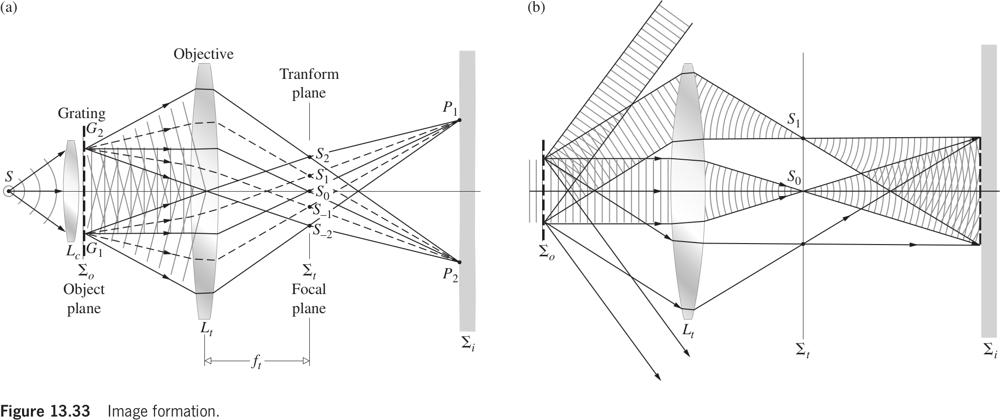
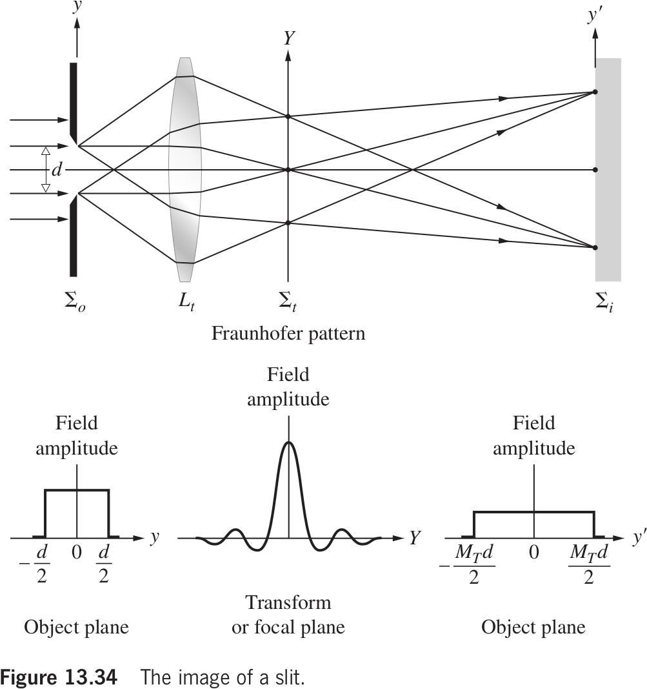
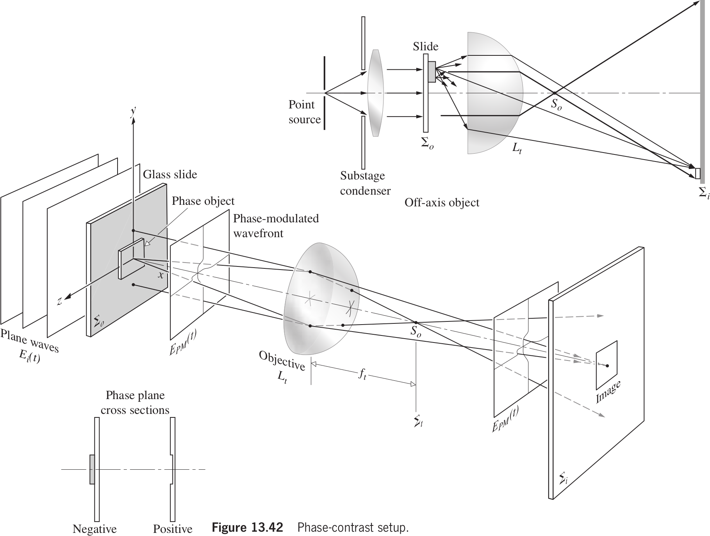
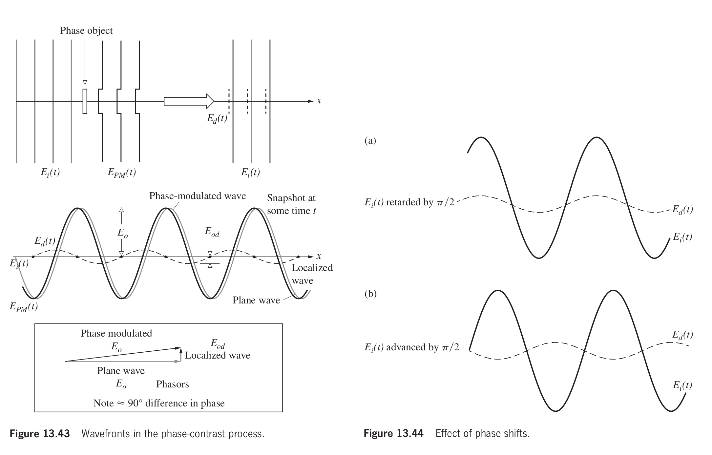
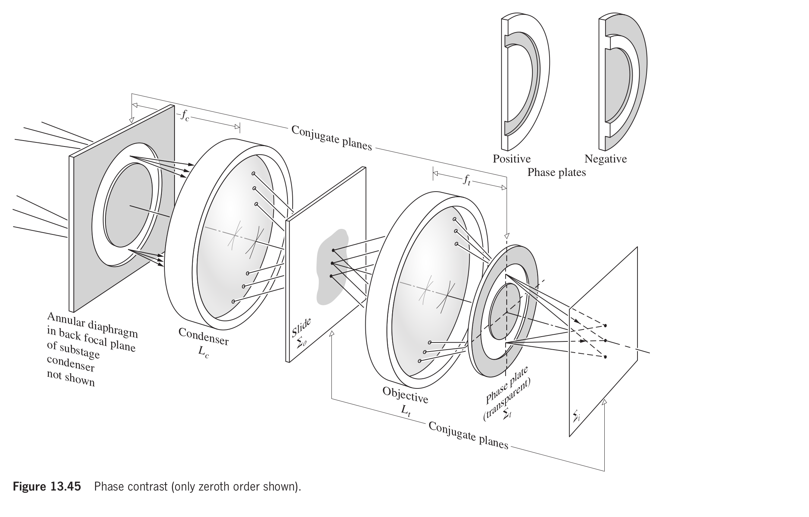

# Chapter 13 Modern Optics: Laser and Other Topics

## 13.2 Imagery--The Spatial Distribution of Optical Information

### 13.2.1 Spatial Frequencies

我们可以在物体后面引入一个透镜（$L_t$）以缩短到图像平面的距离。这个物镜透镜通常被称为变换透镜，因为我们可以将其想象成一个能够生成瞬时傅里叶变换的光学计算机。

假设孔径函数 $\mathcal{A}(y,z)$ 是一个周期性的阶跃函数。如果 $a$ 是光栅间距，那么 $a$ 也是阶跃函数的空间周期，它的倒数是光栅的空间基频。在衍射图案中的中央斑点（$m = 0$）对应于空间频率的直流分量，远离衍射图案中轴的斑点对应于由 $\sin\theta_m=\lambda(m/a)$ 得到的 $(m/a)$。

假设孔径函数 $\mathcal{A}(y,z)$ 是一个正弦函数。理想情况下，在变换平面上只会有三个斑点，分别是零频率和两侧的一阶或基频。扩展到二维，除了在网格上横向和纵向的明显周期性外，它也在对角线上重复出现。

无论如何，衍射图案中的每个光斑都表示了特定空间频率的存在，该频率与其距光轴（零频率位置）的距离成正比。正负符号的频率分量在中心轴周围对称地相对出现。如果我们能够测量变换平面中每个点的电场，我们确实会观察到孔径函数的变换，但这是不可行的。相反，检测到的将是通量密度分布，**在每个点上，辐射度与电场的平方的时间平均值成正比，或者等效地与该点的特定空间频率贡献的幅度的平方成正比**。

### 13.2.2 Abbe's Theory of Image Formation

考虑图 13.33a 所示的系统，是图 13.33b 的详细版本。平面单色波前从准直透镜（$L_c$）发出，被光栅衍射，产生一个扰乱的波前。我们将其分解成一系列新的平面波，每个波对应于一个空间频率或阶数 $m=0,\pm1,\pm2,\dots$，并且在特定的方向传播（图13.33b）。物镜透镜（$L_t$）用作变换透镜，在变换平面 $\Sigma_t$（也是 $L_t$ 的后焦平面）上形成光栅的 Fraunhofer 衍射图案。波继续传播，到达图像平面 $\Sigma_i$。在那里，它们叠加、干涉，形成光栅的倒置图像。因此，点 G1 和 G2 分别成像为 P1 和 P2。物镜透镜形成了两种不同的图案。**一个是对应于源平面共轭的焦平面上的傅里叶变换，另一个是在物体平面共轭的平面上形成的物体的图像。**

我们可以将图 13.33a 中的 $S0$、$S1$、$S2$ 等等在变换平面上点当作是 Huygens 波源，在 $\Sigma_t$ 上得到的衍射图案就是光栅的图像。换句话说，图像是由双重衍射过程产生的。另一种想象方式是入射波被物体衍射，产生的衍射波再被物镜衍射。如果没有那个物镜，物体的衍射图案将出现在 $\Sigma_i$ 上，代替图像。

即使入射光的表面角只占据了物镜的一小部分，较大的孔径会导致更高的分辨率。注意，如果物镜的孔径不足以收集所有的衍射光，图像将不会与实际物体完全对应，而是对应于由 $L_t$ 收集的空间频率。这是因为 Fraunhofer 衍射图案靠外的区域与较高的空间频率相关，它们的丢失将导致图像的清晰度和分辨率的下降。无论如何，应该强调的是，除非物镜孔径无限大，否则它将作为低通滤波器工作。

### 13.2.3 Spatial Filtering

### 13.2.4 Phase Contrast

一个物体之所以能够被“看见”，是因为它显得与周围不同——它可能具有颜色、色调或可能缺乏颜色，总之与背景产生了对比。这种由光波的振幅变化来观察的结构被称为振幅物体（amplitude object）。光波与这种物体作用时会发生反射或透射——即发生了振幅调制（amplitude modulate）。与之相对的是相位物体，一般是透明的物体，在其周围几乎没有对比度，只改变检测到的波的相位。这种物体的光学厚度通常因折射率或实际厚度变化而在各点之间不同。显然，由于眼睛无法检测相位变化，这种物体是不可见的。

当恒定相位的波面的一部分被某种方式遮挡时，即当波前的某个区域发生改变（无论是幅度还是相位，即形状），就会发生衍射。假设平面波通过一个透明的粒子，这个粒子会延缓（retard）波前的一部分的相位。出射的波不再是完全平面的，而是包含一个小的凹陷，对应于被样本延迟的区域——即这个波发生了相位调制（phase modulate）。

|        Symbols         |                       Descriptions                        |
| :--------------------: | :-------------------------------------------------------: |
|       $E_i(x,t)$       |               入射平面波，仅沿 $x$ 方向传播               |
| $E_{PM}(\mathbf{r},t)$ | 相位调制过的波，即穿过样品的波，产生了 $y,z$ 方向的传播。 |
|  $E_d(\mathbf{r},t)$   |                         局部扰动                          |

如图 13.43 所示，如果相位延迟非常小，局部扰动波的振幅非常小，设为 $E_{od}$，延迟约 $\lambda_0/4$。$E_{PM}(\mathbf{r}, t)$ 和 $E_i(x, t)$ 之间的差异表示为 $E_d(\mathbf{r} , t)$。**$E_i(x, t)$ 被称为直接波或零阶波，而 $E_d(\mathbf{r}, t)$ 是衍射波。前者在 $\Sigma_i$ 处产生了一个受物体影响较小的均匀照明场，而后者携带了有关粒子光学结构的所有信息。**在从物体广泛发散之后，这些高阶空间频率项被引导汇聚到像平面上。直接波和衍射波相位差 $\pi/2$ 叠加，再次形成相位调制的波。由于重建波 $E_{PM}(\mathbf{r}, t)$ 在 $\Sigma_i$ 上的振幅是均匀的，尽管相位各点变化，但流量密度是均匀的，因此无法感知图像。同样，相位光栅的零阶光谱将与高阶光谱相位差 $\pi/2$。如果我们可以在它们叠加之前再偏移额外的 $\pi/2$ 相位来改变衍射光和直射光之间的相对相位，它们仍然会相干，然后可以进行干涉，要么相长，要么是相消（图13.44）。在任何一种情况下，图像区域的重建波前将被幅度调制，图像将可见。

设单色光
$$
E_i(x,t)|_{x=0}=E_0\cos\omega t
$$
通过样品后产生了相位延迟 $\phi(y,z)$，因此得到
$$
E_{PM}(\mathbf{r},t)|_{x=0}=E_0\cos[\omega t+\phi(y,z)]\tag{13.20}
$$
这是一个振幅恒定的波，如果不考虑像差、波形反转和放缩、无限大的物镜，它将会和在共轭的相平面上的波是一样的。所以公式 $(13.20)$ 足够描述在 $\Sigma_o$ 和 $\Sigma_i$ 上的波。展开得到
$$
E_{PM}(y,z,t)=E_0\cos\omega t\cos\phi(y,z)-E_0\sin\omega t\sin\phi(y,z)
$$
假设相位延迟 $\phi(y,z)$ 很小，可以近似为
$$
E_{PM}(y,z,t)=E_0\cos\omega t-E_0\phi(y,z)\sin\omega t
$$
如果能改变这两项的相位差，我们就能得到
$$
E_{AM}(y,z,t)=E_0[1+\phi(y,z)]\cos\omega t\tag{13.21}
$$

就是我们想要的振幅调制的波。注意，$\phi(y, z)$ 可以用傅立叶展开来表示，从而引入与物体相关的空间频率。Zernike 在变换平面 $\Sigma_t$ 上插入了一个能够引入 $\pi/2$ 相移的空间滤波器。滤波器可以是一个在折射率为 $n_g$ 的透明玻璃板上刻蚀出的深度为 $d$ 的小圆凹坑。理想情况下，只有直射光会穿过凹坑，这样它就会相对于散射波取得相位超前，超前量为 $(n_g - 1)d$，通过调整使其等于 $\lambda_0/4$。这种类型的滤波器称为相位板，厚度较大或折射率较高的相位物体在明亮的背景下会呈现暗色。相反，如果相位板的中心有一个小凸起的圆盘，情况将会相反。前一种情况称为正相位对比度；后者称为负相位对比度。

在实际操作中，一般使用宽源而不是点源，这样以获得更亮的图像。出射的平面波照亮一个环形光阑（图13.45），由于它是源平面，与物镜的变换平面 $\Sigma_t$ 共轭。然后，它们穿过位于 $\Sigma_t$ 处的薄环形相位板区域。该相位板区域非常小，因此大部分散射波的锥形不会经过这个区域。环形区域镀有薄金属膜，具有吸收性，与较高阶相比，均匀的零阶项强度减小，从而提高对比度。通常，显微镜会配备一系列具有不同吸收度的相位板。

