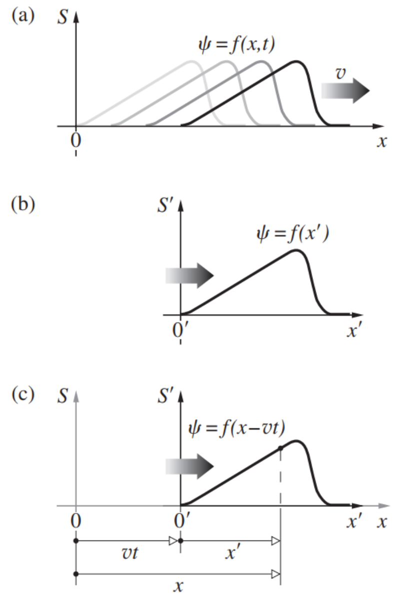
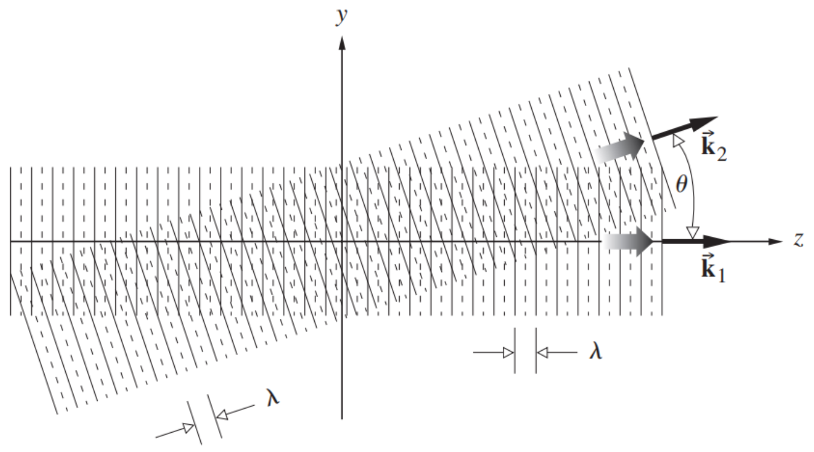

# Chapter 2 Wave Motion

传统行波是介质的自激振荡，它在空间中移动，传输能量和动量。
A classical traveling wave is a self-sustaining disturbance of a medium, which moves through space transporting energy and momentum.

## 2.1 One-Dimensional Waves

**纵向**：介质沿波的运动方向位移。
**longitudinal**: the medium is displaced in the direction of motion of the wave.

**横向**：介质在与波的运动方向垂直的方向上发生位移。
**transverse**: the medium is displaced in a direction perpendicular to that of the motion of the wave.

由于振荡是移动的，它必须是位置和时间的函数：
Since the disturbance is moving, it must be a function of both position and time:
$$
\psi(x,t)=f(x,t)\tag{2.1}
$$
在任何瞬间，例如 $t=0$，振荡的形状可以通过在该值上保持时间不变来找到。
The shape of the disturbance at any instant, say, $t = 0$, can be found by holding time constant at that value.
$$
\psi(x,t)|_{t=0}=f(x,0)=f(x)\tag{2.2}
$$

在时间 $t$ 之后，脉冲沿着 $x$ 轴移动了 $vt$ 的距离，但在所有其他方面它仍然没有改变。我们现在引入一个坐标系 $S'$，它以 $v$ 的速度与脉冲一起移动。此时，坐标是 $x'$ 而不是 $x$，所以
After a time $t$ the pulse has moved along the $x$-axis a distance $vt$, but in all other respects it remains unaltered. We now introduce a coordinate system $S'$, that travels along with the pulse at the speed $v$. Here, the coordinate is $x'$ rather than $x$​, so that
$$
\psi=f(x')\tag{2.3}
$$
Rewrite Eq. $(2.3)$ in terms of $x$
$$
x'=x-vt\tag{2.4}
$$
and substituting into Eq. $(2.3)$
$$
\psi(x,t)=f(x-vt)\tag{2.5}
$$
由此产生的表达式描述了一个具有所需轮廓的波，以 $v$ 的速度在正 $x$ 方向运动。
The resulting expression describes a wave having the desired profile, moving in the positive $x$-direction with a speed $v$.

### 2.1.1 The Differential Wave Equation

To relate the space and time dependencies of $\psi(x,t)$, take the partial derivative of $\psi(x,t)=f(x')$ with respect to $x$, holding $t$ constant.
$$
\frac{\partial\psi}{\partial{x}}=\frac{\partial{f}}{\partial{x}}\\
\frac{\partial\psi}{\partial{x}}=\frac{\partial{f}}{\partial{x'}}\frac{\partial{x'}}{\partial{x}}=\frac{\partial{f}}{\partial{x'}}\frac{\partial(x\mp vt)}{\partial{x}}=\frac{\partial{f}}{\partial{x'}}\tag{2.8}
$$
Holding $x$ constant, the partial derivative with respect to time is
$$
\frac{\partial\psi}{\partial{t}}=\frac{\partial{f}}{\partial{x'}}\frac{\partial{x'}}{\partial{t}}=\mp v\frac{\partial{f}}{\partial{x'}}\tag{2.9}
$$
Combining Eqs. $(2.8)$ and $(2.9)$ yields
$$
\mp v\frac{\partial\psi}{\partial{x}}=\frac{\partial\psi}{\partial{t}}
$$
The second partial derivatives of Eqs. $(2.8)$ and $(2.9)$ are  
$$
\frac{\partial^2\psi}{\partial{x}^2}=\frac{\partial}{\partial{x}}\left(\frac{\partial{f}}{\partial{x'}}\right)=\frac{\partial}{\partial{x'}}\left(\frac{\partial{f}}{\partial{x'}}\right)\frac{\partial{x'}}{\partial{x}}=\frac{\partial^2{f}}{\partial{x'}^2}
$$
and
$$
\frac{\partial^2\psi}{\partial{t}^2}=\mp v\frac{\partial}{\partial{t}}\left(\frac{\partial{f}}{\partial{x'}}\right)=\mp v\frac{\partial}{\partial{x'}}\left(\frac{\partial{f}}{\partial{x'}}\right)\frac{\partial{x'}}{\partial{t}}=v^2\frac{\partial^2\psi}{\partial{x'}^2}
$$
Combining this two, we obtain
$$
\color{red}\frac{\partial^2\psi}{\partial{x}^2}=\frac{1}{v^2}\frac{\partial^2\psi}{\partial{t}^2}\tag{2.11}
$$
如果一个表示波的函数是该方程的解，那么它将同时是 $(x\mp vt)$ 的函数--具体地说，是一个对 $x$ 和 $t$ 都是两次可微的函数（以非平凡的方式）。
If a function that represents a wave is a solution of that equation, it will at the same time be a function of $(x \mp vt)$ -- specifically, one that is twice differentiable (in a nontrivial way) with respect to both $x$ and $t$.

## 2.2 Harmonic Waves

$$
\psi(x,t)|_{t=0}=f(x)=A\sin{kx}\\
\psi(x,t)=A\sin{k(x-vt)}
$$

|  Symbols  |                         Description                          |
| :-------: | :----------------------------------------------------------: |
|    $k$    |                  $k>0$, propagation number                   |
|    $A$    |                          amplitude                           |
| $\lambda$ | wavelength/*spatial period*, $\psi(x,t)=\psi(x\pm\lambda,t)$ implies $|k\lambda|=2\pi$ |
|  $\phi$   |                       $\phi=kx$, phase                       |
|  $\tau$   | *temporal period*, $\psi(x,t)=\psi(x,t\pm\tau)$ implies $|kv\tau|=2\pi$ |
|   $\nu$   |           $\nu\equiv1/\tau$, *temporal frequency*            |
| $\omega$  |   $\omega=2\pi/\tau=2\pi\nu$, *angular temporal frequency*   |
| $\kappa$  |   $\kappa\equiv1/\lambda$, wave number/*spatial frequency*   |

$$
\lambda=v\tau\tag{2.18}
$$

$$
v=\lambda\nu\tag{2.19}
$$

Equivalent expressions
$$
\begin{align*}
\psi&=A\sin{k(x\mp vt)}\\
&=A\sin{2\pi\left(\frac{x}{\lambda}\mp\frac{t}{\tau}\right)}\\
&=A\sin{2\pi(\kappa x\mp \nu t)}\\
&=A\sin{(kx\mp \omega t)}\\
&=A\sin{2\pi\left(\frac{x}{v}\mp t\right)}
\end{align*}
$$
**单色的/单能的**。每个波有一个单一的恒定频率。
**monochromatic/monoenergetic**: Each wave has a single constant frequency.

**准单色**：所有的波都由一个频带组成，而这个频带很窄。
**quasimonochromatic**: all waves comprise a band of frequencies, and that band is narrow.

## 2.3 Phase and Phase Velocity

$$
\psi(x,t)=A\sin(kx-\omega t+\epsilon)
$$

$\epsilon$: initial phase.

The rate-of-change of phase with time
$$
\left|\left(\frac{\partial\varphi}{\partial{t}}\right)_x\right|=\omega\tag{2.30}
$$
The rate-of-change of phase with distance
$$
\left|\left(\frac{\partial\varphi}{\partial{x}}\right)_t\right|=k\tag{2.31}
$$
**相速度**：恒定相位条件的传播速度
**phase velocity**: The speed of propagation of the condition of constant phase
$$
\left(\frac{\partial{x}}{\partial{t}}\right)_{\varphi}=\frac{-(\partial\varphi/\partial{t})_x}{(\partial\varphi/\partial{x})_t}\tag{2.32}
$$
当波沿 $x$ 增加的方向移动时，相速度伴随着一个正号，而在 $x$ 减少的方向上伴随着一个负号。
The phase velocity is accompanied by a positive sign when the wave moves in the direction of increasing $x$ and a negative one in the direction of decreasing $x$.
$$
\begin{cases}\varphi=k(x-vt)&\text{moves in the direction of increasing }x\text{, phase velocity is }+v\\\varphi=k(x+vt)&\text{moves in the direction of decreasing }x\text{, phase velocity is }-v\end{cases}
$$

## 2.4 The Superposition Principle

在重叠区域的每一点上产生的干扰是该位置上各个组成波的代数和。
The resulting disturbance at each point in the region of overlap is the algebraic sum of the individual constituent waves at that location.

## 2.5 The Complex Representation

$$
\psi(x,t)=A\cos(\omega t-kx+\epsilon)=\mathfrak{Re}\left[Ae^{i(\omega t-kx+\epsilon)}\right]=\mathfrak{Re}\left[Ae^{i\varphi}\right]
$$

在将一个波表示为复变函数，然后对该函数进行运算，只有当这些运算被限制为加、减、乘和/或除以一个实数，以及相对于一个实数变量的微分和/或积分时，才能恢复实部。
After expressing a wave as a complex function and then performing operations with/on that function, the real part can be recovered only if those operations are restricted to addition, subtraction, multiplication and/or division by a real quantity, and differentiation and/or integration with respect to a real variable.

## 2.6 Phasors and the Addition of Waves

**相量**：$A\angle\varphi$，一个长度为 $A$ 的箭头，以恒定的速度旋转，这样它与参考的 $x$ 轴的变化角度为 $\omega t$。
**phasor**: $A\angle\varphi$, an arrow with a length $A$ and revolves at a constant rate such that the changing angle it makes with the reference $x$-axis is $\omega t$.

虽然相量不是矢量，但它们以类似的方式相加。
Although phasors are not vectors, they do add in a similar way.

## 2.7 Plane Waves

**波前**：在任何瞬间，三维空间的波前是一个恒定相位的表面。
**wavefront**: at any instant a wavefront in three dimensions is a surface of constant phase.

A plane that is perpendicular to a given vector $\mathbf{k}=(k_x,k_y,k_z)$ and that passes through some point $\mathbf{r}_0=(x_0,y_0,z_0)$:
$$
(\mathbf{r}-\mathbf{r}_0)\cdot\mathbf{k}=0\tag{2.38}
$$
Define:
$$
\psi(\mathbf{r})=Ae^{i\mathbf{k}\cdot\mathbf{r}}\tag{2.46}
$$
$\psi(\mathbf{r})$ is constant over every plane defined by $\mathbf{k}\cdot\mathbf{r}=\text{constant}$. Since we are dealing with harmonic functions, they should repeat themselves in space after a displacement of $\lambda$ in the direction of $\mathbf{k}$. The planes should also have been drawn with an infinite spatial extent, since no limits were put on $\mathbf{r}$.

Since
$$
\psi(\mathbf{r})=\psi\left(\mathbf{r}+\lambda\frac{\mathbf{k}}{|\mathbf{k}|}\right)\tag{2.47}
$$
In the exponential form
$$
Ae^{i\mathbf{k}\cdot\mathbf{r}}=Ae^{i\mathbf{k}\cdot(\mathbf{r}+\lambda\mathbf{k}/|\mathbf{k}|)}=Ae^{i\mathbf{k}\cdot\mathbf{r}}e^{i\lambda|\mathbf{k}|}
$$
This requires
$$
e^{i\lambda|\mathbf{k}|}=1\Rightarrow\lambda|\mathbf{k}|=2\pi
$$
Here, $k=|\mathbf{k}|$ is the propagation number and $\mathbf{k}$ is the propagation vector.

Now we introduce the time dependence
$$
\psi(\mathbf{r},t)=Ae^{i(\mathbf{k}\cdot\mathbf{r}\mp\omega t)}
$$

At any given time, the surfaces joining all points of equal phase are the wavefronts.

**homogeneous**: $A$ is a constant.

**inhomogeneous**: $A$ is a function of $\mathbf{r}$.

Let
$$
\mathbf{r}_k=\left(\mathbf{r}\cdot\frac{\mathbf{k}}{|\mathbf{k}|}\right)\frac{\mathbf{k}}{|\mathbf{k}|}
$$
which represents the component of $\mathbf{r}$ in the direction of $\mathbf{k}$. Since
$$
\mathbf{r}_k\cdot\mathbf{k}=(\mathbf{r}\cdot\mathbf{k})=|\mathbf{r}_k||\mathbf{k}|
$$
then they are on the same wavefront. If the wavefront moves along $\mathbf{k}$ a distance $\mathrm{d}\mathbf{r}_k$, we have
$$
\psi(\mathbf{r},t)=\psi(\mathbf{r}_k,t)=\psi(\mathbf{r}_k+\mathrm{d}\mathbf{r}_k,t+\mathrm{d}t)\\
Ae^{i(\mathbf{k}\cdot\mathbf{r}\mp\omega t)}=Ae^{i(\mathbf{k}\cdot\mathbf{r}_k\mp\omega t)}=Ae^{i[\mathbf{k}\cdot(\mathbf{r}_k+\mathrm{d}\mathbf{r}_k)\mp\omega(t+\mathrm{d}t)]}\tag{2.49}
$$
So it must be that
$$
\mathbf{k}\cdot\mathrm{d}\mathbf{r}_k=\pm\omega\mathrm{d}t
$$
So the wave velocity is
$$
\left|\frac{\mathrm{d}\mathbf{r}_k}{\mathrm{d}t}\right|=\pm\frac{\omega}{|\mathbf{k}|}=\pm v
$$

---

<blockquote style="border-left: 5px solid #bb4545; border-radius: 3px 0 0 3px; padding: 10px 15px; background-color: rgba(188, 70, 70, 0.1)">
    Example
</blockquote>

$|\mathbf{k}_1|=|\mathbf{k}_2|=2\pi/\lambda$, find the expression of two waves.

> $$
> \psi_1=A_1\cos\left(\frac{2\pi}{\lambda}z-\omega t\right)\\
> \psi_2=A_2\cos\left[\frac{2\pi}{\lambda}(z\cos\theta+y\sin\theta)-\omega t\right]
> $$

---

The plane harmonic wave is often written in Cartesian coordinates as
$$
\psi(x,y,z,t)=Ae^{i(k_xx+k_yy+k_zz\mp\omega t)}\tag{2.51}
$$

where
$$
\mathbf{k}=(k_x,k_y,k_z)\quad k_x^2+k_y^2+k_z^2=1
$$

## 2.8 The Three-Dimentional Differential Wave Equation

Eq. $(2.51)$ is a particular solution of the three-dimentional differential wave equation, then
$$
\frac{\partial^2\psi}{\partial{x}^2}=-k_x^2\psi\\
\frac{\partial^2\psi}{\partial{y}^2}=-k_y^2\psi\\
\frac{\partial^2\psi}{\partial{z}^2}=-k_z^2\psi\\
\frac{\partial^2\psi}{\partial{t}^2}=-\omega^2\psi
$$
Therefore
$$
\frac{\partial^2\psi}{\partial{x}^2}+\frac{\partial^2\psi}{\partial{y}^2}+\frac{\partial^2\psi}{\partial{z}^2}=\frac{1}{v^2}\frac{\partial^2\psi}{\partial{t}^2}\tag{2.60}
$$
Simplify it by
$$
\color{red}\nabla^2\psi=\frac{1}{v^2}\frac{\partial^2\psi}{\partial{t}^2}\tag{2.62}
$$

## 2.9 Spherical Waves

The Laplacian operator in spherical coordinates is
$$
\nabla^2=\frac{1}{r^2}\frac{\partial}{\partial{r}}\left(r^2\frac{\partial}{\partial{r}}\right)+\frac{1}{r^2\sin\theta}\frac{\partial}{\partial\theta}\left(\sin\theta\frac{\partial}{\partial\theta}\right)+\frac{1}{r^2\sin^2\theta}\frac{\partial^2}{\partial\phi^2}
$$
球形波是球形对称的
Spherical waves are spherically symmetrical, so
$$
\psi(\mathbf{r})=\psi(r,\theta,\phi)=\psi(r)
$$
The Laplacian of $\psi(r)$ is then simply
$$
\nabla^2\psi(r)=\frac{1}{r^2}\frac{\partial}{\partial{r}}\left(r^2\frac{\partial\psi}{\partial{r}}\right)=\frac{1}{r}\left(2\frac{\partial\psi}{\partial{r}}+r\frac{\partial^2\psi}{\partial{r}^2}\right)=\frac{1}{r}\frac{\partial^2}{\partial{r}^2}(r\psi)
$$

---

Since
$$
x^2+y^2+z^2=r^2
$$
We have
$$
\frac{\partial{r}}{\partial{x}}=\frac{x}{r}\quad\frac{\partial^2{r}}{\partial{x}^2}=\frac{r-x^2/r}{r^2}=\frac{1}{r}\left(\frac{r^2-x^2}{r^2}\right)
$$
Therefore
$$
\frac{\partial\psi}{\partial{x}}=\frac{\partial\psi}{\partial{r}}\frac{\partial{r}}{\partial{x}}\\
\frac{\partial^2\psi}{\partial{x}^2}=\frac{\partial^2\psi}{\partial{r}^2}\left(\frac{\partial{r}}{\partial{x}}\right)^2+\frac{\partial\psi}{\partial{r}}\frac{\partial^2{r}}{\partial{x}^2}=\frac{\partial^2\psi}{\partial{r}^2}\frac{x^2}{r^2}+\frac{1}{r}\left(\frac{r^2-x^2}{r^2}\right)\frac{\partial\psi}{\partial{r}}
$$
Also
$$
\frac{\partial^2\psi}{\partial{y}^2}=\frac{\partial^2\psi}{\partial{r}^2}\frac{y^2}{r^2}+\frac{1}{r}\left(\frac{r^2-y^2}{r^2}\right)\frac{\partial\psi}{\partial{r}}\\
\frac{\partial^2\psi}{\partial{z}^2}=\frac{\partial^2\psi}{\partial{r}^2}\frac{z^2}{r^2}+\frac{1}{r}\left(\frac{r^2-z^2}{r^2}\right)\frac{\partial\psi}{\partial{r}}
$$

---

Add them up we get
$$
\frac{\partial^2\psi}{\partial{x}^2}+\frac{\partial^2\psi}{\partial{y}^2}+\frac{\partial^2\psi}{\partial{z}^2}=\frac{\partial^2\psi}{\partial{r}^2}+\frac{2}{r}\frac{\partial\psi}{\partial{r}}=\frac{1}{r}\frac{\partial^2}{\partial{r}^2}(r\psi)\tag{2.69}
$$
which is equivalent to $\nabla^2\psi$. Therefore
$$
\nabla^2\psi=\frac{1}{r}\frac{\partial^2}{\partial{r}^2}(r\psi)=\frac{1}{v^2}\frac{\partial^2}{\partial{t}^2}\psi\tag{2.70}
$$
Multiplying both sides by $r$ yields
$$
\frac{\partial^2}{\partial{r}^2}(r\psi)=\frac{1}{v^2}\frac{\partial^2}{\partial{t}^2}(r\psi)\tag{2.71}
$$
which has the same form as one-dimensional differential wave equation. So the solution is
$$
\psi(r,t)=\frac{f(r-vt)}{r}\tag{2.72}
$$
Harmonic spherical wave:
$$
\psi(r,t)=\frac{\mathcal{A}}{r}e^{ik(r\mp vt)}
$$
with $\mathcal{A}$ is the source strength.

## 2.10 Cylindrical Waves

The Laplacian operator in cylindrical coordinates is
$$
\nabla^2=\frac{1}{r}\frac{\partial}{\partial{r}}\left(r\frac{\partial}{\partial{r}}\right)+\frac{1}{r^2}\frac{\partial^2}{\partial\theta^2}+\frac{\partial^2}{\partial{z}^2}
$$
Then the differential wave equation is
$$
\frac{1}{r}\left(r-\frac{\partial\psi}{\partial{r}}\right)=\frac{1}{v^2}\frac{\partial^2\psi}{\partial{t}^2}\tag{2.77}
$$
which is called Bessel's equation.

---

$$
\frac{1}{r}\frac{\partial}{\partial{r}}\left(r\frac{\partial\psi}{\partial{r}}\right)=\frac{1}{r}\frac{\partial\psi}{\partial{r}}+\frac{\partial^2\psi}{\partial{r}^2}
$$

For $\sqrt{r}\psi$, 
$$
\frac{\partial^2}{\partial{r}^2}(\sqrt{r}\psi)=\sqrt{r}\left[-\frac{1}{4}r^{-2}\psi+r^{-1}\frac{\partial\psi}{\partial{r}}+\frac{\partial^2\psi}{\partial{r}^2}\right]
$$
Suppose $r$ is large, we ignore the first item and we have
$$
\frac{1}{\sqrt{r}}\frac{\partial^2}{\partial{r}^2}(\sqrt{r}\psi)\approx\frac{1}{r}\frac{\partial}{\partial{r}}\left(r\frac{\partial\psi}{\partial{r}}\right)=\frac{1}{v^2}\frac{\partial^2\psi}{\partial{t}^2}
$$
then the solution can be
$$
\psi(r,t)\approx\frac{A}{\sqrt{r}}e^{ik(r\mp vt)}
$$

## 2.11 Twisted Light
