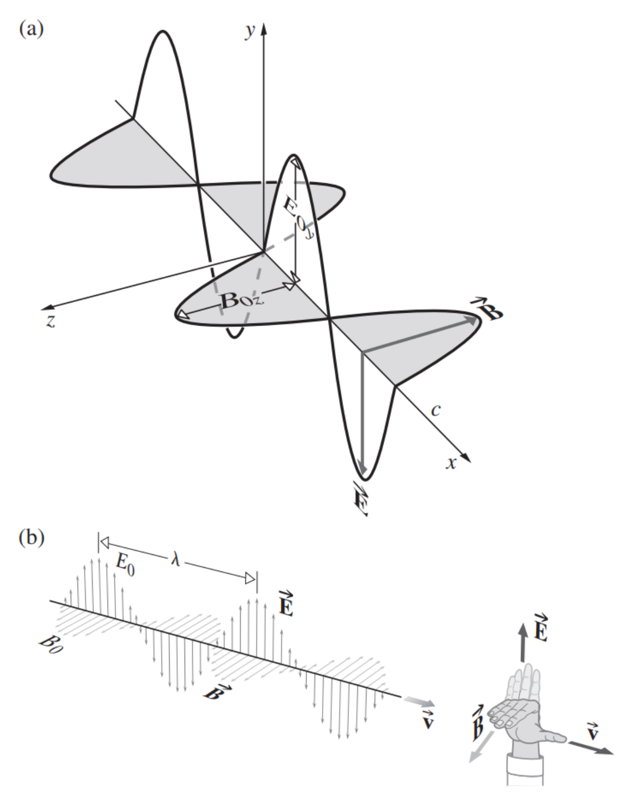

# Chapter 3 Electromagnetic Theory, Photos and Light

## 3.1 Basic Laws of Electromagnetic Theory

|   Symbols    |     Descriptions      |
| :----------: | :-------------------: |
| $\mathbf{E}$ | electric field, $V/m$ |
| $\mathbf{B}$ |  magnetic field, $T$  |

$$
\mathbf{F}_{E}=q\mathbf{E}\\
\mathbf{F}_{M}=q\mathbf{v}\times\mathbf{B}
$$

### 3.1.1 Faraday's Induction Law

变化的磁场产生了电流。
A changing magnetic field generated a current.

感应电动势与垂直于磁场的环路的面积 $A$ 成正比。当磁场恒定时，感应电动势与投影面积的变化率成正比。
The induced emf is proportional to the area $A$ of the loop penetrated perpendicularly by the field. When the field is constant, the induced emf is proportional to the rate-of-change of the perpendicular area penetrated.

**磁通量**
**flux of the magnetic field**
$$
\Phi_M=\iint_{A}\mathbf{B}\cdot\mathrm{d}\mathbf{S}\tag{3.1}
$$
**感应电动势**
**induced emf**
$$
\text{emf}=-\frac{\mathrm{d}\Phi_M}{\mathrm{d}t}\tag{3.2}
$$
楞次定律：感应电动势将生成感应电流，感应电流具有这样的方向，即感应电流的磁场总要阻碍引起感应电流的磁通量的变化。
Lenz's Law: the induced emf will drive an induced current, which will create an induced magnetic field that opposes the flux change that caused it in the first place.
$$
\text{emf}=\oint_{C}\mathbf{E}\cdot\mathrm{d}\mathbf{l}\tag{3.3}
$$
taken around the closed curve $C$, corresponding to the loop.
$$
\color{red}\oint_{C}\mathbf{E}\cdot\mathrm{d}\mathbf{l}=-\frac{\mathrm{d}}{\mathrm{d}t}\iint_{A}\mathbf{B}\cdot\mathrm{d}\mathbf{S}\tag{3.4}
$$

### 3.1.2 Gauss's Law -- Electric

当封闭面所包含的区域内没有电场的源或汇时，通过该面的净通量等于零。
When there are no sources or sinks of the electric field within the region encompassed by the closed surface, the net flux through the surface equals zero.
$$
\Phi_E=\oiint_{A}\mathbf{E}\cdot\mathrm{d}\mathbf{S}\tag{3.6}
$$

---

Consider a charge inside a sphere, at distance $r$, the flux is
$$
\Phi_E=\oiint_{A}\mathbf{E}\cdot\mathrm{d}\mathbf{S}=\oiint_{A}|\mathbf{E}||\mathrm{d}\mathbf{S}|=4\pi r^2|\mathbf{E}|
$$
For a point-charge, the Coulomb's law tells that
$$
|\mathbf{E}|=\frac{1}{4\pi\epsilon_0}\frac{q}{r^2}
$$
Therefore
$$
\Phi_E=\oiint_{A}\mathbf{E}\cdot\mathrm{d}\mathbf{S}=\frac{q}{\epsilon_0}
$$

---

高斯定律：任何封闭区域内包含的若干电荷所产生的净通量为
Gauss's Law: the net flux due to a number of charges contained within any closed area is
$$
\color{red}\oiint_{A}\mathbf{E}\cdot\mathrm{d}\mathbf{S}=\frac{1}{\epsilon_0}\iiint_V\rho\mathrm{d}V\tag{3.7}
$$
其中 $A$ 所包围的体积为 $V$，电荷分布的密度为 $\rho$，$\epsilon_0$ 是真空介电常数。
where the volume enclosed by $A$ is $V$ and the charge distribution has a density $\rho$, and $\epsilon_0$ is the the electric permittivity of free space.

### 3.1.3 Gauss's Law -- Magnetic

$$
\color{red}\oiint_{A}\mathbf{B}\cdot\mathrm{d}\mathbf{S}=0\tag{3.9}
$$

### 3.1.4 Ampère's Circuital Law

---

Suppose there is a magnetic charge $q_m$ with magnetic force $q_m\mathbf{B}$. Then the work along a circular path is
$$
q_m\sum\mathbf{B}_{\parallel}\Delta l=q_m|\mathbf{B}|2\pi r
$$
the magnetic field of a straight wire carrying a current $I$ is
$$
\mathbf{B}=\frac{\mu_0I}{2\pi r}
$$
Then
$$
q_m\sum\mathbf{B}_{\parallel}\Delta l=q_m\mu_0I
$$
and canceling the magnetic charge $q_m$ we get
$$
\sum\mathbf{B}_{\parallel}\Delta l=\mu_0I
$$

---

$$
\oint_C\mathbf{B}\cdot\mathrm{d}\mathbf{l}=\mu_0I
$$

当电流具有非均匀截面时，安培定律是以电流密度或单位面积电流 $\mathbf{J}$ 的面积分来描述的:
When the current has a nonuniform cross section, Ampère's Law is written in terms of the current density or current per unit area $\mathbf{J}$, integrated over the area:
$$
\oint_C\mathbf{B}\cdot\mathrm{d}\mathbf{l}=\mu_0\iint_A\mathbf{J}\cdot\mathrm{d}\mathbf{S}\tag{3.10}
$$
开放面 $A$ 以 $C$ 为界，$\mu_0$ 是真空磁导率。
The open surface $A$ is bounded by $C$, $\mu_0$ is the permeability of free space.

运动的电荷并不是磁场的唯一来源。在给电容器充电或放电时，人们可以在其板块之间的区域测量磁场。
Moving charges are not the only source of a magnetic field. While charging or discharging a capacitor, one can measure a magnetic field in the region between its plates.

---

The eclectic field between two plat is
$$
|\mathbf{E}|=\frac{Q}{\epsilon A}
$$
taking the derivative of both sides yields
$$
\epsilon\frac{\partial{E}}{\partial{t}}=\frac{I}{A}
$$
which is called *displacement current density*.

---

The restatement of Ampère's Law as
$$
\color{red}\oint_C\mathbf{B}\cdot\mathrm{d}\mathbf{l}=\mu\iint_A\left(\mathbf{J}+\epsilon\frac{\partial\mathbf{E}}{\partial{t}}\right)\cdot\mathrm{d}\mathbf{S}\tag{3.13}
$$

### 3.1.5 Maxwell's Equations

The integral form:
$$
\begin{align*}
\oint_{C}\mathbf{E}\cdot\mathrm{d}\mathbf{l}&=-\iint_{A}\frac{\partial\mathbf{B}}{\partial{t}}\cdot\mathrm{d}\mathbf{S}\\
\oint_C\mathbf{B}\cdot\mathrm{d}\mathbf{l}&=\mu\iint_A\left(\mathbf{J}+\epsilon\frac{\partial\mathbf{E}}{\partial{t}}\right)\cdot\mathrm{d}\mathbf{S}\\
\oiint_{A}\mathbf{E}\cdot\mathrm{d}\mathbf{S}&=\frac{1}{\epsilon_0}\iiint_V\rho\mathrm{d}V\\
\oiint_{A}\mathbf{B}\cdot\mathrm{d}\mathbf{S}&=0\
\end{align*}
$$
The differential form: (using Gauss's Divergence theorem and Stokes' theorem)
$$
\begin{align*}
\nabla\times\mathbf{E}&=-\frac{\partial\mathbf{B}}{\partial{t}}\\
\nabla\times\mathbf{B}&=\mu\left(\mathbf{J}+\epsilon\frac{\partial\mathbf{E}}{\partial{t}}\right)\\
\nabla\cdot\mathbf{E}&=\frac{\rho}{\epsilon_0}\\
\nabla\cdot\mathbf{B}&=0\\
\end{align*}
$$

## 3.2 Electromagnetic Waves

1. 场的垂直性。
    The general perpendicularity of the fields.
2. 麦克斯韦方程组的对称性。
    The symmetry of Maxwell's Equations.
3. 方程组中 $\mathbf{E}$ 和 $\mathbf{B}$ 的相互依赖。
    The interdependence of $\mathbf{E}$ and $\mathbf{B}$ in those equations.

$$
\nabla^2\mathbf{E}=\epsilon_0\mu_0\frac{\partial^2\mathbf{E}}{\partial{t}^2}\\
\nabla^2\mathbf{B}=\epsilon_0\mu_0\frac{\partial^2\mathbf{B}}{\partial{t}^2}
$$

$$
c=\frac{1}{\sqrt{\epsilon_0\mu_0}}
$$

### 3.2.1 Transverse Waves

plane or linearly polarized waves: the direction of the vibrating $\mathbf{E}$-vector is fixed.

The $\mathbf{E}$-vector in the figure is
$$
\mathbf{E}=0E_x+\hat{\jmath}E_y(x,t)+0E_z\tag{3.26}
$$
By Faraday's induction law:
$$
\frac{\partial{E}_y}{\partial{x}}=-\frac{\partial{B}_z}{\partial{t}}\tag{3.27}
$$
与时间相关的磁场只能在 $z$ 方向有一个分量。显然，在真空中平面电磁波是横波。
The time-dependent $\mathbf{B}$-field can only have a component in the $z$-direction. Clearly then, in free space, the plane electromagnetic wave is transverse.

We limit the discussion to harmonic waves and write $\mathbf{E}_y(x,t)$ as
$$
E_y(x,t)=E_{y_0}\cos[\omega(t-x/c)+\epsilon]\tag{3.28}
$$
And
$$
B_z(x,t)=-\frac{1}{c}E_{y_0}\cos[\omega(t-x/c)+\epsilon]\tag{3.29}
$$
Here
$$
E_y=cB_z\tag{3.30}
$$

---

Since
$$
\mathbf{E}=\mathbf{E}_0\exp(-j(\mathbf{k}\cdot\mathbf{r}-\omega t))\\
\mathbf{B}=\mathbf{B}_0\exp(-j(\mathbf{k}\cdot\mathbf{r}-\omega t))\\
$$
And
$$
\nabla\times\mathbf{E}=-j|\mathbf{k}|\mathbf{E}\\
\frac{\partial{\mathbf{B}}}{\partial{t}}=j\omega\mathbf{B}
$$
Therefore
$$
|\mathbf{k}|\mathbf{E}=\omega\mathbf{B}\\
\mathbf{E}=\frac{\omega}{|\mathbf{k}|}\mathbf{B}=c\mathbf{B}\\
$$

---

## 3.3 Energy and Momentum

### 3.3.1 The Poynting Vector

**能量密度**：每单位体积的辐射能量。
**energy density**: radiant energy per unit volume.

A parallel-plate capacitor, with capacitance $C$, voltage $V$, plate area $A$, separation $d$, then the energy density in this gap is
$$
u_E=\frac{\frac{1}{2}CV^2}{Ad}=\frac{\frac{1}{2}(\epsilon_0A/d)(Ed)^2}{Ad}=\frac{\epsilon_0}{2}E^2\tag{3.31}
$$
A inductor, with inductance $L$, current $I$, cross-sectional area $A$, length $l$, turns $n$ per unit length, then the energy density in this gap is
$$
u_B=\frac{\frac{1}{2}LI^2}{Al}=\frac{\frac{1}{2}(\mu_0n^2lA)(B/\mu_0n)^2}{Al}=\frac{1}{2\mu_0}B^2\tag{3.32}
$$
Since $c=1/\sqrt{\epsilon_0\mu_0}$, and $|\mathbf{E}|=c|\mathbf{B}|$​, we have
$$
u_E=u_B\tag{3.33}
$$
以电磁波形式流经空间的能量在组成的电场和磁场之间平均分享。
The energy streaming through space in the form of an electromagnetic wave is shared equally between the constituent electric and magnetic fields.
$$
\color{red}u=u_E+u_B=\epsilon_0E^2=\frac{1}{\mu_0}B^2\tag{3.34}
$$
$S$：单位时间内能量（功率）在单位面积上的运输。
$S$: the transport of energy per unit time (the power) across a unit area.

An electromagnetic wave traveling with a speed $c$ through an area $A$. During a very small interval of time $\Delta{t}$, only the energy contained in the cylindrical volume, $u(c\Delta{t}A)$, will cross $A$. Thus
$$
S=\frac{u(c\Delta{t}A)}{\Delta{t}A}=uc\tag{3.37}
$$

or using $(3.34)$:
$$
S=\frac{1}{\mu_0}EB\tag{3.38}
$$
Define **Poynting vector** as
$$
\mathbf{S}=\frac{1}{\mu_0}\mathbf{E}\times\mathbf{B}=c^2\epsilon_0\mathbf{E}\times\mathbf{B}\tag{3.39}
$$
where the energy flows in the direction of the propagation of the wave.

For harmonic, linear polarized plane wave traveling through free space in the direction of $\mathbf{k}$:
$$
\mathbf{E}=\mathbf{E}_0\cos(\mathbf{k}\cdot\mathbf{r}-\omega t)\\
\mathbf{B}=\mathbf{B}_0\cos(\mathbf{k}\cdot\mathbf{r}-\omega t)
$$
then
$$
\mathbf{S}=\frac{1}{\mu_0}\mathbf{E}_0\times\mathbf{B}_0\cos^2(\mathbf{k}\cdot\mathbf{r}-\omega t)\tag{3.43}
$$

### 3.3.2 Irradiance

**辐照度**：$I$，单位时间内单位面积的平均能量。
**irradiance**: $I$, average energy per unit area per unit time.
$$
\begin{align*}
I&=\langle{S}\rangle_{T}\\
&=c^2\epsilon_0|\mathbf{E}_0\times\mathbf{B}_0|\frac{1}{\tau}\int_0^{\tau}\cos^2(\mathbf{k}\cdot\mathbf{r}-\omega t)\mathrm{d}t\\
&=\frac{c^2\epsilon_0}{2}|\mathbf{E}_0\times\mathbf{B}_0|
\end{align*}
$$
辐照度与电场振幅的平方成正比。
The irradiance is proportional to the square of the amplitude of the electric field.

Since $|\mathbf{E}|=c|\mathbf{B}|$, we have
$$
I=c\epsilon_0\langle\mathbf{E}^2\rangle_T=\frac{c}{\mu_0}\langle\mathbf{B}^2\rangle_T
$$

#### The Inverse Square Law

$$
I_14\pi r_1^2=I_24\pi r_2^2
$$

For the same energy emit from a point.

### 3.3.3 Photons

### 3.3.4 Radiation Pressure and Momentum

radiation pressure: $\mathcal{P}$
$$
\mathcal{P}=u=u_E+u_B=\frac{\epsilon_0}{2}E^2+\frac{1}{2\mu}B^2
$$

#### Perfectly Absorbing

$$
\mathcal{P}=\frac{S(t)}{c}
$$

这是从法向入射的光束对一个完全吸收的表面所产生的瞬时压力。
This is the instantaneous pressure that would be exerted on a perfectly absorbing surface by a normally incident beam.
$$
\langle\mathcal{P}\rangle_T=\frac{\langle{S(t)}\rangle}{c}=\frac{I}{c}\tag{3.51}
$$
Let $p$ be momentum, the force exerted by the light beam on a absorbing surface is
$$
A\mathcal{P}=\frac{\Delta{p}}{\Delta{t}}=\frac{p_V(c\Delta{t}A)}{\Delta{t}}=A\frac{S}{c}\tag{3.52}
$$
where $p_V$ is the momentum per unit volume of the radiation. Hence the **volume density of electromagnetic momentum** is
$$
P_V=\frac{S}{c^2}\tag{3.53}
$$

#### Perfectly Reflecting

The beam that entered with a velocity $+c$ will emerge with a velocity $-c$.
$$
\langle\mathcal{P}\rangle_T=2\frac{\langle{S(t)}\rangle}{c}
$$

## 3.4 Radiation

如果一个电荷不匀速运动，它就会产生辐射。
If a charge moves nonuniformly, it radiates.

### 3.4.1 Linear Accelerating Charge

### 3.4.2 Synchrotron Radiation

### 3.4.3 Electric Dipole Radiation

### 3.4.4 The Emission of Light from Atoms

## 3.5 Light in Bulk Matter

The phase speed in the medium:
$$
v=1/\sqrt{\epsilon\mu}\tag{3.58}
$$
**绝对折射率**：$n$，电磁波在真空中的速度与在物质中的速度之比。
**absolute index of refraction**: $n$, the ratio of the speed of an electromagnetic wave in vacuum to that in matter
$$
n\equiv\frac{c}{v}=\pm\sqrt{\frac{\epsilon\mu}{\epsilon_0\mu_0}}\tag{3.59}
$$
In terms of the relative permittivity and relative permeability of the medium:
$$
n=\pm\sqrt{\epsilon_r\mu_r}\tag{3.60}
$$
For non-magnetic materials, $\mu_r\approx1$:
$$
n\approx\sqrt{\epsilon_r}\tag{3.61}
$$
**dispersion**: $\epsilon_r$ and $n$ are frequency dependent.

#### Scattering and Absorption

### 3.5.1 Dispersion

**电极化**：$\mathbf{P}$，外场将介质中的正负电荷分开（每一对都是偶极子）。
**electric polarization**: $\mathbf{P}$, the external field separates positive and negative charges in the medium (each pair of which is a dipole).
$$
(\epsilon-\epsilon_0)\mathbf{E}=\mathbf{P}\tag{3.62}
$$

对于极性电介质的液体，分子实际上经历了快速旋转，使自己与电场对齐。在高驱动频率下，极性分子将无法跟随电场的变化。它们对 $\mathbf{P}$ 的贡献将减少，而 $\epsilon_r$ 将明显下降。
For fluids that are polar dielectrics, the molecules actually undergo rapid rotations, aligning themselves with the electric field. At high driving frequencies, polar molecules will be unable to follow the field alternations. Their contributions to $\mathbf{P}$ will decrease, and $\epsilon_r$ will drop markedly.

因此，$n$ 对 $\omega$ 的依赖性是由在特定频率下的各种电偏振机制的相互作用所决定的。
Thus the dependence of $n$ on $\omega$ is governed by the interplay of the various electric polarization mechanisms contributing at the particular frequency.

---

Using spring model, let $F$ be perturbations, $k_E$ be a kind of elastic constant, $x$ be a small displacement:
$$
F=-k_Ex
$$
A resonant frequency is $\omega_0=\sqrt{k_E/m_e}$, then $F=-\omega^2m_ex$. For a harmonic electric field, the force is
$$
F_E=q_eE(t)=q_eE_0\cos\omega t\tag{3.63}
$$
So
$$
q_eE_0\cos\omega t-m_e\omega^2_0x=m_e\frac{\mathrm{d}^2x}{\mathrm{d}t^2}\tag{3.64}
$$
The solution is:
$$
x(t)=\frac{q_e/m_e}{(\omega^2_0-\omega^2)}E(t)\tag{3.66}
$$
在频率小于 $\omega_0$ 的场存在下，$E(t)$ 和 $x(t)$ 具有相同的符号，这意味着振荡器可以跟随施加的力（即与它同相）。然而，当 $\omega>\omega_0$ 时，位移 $x(t)$ 的方向与瞬时力 $q_eE(t)$ 的方向相反，因此与它 $180^\circ$ 不同相。
In the presence of a field whose frequency is less than $\omega_0$, $E(t)$ and $x(t)$ have the same sign, which means that the oscillator can follow the applied force (i.e., is in-phase with it). However, when $\omega>\omega_0$, the displacement $x(t)$ is in a direction opposite to that of the instantaneous force $q_eE(t)$ and therefore $180^\circ$ out-of-phase with it.

Let $N$ be the contributing electrons per unit volume, then
$$
P=q_exN\tag{3.67}
$$
Hence
$$
P(t)=\frac{q_e^2N/m_e}{(\omega^2_0-\omega^2)}E(t)\tag{3.68}
$$
And
$$
\epsilon=\epsilon_0+\frac{P(t)}{E(t)}=\epsilon_0+\frac{q_e^2N/m_e}{(\omega^2_0-\omega^2)}\tag{3.69}
$$

---

The dispersion equation:
$$
n^2(\omega)=1+\frac{q_e^2N}{\epsilon_0m_e(\omega^2_0-\omega^2)}\tag{3.70}
$$

---

系统发生共振的频率不是单一的 $\omega_0$，而是显然有几个这样的频率。
The implication is that instead of a single frequency $\omega_0$ at which the system resonates, there apparently are several such frequencies.

Let $f_j$ be the weighting factors of number of oscillators with natural frequencies $\omega_{0j}$:
$$
n^2(\omega)=1+\frac{q_e^2N}{\epsilon_0m_e}\sum_{j}\left(\frac{f_j}{(\omega^2_{0j}-\omega^2)}\right)\tag{3.71}
$$
with $\sum_jf_j=1$.

其效果是振荡器的阻尼和它们的能量在物质内以 "热"（随机分子运动）的形式消散。
The effect is a damping of the oscillators and a dissipation of their energy within the substance in the form of "heat" (random molecular motion).

Add $m_e\gamma\mathrm{d}x/\mathrm{d}t$ to $(3.64)$, we get
$$
n^2(\omega)=1+\frac{q_e^2N}{\epsilon_0m_e}\sum_{j}\left(\frac{f_j}{\omega^2_{0j}-\omega^2+i\gamma_j\omega}\right)\tag{3.72}
$$

---

normal dispersion: $\mathrm{d}n/\mathrm{d}\omega>0$.

#### Negative Refraction

## 3.6 The Electromagnetic-Photon Spectrum

### 3.6.1 Radio-frequency Waves

### 3.6.2 Microwaves

### 3.6.3 Infrared

### 3.6.4 Light

### 3.6.5 Ultraviolet

### 3.6.6 X-rays

### 3.6.7 Gamma Rays

## 3.7 Quantum Field Theory

